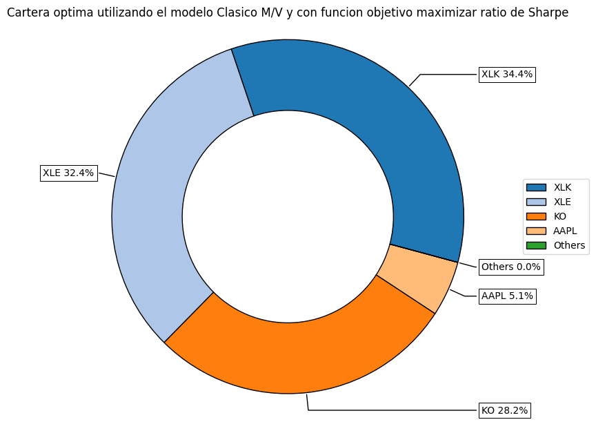
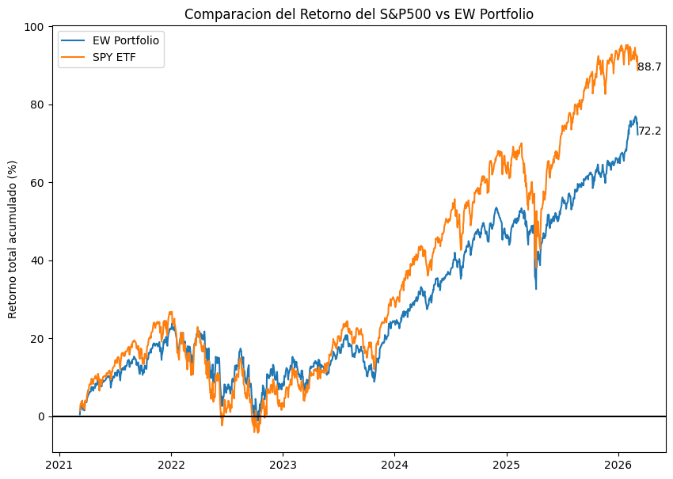

# Optimización de portafolios: Media-Varianza vs. Risk Parity

Construcción y comparación de carteras óptimas sobre un universo de 18 activos —acciones individuales, ETFs sectoriales SPDR y renta fija del Tesoro de EE.UU.— evaluando tres funciones objetivo del modelo clásico de Markowitz y contrastándolas con una asignación por paridad de riesgo.

Desarrollado en el marco del **XXVII Programa de Especialización en Mercado de Valores (PEMV)** de la Superintendencia del Mercado de Valores del Perú.

---

## Pregunta

Dado un universo de activos con una estructura de correlaciones conocida, ¿qué asignación resulta óptima según cada función objetivo, y **cuánto de la diferencia entre carteras viene del método y cuánto de la fragilidad de los estimadores**?

La segunda parte de la pregunta es la que importa. Es fácil correr un optimizador; lo difícil es saber cuánto confiar en el resultado.

## Data

| | |
|---|---|
| **Fuente** | Yahoo Finance vía `yfinance` |
| **Precios** | Ajustados por dividendos y splits (`Adj Close`) |
| **Universo** | 18 activos: AAPL, PG, VZ, KO, BAC · SPY · sectores SPDR (XLF, XLK, XLU, XLE, XLI, XLP, XLY, XLB, XLV, XLC, XLRE) · IEF (Tesoro 7–10 años) |
| **Ventana** | 5 años de precios diarios |
| **Frecuencia de retornos** | Mensual para la matriz de covarianzas |
| **Universo secundario** | DBC, GLD, IEF, SPY, TLT — réplica del All Weather Portfolio |

El notebook complementario analiza 10 activos globales (VNQ, BIL, IEF, EWG, XLV, XLU, SPY, EWZ, KOSPI, NIFTY) con retornos diarios sobre 12 meses.

## Método y por qué este

**Retornos mensuales, no diarios, para la matriz de covarianzas.** Los retornos diarios contienen mucho ruido de microestructura que infla la volatilidad estimada sin aportar información sobre la relación de largo plazo entre activos. La frecuencia mensual da una matriz más estable, que es exactamente lo que necesita un optimizador sensible a los estimadores.

**Clustering jerárquico antes de optimizar.** Correrlo primero evita interpretar como hallazgo lo que en realidad es estructura de correlaciones conocida. El dendrograma muestra tres bloques con alta correlación interna, casi todos ligados al S&P 500 — lo que anticipa que el optimizador va a concentrar peso en los pocos activos que se comportan distinto.

**Tres funciones objetivo sobre la misma matriz, no una.** Máximo Sharpe, mínimo riesgo y máximo retorno se corren sobre el mismo universo y los mismos estimadores. Aislar la función objetivo como única variable es lo que permite atribuir las diferencias de asignación al criterio de optimización y no a los insumos.

**Risk Parity como contraste, no como alternativa decorativa.** Media-Varianza requiere estimar retornos esperados, y ese es su punto débil. Risk Parity solo requiere la matriz de covarianzas, sustancialmente más estable en el tiempo. La comparación entre ambos es el resultado más informativo del ejercicio.

**Benchmark equiponderado y contra el S&P 500.** Sin un benchmark ingenuo no hay forma de saber si la optimización aportó algo o solo agregó complejidad.

## Resultados

**1. La cartera de máximo Sharpe concentra el 95% del peso en 4 de 18 activos.**



XLK 34.4%, XLE 32.4%, KO 28.2% y AAPL 5.1%. Los otros catorce activos reciben peso cero. Esto no es un hallazgo sobre el mercado: es una propiedad conocida del optimizador media-varianza sin restricciones, que asigna todo a los activos con mejor retorno histórico ajustado y descarta el resto.

**2. La estructura de correlaciones limita el beneficio de diversificar dentro de renta variable.**


Los sectores SPDR están fuertemente correlacionados entre sí y con SPY. El aporte real de diversificación viene de IEF y de los sectores defensivos, no de agregar más sectores accionarios.

**3. Cada función objetivo produce una cartera cualitativamente distinta.**

| Función objetivo | Comportamiento de los pesos |
|---|---|
| Máximo ratio de Sharpe | Concentra en pocos activos con mejor retorno histórico ajustado |
| Mínimo riesgo | Se desplaza hacia renta fija y defensivos, con pesos más repartidos |
| Máximo retorno | Solución de esquina: prácticamente todo el peso en un solo activo |
| Risk Parity | Distribución estable, sin depender de estimar retornos esperados |

**4. El plano rentabilidad-riesgo muestra activos que rompen la relación esperada.**



Consumo básico (XLP) se agrupa con KO y PG en el perfil defensivo esperado. Pero hay activos que generan retorno comparable al sector tecnológico manteniendo volatilidad de defensivo — candidatos naturales para una cartera optimizada, y la razón por la que el optimizador los selecciona.

## Limitaciones

- **Los estimadores históricos de retorno esperado son el punto débil del modelo.** Media-Varianza clásico es muy sensible a `mu`: cambios pequeños en el retorno esperado producen cambios grandes en los pesos. La solución de esquina del portafolio de máximo retorno es una manifestación directa de esto, no un error de implementación.
- **No hay restricciones de peso máximo por activo ni por sector.** Una cartera implementable exigiría límites de concentración; sin ellos, el 95% en cuatro activos no es una recomendación de inversión.
- **No se incorporan costos de transacción ni política de rebalanceo,** que en carteras concentradas pueden absorber buena parte de la ventaja teórica.
- **La tasa libre de riesgo se fija en cero.** Con una tasa positiva el punto de tangencia se desplaza y la cartera de máximo Sharpe cambia.
- **Todo el análisis es dentro de muestra.** No hay validación fuera de muestra ni ventana rodante: el desempeño mostrado describe el pasado, no pronostica.

## Qué haría distinto

Reemplazar los estimadores históricos por shrinkage —Ledoit-Wolf para la covarianza— o incorporar vistas vía Black-Litterman, y evaluar la estabilidad de los pesos con una ventana rodante en lugar de una sola optimización sobre toda la muestra. La pregunta interesante no es cuál es la cartera óptima hoy, sino cuánto cambia esa cartera cuando cambia la ventana.

## Contenido

**Para leer** (documento con gráficos, sin ejecutar nada):
- [Optimización de portafolios M/V y Risk Parity](reports/02_optimizacion_portafolios_mv_risk_parity.md) — análisis principal
- [Retorno acumulado de activos globales](reports/01_retornos_acumulados_activos_globales.md) — análisis complementario

**Para ejecutar:**
- [`notebooks/`](notebooks/) — los notebooks originales

```
portfolio-optimization/
├── notebooks/      código ejecutable
├── reports/        versión legible de cada notebook
├── outputs/figures/
└── requirements.txt
```

## Cómo reproducirlo

```bash
pip install -r requirements.txt
```

Ejecutar los notebooks en orden numérico. La data se descarga en tiempo real desde Yahoo Finance, por lo que los resultados numéricos variarán según la fecha de ejecución; las conclusiones metodológicas no.

## Herramientas

Python · pandas · numpy · yfinance · riskfolio-lib · matplotlib · seaborn · plotly

---

Brenda María Rodríguez Ruiz · Bachiller en Economía
