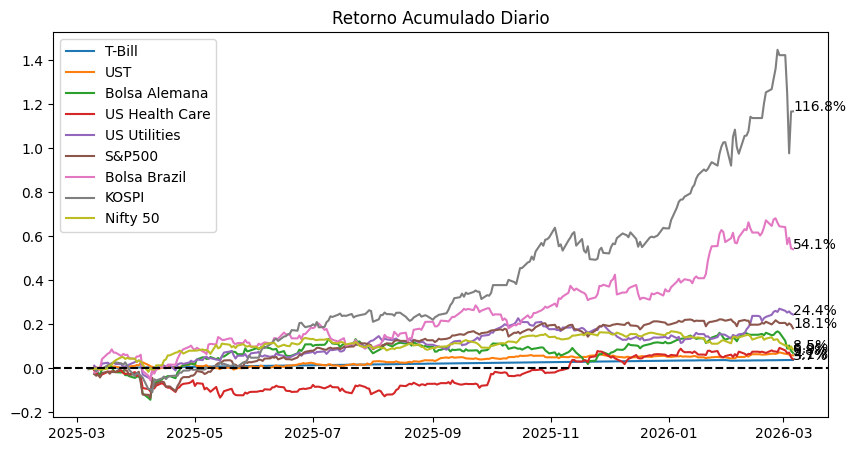

# Retorno acumulado de clases de activos globales

> Version legible del notebook [`01_retornos_acumulados_activos_globales.ipynb`](../notebooks/01_retornos_acumulados_activos_globales.ipynb).
> Para ejecutar el codigo, usar el notebook.

Comparacion del retorno acumulado de 10 activos que representan distintas clases
(renta fija de corto y largo plazo, renta variable desarrollada y emergente,
sectores defensivos e inmobiliario) durante los ultimos 12 meses.

**Pregunta:** que clases de activos superaron al S&P 500 en el periodo, y que
dice esa dispersion sobre el momento del ciclo.

**Fuente:** Yahoo Finance via `yfinance`, precios ajustados por dividendos y splits.


```python
import pandas as pd
import numpy as np
import yfinance as yf
import matplotlib.pyplot as plt
import warnings
warnings.filterwarnings('ignore')
```


```python
# Cambia esta línea en tu código
simbolos = ['VNQ', 'BIL', 'IEF', 'EWG', 'XLV', 'XLU', 'SPY','EWZ','^KS11','^NSEI']
```


```python
df=yf.download(simbolos, period='1y', auto_adjust=False)['Adj Close']
df
```

    [*********************100%***********************]  10 of 10 completed


  <div id="df-9fcb1b2c-624a-4718-a5fa-f17af41a3f40" class="colab-df-container">
    <div>
<style scoped>
    .dataframe tbody tr th:only-of-type {
        vertical-align: middle;
    }

    .dataframe tbody tr th {
        vertical-align: top;
    }

    .dataframe thead th {
        text-align: right;
    }
</style>
<table border="1" class="dataframe">
  <thead>
    <tr style="text-align: right;">
      <th>Ticker</th>
      <th>BIL</th>
      <th>EWG</th>
      <th>EWZ</th>
      <th>IEF</th>
      <th>SPY</th>
      <th>VNQ</th>
      <th>XLU</th>
      <th>XLV</th>
      <th>^KS11</th>
      <th>^NSEI</th>
    </tr>
    <tr>
      <th>Date</th>
      <th></th>
      <th></th>
      <th></th>
      <th></th>
      <th></th>
      <th></th>
      <th></th>
      <th></th>
      <th></th>
      <th></th>
    </tr>
  </thead>
  <tbody>
    <tr>
      <th>2025-03-06</th>
      <td>NaN</td>
      <td>NaN</td>
      <td>NaN</td>
      <td>NaN</td>
      <td>NaN</td>
      <td>NaN</td>
      <td>NaN</td>
      <td>NaN</td>
      <td>2576.159912</td>
      <td>22544.699219</td>
    </tr>
    <tr>
      <th>2025-03-07</th>
      <td>88.175270</td>
      <td>38.175167</td>
      <td>23.540876</td>
      <td>91.168358</td>
      <td>569.235352</td>
      <td>88.921883</td>
      <td>37.571777</td>
      <td>146.699692</td>
      <td>2563.479980</td>
      <td>22552.500000</td>
    </tr>
    <tr>
      <th>2025-03-10</th>
      <td>88.184921</td>
      <td>37.171852</td>
      <td>23.047676</td>
      <td>91.805832</td>
      <td>554.073486</td>
      <td>88.065575</td>
      <td>37.984978</td>
      <td>145.117523</td>
      <td>2570.389893</td>
      <td>22460.300781</td>
    </tr>
    <tr>
      <th>2025-03-11</th>
      <td>88.194542</td>
      <td>37.122669</td>
      <td>23.123554</td>
      <td>91.477448</td>
      <td>549.467468</td>
      <td>87.036072</td>
      <td>37.630112</td>
      <td>143.535355</td>
      <td>2537.600098</td>
      <td>22497.900391</td>
    </tr>
    <tr>
      <th>2025-03-12</th>
      <td>88.204178</td>
      <td>37.368580</td>
      <td>23.218399</td>
      <td>91.206993</td>
      <td>552.383301</td>
      <td>86.766678</td>
      <td>37.513439</td>
      <td>142.100586</td>
      <td>2574.820068</td>
      <td>22470.500000</td>
    </tr>
    <tr>
      <th>...</th>
      <td>...</td>
      <td>...</td>
      <td>...</td>
      <td>...</td>
      <td>...</td>
      <td>...</td>
      <td>...</td>
      <td>...</td>
      <td>...</td>
      <td>...</td>
    </tr>
    <tr>
      <th>2026-03-02</th>
      <td>91.389999</td>
      <td>42.910000</td>
      <td>38.639999</td>
      <td>97.120003</td>
      <td>686.380005</td>
      <td>95.930000</td>
      <td>47.369999</td>
      <td>158.529999</td>
      <td>NaN</td>
      <td>24865.699219</td>
    </tr>
    <tr>
      <th>2026-03-03</th>
      <td>91.400002</td>
      <td>41.570000</td>
      <td>36.820000</td>
      <td>97.010002</td>
      <td>680.330017</td>
      <td>95.419998</td>
      <td>47.070000</td>
      <td>156.740005</td>
      <td>5791.910156</td>
      <td>NaN</td>
    </tr>
    <tr>
      <th>2026-03-04</th>
      <td>91.410004</td>
      <td>42.099998</td>
      <td>37.490002</td>
      <td>96.809998</td>
      <td>685.130005</td>
      <td>95.540001</td>
      <td>47.270000</td>
      <td>157.050003</td>
      <td>5093.540039</td>
      <td>24480.500000</td>
    </tr>
    <tr>
      <th>2026-03-05</th>
      <td>91.419998</td>
      <td>41.180000</td>
      <td>36.360001</td>
      <td>96.510002</td>
      <td>681.309998</td>
      <td>94.580002</td>
      <td>46.900002</td>
      <td>153.910004</td>
      <td>5583.899902</td>
      <td>24765.900391</td>
    </tr>
    <tr>
      <th>2026-03-06</th>
      <td>91.440002</td>
      <td>40.820000</td>
      <td>36.279999</td>
      <td>96.449997</td>
      <td>672.380005</td>
      <td>93.550003</td>
      <td>46.740002</td>
      <td>152.699997</td>
      <td>5584.870117</td>
      <td>24450.449219</td>
    </tr>
  </tbody>
</table>
<p>261 rows × 10 columns</p>
</div>
    <div class="colab-df-buttons">

  <div class="colab-df-container">
    <button class="colab-df-convert" onclick="convertToInteractive('df-9fcb1b2c-624a-4718-a5fa-f17af41a3f40')"
            title="Convert this dataframe to an interactive table."
            style="display:none;">

  <svg xmlns="http://www.w3.org/2000/svg" height="24px" viewBox="0 -960 960 960">
    <path d="M120-120v-720h720v720H120Zm60-500h600v-160H180v160Zm220 220h160v-160H400v160Zm0 220h160v-160H400v160ZM180-400h160v-160H180v160Zm440 0h160v-160H620v160ZM180-180h160v-160H180v160Zm440 0h160v-160H620v160Z"/>
  </svg>
    </button>

  <style>
    .colab-df-container {
      display:flex;
      gap: 12px;
    }

    .colab-df-convert {
      background-color: #E8F0FE;
      border: none;
      border-radius: 50%;
      cursor: pointer;
      display: none;
      fill: #1967D2;
      height: 32px;
      padding: 0 0 0 0;
      width: 32px;
    }

    .colab-df-convert:hover {
      background-color: #E2EBFA;
      box-shadow: 0px 1px 2px rgba(60, 64, 67, 0.3), 0px 1px 3px 1px rgba(60, 64, 67, 0.15);
      fill: #174EA6;
    }

    .colab-df-buttons div {
      margin-bottom: 4px;
    }

    [theme=dark] .colab-df-convert {
      background-color: #3B4455;
      fill: #D2E3FC;
    }

    [theme=dark] .colab-df-convert:hover {
      background-color: #434B5C;
      box-shadow: 0px 1px 3px 1px rgba(0, 0, 0, 0.15);
      filter: drop-shadow(0px 1px 2px rgba(0, 0, 0, 0.3));
      fill: #FFFFFF;
    }
  </style>

    <script>
      const buttonEl =
        document.querySelector('#df-9fcb1b2c-624a-4718-a5fa-f17af41a3f40 button.colab-df-convert');
      buttonEl.style.display =
        google.colab.kernel.accessAllowed ? 'block' : 'none';

      async function convertToInteractive(key) {
        const element = document.querySelector('#df-9fcb1b2c-624a-4718-a5fa-f17af41a3f40');
        const dataTable =
          await google.colab.kernel.invokeFunction('convertToInteractive',
                                                    [key], {});
        if (!dataTable) return;

        const docLinkHtml = 'Like what you see? Visit the ' +
          '<a target="_blank" href=https://colab.research.google.com/notebooks/data_table.ipynb>data table notebook</a>'
          + ' to learn more about interactive tables.';
        element.innerHTML = '';
        dataTable['output_type'] = 'display_data';
        await google.colab.output.renderOutput(dataTable, element);
        const docLink = document.createElement('div');
        docLink.innerHTML = docLinkHtml;
        element.appendChild(docLink);
      }
    </script>
  </div>


  <div id="id_60e51aea-0456-48e2-a159-75e07ab8ac2e">
    <style>
      .colab-df-generate {
        background-color: #E8F0FE;
        border: none;
        border-radius: 50%;
        cursor: pointer;
        display: none;
        fill: #1967D2;
        height: 32px;
        padding: 0 0 0 0;
        width: 32px;
      }

      .colab-df-generate:hover {
        background-color: #E2EBFA;
        box-shadow: 0px 1px 2px rgba(60, 64, 67, 0.3), 0px 1px 3px 1px rgba(60, 64, 67, 0.15);
        fill: #174EA6;
      }

      [theme=dark] .colab-df-generate {
        background-color: #3B4455;
        fill: #D2E3FC;
      }

      [theme=dark] .colab-df-generate:hover {
        background-color: #434B5C;
        box-shadow: 0px 1px 3px 1px rgba(0, 0, 0, 0.15);
        filter: drop-shadow(0px 1px 2px rgba(0, 0, 0, 0.3));
        fill: #FFFFFF;
      }
    </style>
    <button class="colab-df-generate" onclick="generateWithVariable('df')"
            title="Generate code using this dataframe."
            style="display:none;">

  <svg xmlns="http://www.w3.org/2000/svg" height="24px"viewBox="0 0 24 24"
       width="24px">
    <path d="M7,19H8.4L18.45,9,17,7.55,7,17.6ZM5,21V16.75L18.45,3.32a2,2,0,0,1,2.83,0l1.4,1.43a1.91,1.91,0,0,1,.58,1.4,1.91,1.91,0,0,1-.58,1.4L9.25,21ZM18.45,9,17,7.55Zm-12,3A5.31,5.31,0,0,0,4.9,8.1,5.31,5.31,0,0,0,1,6.5,5.31,5.31,0,0,0,4.9,4.9,5.31,5.31,0,0,0,6.5,1,5.31,5.31,0,0,0,8.1,4.9,5.31,5.31,0,0,0,12,6.5,5.46,5.46,0,0,0,6.5,12Z"/>
  </svg>
    </button>
    <script>
      (() => {
      const buttonEl =
        document.querySelector('#id_60e51aea-0456-48e2-a159-75e07ab8ac2e button.colab-df-generate');
      buttonEl.style.display =
        google.colab.kernel.accessAllowed ? 'block' : 'none';

      buttonEl.onclick = () => {
        google.colab.notebook.generateWithVariable('df');
      }
      })();
    </script>
  </div>

    </div>
  </div>


```python
for i in simbolos:
    # Calcula el rendimiento porcentual diario
    df['ret_diario_' + i] = df[i].pct_change()

for i in simbolos:
    # Calcula el rendimiento acumulado compuesto
    df['ret_diario_acum_' + i] = (1 + df['ret_diario_' + i]).cumprod() - 1

# Visualiza el DataFrame con las nuevas columnas
df
```


  <div id="df-cca5fd25-df01-4d71-af5a-0e423a1afdfa" class="colab-df-container">
    <div>
<style scoped>
    .dataframe tbody tr th:only-of-type {
        vertical-align: middle;
    }

    .dataframe tbody tr th {
        vertical-align: top;
    }

    .dataframe thead th {
        text-align: right;
    }
</style>
<table border="1" class="dataframe">
  <thead>
    <tr style="text-align: right;">
      <th>Ticker</th>
      <th>BIL</th>
      <th>EWG</th>
      <th>EWZ</th>
      <th>IEF</th>
      <th>SPY</th>
      <th>VNQ</th>
      <th>XLU</th>
      <th>XLV</th>
      <th>^KS11</th>
      <th>^NSEI</th>
      <th>...</th>
      <th>ret_diario_acum_VNQ</th>
      <th>ret_diario_acum_BIL</th>
      <th>ret_diario_acum_IEF</th>
      <th>ret_diario_acum_EWG</th>
      <th>ret_diario_acum_XLV</th>
      <th>ret_diario_acum_XLU</th>
      <th>ret_diario_acum_SPY</th>
      <th>ret_diario_acum_EWZ</th>
      <th>ret_diario_acum_^KS11</th>
      <th>ret_diario_acum_^NSEI</th>
    </tr>
    <tr>
      <th>Date</th>
      <th></th>
      <th></th>
      <th></th>
      <th></th>
      <th></th>
      <th></th>
      <th></th>
      <th></th>
      <th></th>
      <th></th>
      <th></th>
      <th></th>
      <th></th>
      <th></th>
      <th></th>
      <th></th>
      <th></th>
      <th></th>
      <th></th>
      <th></th>
      <th></th>
    </tr>
  </thead>
  <tbody>
    <tr>
      <th>2025-03-06</th>
      <td>NaN</td>
      <td>NaN</td>
      <td>NaN</td>
      <td>NaN</td>
      <td>NaN</td>
      <td>NaN</td>
      <td>NaN</td>
      <td>NaN</td>
      <td>2576.159912</td>
      <td>22544.699219</td>
      <td>...</td>
      <td>NaN</td>
      <td>NaN</td>
      <td>NaN</td>
      <td>NaN</td>
      <td>NaN</td>
      <td>NaN</td>
      <td>NaN</td>
      <td>NaN</td>
      <td>NaN</td>
      <td>NaN</td>
    </tr>
    <tr>
      <th>2025-03-07</th>
      <td>88.175270</td>
      <td>38.175167</td>
      <td>23.540876</td>
      <td>91.168358</td>
      <td>569.235352</td>
      <td>88.921883</td>
      <td>37.571777</td>
      <td>146.699692</td>
      <td>2563.479980</td>
      <td>22552.500000</td>
      <td>...</td>
      <td>NaN</td>
      <td>NaN</td>
      <td>NaN</td>
      <td>NaN</td>
      <td>NaN</td>
      <td>NaN</td>
      <td>NaN</td>
      <td>NaN</td>
      <td>-0.004922</td>
      <td>0.000346</td>
    </tr>
    <tr>
      <th>2025-03-10</th>
      <td>88.184921</td>
      <td>37.171852</td>
      <td>23.047676</td>
      <td>91.805832</td>
      <td>554.073486</td>
      <td>88.065575</td>
      <td>37.984978</td>
      <td>145.117523</td>
      <td>2570.389893</td>
      <td>22460.300781</td>
      <td>...</td>
      <td>-0.009630</td>
      <td>0.000109</td>
      <td>0.006992</td>
      <td>-0.026282</td>
      <td>-0.010785</td>
      <td>0.010998</td>
      <td>-0.026635</td>
      <td>-0.020951</td>
      <td>-0.002240</td>
      <td>-0.003744</td>
    </tr>
    <tr>
      <th>2025-03-11</th>
      <td>88.194542</td>
      <td>37.122669</td>
      <td>23.123554</td>
      <td>91.477448</td>
      <td>549.467468</td>
      <td>87.036072</td>
      <td>37.630112</td>
      <td>143.535355</td>
      <td>2537.600098</td>
      <td>22497.900391</td>
      <td>...</td>
      <td>-0.021208</td>
      <td>0.000219</td>
      <td>0.003390</td>
      <td>-0.027570</td>
      <td>-0.021570</td>
      <td>0.001553</td>
      <td>-0.034727</td>
      <td>-0.017728</td>
      <td>-0.014968</td>
      <td>-0.002076</td>
    </tr>
    <tr>
      <th>2025-03-12</th>
      <td>88.204178</td>
      <td>37.368580</td>
      <td>23.218399</td>
      <td>91.206993</td>
      <td>552.383301</td>
      <td>86.766678</td>
      <td>37.513439</td>
      <td>142.100586</td>
      <td>2574.820068</td>
      <td>22470.500000</td>
      <td>...</td>
      <td>-0.024237</td>
      <td>0.000328</td>
      <td>0.000424</td>
      <td>-0.021129</td>
      <td>-0.031350</td>
      <td>-0.001553</td>
      <td>-0.029605</td>
      <td>-0.013699</td>
      <td>-0.000520</td>
      <td>-0.003291</td>
    </tr>
    <tr>
      <th>...</th>
      <td>...</td>
      <td>...</td>
      <td>...</td>
      <td>...</td>
      <td>...</td>
      <td>...</td>
      <td>...</td>
      <td>...</td>
      <td>...</td>
      <td>...</td>
      <td>...</td>
      <td>...</td>
      <td>...</td>
      <td>...</td>
      <td>...</td>
      <td>...</td>
      <td>...</td>
      <td>...</td>
      <td>...</td>
      <td>...</td>
      <td>...</td>
    </tr>
    <tr>
      <th>2026-03-02</th>
      <td>91.389999</td>
      <td>42.910000</td>
      <td>38.639999</td>
      <td>97.120003</td>
      <td>686.380005</td>
      <td>95.930000</td>
      <td>47.369999</td>
      <td>158.529999</td>
      <td>NaN</td>
      <td>24865.699219</td>
      <td>...</td>
      <td>0.078812</td>
      <td>0.036458</td>
      <td>0.065282</td>
      <td>0.124029</td>
      <td>0.080643</td>
      <td>0.260787</td>
      <td>0.205793</td>
      <td>0.641400</td>
      <td>1.423813</td>
      <td>0.102951</td>
    </tr>
    <tr>
      <th>2026-03-03</th>
      <td>91.400002</td>
      <td>41.570000</td>
      <td>36.820000</td>
      <td>97.010002</td>
      <td>680.330017</td>
      <td>95.419998</td>
      <td>47.070000</td>
      <td>156.740005</td>
      <td>5791.910156</td>
      <td>NaN</td>
      <td>...</td>
      <td>0.073077</td>
      <td>0.036572</td>
      <td>0.064075</td>
      <td>0.088928</td>
      <td>0.068441</td>
      <td>0.252802</td>
      <td>0.195165</td>
      <td>0.564088</td>
      <td>1.248273</td>
      <td>0.102951</td>
    </tr>
    <tr>
      <th>2026-03-04</th>
      <td>91.410004</td>
      <td>42.099998</td>
      <td>37.490002</td>
      <td>96.809998</td>
      <td>685.130005</td>
      <td>95.540001</td>
      <td>47.270000</td>
      <td>157.050003</td>
      <td>5093.540039</td>
      <td>24480.500000</td>
      <td>...</td>
      <td>0.074426</td>
      <td>0.036685</td>
      <td>0.061882</td>
      <td>0.102811</td>
      <td>0.070554</td>
      <td>0.258125</td>
      <td>0.203597</td>
      <td>0.592549</td>
      <td>0.977183</td>
      <td>0.085865</td>
    </tr>
    <tr>
      <th>2026-03-05</th>
      <td>91.419998</td>
      <td>41.180000</td>
      <td>36.360001</td>
      <td>96.510002</td>
      <td>681.309998</td>
      <td>94.580002</td>
      <td>46.900002</td>
      <td>153.910004</td>
      <td>5583.899902</td>
      <td>24765.900391</td>
      <td>...</td>
      <td>0.063630</td>
      <td>0.036799</td>
      <td>0.058591</td>
      <td>0.078712</td>
      <td>0.049150</td>
      <td>0.248277</td>
      <td>0.196886</td>
      <td>0.544547</td>
      <td>1.167528</td>
      <td>0.098524</td>
    </tr>
    <tr>
      <th>2026-03-06</th>
      <td>91.440002</td>
      <td>40.820000</td>
      <td>36.279999</td>
      <td>96.449997</td>
      <td>672.380005</td>
      <td>93.550003</td>
      <td>46.740002</td>
      <td>152.699997</td>
      <td>5584.870117</td>
      <td>24450.449219</td>
      <td>...</td>
      <td>0.052047</td>
      <td>0.037025</td>
      <td>0.057933</td>
      <td>0.069281</td>
      <td>0.040902</td>
      <td>0.244019</td>
      <td>0.181199</td>
      <td>0.541149</td>
      <td>1.167905</td>
      <td>0.084532</td>
    </tr>
  </tbody>
</table>
<p>261 rows × 30 columns</p>
</div>
    <div class="colab-df-buttons">

  <div class="colab-df-container">
    <button class="colab-df-convert" onclick="convertToInteractive('df-cca5fd25-df01-4d71-af5a-0e423a1afdfa')"
            title="Convert this dataframe to an interactive table."
            style="display:none;">

  <svg xmlns="http://www.w3.org/2000/svg" height="24px" viewBox="0 -960 960 960">
    <path d="M120-120v-720h720v720H120Zm60-500h600v-160H180v160Zm220 220h160v-160H400v160Zm0 220h160v-160H400v160ZM180-400h160v-160H180v160Zm440 0h160v-160H620v160ZM180-180h160v-160H180v160Zm440 0h160v-160H620v160Z"/>
  </svg>
    </button>

  <style>
    .colab-df-container {
      display:flex;
      gap: 12px;
    }

    .colab-df-convert {
      background-color: #E8F0FE;
      border: none;
      border-radius: 50%;
      cursor: pointer;
      display: none;
      fill: #1967D2;
      height: 32px;
      padding: 0 0 0 0;
      width: 32px;
    }

    .colab-df-convert:hover {
      background-color: #E2EBFA;
      box-shadow: 0px 1px 2px rgba(60, 64, 67, 0.3), 0px 1px 3px 1px rgba(60, 64, 67, 0.15);
      fill: #174EA6;
    }

    .colab-df-buttons div {
      margin-bottom: 4px;
    }

    [theme=dark] .colab-df-convert {
      background-color: #3B4455;
      fill: #D2E3FC;
    }

    [theme=dark] .colab-df-convert:hover {
      background-color: #434B5C;
      box-shadow: 0px 1px 3px 1px rgba(0, 0, 0, 0.15);
      filter: drop-shadow(0px 1px 2px rgba(0, 0, 0, 0.3));
      fill: #FFFFFF;
    }
  </style>

    <script>
      const buttonEl =
        document.querySelector('#df-cca5fd25-df01-4d71-af5a-0e423a1afdfa button.colab-df-convert');
      buttonEl.style.display =
        google.colab.kernel.accessAllowed ? 'block' : 'none';

      async function convertToInteractive(key) {
        const element = document.querySelector('#df-cca5fd25-df01-4d71-af5a-0e423a1afdfa');
        const dataTable =
          await google.colab.kernel.invokeFunction('convertToInteractive',
                                                    [key], {});
        if (!dataTable) return;

        const docLinkHtml = 'Like what you see? Visit the ' +
          '<a target="_blank" href=https://colab.research.google.com/notebooks/data_table.ipynb>data table notebook</a>'
          + ' to learn more about interactive tables.';
        element.innerHTML = '';
        dataTable['output_type'] = 'display_data';
        await google.colab.output.renderOutput(dataTable, element);
        const docLink = document.createElement('div');
        docLink.innerHTML = docLinkHtml;
        element.appendChild(docLink);
      }
    </script>
  </div>


  <div id="id_ab5ced69-37a5-4099-ae26-1ea7d3e1652d">
    <style>
      .colab-df-generate {
        background-color: #E8F0FE;
        border: none;
        border-radius: 50%;
        cursor: pointer;
        display: none;
        fill: #1967D2;
        height: 32px;
        padding: 0 0 0 0;
        width: 32px;
      }

      .colab-df-generate:hover {
        background-color: #E2EBFA;
        box-shadow: 0px 1px 2px rgba(60, 64, 67, 0.3), 0px 1px 3px 1px rgba(60, 64, 67, 0.15);
        fill: #174EA6;
      }

      [theme=dark] .colab-df-generate {
        background-color: #3B4455;
        fill: #D2E3FC;
      }

      [theme=dark] .colab-df-generate:hover {
        background-color: #434B5C;
        box-shadow: 0px 1px 3px 1px rgba(0, 0, 0, 0.15);
        filter: drop-shadow(0px 1px 2px rgba(0, 0, 0, 0.3));
        fill: #FFFFFF;
      }
    </style>
    <button class="colab-df-generate" onclick="generateWithVariable('df')"
            title="Generate code using this dataframe."
            style="display:none;">

  <svg xmlns="http://www.w3.org/2000/svg" height="24px"viewBox="0 0 24 24"
       width="24px">
    <path d="M7,19H8.4L18.45,9,17,7.55,7,17.6ZM5,21V16.75L18.45,3.32a2,2,0,0,1,2.83,0l1.4,1.43a1.91,1.91,0,0,1,.58,1.4,1.91,1.91,0,0,1-.58,1.4L9.25,21ZM18.45,9,17,7.55Zm-12,3A5.31,5.31,0,0,0,4.9,8.1,5.31,5.31,0,0,0,1,6.5,5.31,5.31,0,0,0,4.9,4.9,5.31,5.31,0,0,0,6.5,1,5.31,5.31,0,0,0,8.1,4.9,5.31,5.31,0,0,0,12,6.5,5.46,5.46,0,0,0,6.5,12Z"/>
  </svg>
    </button>
    <script>
      (() => {
      const buttonEl =
        document.querySelector('#id_ab5ced69-37a5-4099-ae26-1ea7d3e1652d button.colab-df-generate');
      buttonEl.style.display =
        google.colab.kernel.accessAllowed ? 'block' : 'none';

      buttonEl.onclick = () => {
        google.colab.notebook.generateWithVariable('df');
      }
      })();
    </script>
  </div>

    </div>
  </div>


```python
plt.figure(figsize=(10,5))

# Graficando cada activo con etiquetas personalizadas
plt.plot(df.index, df['ret_diario_acum_BIL'], label='T-Bill')
# Agrega el texto del rendimiento final al final de la línea de BIL
plt.text(df.index[-1], df['ret_diario_acum_BIL'].iloc[-1], f'{df["ret_diario_acum_BIL"].iloc[-1]:.1%}')

plt.plot(df.index, df['ret_diario_acum_IEF'], label='UST')
# Agrega el texto del rendimiento final al final de la línea de IEF
plt.text(df.index[-1], df['ret_diario_acum_IEF'].iloc[-1], f'{df["ret_diario_acum_IEF"].iloc[-1]:.1%}')

plt.plot(df.index, df['ret_diario_acum_EWG'], label='Bolsa Alemana')
plt.text(df.index[-1], df['ret_diario_acum_EWG'].iloc[-1], f'{df["ret_diario_acum_EWG"].iloc[-1]:.1%}')
plt.plot(df.index, df['ret_diario_acum_XLV'], label='US Health Care')
plt.text(df.index[-1], df['ret_diario_acum_XLV'].iloc[-1], f'{df["ret_diario_acum_XLV"].iloc[-1]:.1%}')
plt.plot(df.index, df['ret_diario_acum_XLU'], label='US Utilities')
plt.text(df.index[-1], df['ret_diario_acum_XLU'].iloc[-1], f'{df["ret_diario_acum_XLU"].iloc[-1]:.1%}')
plt.plot(df.index, df['ret_diario_acum_SPY'], label='S&P500')
plt.text(df.index[-1], df['ret_diario_acum_SPY'].iloc[-1], f'{df["ret_diario_acum_SPY"].iloc[-1]:.1%}')
plt.plot(df.index, df['ret_diario_acum_EWZ'], label='Bolsa Brazil')
plt.text(df.index[-1], df['ret_diario_acum_EWZ'].iloc[-1], f'{df["ret_diario_acum_EWZ"].iloc[-1]:.1%}') #Apreciación del real, parecería más CARO
plt.plot(df.index, df['ret_diario_acum_^KS11'], label='KOSPI')
plt.text(df.index[-1], df['ret_diario_acum_^KS11'].iloc[-1], f'{df["ret_diario_acum_^KS11"].iloc[-1]:.1%}')
plt.plot(df.index, df['ret_diario_acum_^NSEI'], label='Nifty 50')
plt.text(df.index[-1], df['ret_diario_acum_^NSEI'].iloc[-1], f'{df["ret_diario_acum_^NSEI"].iloc[-1]:.1%}')
# Configuración de la gráfica
plt.legend()
plt.title('Retorno Acumulado Diario')
plt.axhline(y=0, color='black', linestyle='--')
plt.show()
```


    

    


## Lectura de resultados

**Debilidad sostenida del dolar.** El ETF de bolsa alemana (EWG) esta nominado en
dolares pero invierte en activos en euros: parte de su retorno en el periodo no
proviene del desempeno del mercado aleman sino del efecto tipo de cambio. Es un
recordatorio de que en ETFs internacionales el retorno reportado mezcla dos fuentes
distintas y conviene separarlas antes de atribuir desempeno.

**La inflacion cediendo hace atractiva la renta fija.** El comportamiento de IEF
(bonos del Tesoro de 7 a 10 anos) frente a BIL (letras de muy corto plazo) refleja
expectativas de recorte de tasas: cuando el mercado anticipa que las tasas bajan,
la duracion larga se aprecia mas.

**Los sectores defensivos arrancan lento y terminan bien.** Servicios publicos (XLU)
y salud (XLV) muestran un rezago inicial frente al indice general y luego recuperan.
Es el patron tipico de rotacion hacia defensivos cuando el mercado empieza a
descontar desaceleracion.

**Ejercicio relevante:** identificar indices que superen al SPY sin ser tecnologia
ni renta variable estadounidense. La dispersion observada muestra que si existen,
lo que es el argumento basico a favor de la diversificacion internacional.

## Limitaciones

- Ventana de 12 meses: demasiado corta para conclusiones estructurales, sirve para
  leer el momento del ciclo, no para estimar retornos esperados.
- Los retornos estan en dolares sin cobertura cambiaria, por lo que los activos
  internacionales incorporan riesgo de tipo de cambio no separado.
- No se ajusta por riesgo: el grafico compara retornos, no retornos por unidad de
  volatilidad.
