# Optimizacion de portafolios: modelo Media-Varianza y Risk Parity

> Version legible del notebook [`02_optimizacion_portafolios_mv_risk_parity.ipynb`](../notebooks/02_optimizacion_portafolios_mv_risk_parity.ipynb).
> Para ejecutar el codigo, usar el notebook.

Construccion y comparacion de carteras optimas sobre un universo de 18 activos
(acciones individuales, ETFs sectoriales SPDR y renta fija del Tesoro), evaluando
tres funciones objetivo distintas del modelo clasico de Markowitz y contrastandolas
con una asignacion por paridad de riesgo.

**Pregunta:** dado un universo de activos con estructura de correlaciones conocida,
que asignacion resulta optima segun cada funcion objetivo, y cuanto de esa diferencia
viene del metodo y cuanto de la fragilidad de los estimadores.

**Fuente:** Yahoo Finance via `yfinance`, precios ajustados, ventana de 5 anos.

Segunda parte de la clase: Armamos un portafolio


```python
import pandas as pd
import numpy as np
import yfinance as yf
import seaborn as sns
import matplotlib.pyplot as plt
```


```python
tickers = ['AAPL', 'IEF', 'PG', 'SPY', 'VZ', 'KO', 'XLF', 'XLK', 'XLU', 'XLE', 'XLI', 'XLP', 'XLY', 'XLB', 'XLV', 'XLC', 'XLRE', 'BAC']

# PG: Procter & Gamble, Multinacional de productos de consumo
# VZ: Verizon Communications, Empresa de telecomunicaciones
# BAC: Bank of America, Uno de los bancos más grandes de EE.UU
# IEF: iShares 7–10 Year Treasury Bond ETF, ETF que invierte en bonos del Tesoro de EE.UU
# SPY: SPDR S&P 500 ETF Trust, ETF que replica el S&P 500
# XLF: Financial Select Sector SPDR Fund, Sector financiero
# XLK: Technology Select Sector SPDR Fund, Sector financiero
# XLU: Utilities Select Sector SPDR Fund, Sector servicios públicos
# XLE: Energy Select Sector SPDR Fund, Sector energía
# XLI: Industrial Select Sector SPDR Fund, Sector industrial
# XLP: Consumer Staples Select Sector SPDR Fund, Sector consumo básico
# XLY: Consumer Discretionary Select Sector SPDR Fund, Sector consumo discrecional
# XLB: Materials Select Sector SPDR Fund, Sector materiales
# XLV: Health Care Select Sector SPDR Fund, Sector salud
# XLC: Communication Services Select Sector SPDR Fund, Sector comunicaciones
# XLRE: Real Estate Select Sector SPDR Fund, Sector inmobiliario

# acciones: AAPL, PG, VZ, KO, BAC
# ETFs: IEF, SPY, XLF, XLK, XLU, XLE, XLI, XLP, XLY, XLB, XLV, XLC, XLRE
```


```python
df = yf.download(tickers, period='5y', auto_adjust=False)['Adj Close']
df

# auto_adjust=False, cuando es False, los precios quedan tal como se negociaron en el mercado
# ['Adj Close'], precio ajustado por eventos corporativos, como:dividendos y stock splits
```

    [*********************100%***********************]  18 of 18 completed


  <div id="df-35d53f9c-57cd-4e19-96a0-0d7b8fd477a6" class="colab-df-container">
    <div>
<style scoped>
    .dataframe tbody tr th:only-of-type {
        vertical-align: middle;
    }

    .dataframe tbody tr th {
        vertical-align: top;
    }

    .dataframe thead th {
        text-align: right;
    }
</style>
<table border="1" class="dataframe">
  <thead>
    <tr style="text-align: right;">
      <th>Ticker</th>
      <th>AAPL</th>
      <th>BAC</th>
      <th>IEF</th>
      <th>KO</th>
      <th>PG</th>
      <th>SPY</th>
      <th>VZ</th>
      <th>XLB</th>
      <th>XLC</th>
      <th>XLE</th>
      <th>XLF</th>
      <th>XLI</th>
      <th>XLK</th>
      <th>XLP</th>
      <th>XLRE</th>
      <th>XLU</th>
      <th>XLV</th>
      <th>XLY</th>
    </tr>
    <tr>
      <th>Date</th>
      <th></th>
      <th></th>
      <th></th>
      <th></th>
      <th></th>
      <th></th>
      <th></th>
      <th></th>
      <th></th>
      <th></th>
      <th></th>
      <th></th>
      <th></th>
      <th></th>
      <th></th>
      <th></th>
      <th></th>
      <th></th>
    </tr>
  </thead>
  <tbody>
    <tr>
      <th>2021-03-08</th>
      <td>113.334129</td>
      <td>32.883469</td>
      <td>99.957443</td>
      <td>44.428368</td>
      <td>112.220238</td>
      <td>356.326660</td>
      <td>41.813450</td>
      <td>34.548134</td>
      <td>68.913696</td>
      <td>21.957661</td>
      <td>31.313242</td>
      <td>87.467056</td>
      <td>60.506012</td>
      <td>56.979713</td>
      <td>31.288845</td>
      <td>25.985016</td>
      <td>104.084450</td>
      <td>75.407997</td>
    </tr>
    <tr>
      <th>2021-03-09</th>
      <td>117.941132</td>
      <td>32.166103</td>
      <td>100.431091</td>
      <td>43.757301</td>
      <td>111.224174</td>
      <td>361.414062</td>
      <td>41.379044</td>
      <td>34.760887</td>
      <td>69.684769</td>
      <td>21.572725</td>
      <td>31.028908</td>
      <td>87.105789</td>
      <td>62.564064</td>
      <td>56.927101</td>
      <td>31.643824</td>
      <td>26.328506</td>
      <td>104.693802</td>
      <td>78.256020</td>
    </tr>
    <tr>
      <th>2021-03-10</th>
      <td>116.859985</td>
      <td>33.096020</td>
      <td>100.641556</td>
      <td>44.256302</td>
      <td>112.246666</td>
      <td>363.663727</td>
      <td>42.026981</td>
      <td>35.335781</td>
      <td>69.979897</td>
      <td>22.119081</td>
      <td>31.661795</td>
      <td>88.393440</td>
      <td>62.314022</td>
      <td>57.672443</td>
      <td>31.956549</td>
      <td>26.508842</td>
      <td>104.933807</td>
      <td>78.654655</td>
    </tr>
    <tr>
      <th>2021-03-11</th>
      <td>118.788513</td>
      <td>32.980892</td>
      <td>100.606453</td>
      <td>43.774509</td>
      <td>111.867653</td>
      <td>367.350891</td>
      <td>40.871014</td>
      <td>35.525909</td>
      <td>71.303154</td>
      <td>22.127359</td>
      <td>31.570057</td>
      <td>88.458282</td>
      <td>63.645996</td>
      <td>57.532146</td>
      <td>32.429852</td>
      <td>26.440144</td>
      <td>105.570847</td>
      <td>79.860138</td>
    </tr>
    <tr>
      <th>2021-03-12</th>
      <td>117.882675</td>
      <td>33.600822</td>
      <td>99.878532</td>
      <td>43.687759</td>
      <td>112.951866</td>
      <td>367.845703</td>
      <td>40.959370</td>
      <td>35.620972</td>
      <td>71.103241</td>
      <td>22.172890</td>
      <td>31.891077</td>
      <td>89.644005</td>
      <td>63.189178</td>
      <td>58.005665</td>
      <td>32.987682</td>
      <td>26.796513</td>
      <td>105.801659</td>
      <td>80.095482</td>
    </tr>
    <tr>
      <th>...</th>
      <td>...</td>
      <td>...</td>
      <td>...</td>
      <td>...</td>
      <td>...</td>
      <td>...</td>
      <td>...</td>
      <td>...</td>
      <td>...</td>
      <td>...</td>
      <td>...</td>
      <td>...</td>
      <td>...</td>
      <td>...</td>
      <td>...</td>
      <td>...</td>
      <td>...</td>
      <td>...</td>
    </tr>
    <tr>
      <th>2026-03-02</th>
      <td>264.720001</td>
      <td>49.530003</td>
      <td>97.120003</td>
      <td>80.220001</td>
      <td>163.509995</td>
      <td>686.380005</td>
      <td>49.980000</td>
      <td>53.250000</td>
      <td>117.870003</td>
      <td>57.040001</td>
      <td>51.299999</td>
      <td>178.899994</td>
      <td>139.539993</td>
      <td>88.709999</td>
      <td>43.919998</td>
      <td>47.369999</td>
      <td>158.529999</td>
      <td>115.419998</td>
    </tr>
    <tr>
      <th>2026-03-03</th>
      <td>263.750000</td>
      <td>49.689102</td>
      <td>97.010002</td>
      <td>79.339996</td>
      <td>159.720001</td>
      <td>680.330017</td>
      <td>50.869999</td>
      <td>51.939999</td>
      <td>117.959999</td>
      <td>56.520000</td>
      <td>51.209999</td>
      <td>175.440002</td>
      <td>137.500000</td>
      <td>87.739998</td>
      <td>43.700001</td>
      <td>47.070000</td>
      <td>156.740005</td>
      <td>114.360001</td>
    </tr>
    <tr>
      <th>2026-03-04</th>
      <td>262.519989</td>
      <td>50.017242</td>
      <td>96.809998</td>
      <td>78.099998</td>
      <td>158.300003</td>
      <td>685.130005</td>
      <td>51.200001</td>
      <td>51.919998</td>
      <td>118.790001</td>
      <td>56.189999</td>
      <td>51.500000</td>
      <td>175.970001</td>
      <td>139.839996</td>
      <td>87.160004</td>
      <td>43.759998</td>
      <td>47.270000</td>
      <td>157.050003</td>
      <td>116.389999</td>
    </tr>
    <tr>
      <th>2026-03-05</th>
      <td>260.290009</td>
      <td>49.530003</td>
      <td>96.510002</td>
      <td>77.029999</td>
      <td>153.990005</td>
      <td>681.309998</td>
      <td>51.180000</td>
      <td>50.830002</td>
      <td>118.440002</td>
      <td>56.480000</td>
      <td>51.230000</td>
      <td>172.059998</td>
      <td>140.179993</td>
      <td>85.410004</td>
      <td>43.340000</td>
      <td>46.900002</td>
      <td>153.910004</td>
      <td>116.550003</td>
    </tr>
    <tr>
      <th>2026-03-06</th>
      <td>257.459991</td>
      <td>48.639999</td>
      <td>96.449997</td>
      <td>77.040001</td>
      <td>153.630005</td>
      <td>672.380005</td>
      <td>51.119999</td>
      <td>49.860001</td>
      <td>117.459999</td>
      <td>56.570000</td>
      <td>50.570000</td>
      <td>169.940002</td>
      <td>137.289993</td>
      <td>85.779999</td>
      <td>42.889999</td>
      <td>46.740002</td>
      <td>152.699997</td>
      <td>114.440002</td>
    </tr>
  </tbody>
</table>
<p>1256 rows × 18 columns</p>
</div>
    <div class="colab-df-buttons">

  <div class="colab-df-container">
    <button class="colab-df-convert" onclick="convertToInteractive('df-35d53f9c-57cd-4e19-96a0-0d7b8fd477a6')"
            title="Convert this dataframe to an interactive table."
            style="display:none;">

  <svg xmlns="http://www.w3.org/2000/svg" height="24px" viewBox="0 -960 960 960">
    <path d="M120-120v-720h720v720H120Zm60-500h600v-160H180v160Zm220 220h160v-160H400v160Zm0 220h160v-160H400v160ZM180-400h160v-160H180v160Zm440 0h160v-160H620v160ZM180-180h160v-160H180v160Zm440 0h160v-160H620v160Z"/>
  </svg>
    </button>

  <style>
    .colab-df-container {
      display:flex;
      gap: 12px;
    }

    .colab-df-convert {
      background-color: #E8F0FE;
      border: none;
      border-radius: 50%;
      cursor: pointer;
      display: none;
      fill: #1967D2;
      height: 32px;
      padding: 0 0 0 0;
      width: 32px;
    }

    .colab-df-convert:hover {
      background-color: #E2EBFA;
      box-shadow: 0px 1px 2px rgba(60, 64, 67, 0.3), 0px 1px 3px 1px rgba(60, 64, 67, 0.15);
      fill: #174EA6;
    }

    .colab-df-buttons div {
      margin-bottom: 4px;
    }

    [theme=dark] .colab-df-convert {
      background-color: #3B4455;
      fill: #D2E3FC;
    }

    [theme=dark] .colab-df-convert:hover {
      background-color: #434B5C;
      box-shadow: 0px 1px 3px 1px rgba(0, 0, 0, 0.15);
      filter: drop-shadow(0px 1px 2px rgba(0, 0, 0, 0.3));
      fill: #FFFFFF;
    }
  </style>

    <script>
      const buttonEl =
        document.querySelector('#df-35d53f9c-57cd-4e19-96a0-0d7b8fd477a6 button.colab-df-convert');
      buttonEl.style.display =
        google.colab.kernel.accessAllowed ? 'block' : 'none';

      async function convertToInteractive(key) {
        const element = document.querySelector('#df-35d53f9c-57cd-4e19-96a0-0d7b8fd477a6');
        const dataTable =
          await google.colab.kernel.invokeFunction('convertToInteractive',
                                                    [key], {});
        if (!dataTable) return;

        const docLinkHtml = 'Like what you see? Visit the ' +
          '<a target="_blank" href=https://colab.research.google.com/notebooks/data_table.ipynb>data table notebook</a>'
          + ' to learn more about interactive tables.';
        element.innerHTML = '';
        dataTable['output_type'] = 'display_data';
        await google.colab.output.renderOutput(dataTable, element);
        const docLink = document.createElement('div');
        docLink.innerHTML = docLinkHtml;
        element.appendChild(docLink);
      }
    </script>
  </div>


  <div id="id_06b24bc8-21ef-4bb3-afc4-27010cf33245">
    <style>
      .colab-df-generate {
        background-color: #E8F0FE;
        border: none;
        border-radius: 50%;
        cursor: pointer;
        display: none;
        fill: #1967D2;
        height: 32px;
        padding: 0 0 0 0;
        width: 32px;
      }

      .colab-df-generate:hover {
        background-color: #E2EBFA;
        box-shadow: 0px 1px 2px rgba(60, 64, 67, 0.3), 0px 1px 3px 1px rgba(60, 64, 67, 0.15);
        fill: #174EA6;
      }

      [theme=dark] .colab-df-generate {
        background-color: #3B4455;
        fill: #D2E3FC;
      }

      [theme=dark] .colab-df-generate:hover {
        background-color: #434B5C;
        box-shadow: 0px 1px 3px 1px rgba(0, 0, 0, 0.15);
        filter: drop-shadow(0px 1px 2px rgba(0, 0, 0, 0.3));
        fill: #FFFFFF;
      }
    </style>
    <button class="colab-df-generate" onclick="generateWithVariable('df')"
            title="Generate code using this dataframe."
            style="display:none;">

  <svg xmlns="http://www.w3.org/2000/svg" height="24px"viewBox="0 0 24 24"
       width="24px">
    <path d="M7,19H8.4L18.45,9,17,7.55,7,17.6ZM5,21V16.75L18.45,3.32a2,2,0,0,1,2.83,0l1.4,1.43a1.91,1.91,0,0,1,.58,1.4,1.91,1.91,0,0,1-.58,1.4L9.25,21ZM18.45,9,17,7.55Zm-12,3A5.31,5.31,0,0,0,4.9,8.1,5.31,5.31,0,0,0,1,6.5,5.31,5.31,0,0,0,4.9,4.9,5.31,5.31,0,0,0,6.5,1,5.31,5.31,0,0,0,8.1,4.9,5.31,5.31,0,0,0,12,6.5,5.46,5.46,0,0,0,6.5,12Z"/>
  </svg>
    </button>
    <script>
      (() => {
      const buttonEl =
        document.querySelector('#id_06b24bc8-21ef-4bb3-afc4-27010cf33245 button.colab-df-generate');
      buttonEl.style.display =
        google.colab.kernel.accessAllowed ? 'block' : 'none';

      buttonEl.onclick = () => {
        google.colab.notebook.generateWithVariable('df');
      }
      })();
    </script>
  </div>

    </div>
  </div>


```python
df.info()
```

    <class 'pandas.core.frame.DataFrame'>
    DatetimeIndex: 1256 entries, 2021-03-08 to 2026-03-06
    Data columns (total 18 columns):
     #   Column  Non-Null Count  Dtype  
    ---  ------  --------------  -----  
     0   AAPL    1256 non-null   float64
     1   BAC     1256 non-null   float64
     2   IEF     1256 non-null   float64
     3   KO      1256 non-null   float64
     4   PG      1256 non-null   float64
     5   SPY     1256 non-null   float64
     6   VZ      1256 non-null   float64
     7   XLB     1256 non-null   float64
     8   XLC     1256 non-null   float64
     9   XLE     1256 non-null   float64
     10  XLF     1256 non-null   float64
     11  XLI     1256 non-null   float64
     12  XLK     1256 non-null   float64
     13  XLP     1256 non-null   float64
     14  XLRE    1256 non-null   float64
     15  XLU     1256 non-null   float64
     16  XLV     1256 non-null   float64
     17  XLY     1256 non-null   float64
    dtypes: float64(18)
    memory usage: 186.4 KB


```python
len(df.columns)
tickers

# len(df.columns), cuenta cuántos activos hay en el DataFrame
```


    ['AAPL',
     'IEF',
     'PG',
     'SPY',
     'VZ',
     'KO',
     'XLF',
     'XLK',
     'XLU',
     'XLE',
     'XLI',
     'XLP',
     'XLY',
     'XLB',
     'XLV',
     'XLC',
     'XLRE',
     'BAC']


Equally weighted portfolio


```python
# Asignando los mismos pesos a la cartera con todos los activos: Equally weighted portfolio
weights = pd.Series([1/18]*18, index=df.columns)
weights

# pd.Series, crea una serie de datos de pandas, que es como una columna con valores y etiquetas. En este caso se usa para crear los pesos del portafolio
# [1/18]*18, crea una lista con 18 valores iguales
```


<div>
<style scoped>
    .dataframe tbody tr th:only-of-type {
        vertical-align: middle;
    }

    .dataframe tbody tr th {
        vertical-align: top;
    }

    .dataframe thead th {
        text-align: right;
    }
</style>
<table border="1" class="dataframe">
  <thead>
    <tr style="text-align: right;">
      <th></th>
      <th>0</th>
    </tr>
    <tr>
      <th>Ticker</th>
      <th></th>
    </tr>
  </thead>
  <tbody>
    <tr>
      <th>AAPL</th>
      <td>0.055556</td>
    </tr>
    <tr>
      <th>BAC</th>
      <td>0.055556</td>
    </tr>
    <tr>
      <th>IEF</th>
      <td>0.055556</td>
    </tr>
    <tr>
      <th>KO</th>
      <td>0.055556</td>
    </tr>
    <tr>
      <th>PG</th>
      <td>0.055556</td>
    </tr>
    <tr>
      <th>SPY</th>
      <td>0.055556</td>
    </tr>
    <tr>
      <th>VZ</th>
      <td>0.055556</td>
    </tr>
    <tr>
      <th>XLB</th>
      <td>0.055556</td>
    </tr>
    <tr>
      <th>XLC</th>
      <td>0.055556</td>
    </tr>
    <tr>
      <th>XLE</th>
      <td>0.055556</td>
    </tr>
    <tr>
      <th>XLF</th>
      <td>0.055556</td>
    </tr>
    <tr>
      <th>XLI</th>
      <td>0.055556</td>
    </tr>
    <tr>
      <th>XLK</th>
      <td>0.055556</td>
    </tr>
    <tr>
      <th>XLP</th>
      <td>0.055556</td>
    </tr>
    <tr>
      <th>XLRE</th>
      <td>0.055556</td>
    </tr>
    <tr>
      <th>XLU</th>
      <td>0.055556</td>
    </tr>
    <tr>
      <th>XLV</th>
      <td>0.055556</td>
    </tr>
    <tr>
      <th>XLY</th>
      <td>0.055556</td>
    </tr>
  </tbody>
</table>
</div><br><label><b>dtype:</b> float64</label>


```python
#calculo variacion porcentual
y=df.pct_change().dropna()
y

# .dropna(), elimina filas que tengan valores vacíos (NaN)
```


  <div id="df-91204747-7671-4422-a282-a2a395af398f" class="colab-df-container">
    <div>
<style scoped>
    .dataframe tbody tr th:only-of-type {
        vertical-align: middle;
    }

    .dataframe tbody tr th {
        vertical-align: top;
    }

    .dataframe thead th {
        text-align: right;
    }
</style>
<table border="1" class="dataframe">
  <thead>
    <tr style="text-align: right;">
      <th>Ticker</th>
      <th>AAPL</th>
      <th>BAC</th>
      <th>IEF</th>
      <th>KO</th>
      <th>PG</th>
      <th>SPY</th>
      <th>VZ</th>
      <th>XLB</th>
      <th>XLC</th>
      <th>XLE</th>
      <th>XLF</th>
      <th>XLI</th>
      <th>XLK</th>
      <th>XLP</th>
      <th>XLRE</th>
      <th>XLU</th>
      <th>XLV</th>
      <th>XLY</th>
    </tr>
    <tr>
      <th>Date</th>
      <th></th>
      <th></th>
      <th></th>
      <th></th>
      <th></th>
      <th></th>
      <th></th>
      <th></th>
      <th></th>
      <th></th>
      <th></th>
      <th></th>
      <th></th>
      <th></th>
      <th></th>
      <th></th>
      <th></th>
      <th></th>
    </tr>
  </thead>
  <tbody>
    <tr>
      <th>2021-03-09</th>
      <td>0.040650</td>
      <td>-0.021815</td>
      <td>0.004738</td>
      <td>-0.015104</td>
      <td>-0.008876</td>
      <td>0.014277</td>
      <td>-0.010389</td>
      <td>0.006158</td>
      <td>0.011189</td>
      <td>-0.017531</td>
      <td>-0.009080</td>
      <td>-0.004130</td>
      <td>0.034014</td>
      <td>-0.000923</td>
      <td>0.011345</td>
      <td>0.013219</td>
      <td>0.005854</td>
      <td>0.037768</td>
    </tr>
    <tr>
      <th>2021-03-10</th>
      <td>-0.009167</td>
      <td>0.028910</td>
      <td>0.002096</td>
      <td>0.011404</td>
      <td>0.009193</td>
      <td>0.006225</td>
      <td>0.015659</td>
      <td>0.016539</td>
      <td>0.004235</td>
      <td>0.025326</td>
      <td>0.020397</td>
      <td>0.014783</td>
      <td>-0.003997</td>
      <td>0.013093</td>
      <td>0.009883</td>
      <td>0.006849</td>
      <td>0.002292</td>
      <td>0.005094</td>
    </tr>
    <tr>
      <th>2021-03-11</th>
      <td>0.016503</td>
      <td>-0.003479</td>
      <td>-0.000349</td>
      <td>-0.010886</td>
      <td>-0.003377</td>
      <td>0.010139</td>
      <td>-0.027505</td>
      <td>0.005381</td>
      <td>0.018909</td>
      <td>0.000374</td>
      <td>-0.002897</td>
      <td>0.000734</td>
      <td>0.021375</td>
      <td>-0.002433</td>
      <td>0.014811</td>
      <td>-0.002592</td>
      <td>0.006071</td>
      <td>0.015326</td>
    </tr>
    <tr>
      <th>2021-03-12</th>
      <td>-0.007626</td>
      <td>0.018797</td>
      <td>-0.007235</td>
      <td>-0.001982</td>
      <td>0.009692</td>
      <td>0.001347</td>
      <td>0.002162</td>
      <td>0.002676</td>
      <td>-0.002804</td>
      <td>0.002058</td>
      <td>0.010169</td>
      <td>0.013404</td>
      <td>-0.007177</td>
      <td>0.008231</td>
      <td>0.017201</td>
      <td>0.013478</td>
      <td>0.002186</td>
      <td>0.002947</td>
    </tr>
    <tr>
      <th>2021-03-15</th>
      <td>0.024457</td>
      <td>-0.005008</td>
      <td>0.001229</td>
      <td>0.013304</td>
      <td>0.003278</td>
      <td>0.005964</td>
      <td>0.000179</td>
      <td>0.001144</td>
      <td>0.007096</td>
      <td>-0.011387</td>
      <td>-0.005752</td>
      <td>0.008371</td>
      <td>0.010654</td>
      <td>0.004384</td>
      <td>0.011274</td>
      <td>0.012819</td>
      <td>0.006894</td>
      <td>0.013432</td>
    </tr>
    <tr>
      <th>...</th>
      <td>...</td>
      <td>...</td>
      <td>...</td>
      <td>...</td>
      <td>...</td>
      <td>...</td>
      <td>...</td>
      <td>...</td>
      <td>...</td>
      <td>...</td>
      <td>...</td>
      <td>...</td>
      <td>...</td>
      <td>...</td>
      <td>...</td>
      <td>...</td>
      <td>...</td>
      <td>...</td>
    </tr>
    <tr>
      <th>2026-03-02</th>
      <td>0.002044</td>
      <td>-0.000401</td>
      <td>-0.006008</td>
      <td>-0.016430</td>
      <td>-0.022069</td>
      <td>0.000569</td>
      <td>-0.003191</td>
      <td>-0.002996</td>
      <td>-0.001525</td>
      <td>0.020029</td>
      <td>-0.002528</td>
      <td>0.009936</td>
      <td>0.005621</td>
      <td>-0.014443</td>
      <td>0.001825</td>
      <td>-0.007542</td>
      <td>-0.010424</td>
      <td>-0.012322</td>
    </tr>
    <tr>
      <th>2026-03-03</th>
      <td>-0.003664</td>
      <td>0.003212</td>
      <td>-0.001133</td>
      <td>-0.010970</td>
      <td>-0.023179</td>
      <td>-0.008814</td>
      <td>0.017807</td>
      <td>-0.024601</td>
      <td>0.000764</td>
      <td>-0.009116</td>
      <td>-0.001754</td>
      <td>-0.019340</td>
      <td>-0.014619</td>
      <td>-0.010935</td>
      <td>-0.005009</td>
      <td>-0.006333</td>
      <td>-0.011291</td>
      <td>-0.009184</td>
    </tr>
    <tr>
      <th>2026-03-04</th>
      <td>-0.004664</td>
      <td>0.006604</td>
      <td>-0.002062</td>
      <td>-0.015629</td>
      <td>-0.008891</td>
      <td>0.007055</td>
      <td>0.006487</td>
      <td>-0.000385</td>
      <td>0.007036</td>
      <td>-0.005839</td>
      <td>0.005663</td>
      <td>0.003021</td>
      <td>0.017018</td>
      <td>-0.006610</td>
      <td>0.001373</td>
      <td>0.004249</td>
      <td>0.001978</td>
      <td>0.017751</td>
    </tr>
    <tr>
      <th>2026-03-05</th>
      <td>-0.008495</td>
      <td>-0.009741</td>
      <td>-0.003099</td>
      <td>-0.013700</td>
      <td>-0.027227</td>
      <td>-0.005576</td>
      <td>-0.000391</td>
      <td>-0.020994</td>
      <td>-0.002946</td>
      <td>0.005161</td>
      <td>-0.005243</td>
      <td>-0.022220</td>
      <td>0.002431</td>
      <td>-0.020078</td>
      <td>-0.009598</td>
      <td>-0.007827</td>
      <td>-0.019994</td>
      <td>0.001375</td>
    </tr>
    <tr>
      <th>2026-03-06</th>
      <td>-0.010873</td>
      <td>-0.017969</td>
      <td>-0.000622</td>
      <td>0.000130</td>
      <td>-0.002338</td>
      <td>-0.013107</td>
      <td>-0.001172</td>
      <td>-0.019083</td>
      <td>-0.008274</td>
      <td>0.001593</td>
      <td>-0.012883</td>
      <td>-0.012321</td>
      <td>-0.020616</td>
      <td>0.004332</td>
      <td>-0.010383</td>
      <td>-0.003412</td>
      <td>-0.007862</td>
      <td>-0.018104</td>
    </tr>
  </tbody>
</table>
<p>1255 rows × 18 columns</p>
</div>
    <div class="colab-df-buttons">

  <div class="colab-df-container">
    <button class="colab-df-convert" onclick="convertToInteractive('df-91204747-7671-4422-a282-a2a395af398f')"
            title="Convert this dataframe to an interactive table."
            style="display:none;">

  <svg xmlns="http://www.w3.org/2000/svg" height="24px" viewBox="0 -960 960 960">
    <path d="M120-120v-720h720v720H120Zm60-500h600v-160H180v160Zm220 220h160v-160H400v160Zm0 220h160v-160H400v160ZM180-400h160v-160H180v160Zm440 0h160v-160H620v160ZM180-180h160v-160H180v160Zm440 0h160v-160H620v160Z"/>
  </svg>
    </button>

  <style>
    .colab-df-container {
      display:flex;
      gap: 12px;
    }

    .colab-df-convert {
      background-color: #E8F0FE;
      border: none;
      border-radius: 50%;
      cursor: pointer;
      display: none;
      fill: #1967D2;
      height: 32px;
      padding: 0 0 0 0;
      width: 32px;
    }

    .colab-df-convert:hover {
      background-color: #E2EBFA;
      box-shadow: 0px 1px 2px rgba(60, 64, 67, 0.3), 0px 1px 3px 1px rgba(60, 64, 67, 0.15);
      fill: #174EA6;
    }

    .colab-df-buttons div {
      margin-bottom: 4px;
    }

    [theme=dark] .colab-df-convert {
      background-color: #3B4455;
      fill: #D2E3FC;
    }

    [theme=dark] .colab-df-convert:hover {
      background-color: #434B5C;
      box-shadow: 0px 1px 3px 1px rgba(0, 0, 0, 0.15);
      filter: drop-shadow(0px 1px 2px rgba(0, 0, 0, 0.3));
      fill: #FFFFFF;
    }
  </style>

    <script>
      const buttonEl =
        document.querySelector('#df-91204747-7671-4422-a282-a2a395af398f button.colab-df-convert');
      buttonEl.style.display =
        google.colab.kernel.accessAllowed ? 'block' : 'none';

      async function convertToInteractive(key) {
        const element = document.querySelector('#df-91204747-7671-4422-a282-a2a395af398f');
        const dataTable =
          await google.colab.kernel.invokeFunction('convertToInteractive',
                                                    [key], {});
        if (!dataTable) return;

        const docLinkHtml = 'Like what you see? Visit the ' +
          '<a target="_blank" href=https://colab.research.google.com/notebooks/data_table.ipynb>data table notebook</a>'
          + ' to learn more about interactive tables.';
        element.innerHTML = '';
        dataTable['output_type'] = 'display_data';
        await google.colab.output.renderOutput(dataTable, element);
        const docLink = document.createElement('div');
        docLink.innerHTML = docLinkHtml;
        element.appendChild(docLink);
      }
    </script>
  </div>


  <div id="id_1bea4bf1-6fab-4cd1-8ee6-d8464ea81e3e">
    <style>
      .colab-df-generate {
        background-color: #E8F0FE;
        border: none;
        border-radius: 50%;
        cursor: pointer;
        display: none;
        fill: #1967D2;
        height: 32px;
        padding: 0 0 0 0;
        width: 32px;
      }

      .colab-df-generate:hover {
        background-color: #E2EBFA;
        box-shadow: 0px 1px 2px rgba(60, 64, 67, 0.3), 0px 1px 3px 1px rgba(60, 64, 67, 0.15);
        fill: #174EA6;
      }

      [theme=dark] .colab-df-generate {
        background-color: #3B4455;
        fill: #D2E3FC;
      }

      [theme=dark] .colab-df-generate:hover {
        background-color: #434B5C;
        box-shadow: 0px 1px 3px 1px rgba(0, 0, 0, 0.15);
        filter: drop-shadow(0px 1px 2px rgba(0, 0, 0, 0.3));
        fill: #FFFFFF;
      }
    </style>
    <button class="colab-df-generate" onclick="generateWithVariable('y')"
            title="Generate code using this dataframe."
            style="display:none;">

  <svg xmlns="http://www.w3.org/2000/svg" height="24px"viewBox="0 0 24 24"
       width="24px">
    <path d="M7,19H8.4L18.45,9,17,7.55,7,17.6ZM5,21V16.75L18.45,3.32a2,2,0,0,1,2.83,0l1.4,1.43a1.91,1.91,0,0,1,.58,1.4,1.91,1.91,0,0,1-.58,1.4L9.25,21ZM18.45,9,17,7.55Zm-12,3A5.31,5.31,0,0,0,4.9,8.1,5.31,5.31,0,0,0,1,6.5,5.31,5.31,0,0,0,4.9,4.9,5.31,5.31,0,0,0,6.5,1,5.31,5.31,0,0,0,8.1,4.9,5.31,5.31,0,0,0,12,6.5,5.46,5.46,0,0,0,6.5,12Z"/>
  </svg>
    </button>
    <script>
      (() => {
      const buttonEl =
        document.querySelector('#id_1bea4bf1-6fab-4cd1-8ee6-d8464ea81e3e button.colab-df-generate');
      buttonEl.style.display =
        google.colab.kernel.accessAllowed ? 'block' : 'none';

      buttonEl.onclick = () => {
        google.colab.notebook.generateWithVariable('y');
      }
      })();
    </script>
  </div>

    </div>
  </div>


```python
# Creamos un dataframe
df_analiticos=y.describe()
df_analiticos
```


  <div id="df-690c1cdc-7232-4367-995d-5ee3975dfdc4" class="colab-df-container">
    <div>
<style scoped>
    .dataframe tbody tr th:only-of-type {
        vertical-align: middle;
    }

    .dataframe tbody tr th {
        vertical-align: top;
    }

    .dataframe thead th {
        text-align: right;
    }
</style>
<table border="1" class="dataframe">
  <thead>
    <tr style="text-align: right;">
      <th>Ticker</th>
      <th>AAPL</th>
      <th>BAC</th>
      <th>IEF</th>
      <th>KO</th>
      <th>PG</th>
      <th>SPY</th>
      <th>VZ</th>
      <th>XLB</th>
      <th>XLC</th>
      <th>XLE</th>
      <th>XLF</th>
      <th>XLI</th>
      <th>XLK</th>
      <th>XLP</th>
      <th>XLRE</th>
      <th>XLU</th>
      <th>XLV</th>
      <th>XLY</th>
    </tr>
  </thead>
  <tbody>
    <tr>
      <th>count</th>
      <td>1255.000000</td>
      <td>1255.000000</td>
      <td>1255.000000</td>
      <td>1255.000000</td>
      <td>1255.000000</td>
      <td>1255.000000</td>
      <td>1255.000000</td>
      <td>1255.000000</td>
      <td>1255.000000</td>
      <td>1255.000000</td>
      <td>1255.000000</td>
      <td>1255.000000</td>
      <td>1255.000000</td>
      <td>1255.000000</td>
      <td>1255.000000</td>
      <td>1255.000000</td>
      <td>1255.000000</td>
      <td>1255.000000</td>
    </tr>
    <tr>
      <th>mean</th>
      <td>0.000804</td>
      <td>0.000455</td>
      <td>-0.000017</td>
      <td>0.000488</td>
      <td>0.000311</td>
      <td>0.000563</td>
      <td>0.000250</td>
      <td>0.000363</td>
      <td>0.000510</td>
      <td>0.000891</td>
      <td>0.000451</td>
      <td>0.000588</td>
      <td>0.000773</td>
      <td>0.000360</td>
      <td>0.000323</td>
      <td>0.000526</td>
      <td>0.000347</td>
      <td>0.000444</td>
    </tr>
    <tr>
      <th>std</th>
      <td>0.017366</td>
      <td>0.016941</td>
      <td>0.004838</td>
      <td>0.009954</td>
      <td>0.010967</td>
      <td>0.010693</td>
      <td>0.013428</td>
      <td>0.011895</td>
      <td>0.013069</td>
      <td>0.016498</td>
      <td>0.011779</td>
      <td>0.010799</td>
      <td>0.015542</td>
      <td>0.008275</td>
      <td>0.012000</td>
      <td>0.010788</td>
      <td>0.009127</td>
      <td>0.014917</td>
    </tr>
    <tr>
      <th>min</th>
      <td>-0.092456</td>
      <td>-0.110633</td>
      <td>-0.017770</td>
      <td>-0.069626</td>
      <td>-0.062322</td>
      <td>-0.058543</td>
      <td>-0.074978</td>
      <td>-0.062590</td>
      <td>-0.066903</td>
      <td>-0.091999</td>
      <td>-0.073181</td>
      <td>-0.062853</td>
      <td>-0.068248</td>
      <td>-0.064348</td>
      <td>-0.048203</td>
      <td>-0.055626</td>
      <td>-0.054845</td>
      <td>-0.065384</td>
    </tr>
    <tr>
      <th>25%</th>
      <td>-0.007682</td>
      <td>-0.009047</td>
      <td>-0.003076</td>
      <td>-0.005173</td>
      <td>-0.005641</td>
      <td>-0.004528</td>
      <td>-0.006262</td>
      <td>-0.006997</td>
      <td>-0.005989</td>
      <td>-0.008295</td>
      <td>-0.005750</td>
      <td>-0.005519</td>
      <td>-0.007841</td>
      <td>-0.004343</td>
      <td>-0.006191</td>
      <td>-0.005962</td>
      <td>-0.004970</td>
      <td>-0.007770</td>
    </tr>
    <tr>
      <th>50%</th>
      <td>0.001140</td>
      <td>0.000370</td>
      <td>-0.000103</td>
      <td>0.000688</td>
      <td>0.000651</td>
      <td>0.000699</td>
      <td>0.000250</td>
      <td>0.000602</td>
      <td>0.000982</td>
      <td>0.001567</td>
      <td>0.000762</td>
      <td>0.000922</td>
      <td>0.001449</td>
      <td>0.000534</td>
      <td>0.000717</td>
      <td>0.000894</td>
      <td>0.000386</td>
      <td>0.001194</td>
    </tr>
    <tr>
      <th>75%</th>
      <td>0.009674</td>
      <td>0.009458</td>
      <td>0.002919</td>
      <td>0.006036</td>
      <td>0.006871</td>
      <td>0.006227</td>
      <td>0.006769</td>
      <td>0.007599</td>
      <td>0.007626</td>
      <td>0.010106</td>
      <td>0.007266</td>
      <td>0.007086</td>
      <td>0.009789</td>
      <td>0.005217</td>
      <td>0.007297</td>
      <td>0.007236</td>
      <td>0.005748</td>
      <td>0.008947</td>
    </tr>
    <tr>
      <th>max</th>
      <td>0.153288</td>
      <td>0.084288</td>
      <td>0.022525</td>
      <td>0.047250</td>
      <td>0.042699</td>
      <td>0.105019</td>
      <td>0.118312</td>
      <td>0.087384</td>
      <td>0.088355</td>
      <td>0.077446</td>
      <td>0.075364</td>
      <td>0.088816</td>
      <td>0.134257</td>
      <td>0.038769</td>
      <td>0.076667</td>
      <td>0.047148</td>
      <td>0.043465</td>
      <td>0.108881</td>
    </tr>
  </tbody>
</table>
</div>
    <div class="colab-df-buttons">

  <div class="colab-df-container">
    <button class="colab-df-convert" onclick="convertToInteractive('df-690c1cdc-7232-4367-995d-5ee3975dfdc4')"
            title="Convert this dataframe to an interactive table."
            style="display:none;">

  <svg xmlns="http://www.w3.org/2000/svg" height="24px" viewBox="0 -960 960 960">
    <path d="M120-120v-720h720v720H120Zm60-500h600v-160H180v160Zm220 220h160v-160H400v160Zm0 220h160v-160H400v160ZM180-400h160v-160H180v160Zm440 0h160v-160H620v160ZM180-180h160v-160H180v160Zm440 0h160v-160H620v160Z"/>
  </svg>
    </button>

  <style>
    .colab-df-container {
      display:flex;
      gap: 12px;
    }

    .colab-df-convert {
      background-color: #E8F0FE;
      border: none;
      border-radius: 50%;
      cursor: pointer;
      display: none;
      fill: #1967D2;
      height: 32px;
      padding: 0 0 0 0;
      width: 32px;
    }

    .colab-df-convert:hover {
      background-color: #E2EBFA;
      box-shadow: 0px 1px 2px rgba(60, 64, 67, 0.3), 0px 1px 3px 1px rgba(60, 64, 67, 0.15);
      fill: #174EA6;
    }

    .colab-df-buttons div {
      margin-bottom: 4px;
    }

    [theme=dark] .colab-df-convert {
      background-color: #3B4455;
      fill: #D2E3FC;
    }

    [theme=dark] .colab-df-convert:hover {
      background-color: #434B5C;
      box-shadow: 0px 1px 3px 1px rgba(0, 0, 0, 0.15);
      filter: drop-shadow(0px 1px 2px rgba(0, 0, 0, 0.3));
      fill: #FFFFFF;
    }
  </style>

    <script>
      const buttonEl =
        document.querySelector('#df-690c1cdc-7232-4367-995d-5ee3975dfdc4 button.colab-df-convert');
      buttonEl.style.display =
        google.colab.kernel.accessAllowed ? 'block' : 'none';

      async function convertToInteractive(key) {
        const element = document.querySelector('#df-690c1cdc-7232-4367-995d-5ee3975dfdc4');
        const dataTable =
          await google.colab.kernel.invokeFunction('convertToInteractive',
                                                    [key], {});
        if (!dataTable) return;

        const docLinkHtml = 'Like what you see? Visit the ' +
          '<a target="_blank" href=https://colab.research.google.com/notebooks/data_table.ipynb>data table notebook</a>'
          + ' to learn more about interactive tables.';
        element.innerHTML = '';
        dataTable['output_type'] = 'display_data';
        await google.colab.output.renderOutput(dataTable, element);
        const docLink = document.createElement('div');
        docLink.innerHTML = docLinkHtml;
        element.appendChild(docLink);
      }
    </script>
  </div>


  <div id="id_db15d54e-09a6-44a7-ac22-5bb227629f74">
    <style>
      .colab-df-generate {
        background-color: #E8F0FE;
        border: none;
        border-radius: 50%;
        cursor: pointer;
        display: none;
        fill: #1967D2;
        height: 32px;
        padding: 0 0 0 0;
        width: 32px;
      }

      .colab-df-generate:hover {
        background-color: #E2EBFA;
        box-shadow: 0px 1px 2px rgba(60, 64, 67, 0.3), 0px 1px 3px 1px rgba(60, 64, 67, 0.15);
        fill: #174EA6;
      }

      [theme=dark] .colab-df-generate {
        background-color: #3B4455;
        fill: #D2E3FC;
      }

      [theme=dark] .colab-df-generate:hover {
        background-color: #434B5C;
        box-shadow: 0px 1px 3px 1px rgba(0, 0, 0, 0.15);
        filter: drop-shadow(0px 1px 2px rgba(0, 0, 0, 0.3));
        fill: #FFFFFF;
      }
    </style>
    <button class="colab-df-generate" onclick="generateWithVariable('df_analiticos')"
            title="Generate code using this dataframe."
            style="display:none;">

  <svg xmlns="http://www.w3.org/2000/svg" height="24px"viewBox="0 0 24 24"
       width="24px">
    <path d="M7,19H8.4L18.45,9,17,7.55,7,17.6ZM5,21V16.75L18.45,3.32a2,2,0,0,1,2.83,0l1.4,1.43a1.91,1.91,0,0,1,.58,1.4,1.91,1.91,0,0,1-.58,1.4L9.25,21ZM18.45,9,17,7.55Zm-12,3A5.31,5.31,0,0,0,4.9,8.1,5.31,5.31,0,0,0,1,6.5,5.31,5.31,0,0,0,4.9,4.9,5.31,5.31,0,0,0,6.5,1,5.31,5.31,0,0,0,8.1,4.9,5.31,5.31,0,0,0,12,6.5,5.46,5.46,0,0,0,6.5,12Z"/>
  </svg>
    </button>
    <script>
      (() => {
      const buttonEl =
        document.querySelector('#id_db15d54e-09a6-44a7-ac22-5bb227629f74 button.colab-df-generate');
      buttonEl.style.display =
        google.colab.kernel.accessAllowed ? 'block' : 'none';

      buttonEl.onclick = () => {
        google.colab.notebook.generateWithVariable('df_analiticos');
      }
      })();
    </script>
  </div>

    </div>
  </div>


creamos un data frame nuevo


```python
#hacemos un dataframe sobre el analitico
df_graph=df_analiticos.loc[['mean','std'],:].T
df_graph
```


  <div id="df-7abb3f5c-cd6a-43a5-b234-11e8a12e4002" class="colab-df-container">
    <div>
<style scoped>
    .dataframe tbody tr th:only-of-type {
        vertical-align: middle;
    }

    .dataframe tbody tr th {
        vertical-align: top;
    }

    .dataframe thead th {
        text-align: right;
    }
</style>
<table border="1" class="dataframe">
  <thead>
    <tr style="text-align: right;">
      <th></th>
      <th>mean</th>
      <th>std</th>
    </tr>
    <tr>
      <th>Ticker</th>
      <th></th>
      <th></th>
    </tr>
  </thead>
  <tbody>
    <tr>
      <th>AAPL</th>
      <td>0.000804</td>
      <td>0.017366</td>
    </tr>
    <tr>
      <th>BAC</th>
      <td>0.000455</td>
      <td>0.016941</td>
    </tr>
    <tr>
      <th>IEF</th>
      <td>-0.000017</td>
      <td>0.004838</td>
    </tr>
    <tr>
      <th>KO</th>
      <td>0.000488</td>
      <td>0.009954</td>
    </tr>
    <tr>
      <th>PG</th>
      <td>0.000311</td>
      <td>0.010967</td>
    </tr>
    <tr>
      <th>SPY</th>
      <td>0.000563</td>
      <td>0.010693</td>
    </tr>
    <tr>
      <th>VZ</th>
      <td>0.000250</td>
      <td>0.013428</td>
    </tr>
    <tr>
      <th>XLB</th>
      <td>0.000363</td>
      <td>0.011895</td>
    </tr>
    <tr>
      <th>XLC</th>
      <td>0.000510</td>
      <td>0.013069</td>
    </tr>
    <tr>
      <th>XLE</th>
      <td>0.000891</td>
      <td>0.016498</td>
    </tr>
    <tr>
      <th>XLF</th>
      <td>0.000451</td>
      <td>0.011779</td>
    </tr>
    <tr>
      <th>XLI</th>
      <td>0.000588</td>
      <td>0.010799</td>
    </tr>
    <tr>
      <th>XLK</th>
      <td>0.000773</td>
      <td>0.015542</td>
    </tr>
    <tr>
      <th>XLP</th>
      <td>0.000360</td>
      <td>0.008275</td>
    </tr>
    <tr>
      <th>XLRE</th>
      <td>0.000323</td>
      <td>0.012000</td>
    </tr>
    <tr>
      <th>XLU</th>
      <td>0.000526</td>
      <td>0.010788</td>
    </tr>
    <tr>
      <th>XLV</th>
      <td>0.000347</td>
      <td>0.009127</td>
    </tr>
    <tr>
      <th>XLY</th>
      <td>0.000444</td>
      <td>0.014917</td>
    </tr>
  </tbody>
</table>
</div>
    <div class="colab-df-buttons">

  <div class="colab-df-container">
    <button class="colab-df-convert" onclick="convertToInteractive('df-7abb3f5c-cd6a-43a5-b234-11e8a12e4002')"
            title="Convert this dataframe to an interactive table."
            style="display:none;">

  <svg xmlns="http://www.w3.org/2000/svg" height="24px" viewBox="0 -960 960 960">
    <path d="M120-120v-720h720v720H120Zm60-500h600v-160H180v160Zm220 220h160v-160H400v160Zm0 220h160v-160H400v160ZM180-400h160v-160H180v160Zm440 0h160v-160H620v160ZM180-180h160v-160H180v160Zm440 0h160v-160H620v160Z"/>
  </svg>
    </button>

  <style>
    .colab-df-container {
      display:flex;
      gap: 12px;
    }

    .colab-df-convert {
      background-color: #E8F0FE;
      border: none;
      border-radius: 50%;
      cursor: pointer;
      display: none;
      fill: #1967D2;
      height: 32px;
      padding: 0 0 0 0;
      width: 32px;
    }

    .colab-df-convert:hover {
      background-color: #E2EBFA;
      box-shadow: 0px 1px 2px rgba(60, 64, 67, 0.3), 0px 1px 3px 1px rgba(60, 64, 67, 0.15);
      fill: #174EA6;
    }

    .colab-df-buttons div {
      margin-bottom: 4px;
    }

    [theme=dark] .colab-df-convert {
      background-color: #3B4455;
      fill: #D2E3FC;
    }

    [theme=dark] .colab-df-convert:hover {
      background-color: #434B5C;
      box-shadow: 0px 1px 3px 1px rgba(0, 0, 0, 0.15);
      filter: drop-shadow(0px 1px 2px rgba(0, 0, 0, 0.3));
      fill: #FFFFFF;
    }
  </style>

    <script>
      const buttonEl =
        document.querySelector('#df-7abb3f5c-cd6a-43a5-b234-11e8a12e4002 button.colab-df-convert');
      buttonEl.style.display =
        google.colab.kernel.accessAllowed ? 'block' : 'none';

      async function convertToInteractive(key) {
        const element = document.querySelector('#df-7abb3f5c-cd6a-43a5-b234-11e8a12e4002');
        const dataTable =
          await google.colab.kernel.invokeFunction('convertToInteractive',
                                                    [key], {});
        if (!dataTable) return;

        const docLinkHtml = 'Like what you see? Visit the ' +
          '<a target="_blank" href=https://colab.research.google.com/notebooks/data_table.ipynb>data table notebook</a>'
          + ' to learn more about interactive tables.';
        element.innerHTML = '';
        dataTable['output_type'] = 'display_data';
        await google.colab.output.renderOutput(dataTable, element);
        const docLink = document.createElement('div');
        docLink.innerHTML = docLinkHtml;
        element.appendChild(docLink);
      }
    </script>
  </div>


  <div id="id_706b70a3-b743-44da-bb28-b84f42ed8230">
    <style>
      .colab-df-generate {
        background-color: #E8F0FE;
        border: none;
        border-radius: 50%;
        cursor: pointer;
        display: none;
        fill: #1967D2;
        height: 32px;
        padding: 0 0 0 0;
        width: 32px;
      }

      .colab-df-generate:hover {
        background-color: #E2EBFA;
        box-shadow: 0px 1px 2px rgba(60, 64, 67, 0.3), 0px 1px 3px 1px rgba(60, 64, 67, 0.15);
        fill: #174EA6;
      }

      [theme=dark] .colab-df-generate {
        background-color: #3B4455;
        fill: #D2E3FC;
      }

      [theme=dark] .colab-df-generate:hover {
        background-color: #434B5C;
        box-shadow: 0px 1px 3px 1px rgba(0, 0, 0, 0.15);
        filter: drop-shadow(0px 1px 2px rgba(0, 0, 0, 0.3));
        fill: #FFFFFF;
      }
    </style>
    <button class="colab-df-generate" onclick="generateWithVariable('df_graph')"
            title="Generate code using this dataframe."
            style="display:none;">

  <svg xmlns="http://www.w3.org/2000/svg" height="24px"viewBox="0 0 24 24"
       width="24px">
    <path d="M7,19H8.4L18.45,9,17,7.55,7,17.6ZM5,21V16.75L18.45,3.32a2,2,0,0,1,2.83,0l1.4,1.43a1.91,1.91,0,0,1,.58,1.4,1.91,1.91,0,0,1-.58,1.4L9.25,21ZM18.45,9,17,7.55Zm-12,3A5.31,5.31,0,0,0,4.9,8.1,5.31,5.31,0,0,0,1,6.5,5.31,5.31,0,0,0,4.9,4.9,5.31,5.31,0,0,0,6.5,1,5.31,5.31,0,0,0,8.1,4.9,5.31,5.31,0,0,0,12,6.5,5.46,5.46,0,0,0,6.5,12Z"/>
  </svg>
    </button>
    <script>
      (() => {
      const buttonEl =
        document.querySelector('#id_706b70a3-b743-44da-bb28-b84f42ed8230 button.colab-df-generate');
      buttonEl.style.display =
        google.colab.kernel.accessAllowed ? 'block' : 'none';

      buttonEl.onclick = () => {
        google.colab.notebook.generateWithVariable('df_graph');
      }
      })();
    </script>
  </div>

    </div>
  </div>


### Lectura del plano rentabilidad-riesgo

Los activos se agrupan en regiones reconocibles. Consumo basico (XLP) se ubica cerca
de KO y de PG: mismo perfil defensivo, baja volatilidad y retorno moderado. En el
extremo opuesto, los sectores ciclicos y el sector financiero (BAC, XLF) combinan
mayor volatilidad sin una prima de retorno proporcional en esta ventana.

El caso interesante son los activos que generan retorno de sector tecnologico
manteniendo un perfil defensivo: rompen la relacion lineal que uno esperaria entre
riesgo y retorno, y son precisamente los candidatos naturales para una cartera
optimizada.


```python
# Realizando el gráfico de Rentabilidad vs Riesgo
fig = px.scatter(
    df_graph,
    x='std',
    y='mean',
    symbol=df_graph.index,
    text=df_graph.index,
    color=df_graph.index
)

fig.update_traces(textposition='top center')

fig.update_layout(
    title='Grafico de Rentabilidad vs riesgo',
    yaxis_title='Retorno total promedio (%)',
    xaxis_title='Riesgo (Desviación Estándar)'
)

fig.show()
```


<html>
<head><meta charset="utf-8" /></head>
<body>
    <div>            <script src="https://cdnjs.cloudflare.com/ajax/libs/mathjax/2.7.5/MathJax.js?config=TeX-AMS-MML_SVG"></script><script type="text/javascript">if (window.MathJax && window.MathJax.Hub && window.MathJax.Hub.Config) {window.MathJax.Hub.Config({SVG: {font: "STIX-Web"}});}</script>                <script type="text/javascript">window.PlotlyConfig = {MathJaxConfig: 'local'};</script>
        <script charset="utf-8" src="https://cdn.plot.ly/plotly-2.35.2.min.js"></script>                <div id="89748f54-d8e7-481b-a631-bb2aeeaf904e" class="plotly-graph-div" style="height:525px; width:100%;"></div>            <script type="text/javascript">                                    window.PLOTLYENV=window.PLOTLYENV || {};                                    if (document.getElementById("89748f54-d8e7-481b-a631-bb2aeeaf904e")) {                    Plotly.newPlot(                        "89748f54-d8e7-481b-a631-bb2aeeaf904e",                        [{"hovertemplate":"Ticker=%{text}\u003cbr\u003estd=%{x}\u003cbr\u003emean=%{y}\u003cextra\u003e\u003c\u002fextra\u003e","legendgroup":"AAPL","marker":{"color":"#636efa","symbol":"circle"},"mode":"markers+text","name":"AAPL","orientation":"v","showlegend":true,"text":["AAPL"],"x":[0.017366305687046057],"xaxis":"x","y":[0.0008039813823354875],"yaxis":"y","type":"scatter","textposition":"top center"},{"hovertemplate":"Ticker=%{text}\u003cbr\u003estd=%{x}\u003cbr\u003emean=%{y}\u003cextra\u003e\u003c\u002fextra\u003e","legendgroup":"BAC","marker":{"color":"#EF553B","symbol":"diamond"},"mode":"markers+text","name":"BAC","orientation":"v","showlegend":true,"text":["BAC"],"x":[0.016941328569934192],"xaxis":"x","y":[0.0004554907977181474],"yaxis":"y","type":"scatter","textposition":"top center"},{"hovertemplate":"Ticker=%{text}\u003cbr\u003estd=%{x}\u003cbr\u003emean=%{y}\u003cextra\u003e\u003c\u002fextra\u003e","legendgroup":"IEF","marker":{"color":"#00cc96","symbol":"square"},"mode":"markers+text","name":"IEF","orientation":"v","showlegend":true,"text":["IEF"],"x":[0.0048380356068320795],"xaxis":"x","y":[-0.000016773292512783435],"yaxis":"y","type":"scatter","textposition":"top center"},{"hovertemplate":"Ticker=%{text}\u003cbr\u003estd=%{x}\u003cbr\u003emean=%{y}\u003cextra\u003e\u003c\u002fextra\u003e","legendgroup":"KO","marker":{"color":"#ab63fa","symbol":"x"},"mode":"markers+text","name":"KO","orientation":"v","showlegend":true,"text":["KO"],"x":[0.009954233151363881],"xaxis":"x","y":[0.00048827254177522764],"yaxis":"y","type":"scatter","textposition":"top center"},{"hovertemplate":"Ticker=%{text}\u003cbr\u003estd=%{x}\u003cbr\u003emean=%{y}\u003cextra\u003e\u003c\u002fextra\u003e","legendgroup":"PG","marker":{"color":"#FFA15A","symbol":"cross"},"mode":"markers+text","name":"PG","orientation":"v","showlegend":true,"text":["PG"],"x":[0.010967158817357615],"xaxis":"x","y":[0.00031059979719564457],"yaxis":"y","type":"scatter","textposition":"top center"},{"hovertemplate":"Ticker=%{text}\u003cbr\u003estd=%{x}\u003cbr\u003emean=%{y}\u003cextra\u003e\u003c\u002fextra\u003e","legendgroup":"SPY","marker":{"color":"#19d3f3","symbol":"circle"},"mode":"markers+text","name":"SPY","orientation":"v","showlegend":true,"text":["SPY"],"x":[0.010693362537740059],"xaxis":"x","y":[0.0005630913642138203],"yaxis":"y","type":"scatter","textposition":"top center"},{"hovertemplate":"Ticker=%{text}\u003cbr\u003estd=%{x}\u003cbr\u003emean=%{y}\u003cextra\u003e\u003c\u002fextra\u003e","legendgroup":"VZ","marker":{"color":"#FF6692","symbol":"diamond"},"mode":"markers+text","name":"VZ","orientation":"v","showlegend":true,"text":["VZ"],"x":[0.013427512154746793],"xaxis":"x","y":[0.00025001216362447565],"yaxis":"y","type":"scatter","textposition":"top center"},{"hovertemplate":"Ticker=%{text}\u003cbr\u003estd=%{x}\u003cbr\u003emean=%{y}\u003cextra\u003e\u003c\u002fextra\u003e","legendgroup":"XLB","marker":{"color":"#B6E880","symbol":"square"},"mode":"markers+text","name":"XLB","orientation":"v","showlegend":true,"text":["XLB"],"x":[0.011894785664278214],"xaxis":"x","y":[0.00036296480862011164],"yaxis":"y","type":"scatter","textposition":"top center"},{"hovertemplate":"Ticker=%{text}\u003cbr\u003estd=%{x}\u003cbr\u003emean=%{y}\u003cextra\u003e\u003c\u002fextra\u003e","legendgroup":"XLC","marker":{"color":"#FF97FF","symbol":"x"},"mode":"markers+text","name":"XLC","orientation":"v","showlegend":true,"text":["XLC"],"x":[0.01306929185699231],"xaxis":"x","y":[0.0005103244950361754],"yaxis":"y","type":"scatter","textposition":"top center"},{"hovertemplate":"Ticker=%{text}\u003cbr\u003estd=%{x}\u003cbr\u003emean=%{y}\u003cextra\u003e\u003c\u002fextra\u003e","legendgroup":"XLE","marker":{"color":"#FECB52","symbol":"cross"},"mode":"markers+text","name":"XLE","orientation":"v","showlegend":true,"text":["XLE"],"x":[0.016497861914113815],"xaxis":"x","y":[0.0008909147304169242],"yaxis":"y","type":"scatter","textposition":"top center"},{"hovertemplate":"Ticker=%{text}\u003cbr\u003estd=%{x}\u003cbr\u003emean=%{y}\u003cextra\u003e\u003c\u002fextra\u003e","legendgroup":"XLF","marker":{"color":"#636efa","symbol":"circle"},"mode":"markers+text","name":"XLF","orientation":"v","showlegend":true,"text":["XLF"],"x":[0.011778873071834995],"xaxis":"x","y":[0.000451358014618481],"yaxis":"y","type":"scatter","textposition":"top center"},{"hovertemplate":"Ticker=%{text}\u003cbr\u003estd=%{x}\u003cbr\u003emean=%{y}\u003cextra\u003e\u003c\u002fextra\u003e","legendgroup":"XLI","marker":{"color":"#EF553B","symbol":"diamond"},"mode":"markers+text","name":"XLI","orientation":"v","showlegend":true,"text":["XLI"],"x":[0.010798712231930982],"xaxis":"x","y":[0.0005875679526744343],"yaxis":"y","type":"scatter","textposition":"top center"},{"hovertemplate":"Ticker=%{text}\u003cbr\u003estd=%{x}\u003cbr\u003emean=%{y}\u003cextra\u003e\u003c\u002fextra\u003e","legendgroup":"XLK","marker":{"color":"#00cc96","symbol":"square"},"mode":"markers+text","name":"XLK","orientation":"v","showlegend":true,"text":["XLK"],"x":[0.01554214201009592],"xaxis":"x","y":[0.0007734432990449861],"yaxis":"y","type":"scatter","textposition":"top center"},{"hovertemplate":"Ticker=%{text}\u003cbr\u003estd=%{x}\u003cbr\u003emean=%{y}\u003cextra\u003e\u003c\u002fextra\u003e","legendgroup":"XLP","marker":{"color":"#ab63fa","symbol":"x"},"mode":"markers+text","name":"XLP","orientation":"v","showlegend":true,"text":["XLP"],"x":[0.008274872911211265],"xaxis":"x","y":[0.0003603155320449213],"yaxis":"y","type":"scatter","textposition":"top center"},{"hovertemplate":"Ticker=%{text}\u003cbr\u003estd=%{x}\u003cbr\u003emean=%{y}\u003cextra\u003e\u003c\u002fextra\u003e","legendgroup":"XLRE","marker":{"color":"#FFA15A","symbol":"cross"},"mode":"markers+text","name":"XLRE","orientation":"v","showlegend":true,"text":["XLRE"],"x":[0.011999921700847127],"xaxis":"x","y":[0.0003232634493946551],"yaxis":"y","type":"scatter","textposition":"top center"},{"hovertemplate":"Ticker=%{text}\u003cbr\u003estd=%{x}\u003cbr\u003emean=%{y}\u003cextra\u003e\u003c\u002fextra\u003e","legendgroup":"XLU","marker":{"color":"#19d3f3","symbol":"circle"},"mode":"markers+text","name":"XLU","orientation":"v","showlegend":true,"text":["XLU"],"x":[0.010788078974723173],"xaxis":"x","y":[0.0005261407157462034],"yaxis":"y","type":"scatter","textposition":"top center"},{"hovertemplate":"Ticker=%{text}\u003cbr\u003estd=%{x}\u003cbr\u003emean=%{y}\u003cextra\u003e\u003c\u002fextra\u003e","legendgroup":"XLV","marker":{"color":"#FF6692","symbol":"diamond"},"mode":"markers+text","name":"XLV","orientation":"v","showlegend":true,"text":["XLV"],"x":[0.009126514240054291],"xaxis":"x","y":[0.00034711075620152835],"yaxis":"y","type":"scatter","textposition":"top center"},{"hovertemplate":"Ticker=%{text}\u003cbr\u003estd=%{x}\u003cbr\u003emean=%{y}\u003cextra\u003e\u003c\u002fextra\u003e","legendgroup":"XLY","marker":{"color":"#B6E880","symbol":"square"},"mode":"markers+text","name":"XLY","orientation":"v","showlegend":true,"text":["XLY"],"x":[0.014916927223009654],"xaxis":"x","y":[0.0004436018761755105],"yaxis":"y","type":"scatter","textposition":"top center"}],                        {"template":{"data":{"histogram2dcontour":[{"type":"histogram2dcontour","colorbar":{"outlinewidth":0,"ticks":""},"colorscale":[[0.0,"#0d0887"],[0.1111111111111111,"#46039f"],[0.2222222222222222,"#7201a8"],[0.3333333333333333,"#9c179e"],[0.4444444444444444,"#bd3786"],[0.5555555555555556,"#d8576b"],[0.6666666666666666,"#ed7953"],[0.7777777777777778,"#fb9f3a"],[0.8888888888888888,"#fdca26"],[1.0,"#f0f921"]]}],"choropleth":[{"type":"choropleth","colorbar":{"outlinewidth":0,"ticks":""}}],"histogram2d":[{"type":"histogram2d","colorbar":{"outlinewidth":0,"ticks":""},"colorscale":[[0.0,"#0d0887"],[0.1111111111111111,"#46039f"],[0.2222222222222222,"#7201a8"],[0.3333333333333333,"#9c179e"],[0.4444444444444444,"#bd3786"],[0.5555555555555556,"#d8576b"],[0.6666666666666666,"#ed7953"],[0.7777777777777778,"#fb9f3a"],[0.8888888888888888,"#fdca26"],[1.0,"#f0f921"]]}],"heatmap":[{"type":"heatmap","colorbar":{"outlinewidth":0,"ticks":""},"colorscale":[[0.0,"#0d0887"],[0.1111111111111111,"#46039f"],[0.2222222222222222,"#7201a8"],[0.3333333333333333,"#9c179e"],[0.4444444444444444,"#bd3786"],[0.5555555555555556,"#d8576b"],[0.6666666666666666,"#ed7953"],[0.7777777777777778,"#fb9f3a"],[0.8888888888888888,"#fdca26"],[1.0,"#f0f921"]]}],"heatmapgl":[{"type":"heatmapgl","colorbar":{"outlinewidth":0,"ticks":""},"colorscale":[[0.0,"#0d0887"],[0.1111111111111111,"#46039f"],[0.2222222222222222,"#7201a8"],[0.3333333333333333,"#9c179e"],[0.4444444444444444,"#bd3786"],[0.5555555555555556,"#d8576b"],[0.6666666666666666,"#ed7953"],[0.7777777777777778,"#fb9f3a"],[0.8888888888888888,"#fdca26"],[1.0,"#f0f921"]]}],"contourcarpet":[{"type":"contourcarpet","colorbar":{"outlinewidth":0,"ticks":""}}],"contour":[{"type":"contour","colorbar":{"outlinewidth":0,"ticks":""},"colorscale":[[0.0,"#0d0887"],[0.1111111111111111,"#46039f"],[0.2222222222222222,"#7201a8"],[0.3333333333333333,"#9c179e"],[0.4444444444444444,"#bd3786"],[0.5555555555555556,"#d8576b"],[0.6666666666666666,"#ed7953"],[0.7777777777777778,"#fb9f3a"],[0.8888888888888888,"#fdca26"],[1.0,"#f0f921"]]}],"surface":[{"type":"surface","colorbar":{"outlinewidth":0,"ticks":""},"colorscale":[[0.0,"#0d0887"],[0.1111111111111111,"#46039f"],[0.2222222222222222,"#7201a8"],[0.3333333333333333,"#9c179e"],[0.4444444444444444,"#bd3786"],[0.5555555555555556,"#d8576b"],[0.6666666666666666,"#ed7953"],[0.7777777777777778,"#fb9f3a"],[0.8888888888888888,"#fdca26"],[1.0,"#f0f921"]]}],"mesh3d":[{"type":"mesh3d","colorbar":{"outlinewidth":0,"ticks":""}}],"scatter":[{"fillpattern":{"fillmode":"overlay","size":10,"solidity":0.2},"type":"scatter"}],"parcoords":[{"type":"parcoords","line":{"colorbar":{"outlinewidth":0,"ticks":""}}}],"scatterpolargl":[{"type":"scatterpolargl","marker":{"colorbar":{"outlinewidth":0,"ticks":""}}}],"bar":[{"error_x":{"color":"#2a3f5f"},"error_y":{"color":"#2a3f5f"},"marker":{"line":{"color":"#E5ECF6","width":0.5},"pattern":{"fillmode":"overlay","size":10,"solidity":0.2}},"type":"bar"}],"scattergeo":[{"type":"scattergeo","marker":{"colorbar":{"outlinewidth":0,"ticks":""}}}],"scatterpolar":[{"type":"scatterpolar","marker":{"colorbar":{"outlinewidth":0,"ticks":""}}}],"histogram":[{"marker":{"pattern":{"fillmode":"overlay","size":10,"solidity":0.2}},"type":"histogram"}],"scattergl":[{"type":"scattergl","marker":{"colorbar":{"outlinewidth":0,"ticks":""}}}],"scatter3d":[{"type":"scatter3d","line":{"colorbar":{"outlinewidth":0,"ticks":""}},"marker":{"colorbar":{"outlinewidth":0,"ticks":""}}}],"scattermapbox":[{"type":"scattermapbox","marker":{"colorbar":{"outlinewidth":0,"ticks":""}}}],"scatterternary":[{"type":"scatterternary","marker":{"colorbar":{"outlinewidth":0,"ticks":""}}}],"scattercarpet":[{"type":"scattercarpet","marker":{"colorbar":{"outlinewidth":0,"ticks":""}}}],"carpet":[{"aaxis":{"endlinecolor":"#2a3f5f","gridcolor":"white","linecolor":"white","minorgridcolor":"white","startlinecolor":"#2a3f5f"},"baxis":{"endlinecolor":"#2a3f5f","gridcolor":"white","linecolor":"white","minorgridcolor":"white","startlinecolor":"#2a3f5f"},"type":"carpet"}],"table":[{"cells":{"fill":{"color":"#EBF0F8"},"line":{"color":"white"}},"header":{"fill":{"color":"#C8D4E3"},"line":{"color":"white"}},"type":"table"}],"barpolar":[{"marker":{"line":{"color":"#E5ECF6","width":0.5},"pattern":{"fillmode":"overlay","size":10,"solidity":0.2}},"type":"barpolar"}],"pie":[{"automargin":true,"type":"pie"}]},"layout":{"autotypenumbers":"strict","colorway":["#636efa","#EF553B","#00cc96","#ab63fa","#FFA15A","#19d3f3","#FF6692","#B6E880","#FF97FF","#FECB52"],"font":{"color":"#2a3f5f"},"hovermode":"closest","hoverlabel":{"align":"left"},"paper_bgcolor":"white","plot_bgcolor":"#E5ECF6","polar":{"bgcolor":"#E5ECF6","angularaxis":{"gridcolor":"white","linecolor":"white","ticks":""},"radialaxis":{"gridcolor":"white","linecolor":"white","ticks":""}},"ternary":{"bgcolor":"#E5ECF6","aaxis":{"gridcolor":"white","linecolor":"white","ticks":""},"baxis":{"gridcolor":"white","linecolor":"white","ticks":""},"caxis":{"gridcolor":"white","linecolor":"white","ticks":""}},"coloraxis":{"colorbar":{"outlinewidth":0,"ticks":""}},"colorscale":{"sequential":[[0.0,"#0d0887"],[0.1111111111111111,"#46039f"],[0.2222222222222222,"#7201a8"],[0.3333333333333333,"#9c179e"],[0.4444444444444444,"#bd3786"],[0.5555555555555556,"#d8576b"],[0.6666666666666666,"#ed7953"],[0.7777777777777778,"#fb9f3a"],[0.8888888888888888,"#fdca26"],[1.0,"#f0f921"]],"sequentialminus":[[0.0,"#0d0887"],[0.1111111111111111,"#46039f"],[0.2222222222222222,"#7201a8"],[0.3333333333333333,"#9c179e"],[0.4444444444444444,"#bd3786"],[0.5555555555555556,"#d8576b"],[0.6666666666666666,"#ed7953"],[0.7777777777777778,"#fb9f3a"],[0.8888888888888888,"#fdca26"],[1.0,"#f0f921"]],"diverging":[[0,"#8e0152"],[0.1,"#c51b7d"],[0.2,"#de77ae"],[0.3,"#f1b6da"],[0.4,"#fde0ef"],[0.5,"#f7f7f7"],[0.6,"#e6f5d0"],[0.7,"#b8e186"],[0.8,"#7fbc41"],[0.9,"#4d9221"],[1,"#276419"]]},"xaxis":{"gridcolor":"white","linecolor":"white","ticks":"","title":{"standoff":15},"zerolinecolor":"white","automargin":true,"zerolinewidth":2},"yaxis":{"gridcolor":"white","linecolor":"white","ticks":"","title":{"standoff":15},"zerolinecolor":"white","automargin":true,"zerolinewidth":2},"scene":{"xaxis":{"backgroundcolor":"#E5ECF6","gridcolor":"white","linecolor":"white","showbackground":true,"ticks":"","zerolinecolor":"white","gridwidth":2},"yaxis":{"backgroundcolor":"#E5ECF6","gridcolor":"white","linecolor":"white","showbackground":true,"ticks":"","zerolinecolor":"white","gridwidth":2},"zaxis":{"backgroundcolor":"#E5ECF6","gridcolor":"white","linecolor":"white","showbackground":true,"ticks":"","zerolinecolor":"white","gridwidth":2}},"shapedefaults":{"line":{"color":"#2a3f5f"}},"annotationdefaults":{"arrowcolor":"#2a3f5f","arrowhead":0,"arrowwidth":1},"geo":{"bgcolor":"white","landcolor":"#E5ECF6","subunitcolor":"white","showland":true,"showlakes":true,"lakecolor":"white"},"title":{"x":0.05},"mapbox":{"style":"light"}}},"xaxis":{"anchor":"y","domain":[0.0,1.0],"title":{"text":"Riesgo (Desviación Estándar)"}},"yaxis":{"anchor":"x","domain":[0.0,1.0],"title":{"text":"Retorno total promedio (%)"}},"legend":{"title":{"text":"Ticker"},"tracegroupgap":0},"margin":{"t":60},"title":{"text":"Grafico de Rentabilidad vs riesgo"}},                        {"responsive": true}                    ).then(function(){

var gd = document.getElementById('89748f54-d8e7-481b-a631-bb2aeeaf904e');
var x = new MutationObserver(function (mutations, observer) {{
        var display = window.getComputedStyle(gd).display;
        if (!display || display === 'none') {{
            console.log([gd, 'removed!']);
            Plotly.purge(gd);
            observer.disconnect();
        }}
}});

// Listen for the removal of the full notebook cells
var notebookContainer = gd.closest('#notebook-container');
if (notebookContainer) {{
    x.observe(notebookContainer, {childList: true});
}}

// Listen for the clearing of the current output cell
var outputEl = gd.closest('.output');
if (outputEl) {{
    x.observe(outputEl, {childList: true});
}}

                        })                };                            </script>        </div>
</body>
</html>


```python
df_retornos = y
df_retornos['Port_returns'] = (y * weights).sum(axis=1)
df_retornos
```


  <div id="df-42ed9807-0e88-4cc8-93be-8bd7ca1bd024" class="colab-df-container">
    <div>
<style scoped>
    .dataframe tbody tr th:only-of-type {
        vertical-align: middle;
    }

    .dataframe tbody tr th {
        vertical-align: top;
    }

    .dataframe thead th {
        text-align: right;
    }
</style>
<table border="1" class="dataframe">
  <thead>
    <tr style="text-align: right;">
      <th>Ticker</th>
      <th>AAPL</th>
      <th>BAC</th>
      <th>IEF</th>
      <th>KO</th>
      <th>PG</th>
      <th>SPY</th>
      <th>VZ</th>
      <th>XLB</th>
      <th>XLC</th>
      <th>XLE</th>
      <th>XLF</th>
      <th>XLI</th>
      <th>XLK</th>
      <th>XLP</th>
      <th>XLRE</th>
      <th>XLU</th>
      <th>XLV</th>
      <th>XLY</th>
      <th>Port_returns</th>
    </tr>
    <tr>
      <th>Date</th>
      <th></th>
      <th></th>
      <th></th>
      <th></th>
      <th></th>
      <th></th>
      <th></th>
      <th></th>
      <th></th>
      <th></th>
      <th></th>
      <th></th>
      <th></th>
      <th></th>
      <th></th>
      <th></th>
      <th></th>
      <th></th>
      <th></th>
    </tr>
  </thead>
  <tbody>
    <tr>
      <th>2021-03-09</th>
      <td>0.040650</td>
      <td>-0.021815</td>
      <td>0.004738</td>
      <td>-0.015104</td>
      <td>-0.008876</td>
      <td>0.014277</td>
      <td>-0.010389</td>
      <td>0.006158</td>
      <td>0.011189</td>
      <td>-0.017531</td>
      <td>-0.009080</td>
      <td>-0.004130</td>
      <td>0.034014</td>
      <td>-0.000923</td>
      <td>0.011345</td>
      <td>0.013219</td>
      <td>0.005854</td>
      <td>0.037768</td>
      <td>0.005076</td>
    </tr>
    <tr>
      <th>2021-03-10</th>
      <td>-0.009167</td>
      <td>0.028910</td>
      <td>0.002096</td>
      <td>0.011404</td>
      <td>0.009193</td>
      <td>0.006225</td>
      <td>0.015659</td>
      <td>0.016539</td>
      <td>0.004235</td>
      <td>0.025326</td>
      <td>0.020397</td>
      <td>0.014783</td>
      <td>-0.003997</td>
      <td>0.013093</td>
      <td>0.009883</td>
      <td>0.006849</td>
      <td>0.002292</td>
      <td>0.005094</td>
      <td>0.009934</td>
    </tr>
    <tr>
      <th>2021-03-11</th>
      <td>0.016503</td>
      <td>-0.003479</td>
      <td>-0.000349</td>
      <td>-0.010886</td>
      <td>-0.003377</td>
      <td>0.010139</td>
      <td>-0.027505</td>
      <td>0.005381</td>
      <td>0.018909</td>
      <td>0.000374</td>
      <td>-0.002897</td>
      <td>0.000734</td>
      <td>0.021375</td>
      <td>-0.002433</td>
      <td>0.014811</td>
      <td>-0.002592</td>
      <td>0.006071</td>
      <td>0.015326</td>
      <td>0.003117</td>
    </tr>
    <tr>
      <th>2021-03-12</th>
      <td>-0.007626</td>
      <td>0.018797</td>
      <td>-0.007235</td>
      <td>-0.001982</td>
      <td>0.009692</td>
      <td>0.001347</td>
      <td>0.002162</td>
      <td>0.002676</td>
      <td>-0.002804</td>
      <td>0.002058</td>
      <td>0.010169</td>
      <td>0.013404</td>
      <td>-0.007177</td>
      <td>0.008231</td>
      <td>0.017201</td>
      <td>0.013478</td>
      <td>0.002186</td>
      <td>0.002947</td>
      <td>0.004307</td>
    </tr>
    <tr>
      <th>2021-03-15</th>
      <td>0.024457</td>
      <td>-0.005008</td>
      <td>0.001229</td>
      <td>0.013304</td>
      <td>0.003278</td>
      <td>0.005964</td>
      <td>0.000179</td>
      <td>0.001144</td>
      <td>0.007096</td>
      <td>-0.011387</td>
      <td>-0.005752</td>
      <td>0.008371</td>
      <td>0.010654</td>
      <td>0.004384</td>
      <td>0.011274</td>
      <td>0.012819</td>
      <td>0.006894</td>
      <td>0.013432</td>
      <td>0.005685</td>
    </tr>
    <tr>
      <th>...</th>
      <td>...</td>
      <td>...</td>
      <td>...</td>
      <td>...</td>
      <td>...</td>
      <td>...</td>
      <td>...</td>
      <td>...</td>
      <td>...</td>
      <td>...</td>
      <td>...</td>
      <td>...</td>
      <td>...</td>
      <td>...</td>
      <td>...</td>
      <td>...</td>
      <td>...</td>
      <td>...</td>
      <td>...</td>
    </tr>
    <tr>
      <th>2026-03-02</th>
      <td>0.002044</td>
      <td>-0.000401</td>
      <td>-0.006008</td>
      <td>-0.016430</td>
      <td>-0.022069</td>
      <td>0.000569</td>
      <td>-0.003191</td>
      <td>-0.002996</td>
      <td>-0.001525</td>
      <td>0.020029</td>
      <td>-0.002528</td>
      <td>0.009936</td>
      <td>0.005621</td>
      <td>-0.014443</td>
      <td>0.001825</td>
      <td>-0.007542</td>
      <td>-0.010424</td>
      <td>-0.012322</td>
      <td>-0.003325</td>
    </tr>
    <tr>
      <th>2026-03-03</th>
      <td>-0.003664</td>
      <td>0.003212</td>
      <td>-0.001133</td>
      <td>-0.010970</td>
      <td>-0.023179</td>
      <td>-0.008814</td>
      <td>0.017807</td>
      <td>-0.024601</td>
      <td>0.000764</td>
      <td>-0.009116</td>
      <td>-0.001754</td>
      <td>-0.019340</td>
      <td>-0.014619</td>
      <td>-0.010935</td>
      <td>-0.005009</td>
      <td>-0.006333</td>
      <td>-0.011291</td>
      <td>-0.009184</td>
      <td>-0.007676</td>
    </tr>
    <tr>
      <th>2026-03-04</th>
      <td>-0.004664</td>
      <td>0.006604</td>
      <td>-0.002062</td>
      <td>-0.015629</td>
      <td>-0.008891</td>
      <td>0.007055</td>
      <td>0.006487</td>
      <td>-0.000385</td>
      <td>0.007036</td>
      <td>-0.005839</td>
      <td>0.005663</td>
      <td>0.003021</td>
      <td>0.017018</td>
      <td>-0.006610</td>
      <td>0.001373</td>
      <td>0.004249</td>
      <td>0.001978</td>
      <td>0.017751</td>
      <td>0.001898</td>
    </tr>
    <tr>
      <th>2026-03-05</th>
      <td>-0.008495</td>
      <td>-0.009741</td>
      <td>-0.003099</td>
      <td>-0.013700</td>
      <td>-0.027227</td>
      <td>-0.005576</td>
      <td>-0.000391</td>
      <td>-0.020994</td>
      <td>-0.002946</td>
      <td>0.005161</td>
      <td>-0.005243</td>
      <td>-0.022220</td>
      <td>0.002431</td>
      <td>-0.020078</td>
      <td>-0.009598</td>
      <td>-0.007827</td>
      <td>-0.019994</td>
      <td>0.001375</td>
      <td>-0.009342</td>
    </tr>
    <tr>
      <th>2026-03-06</th>
      <td>-0.010873</td>
      <td>-0.017969</td>
      <td>-0.000622</td>
      <td>0.000130</td>
      <td>-0.002338</td>
      <td>-0.013107</td>
      <td>-0.001172</td>
      <td>-0.019083</td>
      <td>-0.008274</td>
      <td>0.001593</td>
      <td>-0.012883</td>
      <td>-0.012321</td>
      <td>-0.020616</td>
      <td>0.004332</td>
      <td>-0.010383</td>
      <td>-0.003412</td>
      <td>-0.007862</td>
      <td>-0.018104</td>
      <td>-0.008498</td>
    </tr>
  </tbody>
</table>
<p>1255 rows × 19 columns</p>
</div>
    <div class="colab-df-buttons">

  <div class="colab-df-container">
    <button class="colab-df-convert" onclick="convertToInteractive('df-42ed9807-0e88-4cc8-93be-8bd7ca1bd024')"
            title="Convert this dataframe to an interactive table."
            style="display:none;">

  <svg xmlns="http://www.w3.org/2000/svg" height="24px" viewBox="0 -960 960 960">
    <path d="M120-120v-720h720v720H120Zm60-500h600v-160H180v160Zm220 220h160v-160H400v160Zm0 220h160v-160H400v160ZM180-400h160v-160H180v160Zm440 0h160v-160H620v160ZM180-180h160v-160H180v160Zm440 0h160v-160H620v160Z"/>
  </svg>
    </button>

  <style>
    .colab-df-container {
      display:flex;
      gap: 12px;
    }

    .colab-df-convert {
      background-color: #E8F0FE;
      border: none;
      border-radius: 50%;
      cursor: pointer;
      display: none;
      fill: #1967D2;
      height: 32px;
      padding: 0 0 0 0;
      width: 32px;
    }

    .colab-df-convert:hover {
      background-color: #E2EBFA;
      box-shadow: 0px 1px 2px rgba(60, 64, 67, 0.3), 0px 1px 3px 1px rgba(60, 64, 67, 0.15);
      fill: #174EA6;
    }

    .colab-df-buttons div {
      margin-bottom: 4px;
    }

    [theme=dark] .colab-df-convert {
      background-color: #3B4455;
      fill: #D2E3FC;
    }

    [theme=dark] .colab-df-convert:hover {
      background-color: #434B5C;
      box-shadow: 0px 1px 3px 1px rgba(0, 0, 0, 0.15);
      filter: drop-shadow(0px 1px 2px rgba(0, 0, 0, 0.3));
      fill: #FFFFFF;
    }
  </style>

    <script>
      const buttonEl =
        document.querySelector('#df-42ed9807-0e88-4cc8-93be-8bd7ca1bd024 button.colab-df-convert');
      buttonEl.style.display =
        google.colab.kernel.accessAllowed ? 'block' : 'none';

      async function convertToInteractive(key) {
        const element = document.querySelector('#df-42ed9807-0e88-4cc8-93be-8bd7ca1bd024');
        const dataTable =
          await google.colab.kernel.invokeFunction('convertToInteractive',
                                                    [key], {});
        if (!dataTable) return;

        const docLinkHtml = 'Like what you see? Visit the ' +
          '<a target="_blank" href=https://colab.research.google.com/notebooks/data_table.ipynb>data table notebook</a>'
          + ' to learn more about interactive tables.';
        element.innerHTML = '';
        dataTable['output_type'] = 'display_data';
        await google.colab.output.renderOutput(dataTable, element);
        const docLink = document.createElement('div');
        docLink.innerHTML = docLinkHtml;
        element.appendChild(docLink);
      }
    </script>
  </div>


  <div id="id_85729813-16ca-4d9e-a3c8-2197c9b5e5d0">
    <style>
      .colab-df-generate {
        background-color: #E8F0FE;
        border: none;
        border-radius: 50%;
        cursor: pointer;
        display: none;
        fill: #1967D2;
        height: 32px;
        padding: 0 0 0 0;
        width: 32px;
      }

      .colab-df-generate:hover {
        background-color: #E2EBFA;
        box-shadow: 0px 1px 2px rgba(60, 64, 67, 0.3), 0px 1px 3px 1px rgba(60, 64, 67, 0.15);
        fill: #174EA6;
      }

      [theme=dark] .colab-df-generate {
        background-color: #3B4455;
        fill: #D2E3FC;
      }

      [theme=dark] .colab-df-generate:hover {
        background-color: #434B5C;
        box-shadow: 0px 1px 3px 1px rgba(0, 0, 0, 0.15);
        filter: drop-shadow(0px 1px 2px rgba(0, 0, 0, 0.3));
        fill: #FFFFFF;
      }
    </style>
    <button class="colab-df-generate" onclick="generateWithVariable('y')"
            title="Generate code using this dataframe."
            style="display:none;">

  <svg xmlns="http://www.w3.org/2000/svg" height="24px"viewBox="0 0 24 24"
       width="24px">
    <path d="M7,19H8.4L18.45,9,17,7.55,7,17.6ZM5,21V16.75L18.45,3.32a2,2,0,0,1,2.83,0l1.4,1.43a1.91,1.91,0,0,1,.58,1.4,1.91,1.91,0,0,1-.58,1.4L9.25,21ZM18.45,9,17,7.55Zm-12,3A5.31,5.31,0,0,0,4.9,8.1,5.31,5.31,0,0,0,1,6.5,5.31,5.31,0,0,0,4.9,4.9,5.31,5.31,0,0,0,6.5,1,5.31,5.31,0,0,0,8.1,4.9,5.31,5.31,0,0,0,12,6.5,5.46,5.46,0,0,0,6.5,12Z"/>
  </svg>
    </button>
    <script>
      (() => {
      const buttonEl =
        document.querySelector('#id_85729813-16ca-4d9e-a3c8-2197c9b5e5d0 button.colab-df-generate');
      buttonEl.style.display =
        google.colab.kernel.accessAllowed ? 'block' : 'none';

      buttonEl.onclick = () => {
        google.colab.notebook.generateWithVariable('y');
      }
      })();
    </script>
  </div>

    </div>
  </div>


```python
df_retornos.describe()
```


  <div id="df-35bd251c-ddb0-476a-99ac-832ca2d547c6" class="colab-df-container">
    <div>
<style scoped>
    .dataframe tbody tr th:only-of-type {
        vertical-align: middle;
    }

    .dataframe tbody tr th {
        vertical-align: top;
    }

    .dataframe thead th {
        text-align: right;
    }
</style>
<table border="1" class="dataframe">
  <thead>
    <tr style="text-align: right;">
      <th>Ticker</th>
      <th>AAPL</th>
      <th>BAC</th>
      <th>IEF</th>
      <th>KO</th>
      <th>PG</th>
      <th>SPY</th>
      <th>VZ</th>
      <th>XLB</th>
      <th>XLC</th>
      <th>XLE</th>
      <th>XLF</th>
      <th>XLI</th>
      <th>XLK</th>
      <th>XLP</th>
      <th>XLRE</th>
      <th>XLU</th>
      <th>XLV</th>
      <th>XLY</th>
      <th>Port_returns</th>
    </tr>
  </thead>
  <tbody>
    <tr>
      <th>count</th>
      <td>1255.000000</td>
      <td>1255.000000</td>
      <td>1255.000000</td>
      <td>1255.000000</td>
      <td>1255.000000</td>
      <td>1255.000000</td>
      <td>1255.000000</td>
      <td>1255.000000</td>
      <td>1255.000000</td>
      <td>1255.000000</td>
      <td>1255.000000</td>
      <td>1255.000000</td>
      <td>1255.000000</td>
      <td>1255.000000</td>
      <td>1255.000000</td>
      <td>1255.000000</td>
      <td>1255.000000</td>
      <td>1255.000000</td>
      <td>1255.000000</td>
    </tr>
    <tr>
      <th>mean</th>
      <td>0.000804</td>
      <td>0.000455</td>
      <td>-0.000017</td>
      <td>0.000488</td>
      <td>0.000311</td>
      <td>0.000563</td>
      <td>0.000250</td>
      <td>0.000363</td>
      <td>0.000510</td>
      <td>0.000891</td>
      <td>0.000451</td>
      <td>0.000588</td>
      <td>0.000773</td>
      <td>0.000360</td>
      <td>0.000323</td>
      <td>0.000526</td>
      <td>0.000347</td>
      <td>0.000444</td>
      <td>0.000468</td>
    </tr>
    <tr>
      <th>std</th>
      <td>0.017366</td>
      <td>0.016941</td>
      <td>0.004838</td>
      <td>0.009954</td>
      <td>0.010967</td>
      <td>0.010693</td>
      <td>0.013428</td>
      <td>0.011895</td>
      <td>0.013069</td>
      <td>0.016498</td>
      <td>0.011779</td>
      <td>0.010799</td>
      <td>0.015542</td>
      <td>0.008275</td>
      <td>0.012000</td>
      <td>0.010788</td>
      <td>0.009127</td>
      <td>0.014917</td>
      <td>0.008413</td>
    </tr>
    <tr>
      <th>min</th>
      <td>-0.092456</td>
      <td>-0.110633</td>
      <td>-0.017770</td>
      <td>-0.069626</td>
      <td>-0.062322</td>
      <td>-0.058543</td>
      <td>-0.074978</td>
      <td>-0.062590</td>
      <td>-0.066903</td>
      <td>-0.091999</td>
      <td>-0.073181</td>
      <td>-0.062853</td>
      <td>-0.068248</td>
      <td>-0.064348</td>
      <td>-0.048203</td>
      <td>-0.055626</td>
      <td>-0.054845</td>
      <td>-0.065384</td>
      <td>-0.056240</td>
    </tr>
    <tr>
      <th>25%</th>
      <td>-0.007682</td>
      <td>-0.009047</td>
      <td>-0.003076</td>
      <td>-0.005173</td>
      <td>-0.005641</td>
      <td>-0.004528</td>
      <td>-0.006262</td>
      <td>-0.006997</td>
      <td>-0.005989</td>
      <td>-0.008295</td>
      <td>-0.005750</td>
      <td>-0.005519</td>
      <td>-0.007841</td>
      <td>-0.004343</td>
      <td>-0.006191</td>
      <td>-0.005962</td>
      <td>-0.004970</td>
      <td>-0.007770</td>
      <td>-0.003548</td>
    </tr>
    <tr>
      <th>50%</th>
      <td>0.001140</td>
      <td>0.000370</td>
      <td>-0.000103</td>
      <td>0.000688</td>
      <td>0.000651</td>
      <td>0.000699</td>
      <td>0.000250</td>
      <td>0.000602</td>
      <td>0.000982</td>
      <td>0.001567</td>
      <td>0.000762</td>
      <td>0.000922</td>
      <td>0.001449</td>
      <td>0.000534</td>
      <td>0.000717</td>
      <td>0.000894</td>
      <td>0.000386</td>
      <td>0.001194</td>
      <td>0.000596</td>
    </tr>
    <tr>
      <th>75%</th>
      <td>0.009674</td>
      <td>0.009458</td>
      <td>0.002919</td>
      <td>0.006036</td>
      <td>0.006871</td>
      <td>0.006227</td>
      <td>0.006769</td>
      <td>0.007599</td>
      <td>0.007626</td>
      <td>0.010106</td>
      <td>0.007266</td>
      <td>0.007086</td>
      <td>0.009789</td>
      <td>0.005217</td>
      <td>0.007297</td>
      <td>0.007236</td>
      <td>0.005748</td>
      <td>0.008947</td>
      <td>0.004991</td>
    </tr>
    <tr>
      <th>max</th>
      <td>0.153288</td>
      <td>0.084288</td>
      <td>0.022525</td>
      <td>0.047250</td>
      <td>0.042699</td>
      <td>0.105019</td>
      <td>0.118312</td>
      <td>0.087384</td>
      <td>0.088355</td>
      <td>0.077446</td>
      <td>0.075364</td>
      <td>0.088816</td>
      <td>0.134257</td>
      <td>0.038769</td>
      <td>0.076667</td>
      <td>0.047148</td>
      <td>0.043465</td>
      <td>0.108881</td>
      <td>0.067750</td>
    </tr>
  </tbody>
</table>
</div>
    <div class="colab-df-buttons">

  <div class="colab-df-container">
    <button class="colab-df-convert" onclick="convertToInteractive('df-35bd251c-ddb0-476a-99ac-832ca2d547c6')"
            title="Convert this dataframe to an interactive table."
            style="display:none;">

  <svg xmlns="http://www.w3.org/2000/svg" height="24px" viewBox="0 -960 960 960">
    <path d="M120-120v-720h720v720H120Zm60-500h600v-160H180v160Zm220 220h160v-160H400v160Zm0 220h160v-160H400v160ZM180-400h160v-160H180v160Zm440 0h160v-160H620v160ZM180-180h160v-160H180v160Zm440 0h160v-160H620v160Z"/>
  </svg>
    </button>

  <style>
    .colab-df-container {
      display:flex;
      gap: 12px;
    }

    .colab-df-convert {
      background-color: #E8F0FE;
      border: none;
      border-radius: 50%;
      cursor: pointer;
      display: none;
      fill: #1967D2;
      height: 32px;
      padding: 0 0 0 0;
      width: 32px;
    }

    .colab-df-convert:hover {
      background-color: #E2EBFA;
      box-shadow: 0px 1px 2px rgba(60, 64, 67, 0.3), 0px 1px 3px 1px rgba(60, 64, 67, 0.15);
      fill: #174EA6;
    }

    .colab-df-buttons div {
      margin-bottom: 4px;
    }

    [theme=dark] .colab-df-convert {
      background-color: #3B4455;
      fill: #D2E3FC;
    }

    [theme=dark] .colab-df-convert:hover {
      background-color: #434B5C;
      box-shadow: 0px 1px 3px 1px rgba(0, 0, 0, 0.15);
      filter: drop-shadow(0px 1px 2px rgba(0, 0, 0, 0.3));
      fill: #FFFFFF;
    }
  </style>

    <script>
      const buttonEl =
        document.querySelector('#df-35bd251c-ddb0-476a-99ac-832ca2d547c6 button.colab-df-convert');
      buttonEl.style.display =
        google.colab.kernel.accessAllowed ? 'block' : 'none';

      async function convertToInteractive(key) {
        const element = document.querySelector('#df-35bd251c-ddb0-476a-99ac-832ca2d547c6');
        const dataTable =
          await google.colab.kernel.invokeFunction('convertToInteractive',
                                                    [key], {});
        if (!dataTable) return;

        const docLinkHtml = 'Like what you see? Visit the ' +
          '<a target="_blank" href=https://colab.research.google.com/notebooks/data_table.ipynb>data table notebook</a>'
          + ' to learn more about interactive tables.';
        element.innerHTML = '';
        dataTable['output_type'] = 'display_data';
        await google.colab.output.renderOutput(dataTable, element);
        const docLink = document.createElement('div');
        docLink.innerHTML = docLinkHtml;
        element.appendChild(docLink);
      }
    </script>
  </div>


    </div>
  </div>


```python
df_retornos['Port_returns_cumprod'] = ((1 + df_retornos['Port_returns']).cumprod() - 1)
df_retornos
```


  <div id="df-ff862fc2-9df3-4fd4-a785-224baeff52f9" class="colab-df-container">
    <div>
<style scoped>
    .dataframe tbody tr th:only-of-type {
        vertical-align: middle;
    }

    .dataframe tbody tr th {
        vertical-align: top;
    }

    .dataframe thead th {
        text-align: right;
    }
</style>
<table border="1" class="dataframe">
  <thead>
    <tr style="text-align: right;">
      <th>Ticker</th>
      <th>AAPL</th>
      <th>BAC</th>
      <th>IEF</th>
      <th>KO</th>
      <th>PG</th>
      <th>SPY</th>
      <th>VZ</th>
      <th>XLB</th>
      <th>XLC</th>
      <th>XLE</th>
      <th>XLF</th>
      <th>XLI</th>
      <th>XLK</th>
      <th>XLP</th>
      <th>XLRE</th>
      <th>XLU</th>
      <th>XLV</th>
      <th>XLY</th>
      <th>Port_returns</th>
      <th>Port_returns_cumprod</th>
    </tr>
    <tr>
      <th>Date</th>
      <th></th>
      <th></th>
      <th></th>
      <th></th>
      <th></th>
      <th></th>
      <th></th>
      <th></th>
      <th></th>
      <th></th>
      <th></th>
      <th></th>
      <th></th>
      <th></th>
      <th></th>
      <th></th>
      <th></th>
      <th></th>
      <th></th>
      <th></th>
    </tr>
  </thead>
  <tbody>
    <tr>
      <th>2021-03-09</th>
      <td>0.040650</td>
      <td>-0.021815</td>
      <td>0.004738</td>
      <td>-0.015104</td>
      <td>-0.008876</td>
      <td>0.014277</td>
      <td>-0.010389</td>
      <td>0.006158</td>
      <td>0.011189</td>
      <td>-0.017531</td>
      <td>-0.009080</td>
      <td>-0.004130</td>
      <td>0.034014</td>
      <td>-0.000923</td>
      <td>0.011345</td>
      <td>0.013219</td>
      <td>0.005854</td>
      <td>0.037768</td>
      <td>0.005076</td>
      <td>0.005076</td>
    </tr>
    <tr>
      <th>2021-03-10</th>
      <td>-0.009167</td>
      <td>0.028910</td>
      <td>0.002096</td>
      <td>0.011404</td>
      <td>0.009193</td>
      <td>0.006225</td>
      <td>0.015659</td>
      <td>0.016539</td>
      <td>0.004235</td>
      <td>0.025326</td>
      <td>0.020397</td>
      <td>0.014783</td>
      <td>-0.003997</td>
      <td>0.013093</td>
      <td>0.009883</td>
      <td>0.006849</td>
      <td>0.002292</td>
      <td>0.005094</td>
      <td>0.009934</td>
      <td>0.015060</td>
    </tr>
    <tr>
      <th>2021-03-11</th>
      <td>0.016503</td>
      <td>-0.003479</td>
      <td>-0.000349</td>
      <td>-0.010886</td>
      <td>-0.003377</td>
      <td>0.010139</td>
      <td>-0.027505</td>
      <td>0.005381</td>
      <td>0.018909</td>
      <td>0.000374</td>
      <td>-0.002897</td>
      <td>0.000734</td>
      <td>0.021375</td>
      <td>-0.002433</td>
      <td>0.014811</td>
      <td>-0.002592</td>
      <td>0.006071</td>
      <td>0.015326</td>
      <td>0.003117</td>
      <td>0.018224</td>
    </tr>
    <tr>
      <th>2021-03-12</th>
      <td>-0.007626</td>
      <td>0.018797</td>
      <td>-0.007235</td>
      <td>-0.001982</td>
      <td>0.009692</td>
      <td>0.001347</td>
      <td>0.002162</td>
      <td>0.002676</td>
      <td>-0.002804</td>
      <td>0.002058</td>
      <td>0.010169</td>
      <td>0.013404</td>
      <td>-0.007177</td>
      <td>0.008231</td>
      <td>0.017201</td>
      <td>0.013478</td>
      <td>0.002186</td>
      <td>0.002947</td>
      <td>0.004307</td>
      <td>0.022609</td>
    </tr>
    <tr>
      <th>2021-03-15</th>
      <td>0.024457</td>
      <td>-0.005008</td>
      <td>0.001229</td>
      <td>0.013304</td>
      <td>0.003278</td>
      <td>0.005964</td>
      <td>0.000179</td>
      <td>0.001144</td>
      <td>0.007096</td>
      <td>-0.011387</td>
      <td>-0.005752</td>
      <td>0.008371</td>
      <td>0.010654</td>
      <td>0.004384</td>
      <td>0.011274</td>
      <td>0.012819</td>
      <td>0.006894</td>
      <td>0.013432</td>
      <td>0.005685</td>
      <td>0.028423</td>
    </tr>
    <tr>
      <th>...</th>
      <td>...</td>
      <td>...</td>
      <td>...</td>
      <td>...</td>
      <td>...</td>
      <td>...</td>
      <td>...</td>
      <td>...</td>
      <td>...</td>
      <td>...</td>
      <td>...</td>
      <td>...</td>
      <td>...</td>
      <td>...</td>
      <td>...</td>
      <td>...</td>
      <td>...</td>
      <td>...</td>
      <td>...</td>
      <td>...</td>
    </tr>
    <tr>
      <th>2026-03-02</th>
      <td>0.002044</td>
      <td>-0.000401</td>
      <td>-0.006008</td>
      <td>-0.016430</td>
      <td>-0.022069</td>
      <td>0.000569</td>
      <td>-0.003191</td>
      <td>-0.002996</td>
      <td>-0.001525</td>
      <td>0.020029</td>
      <td>-0.002528</td>
      <td>0.009936</td>
      <td>0.005621</td>
      <td>-0.014443</td>
      <td>0.001825</td>
      <td>-0.007542</td>
      <td>-0.010424</td>
      <td>-0.012322</td>
      <td>-0.003325</td>
      <td>0.763159</td>
    </tr>
    <tr>
      <th>2026-03-03</th>
      <td>-0.003664</td>
      <td>0.003212</td>
      <td>-0.001133</td>
      <td>-0.010970</td>
      <td>-0.023179</td>
      <td>-0.008814</td>
      <td>0.017807</td>
      <td>-0.024601</td>
      <td>0.000764</td>
      <td>-0.009116</td>
      <td>-0.001754</td>
      <td>-0.019340</td>
      <td>-0.014619</td>
      <td>-0.010935</td>
      <td>-0.005009</td>
      <td>-0.006333</td>
      <td>-0.011291</td>
      <td>-0.009184</td>
      <td>-0.007676</td>
      <td>0.749625</td>
    </tr>
    <tr>
      <th>2026-03-04</th>
      <td>-0.004664</td>
      <td>0.006604</td>
      <td>-0.002062</td>
      <td>-0.015629</td>
      <td>-0.008891</td>
      <td>0.007055</td>
      <td>0.006487</td>
      <td>-0.000385</td>
      <td>0.007036</td>
      <td>-0.005839</td>
      <td>0.005663</td>
      <td>0.003021</td>
      <td>0.017018</td>
      <td>-0.006610</td>
      <td>0.001373</td>
      <td>0.004249</td>
      <td>0.001978</td>
      <td>0.017751</td>
      <td>0.001898</td>
      <td>0.752945</td>
    </tr>
    <tr>
      <th>2026-03-05</th>
      <td>-0.008495</td>
      <td>-0.009741</td>
      <td>-0.003099</td>
      <td>-0.013700</td>
      <td>-0.027227</td>
      <td>-0.005576</td>
      <td>-0.000391</td>
      <td>-0.020994</td>
      <td>-0.002946</td>
      <td>0.005161</td>
      <td>-0.005243</td>
      <td>-0.022220</td>
      <td>0.002431</td>
      <td>-0.020078</td>
      <td>-0.009598</td>
      <td>-0.007827</td>
      <td>-0.019994</td>
      <td>0.001375</td>
      <td>-0.009342</td>
      <td>0.736569</td>
    </tr>
    <tr>
      <th>2026-03-06</th>
      <td>-0.010873</td>
      <td>-0.017969</td>
      <td>-0.000622</td>
      <td>0.000130</td>
      <td>-0.002338</td>
      <td>-0.013107</td>
      <td>-0.001172</td>
      <td>-0.019083</td>
      <td>-0.008274</td>
      <td>0.001593</td>
      <td>-0.012883</td>
      <td>-0.012321</td>
      <td>-0.020616</td>
      <td>0.004332</td>
      <td>-0.010383</td>
      <td>-0.003412</td>
      <td>-0.007862</td>
      <td>-0.018104</td>
      <td>-0.008498</td>
      <td>0.721812</td>
    </tr>
  </tbody>
</table>
<p>1255 rows × 20 columns</p>
</div>
    <div class="colab-df-buttons">

  <div class="colab-df-container">
    <button class="colab-df-convert" onclick="convertToInteractive('df-ff862fc2-9df3-4fd4-a785-224baeff52f9')"
            title="Convert this dataframe to an interactive table."
            style="display:none;">

  <svg xmlns="http://www.w3.org/2000/svg" height="24px" viewBox="0 -960 960 960">
    <path d="M120-120v-720h720v720H120Zm60-500h600v-160H180v160Zm220 220h160v-160H400v160Zm0 220h160v-160H400v160ZM180-400h160v-160H180v160Zm440 0h160v-160H620v160ZM180-180h160v-160H180v160Zm440 0h160v-160H620v160Z"/>
  </svg>
    </button>

  <style>
    .colab-df-container {
      display:flex;
      gap: 12px;
    }

    .colab-df-convert {
      background-color: #E8F0FE;
      border: none;
      border-radius: 50%;
      cursor: pointer;
      display: none;
      fill: #1967D2;
      height: 32px;
      padding: 0 0 0 0;
      width: 32px;
    }

    .colab-df-convert:hover {
      background-color: #E2EBFA;
      box-shadow: 0px 1px 2px rgba(60, 64, 67, 0.3), 0px 1px 3px 1px rgba(60, 64, 67, 0.15);
      fill: #174EA6;
    }

    .colab-df-buttons div {
      margin-bottom: 4px;
    }

    [theme=dark] .colab-df-convert {
      background-color: #3B4455;
      fill: #D2E3FC;
    }

    [theme=dark] .colab-df-convert:hover {
      background-color: #434B5C;
      box-shadow: 0px 1px 3px 1px rgba(0, 0, 0, 0.15);
      filter: drop-shadow(0px 1px 2px rgba(0, 0, 0, 0.3));
      fill: #FFFFFF;
    }
  </style>

    <script>
      const buttonEl =
        document.querySelector('#df-ff862fc2-9df3-4fd4-a785-224baeff52f9 button.colab-df-convert');
      buttonEl.style.display =
        google.colab.kernel.accessAllowed ? 'block' : 'none';

      async function convertToInteractive(key) {
        const element = document.querySelector('#df-ff862fc2-9df3-4fd4-a785-224baeff52f9');
        const dataTable =
          await google.colab.kernel.invokeFunction('convertToInteractive',
                                                    [key], {});
        if (!dataTable) return;

        const docLinkHtml = 'Like what you see? Visit the ' +
          '<a target="_blank" href=https://colab.research.google.com/notebooks/data_table.ipynb>data table notebook</a>'
          + ' to learn more about interactive tables.';
        element.innerHTML = '';
        dataTable['output_type'] = 'display_data';
        await google.colab.output.renderOutput(dataTable, element);
        const docLink = document.createElement('div');
        docLink.innerHTML = docLinkHtml;
        element.appendChild(docLink);
      }
    </script>
  </div>


  <div id="id_65d5cea9-eeac-489a-ba5f-655e705f3f03">
    <style>
      .colab-df-generate {
        background-color: #E8F0FE;
        border: none;
        border-radius: 50%;
        cursor: pointer;
        display: none;
        fill: #1967D2;
        height: 32px;
        padding: 0 0 0 0;
        width: 32px;
      }

      .colab-df-generate:hover {
        background-color: #E2EBFA;
        box-shadow: 0px 1px 2px rgba(60, 64, 67, 0.3), 0px 1px 3px 1px rgba(60, 64, 67, 0.15);
        fill: #174EA6;
      }

      [theme=dark] .colab-df-generate {
        background-color: #3B4455;
        fill: #D2E3FC;
      }

      [theme=dark] .colab-df-generate:hover {
        background-color: #434B5C;
        box-shadow: 0px 1px 3px 1px rgba(0, 0, 0, 0.15);
        filter: drop-shadow(0px 1px 2px rgba(0, 0, 0, 0.3));
        fill: #FFFFFF;
      }
    </style>
    <button class="colab-df-generate" onclick="generateWithVariable('y')"
            title="Generate code using this dataframe."
            style="display:none;">

  <svg xmlns="http://www.w3.org/2000/svg" height="24px"viewBox="0 0 24 24"
       width="24px">
    <path d="M7,19H8.4L18.45,9,17,7.55,7,17.6ZM5,21V16.75L18.45,3.32a2,2,0,0,1,2.83,0l1.4,1.43a1.91,1.91,0,0,1,.58,1.4,1.91,1.91,0,0,1-.58,1.4L9.25,21ZM18.45,9,17,7.55Zm-12,3A5.31,5.31,0,0,0,4.9,8.1,5.31,5.31,0,0,0,1,6.5,5.31,5.31,0,0,0,4.9,4.9,5.31,5.31,0,0,0,6.5,1,5.31,5.31,0,0,0,8.1,4.9,5.31,5.31,0,0,0,12,6.5,5.46,5.46,0,0,0,6.5,12Z"/>
  </svg>
    </button>
    <script>
      (() => {
      const buttonEl =
        document.querySelector('#id_65d5cea9-eeac-489a-ba5f-655e705f3f03 button.colab-df-generate');
      buttonEl.style.display =
        google.colab.kernel.accessAllowed ? 'block' : 'none';

      buttonEl.onclick = () => {
        google.colab.notebook.generateWithVariable('y');
      }
      })();
    </script>
  </div>

    </div>
  </div>


```python
#Ahora del SPY
df_retornos['SPY_returns_cumprod'] = ((1 + df_retornos['SPY']).cumprod() - 1)
df_retornos
```


  <div id="df-ac30eb28-e49a-4c67-904a-f8f16922e55b" class="colab-df-container">
    <div>
<style scoped>
    .dataframe tbody tr th:only-of-type {
        vertical-align: middle;
    }

    .dataframe tbody tr th {
        vertical-align: top;
    }

    .dataframe thead th {
        text-align: right;
    }
</style>
<table border="1" class="dataframe">
  <thead>
    <tr style="text-align: right;">
      <th>Ticker</th>
      <th>AAPL</th>
      <th>BAC</th>
      <th>IEF</th>
      <th>KO</th>
      <th>PG</th>
      <th>SPY</th>
      <th>VZ</th>
      <th>XLB</th>
      <th>XLC</th>
      <th>XLE</th>
      <th>...</th>
      <th>XLI</th>
      <th>XLK</th>
      <th>XLP</th>
      <th>XLRE</th>
      <th>XLU</th>
      <th>XLV</th>
      <th>XLY</th>
      <th>Port_returns</th>
      <th>Port_returns_cumprod</th>
      <th>SPY_returns_cumprod</th>
    </tr>
    <tr>
      <th>Date</th>
      <th></th>
      <th></th>
      <th></th>
      <th></th>
      <th></th>
      <th></th>
      <th></th>
      <th></th>
      <th></th>
      <th></th>
      <th></th>
      <th></th>
      <th></th>
      <th></th>
      <th></th>
      <th></th>
      <th></th>
      <th></th>
      <th></th>
      <th></th>
      <th></th>
    </tr>
  </thead>
  <tbody>
    <tr>
      <th>2021-03-09</th>
      <td>0.040650</td>
      <td>-0.021815</td>
      <td>0.004738</td>
      <td>-0.015104</td>
      <td>-0.008876</td>
      <td>0.014277</td>
      <td>-0.010389</td>
      <td>0.006158</td>
      <td>0.011189</td>
      <td>-0.017531</td>
      <td>...</td>
      <td>-0.004130</td>
      <td>0.034014</td>
      <td>-0.000923</td>
      <td>0.011345</td>
      <td>0.013219</td>
      <td>0.005854</td>
      <td>0.037768</td>
      <td>0.005076</td>
      <td>0.005076</td>
      <td>0.014277</td>
    </tr>
    <tr>
      <th>2021-03-10</th>
      <td>-0.009167</td>
      <td>0.028910</td>
      <td>0.002096</td>
      <td>0.011404</td>
      <td>0.009193</td>
      <td>0.006225</td>
      <td>0.015659</td>
      <td>0.016539</td>
      <td>0.004235</td>
      <td>0.025326</td>
      <td>...</td>
      <td>0.014783</td>
      <td>-0.003997</td>
      <td>0.013093</td>
      <td>0.009883</td>
      <td>0.006849</td>
      <td>0.002292</td>
      <td>0.005094</td>
      <td>0.009934</td>
      <td>0.015060</td>
      <td>0.020591</td>
    </tr>
    <tr>
      <th>2021-03-11</th>
      <td>0.016503</td>
      <td>-0.003479</td>
      <td>-0.000349</td>
      <td>-0.010886</td>
      <td>-0.003377</td>
      <td>0.010139</td>
      <td>-0.027505</td>
      <td>0.005381</td>
      <td>0.018909</td>
      <td>0.000374</td>
      <td>...</td>
      <td>0.000734</td>
      <td>0.021375</td>
      <td>-0.002433</td>
      <td>0.014811</td>
      <td>-0.002592</td>
      <td>0.006071</td>
      <td>0.015326</td>
      <td>0.003117</td>
      <td>0.018224</td>
      <td>0.030939</td>
    </tr>
    <tr>
      <th>2021-03-12</th>
      <td>-0.007626</td>
      <td>0.018797</td>
      <td>-0.007235</td>
      <td>-0.001982</td>
      <td>0.009692</td>
      <td>0.001347</td>
      <td>0.002162</td>
      <td>0.002676</td>
      <td>-0.002804</td>
      <td>0.002058</td>
      <td>...</td>
      <td>0.013404</td>
      <td>-0.007177</td>
      <td>0.008231</td>
      <td>0.017201</td>
      <td>0.013478</td>
      <td>0.002186</td>
      <td>0.002947</td>
      <td>0.004307</td>
      <td>0.022609</td>
      <td>0.032327</td>
    </tr>
    <tr>
      <th>2021-03-15</th>
      <td>0.024457</td>
      <td>-0.005008</td>
      <td>0.001229</td>
      <td>0.013304</td>
      <td>0.003278</td>
      <td>0.005964</td>
      <td>0.000179</td>
      <td>0.001144</td>
      <td>0.007096</td>
      <td>-0.011387</td>
      <td>...</td>
      <td>0.008371</td>
      <td>0.010654</td>
      <td>0.004384</td>
      <td>0.011274</td>
      <td>0.012819</td>
      <td>0.006894</td>
      <td>0.013432</td>
      <td>0.005685</td>
      <td>0.028423</td>
      <td>0.038484</td>
    </tr>
    <tr>
      <th>...</th>
      <td>...</td>
      <td>...</td>
      <td>...</td>
      <td>...</td>
      <td>...</td>
      <td>...</td>
      <td>...</td>
      <td>...</td>
      <td>...</td>
      <td>...</td>
      <td>...</td>
      <td>...</td>
      <td>...</td>
      <td>...</td>
      <td>...</td>
      <td>...</td>
      <td>...</td>
      <td>...</td>
      <td>...</td>
      <td>...</td>
      <td>...</td>
    </tr>
    <tr>
      <th>2026-03-02</th>
      <td>0.002044</td>
      <td>-0.000401</td>
      <td>-0.006008</td>
      <td>-0.016430</td>
      <td>-0.022069</td>
      <td>0.000569</td>
      <td>-0.003191</td>
      <td>-0.002996</td>
      <td>-0.001525</td>
      <td>0.020029</td>
      <td>...</td>
      <td>0.009936</td>
      <td>0.005621</td>
      <td>-0.014443</td>
      <td>0.001825</td>
      <td>-0.007542</td>
      <td>-0.010424</td>
      <td>-0.012322</td>
      <td>-0.003325</td>
      <td>0.763159</td>
      <td>0.926266</td>
    </tr>
    <tr>
      <th>2026-03-03</th>
      <td>-0.003664</td>
      <td>0.003212</td>
      <td>-0.001133</td>
      <td>-0.010970</td>
      <td>-0.023179</td>
      <td>-0.008814</td>
      <td>0.017807</td>
      <td>-0.024601</td>
      <td>0.000764</td>
      <td>-0.009116</td>
      <td>...</td>
      <td>-0.019340</td>
      <td>-0.014619</td>
      <td>-0.010935</td>
      <td>-0.005009</td>
      <td>-0.006333</td>
      <td>-0.011291</td>
      <td>-0.009184</td>
      <td>-0.007676</td>
      <td>0.749625</td>
      <td>0.909287</td>
    </tr>
    <tr>
      <th>2026-03-04</th>
      <td>-0.004664</td>
      <td>0.006604</td>
      <td>-0.002062</td>
      <td>-0.015629</td>
      <td>-0.008891</td>
      <td>0.007055</td>
      <td>0.006487</td>
      <td>-0.000385</td>
      <td>0.007036</td>
      <td>-0.005839</td>
      <td>...</td>
      <td>0.003021</td>
      <td>0.017018</td>
      <td>-0.006610</td>
      <td>0.001373</td>
      <td>0.004249</td>
      <td>0.001978</td>
      <td>0.017751</td>
      <td>0.001898</td>
      <td>0.752945</td>
      <td>0.922758</td>
    </tr>
    <tr>
      <th>2026-03-05</th>
      <td>-0.008495</td>
      <td>-0.009741</td>
      <td>-0.003099</td>
      <td>-0.013700</td>
      <td>-0.027227</td>
      <td>-0.005576</td>
      <td>-0.000391</td>
      <td>-0.020994</td>
      <td>-0.002946</td>
      <td>0.005161</td>
      <td>...</td>
      <td>-0.022220</td>
      <td>0.002431</td>
      <td>-0.020078</td>
      <td>-0.009598</td>
      <td>-0.007827</td>
      <td>-0.019994</td>
      <td>0.001375</td>
      <td>-0.009342</td>
      <td>0.736569</td>
      <td>0.912038</td>
    </tr>
    <tr>
      <th>2026-03-06</th>
      <td>-0.010873</td>
      <td>-0.017969</td>
      <td>-0.000622</td>
      <td>0.000130</td>
      <td>-0.002338</td>
      <td>-0.013107</td>
      <td>-0.001172</td>
      <td>-0.019083</td>
      <td>-0.008274</td>
      <td>0.001593</td>
      <td>...</td>
      <td>-0.012321</td>
      <td>-0.020616</td>
      <td>0.004332</td>
      <td>-0.010383</td>
      <td>-0.003412</td>
      <td>-0.007862</td>
      <td>-0.018104</td>
      <td>-0.008498</td>
      <td>0.721812</td>
      <td>0.886976</td>
    </tr>
  </tbody>
</table>
<p>1255 rows × 21 columns</p>
</div>
    <div class="colab-df-buttons">

  <div class="colab-df-container">
    <button class="colab-df-convert" onclick="convertToInteractive('df-ac30eb28-e49a-4c67-904a-f8f16922e55b')"
            title="Convert this dataframe to an interactive table."
            style="display:none;">

  <svg xmlns="http://www.w3.org/2000/svg" height="24px" viewBox="0 -960 960 960">
    <path d="M120-120v-720h720v720H120Zm60-500h600v-160H180v160Zm220 220h160v-160H400v160Zm0 220h160v-160H400v160ZM180-400h160v-160H180v160Zm440 0h160v-160H620v160ZM180-180h160v-160H180v160Zm440 0h160v-160H620v160Z"/>
  </svg>
    </button>

  <style>
    .colab-df-container {
      display:flex;
      gap: 12px;
    }

    .colab-df-convert {
      background-color: #E8F0FE;
      border: none;
      border-radius: 50%;
      cursor: pointer;
      display: none;
      fill: #1967D2;
      height: 32px;
      padding: 0 0 0 0;
      width: 32px;
    }

    .colab-df-convert:hover {
      background-color: #E2EBFA;
      box-shadow: 0px 1px 2px rgba(60, 64, 67, 0.3), 0px 1px 3px 1px rgba(60, 64, 67, 0.15);
      fill: #174EA6;
    }

    .colab-df-buttons div {
      margin-bottom: 4px;
    }

    [theme=dark] .colab-df-convert {
      background-color: #3B4455;
      fill: #D2E3FC;
    }

    [theme=dark] .colab-df-convert:hover {
      background-color: #434B5C;
      box-shadow: 0px 1px 3px 1px rgba(0, 0, 0, 0.15);
      filter: drop-shadow(0px 1px 2px rgba(0, 0, 0, 0.3));
      fill: #FFFFFF;
    }
  </style>

    <script>
      const buttonEl =
        document.querySelector('#df-ac30eb28-e49a-4c67-904a-f8f16922e55b button.colab-df-convert');
      buttonEl.style.display =
        google.colab.kernel.accessAllowed ? 'block' : 'none';

      async function convertToInteractive(key) {
        const element = document.querySelector('#df-ac30eb28-e49a-4c67-904a-f8f16922e55b');
        const dataTable =
          await google.colab.kernel.invokeFunction('convertToInteractive',
                                                    [key], {});
        if (!dataTable) return;

        const docLinkHtml = 'Like what you see? Visit the ' +
          '<a target="_blank" href=https://colab.research.google.com/notebooks/data_table.ipynb>data table notebook</a>'
          + ' to learn more about interactive tables.';
        element.innerHTML = '';
        dataTable['output_type'] = 'display_data';
        await google.colab.output.renderOutput(dataTable, element);
        const docLink = document.createElement('div');
        docLink.innerHTML = docLinkHtml;
        element.appendChild(docLink);
      }
    </script>
  </div>


  <div id="id_4eb281d9-563e-4d51-af49-08a84788bc4d">
    <style>
      .colab-df-generate {
        background-color: #E8F0FE;
        border: none;
        border-radius: 50%;
        cursor: pointer;
        display: none;
        fill: #1967D2;
        height: 32px;
        padding: 0 0 0 0;
        width: 32px;
      }

      .colab-df-generate:hover {
        background-color: #E2EBFA;
        box-shadow: 0px 1px 2px rgba(60, 64, 67, 0.3), 0px 1px 3px 1px rgba(60, 64, 67, 0.15);
        fill: #174EA6;
      }

      [theme=dark] .colab-df-generate {
        background-color: #3B4455;
        fill: #D2E3FC;
      }

      [theme=dark] .colab-df-generate:hover {
        background-color: #434B5C;
        box-shadow: 0px 1px 3px 1px rgba(0, 0, 0, 0.15);
        filter: drop-shadow(0px 1px 2px rgba(0, 0, 0, 0.3));
        fill: #FFFFFF;
      }
    </style>
    <button class="colab-df-generate" onclick="generateWithVariable('y')"
            title="Generate code using this dataframe."
            style="display:none;">

  <svg xmlns="http://www.w3.org/2000/svg" height="24px"viewBox="0 0 24 24"
       width="24px">
    <path d="M7,19H8.4L18.45,9,17,7.55,7,17.6ZM5,21V16.75L18.45,3.32a2,2,0,0,1,2.83,0l1.4,1.43a1.91,1.91,0,0,1,.58,1.4,1.91,1.91,0,0,1-.58,1.4L9.25,21ZM18.45,9,17,7.55Zm-12,3A5.31,5.31,0,0,0,4.9,8.1,5.31,5.31,0,0,0,1,6.5,5.31,5.31,0,0,0,4.9,4.9,5.31,5.31,0,0,0,6.5,1,5.31,5.31,0,0,0,8.1,4.9,5.31,5.31,0,0,0,12,6.5,5.46,5.46,0,0,0,6.5,12Z"/>
  </svg>
    </button>
    <script>
      (() => {
      const buttonEl =
        document.querySelector('#id_4eb281d9-563e-4d51-af49-08a84788bc4d button.colab-df-generate');
      buttonEl.style.display =
        google.colab.kernel.accessAllowed ? 'block' : 'none';

      buttonEl.onclick = () => {
        google.colab.notebook.generateWithVariable('y');
      }
      })();
    </script>
  </div>

    </div>
  </div>


```python
# Realizamos el grafico del retorno acumulado del EW Portfolio (all tickers) vs el retorno acumulado del SPY (ETF sigue el S&P500)
plt.figure(figsize=(10, 7))

# Graficar portafolio
plt.plot(df_retornos['Port_returns_cumprod'] * 100, label='EW Portfolio')
plt.text(df_retornos.index[-1], df_retornos['Port_returns_cumprod'].iloc[-1] * 100, round(df_retornos['Port_returns_cumprod'].iloc[-1] * 100, 1))

# Graficar SPY
plt.plot(df_retornos['SPY_returns_cumprod'] * 100, label='SPY ETF')
plt.text(df_retornos.index[-1], df_retornos['SPY_returns_cumprod'].iloc[-1] * 100, round(df_retornos['SPY_returns_cumprod'].iloc[-1] * 100, 1))

# Configuración de la gráfica
plt.axhline(y=0, color='black')
plt.title('Comparacion del Retorno del S&P500 vs EW Portfolio')
plt.legend()
plt.ylabel('Retorno total acumulado (%)')
plt.show()
```


    

    


```python
y = df.resample('ME').last().pct_change().dropna()
y
```


  <div id="df-ecfa82d9-8b6b-4fe0-9ae3-8184caeedee8" class="colab-df-container">
    <div>
<style scoped>
    .dataframe tbody tr th:only-of-type {
        vertical-align: middle;
    }

    .dataframe tbody tr th {
        vertical-align: top;
    }

    .dataframe thead th {
        text-align: right;
    }
</style>
<table border="1" class="dataframe">
  <thead>
    <tr style="text-align: right;">
      <th>Ticker</th>
      <th>AAPL</th>
      <th>BAC</th>
      <th>IEF</th>
      <th>KO</th>
      <th>PG</th>
      <th>SPY</th>
      <th>VZ</th>
      <th>XLB</th>
      <th>XLC</th>
      <th>XLE</th>
      <th>XLF</th>
      <th>XLI</th>
      <th>XLK</th>
      <th>XLP</th>
      <th>XLRE</th>
      <th>XLU</th>
      <th>XLV</th>
      <th>XLY</th>
    </tr>
    <tr>
      <th>Date</th>
      <th></th>
      <th></th>
      <th></th>
      <th></th>
      <th></th>
      <th></th>
      <th></th>
      <th></th>
      <th></th>
      <th></th>
      <th></th>
      <th></th>
      <th></th>
      <th></th>
      <th></th>
      <th></th>
      <th></th>
      <th></th>
    </tr>
  </thead>
  <tbody>
    <tr>
      <th>2021-04-30</th>
      <td>0.076218</td>
      <td>0.047557</td>
      <td>0.010013</td>
      <td>0.024094</td>
      <td>-0.008538</td>
      <td>0.052910</td>
      <td>0.004501</td>
      <td>0.053807</td>
      <td>0.064512</td>
      <td>0.006727</td>
      <td>0.064905</td>
      <td>0.035348</td>
      <td>0.051878</td>
      <td>0.018592</td>
      <td>0.083059</td>
      <td>0.041849</td>
      <td>0.039318</td>
      <td>0.064557</td>
    </tr>
    <tr>
      <th>2021-05-31</th>
      <td>-0.050497</td>
      <td>0.045892</td>
      <td>0.004249</td>
      <td>0.024268</td>
      <td>0.010718</td>
      <td>0.006566</td>
      <td>-0.022495</td>
      <td>0.050819</td>
      <td>0.009481</td>
      <td>0.057097</td>
      <td>0.047711</td>
      <td>0.031296</td>
      <td>-0.009306</td>
      <td>0.017678</td>
      <td>0.011457</td>
      <td>-0.023381</td>
      <td>0.018709</td>
      <td>-0.033982</td>
    </tr>
    <tr>
      <th>2021-06-30</th>
      <td>0.099109</td>
      <td>-0.023270</td>
      <td>0.010226</td>
      <td>-0.013968</td>
      <td>0.000593</td>
      <td>0.022428</td>
      <td>-0.008143</td>
      <td>-0.052632</td>
      <td>0.029516</td>
      <td>0.042339</td>
      <td>-0.030394</td>
      <td>-0.022795</td>
      <td>0.068863</td>
      <td>-0.005445</td>
      <td>0.031365</td>
      <td>-0.022083</td>
      <td>0.022989</td>
      <td>0.034569</td>
    </tr>
    <tr>
      <th>2021-07-31</th>
      <td>0.064983</td>
      <td>-0.069610</td>
      <td>0.019902</td>
      <td>0.053964</td>
      <td>0.060732</td>
      <td>0.024412</td>
      <td>0.006722</td>
      <td>0.020775</td>
      <td>0.017661</td>
      <td>-0.083163</td>
      <td>-0.004633</td>
      <td>0.009375</td>
      <td>0.038873</td>
      <td>0.022010</td>
      <td>0.046244</td>
      <td>0.043334</td>
      <td>0.049226</td>
      <td>0.010529</td>
    </tr>
    <tr>
      <th>2021-08-31</th>
      <td>0.042489</td>
      <td>0.088373</td>
      <td>-0.003945</td>
      <td>-0.012625</td>
      <td>0.001125</td>
      <td>0.029760</td>
      <td>-0.013984</td>
      <td>0.018924</td>
      <td>0.039078</td>
      <td>-0.020044</td>
      <td>0.051479</td>
      <td>0.011126</td>
      <td>0.035593</td>
      <td>0.010488</td>
      <td>0.028029</td>
      <td>0.038957</td>
      <td>0.023155</td>
      <td>0.017846</td>
    </tr>
    <tr>
      <th>2021-09-30</th>
      <td>-0.068037</td>
      <td>0.021977</td>
      <td>-0.015970</td>
      <td>-0.061161</td>
      <td>-0.018189</td>
      <td>-0.046605</td>
      <td>-0.018000</td>
      <td>-0.071886</td>
      <td>-0.062753</td>
      <td>0.089315</td>
      <td>-0.018425</td>
      <td>-0.060798</td>
      <td>-0.058399</td>
      <td>-0.041392</td>
      <td>-0.062521</td>
      <td>-0.060932</td>
      <td>-0.055184</td>
      <td>-0.021408</td>
    </tr>
    <tr>
      <th>2021-10-31</th>
      <td>0.058657</td>
      <td>0.125560</td>
      <td>-0.004429</td>
      <td>0.074328</td>
      <td>0.029159</td>
      <td>0.070164</td>
      <td>-0.007234</td>
      <td>0.075971</td>
      <td>0.002372</td>
      <td>0.103283</td>
      <td>0.072742</td>
      <td>0.067968</td>
      <td>0.081770</td>
      <td>0.035009</td>
      <td>0.075816</td>
      <td>0.047433</td>
      <td>0.051217</td>
      <td>0.120925</td>
    </tr>
    <tr>
      <th>2021-11-30</th>
      <td>0.105082</td>
      <td>-0.069276</td>
      <td>0.010921</td>
      <td>-0.062325</td>
      <td>0.011120</td>
      <td>-0.008035</td>
      <td>-0.051330</td>
      <td>-0.005522</td>
      <td>-0.061395</td>
      <td>-0.050113</td>
      <td>-0.057129</td>
      <td>-0.035602</td>
      <td>0.044512</td>
      <td>-0.013474</td>
      <td>-0.008992</td>
      <td>-0.017038</td>
      <td>-0.030563</td>
      <td>0.016356</td>
    </tr>
    <tr>
      <th>2021-12-31</th>
      <td>0.074229</td>
      <td>0.005265</td>
      <td>-0.005240</td>
      <td>0.128885</td>
      <td>0.131415</td>
      <td>0.046248</td>
      <td>0.033618</td>
      <td>0.075832</td>
      <td>0.032769</td>
      <td>0.029834</td>
      <td>0.033643</td>
      <td>0.053976</td>
      <td>0.032473</td>
      <td>0.104547</td>
      <td>0.102631</td>
      <td>0.096893</td>
      <td>0.090198</td>
      <td>0.001497</td>
    </tr>
    <tr>
      <th>2022-01-31</th>
      <td>-0.015712</td>
      <td>0.037087</td>
      <td>-0.021131</td>
      <td>0.030400</td>
      <td>-0.013838</td>
      <td>-0.052741</td>
      <td>0.036785</td>
      <td>-0.067984</td>
      <td>-0.048017</td>
      <td>0.187748</td>
      <td>0.000256</td>
      <td>-0.047916</td>
      <td>-0.068442</td>
      <td>-0.014784</td>
      <td>-0.086277</td>
      <td>-0.032551</td>
      <td>-0.068564</td>
      <td>-0.095334</td>
    </tr>
    <tr>
      <th>2022-02-28</th>
      <td>-0.054066</td>
      <td>-0.042046</td>
      <td>-0.003041</td>
      <td>0.020161</td>
      <td>-0.028420</td>
      <td>-0.029517</td>
      <td>0.008266</td>
      <td>-0.012670</td>
      <td>-0.074375</td>
      <td>0.070692</td>
      <td>-0.013825</td>
      <td>-0.008437</td>
      <td>-0.048774</td>
      <td>-0.014084</td>
      <td>-0.047951</td>
      <td>-0.019061</td>
      <td>-0.009677</td>
      <td>-0.040660</td>
    </tr>
    <tr>
      <th>2022-03-31</th>
      <td>0.057473</td>
      <td>-0.062861</td>
      <td>-0.040609</td>
      <td>0.003769</td>
      <td>-0.019822</td>
      <td>0.037590</td>
      <td>-0.050866</td>
      <td>0.061189</td>
      <td>0.007375</td>
      <td>0.093386</td>
      <td>-0.001300</td>
      <td>0.034364</td>
      <td>0.033450</td>
      <td>0.017813</td>
      <td>0.078252</td>
      <td>0.103452</td>
      <td>0.057381</td>
      <td>0.044267</td>
    </tr>
    <tr>
      <th>2022-04-30</th>
      <td>-0.097131</td>
      <td>-0.134401</td>
      <td>-0.042283</td>
      <td>0.042097</td>
      <td>0.056615</td>
      <td>-0.087769</td>
      <td>-0.080020</td>
      <td>-0.035394</td>
      <td>-0.141320</td>
      <td>-0.016876</td>
      <td>-0.099426</td>
      <td>-0.076131</td>
      <td>-0.110175</td>
      <td>0.023060</td>
      <td>-0.035596</td>
      <td>-0.042976</td>
      <td>-0.048909</td>
      <td>-0.119568</td>
    </tr>
    <tr>
      <th>2022-05-31</th>
      <td>-0.054496</td>
      <td>0.042601</td>
      <td>0.006184</td>
      <td>-0.019037</td>
      <td>-0.078916</td>
      <td>0.002257</td>
      <td>0.107775</td>
      <td>0.011760</td>
      <td>0.018964</td>
      <td>0.160346</td>
      <td>0.027818</td>
      <td>-0.004625</td>
      <td>-0.006859</td>
      <td>-0.040830</td>
      <td>-0.051073</td>
      <td>0.043081</td>
      <td>0.014890</td>
      <td>-0.051203</td>
    </tr>
    <tr>
      <th>2022-06-30</th>
      <td>-0.081430</td>
      <td>-0.158352</td>
      <td>-0.008635</td>
      <td>-0.000244</td>
      <td>-0.027658</td>
      <td>-0.082460</td>
      <td>-0.010528</td>
      <td>-0.138563</td>
      <td>-0.096023</td>
      <td>-0.170735</td>
      <td>-0.108609</td>
      <td>-0.073670</td>
      <td>-0.092557</td>
      <td>-0.023472</td>
      <td>-0.068547</td>
      <td>-0.048954</td>
      <td>-0.026080</td>
      <td>-0.108335</td>
    </tr>
    <tr>
      <th>2022-07-31</th>
      <td>0.188634</td>
      <td>0.086091</td>
      <td>0.029615</td>
      <td>0.020029</td>
      <td>-0.027667</td>
      <td>0.092087</td>
      <td>-0.078401</td>
      <td>0.061549</td>
      <td>0.038695</td>
      <td>0.096630</td>
      <td>0.071860</td>
      <td>0.095031</td>
      <td>0.134519</td>
      <td>0.032003</td>
      <td>0.085169</td>
      <td>0.054470</td>
      <td>0.032439</td>
      <td>0.184391</td>
    </tr>
    <tr>
      <th>2022-08-31</th>
      <td>-0.031208</td>
      <td>-0.005915</td>
      <td>-0.038539</td>
      <td>-0.038336</td>
      <td>-0.006983</td>
      <td>-0.040802</td>
      <td>-0.094826</td>
      <td>-0.034813</td>
      <td>-0.035302</td>
      <td>0.026524</td>
      <td>-0.019579</td>
      <td>-0.028336</td>
      <td>-0.062127</td>
      <td>-0.018526</td>
      <td>-0.056157</td>
      <td>0.005274</td>
      <td>-0.057704</td>
      <td>-0.044955</td>
    </tr>
    <tr>
      <th>2022-09-30</th>
      <td>-0.120977</td>
      <td>-0.095538</td>
      <td>-0.047350</td>
      <td>-0.085587</td>
      <td>-0.084747</td>
      <td>-0.092446</td>
      <td>-0.091844</td>
      <td>-0.093030</td>
      <td>-0.117484</td>
      <td>-0.095587</td>
      <td>-0.076560</td>
      <td>-0.104309</td>
      <td>-0.119671</td>
      <td>-0.081328</td>
      <td>-0.131713</td>
      <td>-0.112810</td>
      <td>-0.025387</td>
      <td>-0.082064</td>
    </tr>
    <tr>
      <th>2022-10-31</th>
      <td>0.109551</td>
      <td>0.193377</td>
      <td>-0.014540</td>
      <td>0.068368</td>
      <td>0.074263</td>
      <td>0.081275</td>
      <td>0.000785</td>
      <td>0.089252</td>
      <td>0.006682</td>
      <td>0.249653</td>
      <td>0.119236</td>
      <td>0.138942</td>
      <td>0.076528</td>
      <td>0.090065</td>
      <td>0.019995</td>
      <td>0.019386</td>
      <td>0.096111</td>
      <td>0.011091</td>
    </tr>
    <tr>
      <th>2022-11-30</th>
      <td>-0.033028</td>
      <td>0.050222</td>
      <td>0.036123</td>
      <td>0.070361</td>
      <td>0.107596</td>
      <td>0.055592</td>
      <td>0.043083</td>
      <td>0.117036</td>
      <td>0.068451</td>
      <td>0.012778</td>
      <td>0.068570</td>
      <td>0.078113</td>
      <td>0.063267</td>
      <td>0.061177</td>
      <td>0.068336</td>
      <td>0.069632</td>
      <td>0.047232</td>
      <td>0.014858</td>
    </tr>
    <tr>
      <th>2022-12-31</th>
      <td>-0.122272</td>
      <td>-0.119851</td>
      <td>-0.014880</td>
      <td>0.000000</td>
      <td>0.016090</td>
      <td>-0.057628</td>
      <td>0.010775</td>
      <td>-0.055188</td>
      <td>-0.066043</td>
      <td>-0.030489</td>
      <td>-0.052205</td>
      <td>-0.029898</td>
      <td>-0.082102</td>
      <td>-0.027275</td>
      <td>-0.048183</td>
      <td>-0.004944</td>
      <td>-0.018777</td>
      <td>-0.113950</td>
    </tr>
    <tr>
      <th>2023-01-31</th>
      <td>0.110521</td>
      <td>0.071256</td>
      <td>0.035811</td>
      <td>-0.036001</td>
      <td>-0.054675</td>
      <td>0.062887</td>
      <td>0.071663</td>
      <td>0.089727</td>
      <td>0.147739</td>
      <td>0.028124</td>
      <td>0.069006</td>
      <td>0.037063</td>
      <td>0.092575</td>
      <td>-0.010865</td>
      <td>0.099106</td>
      <td>-0.020000</td>
      <td>-0.018329</td>
      <td>0.151285</td>
    </tr>
    <tr>
      <th>2023-02-28</th>
      <td>0.023183</td>
      <td>-0.033258</td>
      <td>-0.032708</td>
      <td>-0.029517</td>
      <td>-0.033853</td>
      <td>-0.025143</td>
      <td>-0.066394</td>
      <td>-0.033314</td>
      <td>-0.028686</td>
      <td>-0.069387</td>
      <td>-0.022976</td>
      <td>-0.008640</td>
      <td>0.004119</td>
      <td>-0.023190</td>
      <td>-0.058635</td>
      <td>-0.059198</td>
      <td>-0.046416</td>
      <td>-0.021251</td>
    </tr>
    <tr>
      <th>2023-03-31</th>
      <td>0.118649</td>
      <td>-0.160773</td>
      <td>0.037211</td>
      <td>0.050341</td>
      <td>0.080910</td>
      <td>0.037078</td>
      <td>0.002061</td>
      <td>-0.010011</td>
      <td>0.086514</td>
      <td>0.000053</td>
      <td>-0.095477</td>
      <td>0.006191</td>
      <td>0.108580</td>
      <td>0.042193</td>
      <td>-0.014760</td>
      <td>0.049060</td>
      <td>0.021978</td>
      <td>0.030619</td>
    </tr>
    <tr>
      <th>2023-04-30</th>
      <td>0.028987</td>
      <td>0.023776</td>
      <td>0.008148</td>
      <td>0.034177</td>
      <td>0.058303</td>
      <td>0.015975</td>
      <td>0.014981</td>
      <td>-0.001364</td>
      <td>0.033293</td>
      <td>0.027768</td>
      <td>0.031726</td>
      <td>-0.011662</td>
      <td>-0.001192</td>
      <td>0.036541</td>
      <td>0.009898</td>
      <td>0.019057</td>
      <td>0.031438</td>
      <td>-0.011234</td>
    </tr>
    <tr>
      <th>2023-05-31</th>
      <td>0.046058</td>
      <td>-0.050888</td>
      <td>-0.014383</td>
      <td>-0.069992</td>
      <td>-0.088758</td>
      <td>0.004616</td>
      <td>-0.082411</td>
      <td>-0.068653</td>
      <td>0.039065</td>
      <td>-0.100317</td>
      <td>-0.042508</td>
      <td>-0.031500</td>
      <td>0.089173</td>
      <td>-0.061596</td>
      <td>-0.045298</td>
      <td>-0.058713</td>
      <td>-0.042687</td>
      <td>0.025362</td>
    </tr>
    <tr>
      <th>2023-06-30</th>
      <td>0.094330</td>
      <td>0.040624</td>
      <td>-0.012553</td>
      <td>0.017074</td>
      <td>0.064842</td>
      <td>0.064800</td>
      <td>0.043784</td>
      <td>0.110057</td>
      <td>0.047328</td>
      <td>0.069134</td>
      <td>0.066160</td>
      <td>0.112537</td>
      <td>0.060532</td>
      <td>0.027882</td>
      <td>0.055839</td>
      <td>0.015961</td>
      <td>0.042606</td>
      <td>0.122298</td>
    </tr>
    <tr>
      <th>2023-07-31</th>
      <td>0.012786</td>
      <td>0.115371</td>
      <td>-0.006517</td>
      <td>0.028396</td>
      <td>0.036541</td>
      <td>0.032733</td>
      <td>-0.067220</td>
      <td>0.034391</td>
      <td>0.057007</td>
      <td>0.077738</td>
      <td>0.048057</td>
      <td>0.028885</td>
      <td>0.025825</td>
      <td>0.021302</td>
      <td>0.013266</td>
      <td>0.024908</td>
      <td>0.010698</td>
      <td>0.023143</td>
    </tr>
    <tr>
      <th>2023-08-31</th>
      <td>-0.042384</td>
      <td>-0.096596</td>
      <td>-0.007309</td>
      <td>-0.033909</td>
      <td>-0.012540</td>
      <td>-0.016252</td>
      <td>0.026408</td>
      <td>-0.033015</td>
      <td>-0.015409</td>
      <td>0.016461</td>
      <td>-0.026889</td>
      <td>-0.019833</td>
      <td>-0.015083</td>
      <td>-0.039472</td>
      <td>-0.030636</td>
      <td>-0.061279</td>
      <td>-0.007007</td>
      <td>-0.017440</td>
    </tr>
    <tr>
      <th>2023-09-30</th>
      <td>-0.088678</td>
      <td>-0.044995</td>
      <td>-0.031388</td>
      <td>-0.056926</td>
      <td>-0.054944</td>
      <td>-0.047434</td>
      <td>-0.073471</td>
      <td>-0.047790</td>
      <td>-0.029476</td>
      <td>0.024033</td>
      <td>-0.030882</td>
      <td>-0.059475</td>
      <td>-0.064783</td>
      <td>-0.047879</td>
      <td>-0.072349</td>
      <td>-0.056424</td>
      <td>-0.029592</td>
      <td>-0.055320</td>
    </tr>
    <tr>
      <th>2023-10-31</th>
      <td>-0.002570</td>
      <td>-0.037984</td>
      <td>-0.019277</td>
      <td>0.009111</td>
      <td>0.035081</td>
      <td>-0.021709</td>
      <td>0.107061</td>
      <td>-0.031700</td>
      <td>-0.012963</td>
      <td>-0.057528</td>
      <td>-0.024420</td>
      <td>-0.029789</td>
      <td>0.000488</td>
      <td>-0.013806</td>
      <td>-0.028471</td>
      <td>0.012897</td>
      <td>-0.032624</td>
      <td>-0.055162</td>
    </tr>
    <tr>
      <th>2023-11-30</th>
      <td>0.113780</td>
      <td>0.166794</td>
      <td>0.045544</td>
      <td>0.042757</td>
      <td>0.023262</td>
      <td>0.091344</td>
      <td>0.091090</td>
      <td>0.083487</td>
      <td>0.078028</td>
      <td>-0.007160</td>
      <td>0.109394</td>
      <td>0.088349</td>
      <td>0.128956</td>
      <td>0.041261</td>
      <td>0.124774</td>
      <td>0.051432</td>
      <td>0.054360</td>
      <td>0.109665</td>
    </tr>
    <tr>
      <th>2023-12-31</th>
      <td>0.013582</td>
      <td>0.104296</td>
      <td>0.037723</td>
      <td>0.008385</td>
      <td>-0.045467</td>
      <td>0.045655</td>
      <td>-0.016436</td>
      <td>0.045234</td>
      <td>0.043980</td>
      <td>0.000772</td>
      <td>0.052539</td>
      <td>0.070655</td>
      <td>0.041827</td>
      <td>0.027116</td>
      <td>0.087459</td>
      <td>0.018588</td>
      <td>0.043261</td>
      <td>0.061321</td>
    </tr>
    <tr>
      <th>2024-01-31</th>
      <td>-0.042227</td>
      <td>0.010098</td>
      <td>0.000726</td>
      <td>0.009503</td>
      <td>0.079107</td>
      <td>0.015927</td>
      <td>0.142285</td>
      <td>-0.038929</td>
      <td>0.044316</td>
      <td>-0.005129</td>
      <td>0.030851</td>
      <td>-0.009650</td>
      <td>0.027016</td>
      <td>0.012356</td>
      <td>-0.048178</td>
      <td>-0.029686</td>
      <td>0.029330</td>
      <td>-0.044125</td>
    </tr>
    <tr>
      <th>2024-02-29</th>
      <td>-0.018543</td>
      <td>0.022146</td>
      <td>-0.020826</td>
      <td>0.008909</td>
      <td>0.011455</td>
      <td>0.052187</td>
      <td>-0.055017</td>
      <td>0.065077</td>
      <td>0.045862</td>
      <td>0.032730</td>
      <td>0.040764</td>
      <td>0.071840</td>
      <td>0.047046</td>
      <td>0.020982</td>
      <td>0.025701</td>
      <td>0.010578</td>
      <td>0.031629</td>
      <td>0.078926</td>
    </tr>
    <tr>
      <th>2024-03-31</th>
      <td>-0.051286</td>
      <td>0.098494</td>
      <td>0.007332</td>
      <td>0.027480</td>
      <td>0.020826</td>
      <td>0.032702</td>
      <td>0.048476</td>
      <td>0.064684</td>
      <td>0.031767</td>
      <td>0.104864</td>
      <td>0.048056</td>
      <td>0.044209</td>
      <td>0.007894</td>
      <td>0.033206</td>
      <td>0.017620</td>
      <td>0.065900</td>
      <td>0.023777</td>
      <td>-0.000648</td>
    </tr>
    <tr>
      <th>2024-04-30</th>
      <td>-0.006706</td>
      <td>-0.023998</td>
      <td>-0.031298</td>
      <td>0.009644</td>
      <td>0.012350</td>
      <td>-0.040320</td>
      <td>-0.043625</td>
      <td>-0.045861</td>
      <td>-0.046534</td>
      <td>-0.009427</td>
      <td>-0.041785</td>
      <td>-0.035249</td>
      <td>-0.057618</td>
      <td>-0.011262</td>
      <td>-0.084493</td>
      <td>0.016603</td>
      <td>-0.050091</td>
      <td>-0.044973</td>
    </tr>
    <tr>
      <th>2024-05-31</th>
      <td>0.130222</td>
      <td>0.080519</td>
      <td>0.018002</td>
      <td>0.018779</td>
      <td>0.008211</td>
      <td>0.050580</td>
      <td>0.042036</td>
      <td>0.032720</td>
      <td>0.069355</td>
      <td>-0.003422</td>
      <td>0.031715</td>
      <td>0.016376</td>
      <td>0.070770</td>
      <td>0.024371</td>
      <td>0.051395</td>
      <td>0.089602</td>
      <td>0.024015</td>
      <td>0.001993</td>
    </tr>
    <tr>
      <th>2024-06-30</th>
      <td>0.095553</td>
      <td>0.000547</td>
      <td>0.012170</td>
      <td>0.019289</td>
      <td>0.002309</td>
      <td>0.035280</td>
      <td>0.002187</td>
      <td>-0.030584</td>
      <td>0.031546</td>
      <td>-0.014142</td>
      <td>-0.008819</td>
      <td>-0.009889</td>
      <td>0.078354</td>
      <td>-0.002351</td>
      <td>0.019717</td>
      <td>-0.055426</td>
      <td>0.018240</td>
      <td>0.038770</td>
    </tr>
    <tr>
      <th>2024-07-31</th>
      <td>0.054411</td>
      <td>0.013578</td>
      <td>0.028972</td>
      <td>0.048547</td>
      <td>-0.019362</td>
      <td>0.012109</td>
      <td>-0.001379</td>
      <td>0.043370</td>
      <td>0.001518</td>
      <td>0.022600</td>
      <td>0.063975</td>
      <td>0.049151</td>
      <td>-0.032843</td>
      <td>0.016584</td>
      <td>0.072377</td>
      <td>0.068242</td>
      <td>0.026621</td>
      <td>0.027906</td>
    </tr>
    <tr>
      <th>2024-08-31</th>
      <td>0.032353</td>
      <td>0.010915</td>
      <td>0.013458</td>
      <td>0.085856</td>
      <td>0.067056</td>
      <td>0.023365</td>
      <td>0.031096</td>
      <td>0.023226</td>
      <td>0.017834</td>
      <td>-0.020706</td>
      <td>0.045725</td>
      <td>0.028156</td>
      <td>0.006993</td>
      <td>0.059859</td>
      <td>0.057295</td>
      <td>0.048084</td>
      <td>0.050591</td>
      <td>-0.001974</td>
    </tr>
    <tr>
      <th>2024-09-30</th>
      <td>0.017467</td>
      <td>-0.019909</td>
      <td>0.013825</td>
      <td>-0.001619</td>
      <td>0.009677</td>
      <td>0.021005</td>
      <td>0.074916</td>
      <td>0.026837</td>
      <td>0.038415</td>
      <td>-0.030181</td>
      <td>-0.005589</td>
      <td>0.033620</td>
      <td>0.026485</td>
      <td>0.011284</td>
      <td>0.032907</td>
      <td>0.066030</td>
      <td>-0.016575</td>
      <td>0.073020</td>
    </tr>
    <tr>
      <th>2024-10-31</th>
      <td>-0.030429</td>
      <td>0.053932</td>
      <td>-0.033874</td>
      <td>-0.091150</td>
      <td>-0.040698</td>
      <td>-0.008924</td>
      <td>-0.047257</td>
      <td>-0.031023</td>
      <td>0.018142</td>
      <td>0.008998</td>
      <td>0.025596</td>
      <td>-0.011887</td>
      <td>-0.015592</td>
      <td>-0.034699</td>
      <td>-0.032908</td>
      <td>-0.010770</td>
      <td>-0.046423</td>
      <td>-0.017368</td>
    </tr>
    <tr>
      <th>2024-11-30</th>
      <td>0.051707</td>
      <td>0.136059</td>
      <td>0.010209</td>
      <td>-0.011391</td>
      <td>0.085240</td>
      <td>0.059634</td>
      <td>0.052457</td>
      <td>0.014884</td>
      <td>0.069100</td>
      <td>0.078338</td>
      <td>0.104561</td>
      <td>0.075917</td>
      <td>0.051701</td>
      <td>0.038692</td>
      <td>0.041667</td>
      <td>0.037792</td>
      <td>0.003677</td>
      <td>0.129057</td>
    </tr>
    <tr>
      <th>2024-12-31</th>
      <td>0.055155</td>
      <td>-0.069786</td>
      <td>-0.022584</td>
      <td>-0.028402</td>
      <td>-0.064766</td>
      <td>-0.024060</td>
      <td>-0.098105</td>
      <td>-0.107630</td>
      <td>-0.013601</td>
      <td>-0.095796</td>
      <td>-0.054614</td>
      <td>-0.080332</td>
      <td>-0.003547</td>
      <td>-0.048228</td>
      <td>-0.086503</td>
      <td>-0.079741</td>
      <td>-0.062527</td>
      <td>0.011134</td>
    </tr>
    <tr>
      <th>2025-01-31</th>
      <td>-0.057583</td>
      <td>0.053470</td>
      <td>0.006166</td>
      <td>0.019595</td>
      <td>-0.003864</td>
      <td>0.026856</td>
      <td>0.002450</td>
      <td>0.055265</td>
      <td>0.057535</td>
      <td>0.023115</td>
      <td>0.064970</td>
      <td>0.050015</td>
      <td>-0.007354</td>
      <td>0.004707</td>
      <td>0.018441</td>
      <td>0.028934</td>
      <td>0.067602</td>
      <td>0.034856</td>
    </tr>
    <tr>
      <th>2025-02-28</th>
      <td>0.025873</td>
      <td>-0.004320</td>
      <td>0.027997</td>
      <td>0.121771</td>
      <td>0.047292</td>
      <td>-0.012695</td>
      <td>0.094186</td>
      <td>-0.000338</td>
      <td>-0.003712</td>
      <td>0.038339</td>
      <td>0.013794</td>
      <td>-0.014601</td>
      <td>-0.022876</td>
      <td>0.051912</td>
      <td>0.041767</td>
      <td>0.017206</td>
      <td>0.014026</td>
      <td>-0.069819</td>
    </tr>
    <tr>
      <th>2025-03-31</th>
      <td>-0.081500</td>
      <td>-0.089081</td>
      <td>0.003419</td>
      <td>0.013180</td>
      <td>-0.019673</td>
      <td>-0.055719</td>
      <td>0.052436</td>
      <td>-0.026703</td>
      <td>-0.051613</td>
      <td>0.034932</td>
      <td>-0.041952</td>
      <td>-0.035630</td>
      <td>-0.082860</td>
      <td>-0.011765</td>
      <td>-0.023920</td>
      <td>0.002394</td>
      <td>-0.015813</td>
      <td>-0.083147</td>
    </tr>
    <tr>
      <th>2025-04-30</th>
      <td>-0.043353</td>
      <td>-0.044333</td>
      <td>0.010561</td>
      <td>0.012985</td>
      <td>-0.040116</td>
      <td>-0.008670</td>
      <td>-0.013058</td>
      <td>-0.024308</td>
      <td>-0.010472</td>
      <td>-0.138577</td>
      <td>-0.021080</td>
      <td>0.001144</td>
      <td>0.016902</td>
      <td>0.001959</td>
      <td>-0.013142</td>
      <td>0.000634</td>
      <td>-0.037943</td>
      <td>-0.001013</td>
    </tr>
    <tr>
      <th>2025-05-31</th>
      <td>-0.053584</td>
      <td>0.106570</td>
      <td>-0.012396</td>
      <td>-0.006203</td>
      <td>0.045027</td>
      <td>0.062845</td>
      <td>-0.002270</td>
      <td>0.029205</td>
      <td>0.062448</td>
      <td>0.012795</td>
      <td>0.045119</td>
      <td>0.088401</td>
      <td>0.099728</td>
      <td>0.012220</td>
      <td>0.010412</td>
      <td>0.038276</td>
      <td>-0.055741</td>
      <td>0.083849</td>
    </tr>
    <tr>
      <th>2025-06-30</th>
      <td>0.021508</td>
      <td>0.078605</td>
      <td>0.016020</td>
      <td>-0.011747</td>
      <td>-0.062217</td>
      <td>0.051386</td>
      <td>-0.015696</td>
      <td>0.022207</td>
      <td>0.072913</td>
      <td>0.048693</td>
      <td>0.031191</td>
      <td>0.036052</td>
      <td>0.098479</td>
      <td>-0.015750</td>
      <td>0.001550</td>
      <td>0.003747</td>
      <td>0.021060</td>
      <td>0.018672</td>
    </tr>
    <tr>
      <th>2025-07-31</th>
      <td>0.011698</td>
      <td>-0.001057</td>
      <td>-0.005939</td>
      <td>-0.040424</td>
      <td>-0.049090</td>
      <td>0.023032</td>
      <td>0.004192</td>
      <td>-0.000911</td>
      <td>-0.010320</td>
      <td>0.028299</td>
      <td>0.000000</td>
      <td>0.030436</td>
      <td>0.037555</td>
      <td>-0.014697</td>
      <td>-0.000241</td>
      <td>0.049106</td>
      <td>-0.032347</td>
      <td>0.018865</td>
    </tr>
    <tr>
      <th>2025-08-31</th>
      <td>0.119639</td>
      <td>0.073408</td>
      <td>0.016482</td>
      <td>0.016203</td>
      <td>0.043663</td>
      <td>0.020520</td>
      <td>0.034378</td>
      <td>0.051864</td>
      <td>0.037054</td>
      <td>0.036464</td>
      <td>0.030934</td>
      <td>0.000000</td>
      <td>-0.001104</td>
      <td>0.012534</td>
      <td>0.021734</td>
      <td>-0.015758</td>
      <td>0.053669</td>
      <td>0.046561</td>
    </tr>
    <tr>
      <th>2025-09-30</th>
      <td>0.096881</td>
      <td>0.022407</td>
      <td>0.006511</td>
      <td>-0.031329</td>
      <td>-0.021587</td>
      <td>0.035620</td>
      <td>-0.006331</td>
      <td>-0.024217</td>
      <td>0.066369</td>
      <td>-0.003182</td>
      <td>0.001062</td>
      <td>0.018796</td>
      <td>0.075337</td>
      <td>-0.023177</td>
      <td>0.003346</td>
      <td>0.041236</td>
      <td>0.017292</td>
      <td>0.035914</td>
    </tr>
    <tr>
      <th>2025-10-31</th>
      <td>0.061815</td>
      <td>0.036053</td>
      <td>0.007113</td>
      <td>0.038902</td>
      <td>-0.014504</td>
      <td>0.023837</td>
      <td>-0.080247</td>
      <td>-0.044075</td>
      <td>-0.030075</td>
      <td>-0.013544</td>
      <td>-0.027845</td>
      <td>0.005382</td>
      <td>0.066771</td>
      <td>-0.026668</td>
      <td>-0.029195</td>
      <td>0.021672</td>
      <td>0.036502</td>
      <td>0.001210</td>
    </tr>
    <tr>
      <th>2025-11-30</th>
      <td>0.032364</td>
      <td>0.003742</td>
      <td>0.009881</td>
      <td>0.061248</td>
      <td>-0.014697</td>
      <td>0.001950</td>
      <td>0.034474</td>
      <td>0.043539</td>
      <td>0.005052</td>
      <td>0.026325</td>
      <td>0.018331</td>
      <td>-0.008835</td>
      <td>-0.048091</td>
      <td>0.040509</td>
      <td>0.018826</td>
      <td>0.017172</td>
      <td>0.092894</td>
      <td>-0.014462</td>
    </tr>
    <tr>
      <th>2025-12-31</th>
      <td>-0.025067</td>
      <td>0.030490</td>
      <td>-0.007612</td>
      <td>-0.037185</td>
      <td>-0.032735</td>
      <td>0.000797</td>
      <td>-0.009244</td>
      <td>0.019778</td>
      <td>0.023495</td>
      <td>-0.002960</td>
      <td>0.030591</td>
      <td>0.012761</td>
      <td>0.007535</td>
      <td>-0.013441</td>
      <td>-0.021095</td>
      <td>-0.050870</td>
      <td>-0.013897</td>
      <td>0.011982</td>
    </tr>
    <tr>
      <th>2026-01-31</th>
      <td>-0.045538</td>
      <td>-0.032727</td>
      <td>-0.002288</td>
      <td>0.070090</td>
      <td>0.066552</td>
      <td>0.014738</td>
      <td>0.112016</td>
      <td>0.086439</td>
      <td>0.020048</td>
      <td>0.141803</td>
      <td>-0.024283</td>
      <td>0.066529</td>
      <td>-0.000625</td>
      <td>0.075052</td>
      <td>0.026766</td>
      <td>0.013118</td>
      <td>-0.000388</td>
      <td>0.014739</td>
    </tr>
    <tr>
      <th>2026-02-28</th>
      <td>0.019066</td>
      <td>-0.063346</td>
      <td>0.021367</td>
      <td>0.090229</td>
      <td>0.101667</td>
      <td>-0.008642</td>
      <td>0.126235</td>
      <td>0.084027</td>
      <td>-0.016905</td>
      <td>0.095397</td>
      <td>-0.037612</td>
      <td>0.070720</td>
      <td>-0.035585</td>
      <td>0.077835</td>
      <td>0.058170</td>
      <td>0.103584</td>
      <td>0.035285</td>
      <td>-0.035570</td>
    </tr>
    <tr>
      <th>2026-03-31</th>
      <td>-0.025437</td>
      <td>-0.018363</td>
      <td>-0.012865</td>
      <td>-0.055419</td>
      <td>-0.081160</td>
      <td>-0.019840</td>
      <td>0.019545</td>
      <td>-0.066467</td>
      <td>-0.004998</td>
      <td>0.011624</td>
      <td>-0.016722</td>
      <td>-0.040646</td>
      <td>-0.010594</td>
      <td>-0.046995</td>
      <td>-0.021670</td>
      <td>-0.020742</td>
      <td>-0.046816</td>
      <td>-0.020709</td>
    </tr>
  </tbody>
</table>
</div>
    <div class="colab-df-buttons">

  <div class="colab-df-container">
    <button class="colab-df-convert" onclick="convertToInteractive('df-ecfa82d9-8b6b-4fe0-9ae3-8184caeedee8')"
            title="Convert this dataframe to an interactive table."
            style="display:none;">

  <svg xmlns="http://www.w3.org/2000/svg" height="24px" viewBox="0 -960 960 960">
    <path d="M120-120v-720h720v720H120Zm60-500h600v-160H180v160Zm220 220h160v-160H400v160Zm0 220h160v-160H400v160ZM180-400h160v-160H180v160Zm440 0h160v-160H620v160ZM180-180h160v-160H180v160Zm440 0h160v-160H620v160Z"/>
  </svg>
    </button>

  <style>
    .colab-df-container {
      display:flex;
      gap: 12px;
    }

    .colab-df-convert {
      background-color: #E8F0FE;
      border: none;
      border-radius: 50%;
      cursor: pointer;
      display: none;
      fill: #1967D2;
      height: 32px;
      padding: 0 0 0 0;
      width: 32px;
    }

    .colab-df-convert:hover {
      background-color: #E2EBFA;
      box-shadow: 0px 1px 2px rgba(60, 64, 67, 0.3), 0px 1px 3px 1px rgba(60, 64, 67, 0.15);
      fill: #174EA6;
    }

    .colab-df-buttons div {
      margin-bottom: 4px;
    }

    [theme=dark] .colab-df-convert {
      background-color: #3B4455;
      fill: #D2E3FC;
    }

    [theme=dark] .colab-df-convert:hover {
      background-color: #434B5C;
      box-shadow: 0px 1px 3px 1px rgba(0, 0, 0, 0.15);
      filter: drop-shadow(0px 1px 2px rgba(0, 0, 0, 0.3));
      fill: #FFFFFF;
    }
  </style>

    <script>
      const buttonEl =
        document.querySelector('#df-ecfa82d9-8b6b-4fe0-9ae3-8184caeedee8 button.colab-df-convert');
      buttonEl.style.display =
        google.colab.kernel.accessAllowed ? 'block' : 'none';

      async function convertToInteractive(key) {
        const element = document.querySelector('#df-ecfa82d9-8b6b-4fe0-9ae3-8184caeedee8');
        const dataTable =
          await google.colab.kernel.invokeFunction('convertToInteractive',
                                                    [key], {});
        if (!dataTable) return;

        const docLinkHtml = 'Like what you see? Visit the ' +
          '<a target="_blank" href=https://colab.research.google.com/notebooks/data_table.ipynb>data table notebook</a>'
          + ' to learn more about interactive tables.';
        element.innerHTML = '';
        dataTable['output_type'] = 'display_data';
        await google.colab.output.renderOutput(dataTable, element);
        const docLink = document.createElement('div');
        docLink.innerHTML = docLinkHtml;
        element.appendChild(docLink);
      }
    </script>
  </div>


  <div id="id_af28e919-3bb7-4079-87fe-55cfd3ead405">
    <style>
      .colab-df-generate {
        background-color: #E8F0FE;
        border: none;
        border-radius: 50%;
        cursor: pointer;
        display: none;
        fill: #1967D2;
        height: 32px;
        padding: 0 0 0 0;
        width: 32px;
      }

      .colab-df-generate:hover {
        background-color: #E2EBFA;
        box-shadow: 0px 1px 2px rgba(60, 64, 67, 0.3), 0px 1px 3px 1px rgba(60, 64, 67, 0.15);
        fill: #174EA6;
      }

      [theme=dark] .colab-df-generate {
        background-color: #3B4455;
        fill: #D2E3FC;
      }

      [theme=dark] .colab-df-generate:hover {
        background-color: #434B5C;
        box-shadow: 0px 1px 3px 1px rgba(0, 0, 0, 0.15);
        filter: drop-shadow(0px 1px 2px rgba(0, 0, 0, 0.3));
        fill: #FFFFFF;
      }
    </style>
    <button class="colab-df-generate" onclick="generateWithVariable('y')"
            title="Generate code using this dataframe."
            style="display:none;">

  <svg xmlns="http://www.w3.org/2000/svg" height="24px"viewBox="0 0 24 24"
       width="24px">
    <path d="M7,19H8.4L18.45,9,17,7.55,7,17.6ZM5,21V16.75L18.45,3.32a2,2,0,0,1,2.83,0l1.4,1.43a1.91,1.91,0,0,1,.58,1.4,1.91,1.91,0,0,1-.58,1.4L9.25,21ZM18.45,9,17,7.55Zm-12,3A5.31,5.31,0,0,0,4.9,8.1,5.31,5.31,0,0,0,1,6.5,5.31,5.31,0,0,0,4.9,4.9,5.31,5.31,0,0,0,6.5,1,5.31,5.31,0,0,0,8.1,4.9,5.31,5.31,0,0,0,12,6.5,5.46,5.46,0,0,0,6.5,12Z"/>
  </svg>
    </button>
    <script>
      (() => {
      const buttonEl =
        document.querySelector('#id_af28e919-3bb7-4079-87fe-55cfd3ead405 button.colab-df-generate');
      buttonEl.style.display =
        google.colab.kernel.accessAllowed ? 'block' : 'none';

      buttonEl.onclick = () => {
        google.colab.notebook.generateWithVariable('y');
      }
      })();
    </script>
  </div>

    </div>
  </div>


```python
y.describe()
```


  <div id="df-1d71c03f-ac9b-4bca-92aa-18ec9d8ff859" class="colab-df-container">
    <div>
<style scoped>
    .dataframe tbody tr th:only-of-type {
        vertical-align: middle;
    }

    .dataframe tbody tr th {
        vertical-align: top;
    }

    .dataframe thead th {
        text-align: right;
    }
</style>
<table border="1" class="dataframe">
  <thead>
    <tr style="text-align: right;">
      <th>Ticker</th>
      <th>AAPL</th>
      <th>BAC</th>
      <th>IEF</th>
      <th>KO</th>
      <th>PG</th>
      <th>SPY</th>
      <th>VZ</th>
      <th>XLB</th>
      <th>XLC</th>
      <th>XLE</th>
      <th>XLF</th>
      <th>XLI</th>
      <th>XLK</th>
      <th>XLP</th>
      <th>XLRE</th>
      <th>XLU</th>
      <th>XLV</th>
      <th>XLY</th>
    </tr>
  </thead>
  <tbody>
    <tr>
      <th>count</th>
      <td>60.000000</td>
      <td>60.000000</td>
      <td>60.000000</td>
      <td>60.000000</td>
      <td>60.000000</td>
      <td>60.000000</td>
      <td>60.000000</td>
      <td>60.000000</td>
      <td>60.000000</td>
      <td>60.000000</td>
      <td>60.000000</td>
      <td>60.000000</td>
      <td>60.000000</td>
      <td>60.000000</td>
      <td>60.000000</td>
      <td>60.000000</td>
      <td>60.000000</td>
      <td>60.000000</td>
    </tr>
    <tr>
      <th>mean</th>
      <td>0.015338</td>
      <td>0.008744</td>
      <td>-0.000209</td>
      <td>0.009811</td>
      <td>0.005489</td>
      <td>0.010889</td>
      <td>0.004615</td>
      <td>0.007139</td>
      <td>0.010063</td>
      <td>0.019621</td>
      <td>0.009280</td>
      <td>0.011643</td>
      <td>0.014570</td>
      <td>0.006606</td>
      <td>0.005531</td>
      <td>0.009871</td>
      <td>0.006623</td>
      <td>0.007773</td>
    </tr>
    <tr>
      <th>std</th>
      <td>0.070255</td>
      <td>0.076669</td>
      <td>0.021773</td>
      <td>0.047131</td>
      <td>0.051256</td>
      <td>0.043603</td>
      <td>0.058347</td>
      <td>0.057188</td>
      <td>0.052696</td>
      <td>0.073244</td>
      <td>0.051256</td>
      <td>0.051107</td>
      <td>0.060066</td>
      <td>0.037752</td>
      <td>0.055402</td>
      <td>0.047634</td>
      <td>0.041891</td>
      <td>0.063807</td>
    </tr>
    <tr>
      <th>min</th>
      <td>-0.122272</td>
      <td>-0.160773</td>
      <td>-0.047350</td>
      <td>-0.091150</td>
      <td>-0.088758</td>
      <td>-0.092446</td>
      <td>-0.098105</td>
      <td>-0.138563</td>
      <td>-0.141320</td>
      <td>-0.170735</td>
      <td>-0.108609</td>
      <td>-0.104309</td>
      <td>-0.119671</td>
      <td>-0.081328</td>
      <td>-0.131713</td>
      <td>-0.112810</td>
      <td>-0.068564</td>
      <td>-0.119568</td>
    </tr>
    <tr>
      <th>25%</th>
      <td>-0.042626</td>
      <td>-0.042618</td>
      <td>-0.014422</td>
      <td>-0.021378</td>
      <td>-0.027855</td>
      <td>-0.017149</td>
      <td>-0.027778</td>
      <td>-0.033689</td>
      <td>-0.015783</td>
      <td>-0.013693</td>
      <td>-0.025037</td>
      <td>-0.024180</td>
      <td>-0.017413</td>
      <td>-0.016444</td>
      <td>-0.033580</td>
      <td>-0.021077</td>
      <td>-0.029835</td>
      <td>-0.034379</td>
    </tr>
    <tr>
      <th>50%</th>
      <td>0.018267</td>
      <td>0.010507</td>
      <td>0.002073</td>
      <td>0.011314</td>
      <td>0.000859</td>
      <td>0.018247</td>
      <td>0.002124</td>
      <td>0.013322</td>
      <td>0.017988</td>
      <td>0.019531</td>
      <td>0.007428</td>
      <td>0.007783</td>
      <td>0.012398</td>
      <td>0.010886</td>
      <td>0.010934</td>
      <td>0.016282</td>
      <td>0.016091</td>
      <td>0.010810</td>
    </tr>
    <tr>
      <th>75%</th>
      <td>0.062607</td>
      <td>0.053585</td>
      <td>0.012492</td>
      <td>0.035358</td>
      <td>0.044004</td>
      <td>0.039607</td>
      <td>0.038097</td>
      <td>0.052350</td>
      <td>0.044064</td>
      <td>0.050794</td>
      <td>0.047797</td>
      <td>0.045444</td>
      <td>0.061216</td>
      <td>0.028912</td>
      <td>0.042886</td>
      <td>0.043144</td>
      <td>0.035589</td>
      <td>0.035121</td>
    </tr>
    <tr>
      <th>max</th>
      <td>0.188634</td>
      <td>0.193377</td>
      <td>0.045544</td>
      <td>0.128885</td>
      <td>0.131415</td>
      <td>0.092087</td>
      <td>0.142285</td>
      <td>0.117036</td>
      <td>0.147739</td>
      <td>0.249653</td>
      <td>0.119236</td>
      <td>0.138942</td>
      <td>0.134519</td>
      <td>0.104547</td>
      <td>0.124774</td>
      <td>0.103584</td>
      <td>0.096111</td>
      <td>0.184391</td>
    </tr>
  </tbody>
</table>
</div>
    <div class="colab-df-buttons">

  <div class="colab-df-container">
    <button class="colab-df-convert" onclick="convertToInteractive('df-1d71c03f-ac9b-4bca-92aa-18ec9d8ff859')"
            title="Convert this dataframe to an interactive table."
            style="display:none;">

  <svg xmlns="http://www.w3.org/2000/svg" height="24px" viewBox="0 -960 960 960">
    <path d="M120-120v-720h720v720H120Zm60-500h600v-160H180v160Zm220 220h160v-160H400v160Zm0 220h160v-160H400v160ZM180-400h160v-160H180v160Zm440 0h160v-160H620v160ZM180-180h160v-160H180v160Zm440 0h160v-160H620v160Z"/>
  </svg>
    </button>

  <style>
    .colab-df-container {
      display:flex;
      gap: 12px;
    }

    .colab-df-convert {
      background-color: #E8F0FE;
      border: none;
      border-radius: 50%;
      cursor: pointer;
      display: none;
      fill: #1967D2;
      height: 32px;
      padding: 0 0 0 0;
      width: 32px;
    }

    .colab-df-convert:hover {
      background-color: #E2EBFA;
      box-shadow: 0px 1px 2px rgba(60, 64, 67, 0.3), 0px 1px 3px 1px rgba(60, 64, 67, 0.15);
      fill: #174EA6;
    }

    .colab-df-buttons div {
      margin-bottom: 4px;
    }

    [theme=dark] .colab-df-convert {
      background-color: #3B4455;
      fill: #D2E3FC;
    }

    [theme=dark] .colab-df-convert:hover {
      background-color: #434B5C;
      box-shadow: 0px 1px 3px 1px rgba(0, 0, 0, 0.15);
      filter: drop-shadow(0px 1px 2px rgba(0, 0, 0, 0.3));
      fill: #FFFFFF;
    }
  </style>

    <script>
      const buttonEl =
        document.querySelector('#df-1d71c03f-ac9b-4bca-92aa-18ec9d8ff859 button.colab-df-convert');
      buttonEl.style.display =
        google.colab.kernel.accessAllowed ? 'block' : 'none';

      async function convertToInteractive(key) {
        const element = document.querySelector('#df-1d71c03f-ac9b-4bca-92aa-18ec9d8ff859');
        const dataTable =
          await google.colab.kernel.invokeFunction('convertToInteractive',
                                                    [key], {});
        if (!dataTable) return;

        const docLinkHtml = 'Like what you see? Visit the ' +
          '<a target="_blank" href=https://colab.research.google.com/notebooks/data_table.ipynb>data table notebook</a>'
          + ' to learn more about interactive tables.';
        element.innerHTML = '';
        dataTable['output_type'] = 'display_data';
        await google.colab.output.renderOutput(dataTable, element);
        const docLink = document.createElement('div');
        docLink.innerHTML = docLinkHtml;
        element.appendChild(docLink);
      }
    </script>
  </div>


    </div>
  </div>


Calculando la matriz de correlaciones


```python
cm=y.corr()
cm
```


  <div id="df-6b3da266-5dcf-4fb4-a8fd-bedc3f1d2a9a" class="colab-df-container">
    <div>
<style scoped>
    .dataframe tbody tr th:only-of-type {
        vertical-align: middle;
    }

    .dataframe tbody tr th {
        vertical-align: top;
    }

    .dataframe thead th {
        text-align: right;
    }
</style>
<table border="1" class="dataframe">
  <thead>
    <tr style="text-align: right;">
      <th>Ticker</th>
      <th>AAPL</th>
      <th>BAC</th>
      <th>IEF</th>
      <th>KO</th>
      <th>PG</th>
      <th>SPY</th>
      <th>VZ</th>
      <th>XLB</th>
      <th>XLC</th>
      <th>XLE</th>
      <th>XLF</th>
      <th>XLI</th>
      <th>XLK</th>
      <th>XLP</th>
      <th>XLRE</th>
      <th>XLU</th>
      <th>XLV</th>
      <th>XLY</th>
    </tr>
    <tr>
      <th>Ticker</th>
      <th></th>
      <th></th>
      <th></th>
      <th></th>
      <th></th>
      <th></th>
      <th></th>
      <th></th>
      <th></th>
      <th></th>
      <th></th>
      <th></th>
      <th></th>
      <th></th>
      <th></th>
      <th></th>
      <th></th>
      <th></th>
    </tr>
  </thead>
  <tbody>
    <tr>
      <th>AAPL</th>
      <td>1.000000</td>
      <td>0.363875</td>
      <td>0.494583</td>
      <td>0.234023</td>
      <td>0.185814</td>
      <td>0.692012</td>
      <td>0.024799</td>
      <td>0.388681</td>
      <td>0.555172</td>
      <td>0.115049</td>
      <td>0.373158</td>
      <td>0.435934</td>
      <td>0.738272</td>
      <td>0.364853</td>
      <td>0.596990</td>
      <td>0.382680</td>
      <td>0.457424</td>
      <td>0.674953</td>
    </tr>
    <tr>
      <th>BAC</th>
      <td>0.363875</td>
      <td>1.000000</td>
      <td>0.302074</td>
      <td>0.144789</td>
      <td>0.122515</td>
      <td>0.714422</td>
      <td>0.149252</td>
      <td>0.576493</td>
      <td>0.583947</td>
      <td>0.508733</td>
      <td>0.905666</td>
      <td>0.667731</td>
      <td>0.526832</td>
      <td>0.346399</td>
      <td>0.497014</td>
      <td>0.344816</td>
      <td>0.399024</td>
      <td>0.573752</td>
    </tr>
    <tr>
      <th>IEF</th>
      <td>0.494583</td>
      <td>0.302074</td>
      <td>1.000000</td>
      <td>0.432928</td>
      <td>0.241263</td>
      <td>0.565452</td>
      <td>0.483954</td>
      <td>0.471686</td>
      <td>0.588422</td>
      <td>0.048994</td>
      <td>0.397614</td>
      <td>0.461238</td>
      <td>0.524298</td>
      <td>0.449648</td>
      <td>0.653492</td>
      <td>0.452503</td>
      <td>0.500135</td>
      <td>0.446773</td>
    </tr>
    <tr>
      <th>KO</th>
      <td>0.234023</td>
      <td>0.144789</td>
      <td>0.432928</td>
      <td>1.000000</td>
      <td>0.714601</td>
      <td>0.322221</td>
      <td>0.424034</td>
      <td>0.528296</td>
      <td>0.145638</td>
      <td>0.293015</td>
      <td>0.275189</td>
      <td>0.456506</td>
      <td>0.117597</td>
      <td>0.852420</td>
      <td>0.539478</td>
      <td>0.572498</td>
      <td>0.634684</td>
      <td>0.035304</td>
    </tr>
    <tr>
      <th>PG</th>
      <td>0.185814</td>
      <td>0.122515</td>
      <td>0.241263</td>
      <td>0.714601</td>
      <td>1.000000</td>
      <td>0.312842</td>
      <td>0.430074</td>
      <td>0.474098</td>
      <td>0.191825</td>
      <td>0.238909</td>
      <td>0.233305</td>
      <td>0.441934</td>
      <td>0.155021</td>
      <td>0.812400</td>
      <td>0.416045</td>
      <td>0.477738</td>
      <td>0.456391</td>
      <td>0.082947</td>
    </tr>
    <tr>
      <th>SPY</th>
      <td>0.692012</td>
      <td>0.714422</td>
      <td>0.565452</td>
      <td>0.322221</td>
      <td>0.312842</td>
      <td>1.000000</td>
      <td>0.214187</td>
      <td>0.756247</td>
      <td>0.846160</td>
      <td>0.335715</td>
      <td>0.780967</td>
      <td>0.862832</td>
      <td>0.900438</td>
      <td>0.556812</td>
      <td>0.797909</td>
      <td>0.598059</td>
      <td>0.641611</td>
      <td>0.853599</td>
    </tr>
    <tr>
      <th>VZ</th>
      <td>0.024799</td>
      <td>0.149252</td>
      <td>0.483954</td>
      <td>0.424034</td>
      <td>0.430074</td>
      <td>0.214187</td>
      <td>1.000000</td>
      <td>0.367966</td>
      <td>0.324612</td>
      <td>0.286174</td>
      <td>0.276150</td>
      <td>0.301985</td>
      <td>0.076258</td>
      <td>0.427153</td>
      <td>0.344745</td>
      <td>0.371149</td>
      <td>0.292449</td>
      <td>0.014060</td>
    </tr>
    <tr>
      <th>XLB</th>
      <td>0.388681</td>
      <td>0.576493</td>
      <td>0.471686</td>
      <td>0.528296</td>
      <td>0.474098</td>
      <td>0.756247</td>
      <td>0.367966</td>
      <td>1.000000</td>
      <td>0.600330</td>
      <td>0.496206</td>
      <td>0.732355</td>
      <td>0.875192</td>
      <td>0.489158</td>
      <td>0.746255</td>
      <td>0.823714</td>
      <td>0.674325</td>
      <td>0.686792</td>
      <td>0.599926</td>
    </tr>
    <tr>
      <th>XLC</th>
      <td>0.555172</td>
      <td>0.583947</td>
      <td>0.588422</td>
      <td>0.145638</td>
      <td>0.191825</td>
      <td>0.846160</td>
      <td>0.324612</td>
      <td>0.600330</td>
      <td>1.000000</td>
      <td>0.180855</td>
      <td>0.663893</td>
      <td>0.645564</td>
      <td>0.787953</td>
      <td>0.367766</td>
      <td>0.650267</td>
      <td>0.455166</td>
      <td>0.453634</td>
      <td>0.729810</td>
    </tr>
    <tr>
      <th>XLE</th>
      <td>0.115049</td>
      <td>0.508733</td>
      <td>0.048994</td>
      <td>0.293015</td>
      <td>0.238909</td>
      <td>0.335715</td>
      <td>0.286174</td>
      <td>0.496206</td>
      <td>0.180855</td>
      <td>1.000000</td>
      <td>0.484450</td>
      <td>0.478606</td>
      <td>0.106970</td>
      <td>0.399923</td>
      <td>0.246622</td>
      <td>0.322038</td>
      <td>0.319425</td>
      <td>0.171703</td>
    </tr>
    <tr>
      <th>XLF</th>
      <td>0.373158</td>
      <td>0.905666</td>
      <td>0.397614</td>
      <td>0.275189</td>
      <td>0.233305</td>
      <td>0.780967</td>
      <td>0.276150</td>
      <td>0.732355</td>
      <td>0.663893</td>
      <td>0.484450</td>
      <td>1.000000</td>
      <td>0.779491</td>
      <td>0.520449</td>
      <td>0.481346</td>
      <td>0.667940</td>
      <td>0.455756</td>
      <td>0.561184</td>
      <td>0.629666</td>
    </tr>
    <tr>
      <th>XLI</th>
      <td>0.435934</td>
      <td>0.667731</td>
      <td>0.461238</td>
      <td>0.456506</td>
      <td>0.441934</td>
      <td>0.862832</td>
      <td>0.301985</td>
      <td>0.875192</td>
      <td>0.645564</td>
      <td>0.478606</td>
      <td>0.779491</td>
      <td>1.000000</td>
      <td>0.655104</td>
      <td>0.700957</td>
      <td>0.774399</td>
      <td>0.669966</td>
      <td>0.620506</td>
      <td>0.703827</td>
    </tr>
    <tr>
      <th>XLK</th>
      <td>0.738272</td>
      <td>0.526832</td>
      <td>0.524298</td>
      <td>0.117597</td>
      <td>0.155021</td>
      <td>0.900438</td>
      <td>0.076258</td>
      <td>0.489158</td>
      <td>0.787953</td>
      <td>0.106970</td>
      <td>0.520449</td>
      <td>0.655104</td>
      <td>1.000000</td>
      <td>0.316391</td>
      <td>0.612002</td>
      <td>0.401202</td>
      <td>0.400975</td>
      <td>0.807829</td>
    </tr>
    <tr>
      <th>XLP</th>
      <td>0.364853</td>
      <td>0.346399</td>
      <td>0.449648</td>
      <td>0.852420</td>
      <td>0.812400</td>
      <td>0.556812</td>
      <td>0.427153</td>
      <td>0.746255</td>
      <td>0.367766</td>
      <td>0.399923</td>
      <td>0.481346</td>
      <td>0.700957</td>
      <td>0.316391</td>
      <td>1.000000</td>
      <td>0.719794</td>
      <td>0.677798</td>
      <td>0.681099</td>
      <td>0.297398</td>
    </tr>
    <tr>
      <th>XLRE</th>
      <td>0.596990</td>
      <td>0.497014</td>
      <td>0.653492</td>
      <td>0.539478</td>
      <td>0.416045</td>
      <td>0.797909</td>
      <td>0.344745</td>
      <td>0.823714</td>
      <td>0.650267</td>
      <td>0.246622</td>
      <td>0.667940</td>
      <td>0.774399</td>
      <td>0.612002</td>
      <td>0.719794</td>
      <td>1.000000</td>
      <td>0.706654</td>
      <td>0.689914</td>
      <td>0.688371</td>
    </tr>
    <tr>
      <th>XLU</th>
      <td>0.382680</td>
      <td>0.344816</td>
      <td>0.452503</td>
      <td>0.572498</td>
      <td>0.477738</td>
      <td>0.598059</td>
      <td>0.371149</td>
      <td>0.674325</td>
      <td>0.455166</td>
      <td>0.322038</td>
      <td>0.455756</td>
      <td>0.669966</td>
      <td>0.401202</td>
      <td>0.677798</td>
      <td>0.706654</td>
      <td>1.000000</td>
      <td>0.565062</td>
      <td>0.364912</td>
    </tr>
    <tr>
      <th>XLV</th>
      <td>0.457424</td>
      <td>0.399024</td>
      <td>0.500135</td>
      <td>0.634684</td>
      <td>0.456391</td>
      <td>0.641611</td>
      <td>0.292449</td>
      <td>0.686792</td>
      <td>0.453634</td>
      <td>0.319425</td>
      <td>0.561184</td>
      <td>0.620506</td>
      <td>0.400975</td>
      <td>0.681099</td>
      <td>0.689914</td>
      <td>0.565062</td>
      <td>1.000000</td>
      <td>0.367734</td>
    </tr>
    <tr>
      <th>XLY</th>
      <td>0.674953</td>
      <td>0.573752</td>
      <td>0.446773</td>
      <td>0.035304</td>
      <td>0.082947</td>
      <td>0.853599</td>
      <td>0.014060</td>
      <td>0.599926</td>
      <td>0.729810</td>
      <td>0.171703</td>
      <td>0.629666</td>
      <td>0.703827</td>
      <td>0.807829</td>
      <td>0.297398</td>
      <td>0.688371</td>
      <td>0.364912</td>
      <td>0.367734</td>
      <td>1.000000</td>
    </tr>
  </tbody>
</table>
</div>
    <div class="colab-df-buttons">

  <div class="colab-df-container">
    <button class="colab-df-convert" onclick="convertToInteractive('df-6b3da266-5dcf-4fb4-a8fd-bedc3f1d2a9a')"
            title="Convert this dataframe to an interactive table."
            style="display:none;">

  <svg xmlns="http://www.w3.org/2000/svg" height="24px" viewBox="0 -960 960 960">
    <path d="M120-120v-720h720v720H120Zm60-500h600v-160H180v160Zm220 220h160v-160H400v160Zm0 220h160v-160H400v160ZM180-400h160v-160H180v160Zm440 0h160v-160H620v160ZM180-180h160v-160H180v160Zm440 0h160v-160H620v160Z"/>
  </svg>
    </button>

  <style>
    .colab-df-container {
      display:flex;
      gap: 12px;
    }

    .colab-df-convert {
      background-color: #E8F0FE;
      border: none;
      border-radius: 50%;
      cursor: pointer;
      display: none;
      fill: #1967D2;
      height: 32px;
      padding: 0 0 0 0;
      width: 32px;
    }

    .colab-df-convert:hover {
      background-color: #E2EBFA;
      box-shadow: 0px 1px 2px rgba(60, 64, 67, 0.3), 0px 1px 3px 1px rgba(60, 64, 67, 0.15);
      fill: #174EA6;
    }

    .colab-df-buttons div {
      margin-bottom: 4px;
    }

    [theme=dark] .colab-df-convert {
      background-color: #3B4455;
      fill: #D2E3FC;
    }

    [theme=dark] .colab-df-convert:hover {
      background-color: #434B5C;
      box-shadow: 0px 1px 3px 1px rgba(0, 0, 0, 0.15);
      filter: drop-shadow(0px 1px 2px rgba(0, 0, 0, 0.3));
      fill: #FFFFFF;
    }
  </style>

    <script>
      const buttonEl =
        document.querySelector('#df-6b3da266-5dcf-4fb4-a8fd-bedc3f1d2a9a button.colab-df-convert');
      buttonEl.style.display =
        google.colab.kernel.accessAllowed ? 'block' : 'none';

      async function convertToInteractive(key) {
        const element = document.querySelector('#df-6b3da266-5dcf-4fb4-a8fd-bedc3f1d2a9a');
        const dataTable =
          await google.colab.kernel.invokeFunction('convertToInteractive',
                                                    [key], {});
        if (!dataTable) return;

        const docLinkHtml = 'Like what you see? Visit the ' +
          '<a target="_blank" href=https://colab.research.google.com/notebooks/data_table.ipynb>data table notebook</a>'
          + ' to learn more about interactive tables.';
        element.innerHTML = '';
        dataTable['output_type'] = 'display_data';
        await google.colab.output.renderOutput(dataTable, element);
        const docLink = document.createElement('div');
        docLink.innerHTML = docLinkHtml;
        element.appendChild(docLink);
      }
    </script>
  </div>


  <div id="id_ed387c1a-d447-4e6c-b1a3-6163e06a4b93">
    <style>
      .colab-df-generate {
        background-color: #E8F0FE;
        border: none;
        border-radius: 50%;
        cursor: pointer;
        display: none;
        fill: #1967D2;
        height: 32px;
        padding: 0 0 0 0;
        width: 32px;
      }

      .colab-df-generate:hover {
        background-color: #E2EBFA;
        box-shadow: 0px 1px 2px rgba(60, 64, 67, 0.3), 0px 1px 3px 1px rgba(60, 64, 67, 0.15);
        fill: #174EA6;
      }

      [theme=dark] .colab-df-generate {
        background-color: #3B4455;
        fill: #D2E3FC;
      }

      [theme=dark] .colab-df-generate:hover {
        background-color: #434B5C;
        box-shadow: 0px 1px 3px 1px rgba(0, 0, 0, 0.15);
        filter: drop-shadow(0px 1px 2px rgba(0, 0, 0, 0.3));
        fill: #FFFFFF;
      }
    </style>
    <button class="colab-df-generate" onclick="generateWithVariable('cm')"
            title="Generate code using this dataframe."
            style="display:none;">

  <svg xmlns="http://www.w3.org/2000/svg" height="24px"viewBox="0 0 24 24"
       width="24px">
    <path d="M7,19H8.4L18.45,9,17,7.55,7,17.6ZM5,21V16.75L18.45,3.32a2,2,0,0,1,2.83,0l1.4,1.43a1.91,1.91,0,0,1,.58,1.4,1.91,1.91,0,0,1-.58,1.4L9.25,21ZM18.45,9,17,7.55Zm-12,3A5.31,5.31,0,0,0,4.9,8.1,5.31,5.31,0,0,0,1,6.5,5.31,5.31,0,0,0,4.9,4.9,5.31,5.31,0,0,0,6.5,1,5.31,5.31,0,0,0,8.1,4.9,5.31,5.31,0,0,0,12,6.5,5.46,5.46,0,0,0,6.5,12Z"/>
  </svg>
    </button>
    <script>
      (() => {
      const buttonEl =
        document.querySelector('#id_ed387c1a-d447-4e6c-b1a3-6163e06a4b93 button.colab-df-generate');
      buttonEl.style.display =
        google.colab.kernel.accessAllowed ? 'block' : 'none';

      buttonEl.onclick = () => {
        google.colab.notebook.generateWithVariable('cm');
      }
      })();
    </script>
  </div>

    </div>
  </div>


```python
# Mostramos la matriz de correlaciones con un heatmap
plt.figure(figsize=(10,8))
mask = np.triu(np.ones_like(cm, dtype=bool))
heatmap = sns.heatmap(cm, mask=mask, annot=True)
heatmap.set_title('Matriz de correlaciones')
```


    Text(0.5, 1.0, 'Matriz de correlaciones')


    
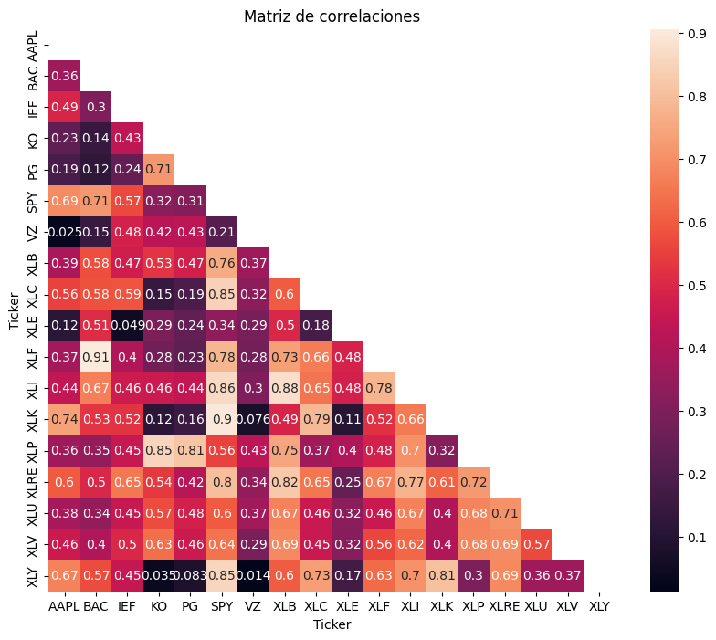
    


Instalamos e importamos la libreria riskfolio lib


```python
%pip install riskfolio-lib
```

    Collecting riskfolio-lib
      Downloading riskfolio_lib-7.2.1-cp312-cp312-manylinux_2_24_x86_64.manylinux_2_28_x86_64.whl.metadata (18 kB)
    Requirement already satisfied: numpy>=1.26.4 in /usr/local/lib/python3.12/dist-packages (from riskfolio-lib) (2.0.2)
    Requirement already satisfied: scipy>=1.16.1 in /usr/local/lib/python3.12/dist-packages (from riskfolio-lib) (1.16.3)
    Requirement already satisfied: pandas>=2.2.2 in /usr/local/lib/python3.12/dist-packages (from riskfolio-lib) (2.2.2)
    Requirement already satisfied: matplotlib>=3.9.2 in /usr/local/lib/python3.12/dist-packages (from riskfolio-lib) (3.10.0)
    Requirement already satisfied: clarabel>=0.11.1 in /usr/local/lib/python3.12/dist-packages (from riskfolio-lib) (0.11.1)
    Requirement already satisfied: SCS>=3.2.7 in /usr/local/lib/python3.12/dist-packages (from riskfolio-lib) (3.2.11)
    Requirement already satisfied: cvxpy>=1.6.6 in /usr/local/lib/python3.12/dist-packages (from riskfolio-lib) (1.6.7)
    Requirement already satisfied: scikit-learn>=1.3.0 in /usr/local/lib/python3.12/dist-packages (from riskfolio-lib) (1.6.1)
    Requirement already satisfied: statsmodels>=0.14.5 in /usr/local/lib/python3.12/dist-packages (from riskfolio-lib) (0.14.6)
    Collecting arch>=7.2 (from riskfolio-lib)
      Downloading arch-8.0.0-cp312-cp312-manylinux2014_x86_64.manylinux_2_17_x86_64.manylinux_2_28_x86_64.whl.metadata (13 kB)
    Collecting xlsxwriter>=3.2.2 (from riskfolio-lib)
      Downloading xlsxwriter-3.2.9-py3-none-any.whl.metadata (2.7 kB)
    Requirement already satisfied: networkx>=3.4.2 in /usr/local/lib/python3.12/dist-packages (from riskfolio-lib) (3.6.1)
    Requirement already satisfied: astropy>=6.1.3 in /usr/local/lib/python3.12/dist-packages (from riskfolio-lib) (7.2.0)
    Collecting pybind11>=2.13.6 (from riskfolio-lib)
      Downloading pybind11-3.0.2-py3-none-any.whl.metadata (10 kB)
    Collecting vectorbt>=0.28.0 (from riskfolio-lib)
      Downloading vectorbt-0.28.4-py3-none-any.whl.metadata (11 kB)
    Requirement already satisfied: packaging in /usr/local/lib/python3.12/dist-packages (from arch>=7.2->riskfolio-lib) (26.0)
    Requirement already satisfied: pyerfa>=2.0.1.1 in /usr/local/lib/python3.12/dist-packages (from astropy>=6.1.3->riskfolio-lib) (2.0.1.5)
    Requirement already satisfied: astropy-iers-data>=0.2025.10.27.0.39.10 in /usr/local/lib/python3.12/dist-packages (from astropy>=6.1.3->riskfolio-lib) (0.2026.2.23.0.48.33)
    Requirement already satisfied: PyYAML>=6.0.0 in /usr/local/lib/python3.12/dist-packages (from astropy>=6.1.3->riskfolio-lib) (6.0.3)
    Requirement already satisfied: cffi in /usr/local/lib/python3.12/dist-packages (from clarabel>=0.11.1->riskfolio-lib) (2.0.0)
    Requirement already satisfied: osqp>=0.6.2 in /usr/local/lib/python3.12/dist-packages (from cvxpy>=1.6.6->riskfolio-lib) (1.1.1)
    Requirement already satisfied: contourpy>=1.0.1 in /usr/local/lib/python3.12/dist-packages (from matplotlib>=3.9.2->riskfolio-lib) (1.3.3)
    Requirement already satisfied: cycler>=0.10 in /usr/local/lib/python3.12/dist-packages (from matplotlib>=3.9.2->riskfolio-lib) (0.12.1)
    Requirement already satisfied: fonttools>=4.22.0 in /usr/local/lib/python3.12/dist-packages (from matplotlib>=3.9.2->riskfolio-lib) (4.61.1)
    Requirement already satisfied: kiwisolver>=1.3.1 in /usr/local/lib/python3.12/dist-packages (from matplotlib>=3.9.2->riskfolio-lib) (1.4.9)
    Requirement already satisfied: pillow>=8 in /usr/local/lib/python3.12/dist-packages (from matplotlib>=3.9.2->riskfolio-lib) (11.3.0)
    Requirement already satisfied: pyparsing>=2.3.1 in /usr/local/lib/python3.12/dist-packages (from matplotlib>=3.9.2->riskfolio-lib) (3.3.2)
    Requirement already satisfied: python-dateutil>=2.7 in /usr/local/lib/python3.12/dist-packages (from matplotlib>=3.9.2->riskfolio-lib) (2.9.0.post0)
    Requirement already satisfied: pytz>=2020.1 in /usr/local/lib/python3.12/dist-packages (from pandas>=2.2.2->riskfolio-lib) (2025.2)
    Requirement already satisfied: tzdata>=2022.7 in /usr/local/lib/python3.12/dist-packages (from pandas>=2.2.2->riskfolio-lib) (2025.3)
    Requirement already satisfied: joblib>=1.2.0 in /usr/local/lib/python3.12/dist-packages (from scikit-learn>=1.3.0->riskfolio-lib) (1.5.3)
    Requirement already satisfied: threadpoolctl>=3.1.0 in /usr/local/lib/python3.12/dist-packages (from scikit-learn>=1.3.0->riskfolio-lib) (3.6.0)
    Requirement already satisfied: patsy>=0.5.6 in /usr/local/lib/python3.12/dist-packages (from statsmodels>=0.14.5->riskfolio-lib) (1.0.2)
    Requirement already satisfied: plotly>=4.12.0 in /usr/local/lib/python3.12/dist-packages (from vectorbt>=0.28.0->riskfolio-lib) (5.24.1)
    Requirement already satisfied: ipywidgets>=7.0.0 in /usr/local/lib/python3.12/dist-packages (from vectorbt>=0.28.0->riskfolio-lib) (7.7.1)
    Requirement already satisfied: anywidget in /usr/local/lib/python3.12/dist-packages (from vectorbt>=0.28.0->riskfolio-lib) (0.9.21)
    Requirement already satisfied: numba>=0.60 in /usr/local/lib/python3.12/dist-packages (from vectorbt>=0.28.0->riskfolio-lib) (0.60.0)
    Requirement already satisfied: dill in /usr/local/lib/python3.12/dist-packages (from vectorbt>=0.28.0->riskfolio-lib) (0.3.8)
    Requirement already satisfied: tqdm in /usr/local/lib/python3.12/dist-packages (from vectorbt>=0.28.0->riskfolio-lib) (4.67.3)
    Collecting dateparser (from vectorbt>=0.28.0->riskfolio-lib)
      Downloading dateparser-1.3.0-py3-none-any.whl.metadata (30 kB)
    Requirement already satisfied: imageio in /usr/local/lib/python3.12/dist-packages (from vectorbt>=0.28.0->riskfolio-lib) (2.37.2)
    Collecting schedule (from vectorbt>=0.28.0->riskfolio-lib)
      Downloading schedule-1.2.2-py3-none-any.whl.metadata (3.8 kB)
    Requirement already satisfied: requests in /usr/local/lib/python3.12/dist-packages (from vectorbt>=0.28.0->riskfolio-lib) (2.32.4)
    Collecting mypy_extensions (from vectorbt>=0.28.0->riskfolio-lib)
      Downloading mypy_extensions-1.1.0-py3-none-any.whl.metadata (1.1 kB)
    Requirement already satisfied: ipykernel>=4.5.1 in /usr/local/lib/python3.12/dist-packages (from ipywidgets>=7.0.0->vectorbt>=0.28.0->riskfolio-lib) (6.17.1)
    Requirement already satisfied: ipython-genutils~=0.2.0 in /usr/local/lib/python3.12/dist-packages (from ipywidgets>=7.0.0->vectorbt>=0.28.0->riskfolio-lib) (0.2.0)
    Requirement already satisfied: traitlets>=4.3.1 in /usr/local/lib/python3.12/dist-packages (from ipywidgets>=7.0.0->vectorbt>=0.28.0->riskfolio-lib) (5.7.1)
    Requirement already satisfied: widgetsnbextension~=3.6.0 in /usr/local/lib/python3.12/dist-packages (from ipywidgets>=7.0.0->vectorbt>=0.28.0->riskfolio-lib) (3.6.10)
    Requirement already satisfied: ipython>=4.0.0 in /usr/local/lib/python3.12/dist-packages (from ipywidgets>=7.0.0->vectorbt>=0.28.0->riskfolio-lib) (7.34.0)
    Requirement already satisfied: jupyterlab-widgets>=1.0.0 in /usr/local/lib/python3.12/dist-packages (from ipywidgets>=7.0.0->vectorbt>=0.28.0->riskfolio-lib) (3.0.16)
    Requirement already satisfied: llvmlite<0.44,>=0.43.0dev0 in /usr/local/lib/python3.12/dist-packages (from numba>=0.60->vectorbt>=0.28.0->riskfolio-lib) (0.43.0)
    Requirement already satisfied: jinja2 in /usr/local/lib/python3.12/dist-packages (from osqp>=0.6.2->cvxpy>=1.6.6->riskfolio-lib) (3.1.6)
    Requirement already satisfied: setuptools in /usr/local/lib/python3.12/dist-packages (from osqp>=0.6.2->cvxpy>=1.6.6->riskfolio-lib) (75.2.0)
    Requirement already satisfied: tenacity>=6.2.0 in /usr/local/lib/python3.12/dist-packages (from plotly>=4.12.0->vectorbt>=0.28.0->riskfolio-lib) (9.1.4)
    Requirement already satisfied: six>=1.5 in /usr/local/lib/python3.12/dist-packages (from python-dateutil>=2.7->matplotlib>=3.9.2->riskfolio-lib) (1.17.0)
    Requirement already satisfied: psygnal>=0.8.1 in /usr/local/lib/python3.12/dist-packages (from anywidget->vectorbt>=0.28.0->riskfolio-lib) (0.15.1)
    Requirement already satisfied: typing-extensions>=4.2.0 in /usr/local/lib/python3.12/dist-packages (from anywidget->vectorbt>=0.28.0->riskfolio-lib) (4.15.0)
    Requirement already satisfied: pycparser in /usr/local/lib/python3.12/dist-packages (from cffi->clarabel>=0.11.1->riskfolio-lib) (3.0)
    Requirement already satisfied: regex>=2024.9.11 in /usr/local/lib/python3.12/dist-packages (from dateparser->vectorbt>=0.28.0->riskfolio-lib) (2025.11.3)
    Requirement already satisfied: tzlocal>=0.2 in /usr/local/lib/python3.12/dist-packages (from dateparser->vectorbt>=0.28.0->riskfolio-lib) (5.3.1)
    Requirement already satisfied: charset_normalizer<4,>=2 in /usr/local/lib/python3.12/dist-packages (from requests->vectorbt>=0.28.0->riskfolio-lib) (3.4.4)
    Requirement already satisfied: idna<4,>=2.5 in /usr/local/lib/python3.12/dist-packages (from requests->vectorbt>=0.28.0->riskfolio-lib) (3.11)
    Requirement already satisfied: urllib3<3,>=1.21.1 in /usr/local/lib/python3.12/dist-packages (from requests->vectorbt>=0.28.0->riskfolio-lib) (2.5.0)
    Requirement already satisfied: certifi>=2017.4.17 in /usr/local/lib/python3.12/dist-packages (from requests->vectorbt>=0.28.0->riskfolio-lib) (2026.2.25)
    Requirement already satisfied: debugpy>=1.0 in /usr/local/lib/python3.12/dist-packages (from ipykernel>=4.5.1->ipywidgets>=7.0.0->vectorbt>=0.28.0->riskfolio-lib) (1.8.15)
    Requirement already satisfied: jupyter-client>=6.1.12 in /usr/local/lib/python3.12/dist-packages (from ipykernel>=4.5.1->ipywidgets>=7.0.0->vectorbt>=0.28.0->riskfolio-lib) (7.4.9)
    Requirement already satisfied: matplotlib-inline>=0.1 in /usr/local/lib/python3.12/dist-packages (from ipykernel>=4.5.1->ipywidgets>=7.0.0->vectorbt>=0.28.0->riskfolio-lib) (0.2.1)
    Requirement already satisfied: nest-asyncio in /usr/local/lib/python3.12/dist-packages (from ipykernel>=4.5.1->ipywidgets>=7.0.0->vectorbt>=0.28.0->riskfolio-lib) (1.6.0)
    Requirement already satisfied: psutil in /usr/local/lib/python3.12/dist-packages (from ipykernel>=4.5.1->ipywidgets>=7.0.0->vectorbt>=0.28.0->riskfolio-lib) (5.9.5)
    Requirement already satisfied: pyzmq>=17 in /usr/local/lib/python3.12/dist-packages (from ipykernel>=4.5.1->ipywidgets>=7.0.0->vectorbt>=0.28.0->riskfolio-lib) (26.2.1)
    Requirement already satisfied: tornado>=6.1 in /usr/local/lib/python3.12/dist-packages (from ipykernel>=4.5.1->ipywidgets>=7.0.0->vectorbt>=0.28.0->riskfolio-lib) (6.5.1)
    Collecting jedi>=0.16 (from ipython>=4.0.0->ipywidgets>=7.0.0->vectorbt>=0.28.0->riskfolio-lib)
      Downloading jedi-0.19.2-py2.py3-none-any.whl.metadata (22 kB)
    Requirement already satisfied: decorator in /usr/local/lib/python3.12/dist-packages (from ipython>=4.0.0->ipywidgets>=7.0.0->vectorbt>=0.28.0->riskfolio-lib) (4.4.2)
    Requirement already satisfied: pickleshare in /usr/local/lib/python3.12/dist-packages (from ipython>=4.0.0->ipywidgets>=7.0.0->vectorbt>=0.28.0->riskfolio-lib) (0.7.5)
    Requirement already satisfied: prompt-toolkit!=3.0.0,!=3.0.1,<3.1.0,>=2.0.0 in /usr/local/lib/python3.12/dist-packages (from ipython>=4.0.0->ipywidgets>=7.0.0->vectorbt>=0.28.0->riskfolio-lib) (3.0.52)
    Requirement already satisfied: pygments in /usr/local/lib/python3.12/dist-packages (from ipython>=4.0.0->ipywidgets>=7.0.0->vectorbt>=0.28.0->riskfolio-lib) (2.19.2)
    Requirement already satisfied: backcall in /usr/local/lib/python3.12/dist-packages (from ipython>=4.0.0->ipywidgets>=7.0.0->vectorbt>=0.28.0->riskfolio-lib) (0.2.0)
    Requirement already satisfied: pexpect>4.3 in /usr/local/lib/python3.12/dist-packages (from ipython>=4.0.0->ipywidgets>=7.0.0->vectorbt>=0.28.0->riskfolio-lib) (4.9.0)
    Requirement already satisfied: notebook>=4.4.1 in /usr/local/lib/python3.12/dist-packages (from widgetsnbextension~=3.6.0->ipywidgets>=7.0.0->vectorbt>=0.28.0->riskfolio-lib) (6.5.7)
    Requirement already satisfied: MarkupSafe>=2.0 in /usr/local/lib/python3.12/dist-packages (from jinja2->osqp>=0.6.2->cvxpy>=1.6.6->riskfolio-lib) (3.0.3)
    Requirement already satisfied: parso<0.9.0,>=0.8.4 in /usr/local/lib/python3.12/dist-packages (from jedi>=0.16->ipython>=4.0.0->ipywidgets>=7.0.0->vectorbt>=0.28.0->riskfolio-lib) (0.8.6)
    Requirement already satisfied: entrypoints in /usr/local/lib/python3.12/dist-packages (from jupyter-client>=6.1.12->ipykernel>=4.5.1->ipywidgets>=7.0.0->vectorbt>=0.28.0->riskfolio-lib) (0.4)
    Requirement already satisfied: jupyter-core>=4.9.2 in /usr/local/lib/python3.12/dist-packages (from jupyter-client>=6.1.12->ipykernel>=4.5.1->ipywidgets>=7.0.0->vectorbt>=0.28.0->riskfolio-lib) (5.9.1)
    Requirement already satisfied: argon2-cffi in /usr/local/lib/python3.12/dist-packages (from notebook>=4.4.1->widgetsnbextension~=3.6.0->ipywidgets>=7.0.0->vectorbt>=0.28.0->riskfolio-lib) (25.1.0)
    Requirement already satisfied: nbformat in /usr/local/lib/python3.12/dist-packages (from notebook>=4.4.1->widgetsnbextension~=3.6.0->ipywidgets>=7.0.0->vectorbt>=0.28.0->riskfolio-lib) (5.10.4)
    Requirement already satisfied: nbconvert>=5 in /usr/local/lib/python3.12/dist-packages (from notebook>=4.4.1->widgetsnbextension~=3.6.0->ipywidgets>=7.0.0->vectorbt>=0.28.0->riskfolio-lib) (7.17.0)
    Requirement already satisfied: Send2Trash>=1.8.0 in /usr/local/lib/python3.12/dist-packages (from notebook>=4.4.1->widgetsnbextension~=3.6.0->ipywidgets>=7.0.0->vectorbt>=0.28.0->riskfolio-lib) (2.1.0)
    Requirement already satisfied: terminado>=0.8.3 in /usr/local/lib/python3.12/dist-packages (from notebook>=4.4.1->widgetsnbextension~=3.6.0->ipywidgets>=7.0.0->vectorbt>=0.28.0->riskfolio-lib) (0.18.1)
    Requirement already satisfied: prometheus-client in /usr/local/lib/python3.12/dist-packages (from notebook>=4.4.1->widgetsnbextension~=3.6.0->ipywidgets>=7.0.0->vectorbt>=0.28.0->riskfolio-lib) (0.24.1)
    Requirement already satisfied: nbclassic>=0.4.7 in /usr/local/lib/python3.12/dist-packages (from notebook>=4.4.1->widgetsnbextension~=3.6.0->ipywidgets>=7.0.0->vectorbt>=0.28.0->riskfolio-lib) (1.3.3)
    Requirement already satisfied: ptyprocess>=0.5 in /usr/local/lib/python3.12/dist-packages (from pexpect>4.3->ipython>=4.0.0->ipywidgets>=7.0.0->vectorbt>=0.28.0->riskfolio-lib) (0.7.0)
    Requirement already satisfied: wcwidth in /usr/local/lib/python3.12/dist-packages (from prompt-toolkit!=3.0.0,!=3.0.1,<3.1.0,>=2.0.0->ipython>=4.0.0->ipywidgets>=7.0.0->vectorbt>=0.28.0->riskfolio-lib) (0.6.0)
    Requirement already satisfied: platformdirs>=2.5 in /usr/local/lib/python3.12/dist-packages (from jupyter-core>=4.9.2->jupyter-client>=6.1.12->ipykernel>=4.5.1->ipywidgets>=7.0.0->vectorbt>=0.28.0->riskfolio-lib) (4.9.2)
    Requirement already satisfied: notebook-shim>=0.2.3 in /usr/local/lib/python3.12/dist-packages (from nbclassic>=0.4.7->notebook>=4.4.1->widgetsnbextension~=3.6.0->ipywidgets>=7.0.0->vectorbt>=0.28.0->riskfolio-lib) (0.2.4)
    Requirement already satisfied: beautifulsoup4 in /usr/local/lib/python3.12/dist-packages (from nbconvert>=5->notebook>=4.4.1->widgetsnbextension~=3.6.0->ipywidgets>=7.0.0->vectorbt>=0.28.0->riskfolio-lib) (4.13.5)
    Requirement already satisfied: bleach!=5.0.0 in /usr/local/lib/python3.12/dist-packages (from bleach[css]!=5.0.0->nbconvert>=5->notebook>=4.4.1->widgetsnbextension~=3.6.0->ipywidgets>=7.0.0->vectorbt>=0.28.0->riskfolio-lib) (6.3.0)
    Requirement already satisfied: defusedxml in /usr/local/lib/python3.12/dist-packages (from nbconvert>=5->notebook>=4.4.1->widgetsnbextension~=3.6.0->ipywidgets>=7.0.0->vectorbt>=0.28.0->riskfolio-lib) (0.7.1)
    Requirement already satisfied: jupyterlab-pygments in /usr/local/lib/python3.12/dist-packages (from nbconvert>=5->notebook>=4.4.1->widgetsnbextension~=3.6.0->ipywidgets>=7.0.0->vectorbt>=0.28.0->riskfolio-lib) (0.3.0)
    Requirement already satisfied: mistune<4,>=2.0.3 in /usr/local/lib/python3.12/dist-packages (from nbconvert>=5->notebook>=4.4.1->widgetsnbextension~=3.6.0->ipywidgets>=7.0.0->vectorbt>=0.28.0->riskfolio-lib) (3.2.0)
    Requirement already satisfied: nbclient>=0.5.0 in /usr/local/lib/python3.12/dist-packages (from nbconvert>=5->notebook>=4.4.1->widgetsnbextension~=3.6.0->ipywidgets>=7.0.0->vectorbt>=0.28.0->riskfolio-lib) (0.10.4)
    Requirement already satisfied: pandocfilters>=1.4.1 in /usr/local/lib/python3.12/dist-packages (from nbconvert>=5->notebook>=4.4.1->widgetsnbextension~=3.6.0->ipywidgets>=7.0.0->vectorbt>=0.28.0->riskfolio-lib) (1.5.1)
    Requirement already satisfied: fastjsonschema>=2.15 in /usr/local/lib/python3.12/dist-packages (from nbformat->notebook>=4.4.1->widgetsnbextension~=3.6.0->ipywidgets>=7.0.0->vectorbt>=0.28.0->riskfolio-lib) (2.21.2)
    Requirement already satisfied: jsonschema>=2.6 in /usr/local/lib/python3.12/dist-packages (from nbformat->notebook>=4.4.1->widgetsnbextension~=3.6.0->ipywidgets>=7.0.0->vectorbt>=0.28.0->riskfolio-lib) (4.26.0)
    Requirement already satisfied: argon2-cffi-bindings in /usr/local/lib/python3.12/dist-packages (from argon2-cffi->notebook>=4.4.1->widgetsnbextension~=3.6.0->ipywidgets>=7.0.0->vectorbt>=0.28.0->riskfolio-lib) (25.1.0)
    Requirement already satisfied: webencodings in /usr/local/lib/python3.12/dist-packages (from bleach!=5.0.0->bleach[css]!=5.0.0->nbconvert>=5->notebook>=4.4.1->widgetsnbextension~=3.6.0->ipywidgets>=7.0.0->vectorbt>=0.28.0->riskfolio-lib) (0.5.1)
    Requirement already satisfied: tinycss2<1.5,>=1.1.0 in /usr/local/lib/python3.12/dist-packages (from bleach[css]!=5.0.0->nbconvert>=5->notebook>=4.4.1->widgetsnbextension~=3.6.0->ipywidgets>=7.0.0->vectorbt>=0.28.0->riskfolio-lib) (1.4.0)
    Requirement already satisfied: attrs>=22.2.0 in /usr/local/lib/python3.12/dist-packages (from jsonschema>=2.6->nbformat->notebook>=4.4.1->widgetsnbextension~=3.6.0->ipywidgets>=7.0.0->vectorbt>=0.28.0->riskfolio-lib) (25.4.0)
    Requirement already satisfied: jsonschema-specifications>=2023.03.6 in /usr/local/lib/python3.12/dist-packages (from jsonschema>=2.6->nbformat->notebook>=4.4.1->widgetsnbextension~=3.6.0->ipywidgets>=7.0.0->vectorbt>=0.28.0->riskfolio-lib) (2025.9.1)
    Requirement already satisfied: referencing>=0.28.4 in /usr/local/lib/python3.12/dist-packages (from jsonschema>=2.6->nbformat->notebook>=4.4.1->widgetsnbextension~=3.6.0->ipywidgets>=7.0.0->vectorbt>=0.28.0->riskfolio-lib) (0.37.0)
    Requirement already satisfied: rpds-py>=0.25.0 in /usr/local/lib/python3.12/dist-packages (from jsonschema>=2.6->nbformat->notebook>=4.4.1->widgetsnbextension~=3.6.0->ipywidgets>=7.0.0->vectorbt>=0.28.0->riskfolio-lib) (0.30.0)
    Requirement already satisfied: jupyter-server<3,>=1.8 in /usr/local/lib/python3.12/dist-packages (from notebook-shim>=0.2.3->nbclassic>=0.4.7->notebook>=4.4.1->widgetsnbextension~=3.6.0->ipywidgets>=7.0.0->vectorbt>=0.28.0->riskfolio-lib) (2.14.0)
    Requirement already satisfied: soupsieve>1.2 in /usr/local/lib/python3.12/dist-packages (from beautifulsoup4->nbconvert>=5->notebook>=4.4.1->widgetsnbextension~=3.6.0->ipywidgets>=7.0.0->vectorbt>=0.28.0->riskfolio-lib) (2.8.3)
    Requirement already satisfied: anyio>=3.1.0 in /usr/local/lib/python3.12/dist-packages (from jupyter-server<3,>=1.8->notebook-shim>=0.2.3->nbclassic>=0.4.7->notebook>=4.4.1->widgetsnbextension~=3.6.0->ipywidgets>=7.0.0->vectorbt>=0.28.0->riskfolio-lib) (4.12.1)
    Requirement already satisfied: jupyter-events>=0.9.0 in /usr/local/lib/python3.12/dist-packages (from jupyter-server<3,>=1.8->notebook-shim>=0.2.3->nbclassic>=0.4.7->notebook>=4.4.1->widgetsnbextension~=3.6.0->ipywidgets>=7.0.0->vectorbt>=0.28.0->riskfolio-lib) (0.12.0)
    Requirement already satisfied: jupyter-server-terminals>=0.4.4 in /usr/local/lib/python3.12/dist-packages (from jupyter-server<3,>=1.8->notebook-shim>=0.2.3->nbclassic>=0.4.7->notebook>=4.4.1->widgetsnbextension~=3.6.0->ipywidgets>=7.0.0->vectorbt>=0.28.0->riskfolio-lib) (0.5.4)
    Requirement already satisfied: overrides>=5.0 in /usr/local/lib/python3.12/dist-packages (from jupyter-server<3,>=1.8->notebook-shim>=0.2.3->nbclassic>=0.4.7->notebook>=4.4.1->widgetsnbextension~=3.6.0->ipywidgets>=7.0.0->vectorbt>=0.28.0->riskfolio-lib) (7.7.0)
    Requirement already satisfied: websocket-client>=1.7 in /usr/local/lib/python3.12/dist-packages (from jupyter-server<3,>=1.8->notebook-shim>=0.2.3->nbclassic>=0.4.7->notebook>=4.4.1->widgetsnbextension~=3.6.0->ipywidgets>=7.0.0->vectorbt>=0.28.0->riskfolio-lib) (1.9.0)
    Requirement already satisfied: python-json-logger>=2.0.4 in /usr/local/lib/python3.12/dist-packages (from jupyter-events>=0.9.0->jupyter-server<3,>=1.8->notebook-shim>=0.2.3->nbclassic>=0.4.7->notebook>=4.4.1->widgetsnbextension~=3.6.0->ipywidgets>=7.0.0->vectorbt>=0.28.0->riskfolio-lib) (4.0.0)
    Requirement already satisfied: rfc3339-validator in /usr/local/lib/python3.12/dist-packages (from jupyter-events>=0.9.0->jupyter-server<3,>=1.8->notebook-shim>=0.2.3->nbclassic>=0.4.7->notebook>=4.4.1->widgetsnbextension~=3.6.0->ipywidgets>=7.0.0->vectorbt>=0.28.0->riskfolio-lib) (0.1.4)
    Requirement already satisfied: rfc3986-validator>=0.1.1 in /usr/local/lib/python3.12/dist-packages (from jupyter-events>=0.9.0->jupyter-server<3,>=1.8->notebook-shim>=0.2.3->nbclassic>=0.4.7->notebook>=4.4.1->widgetsnbextension~=3.6.0->ipywidgets>=7.0.0->vectorbt>=0.28.0->riskfolio-lib) (0.1.1)
    Requirement already satisfied: fqdn in /usr/local/lib/python3.12/dist-packages (from jsonschema[format-nongpl]>=4.18.0->jupyter-events>=0.9.0->jupyter-server<3,>=1.8->notebook-shim>=0.2.3->nbclassic>=0.4.7->notebook>=4.4.1->widgetsnbextension~=3.6.0->ipywidgets>=7.0.0->vectorbt>=0.28.0->riskfolio-lib) (1.5.1)
    Requirement already satisfied: isoduration in /usr/local/lib/python3.12/dist-packages (from jsonschema[format-nongpl]>=4.18.0->jupyter-events>=0.9.0->jupyter-server<3,>=1.8->notebook-shim>=0.2.3->nbclassic>=0.4.7->notebook>=4.4.1->widgetsnbextension~=3.6.0->ipywidgets>=7.0.0->vectorbt>=0.28.0->riskfolio-lib) (20.11.0)
    Requirement already satisfied: jsonpointer>1.13 in /usr/local/lib/python3.12/dist-packages (from jsonschema[format-nongpl]>=4.18.0->jupyter-events>=0.9.0->jupyter-server<3,>=1.8->notebook-shim>=0.2.3->nbclassic>=0.4.7->notebook>=4.4.1->widgetsnbextension~=3.6.0->ipywidgets>=7.0.0->vectorbt>=0.28.0->riskfolio-lib) (3.0.0)
    Requirement already satisfied: rfc3987-syntax>=1.1.0 in /usr/local/lib/python3.12/dist-packages (from jsonschema[format-nongpl]>=4.18.0->jupyter-events>=0.9.0->jupyter-server<3,>=1.8->notebook-shim>=0.2.3->nbclassic>=0.4.7->notebook>=4.4.1->widgetsnbextension~=3.6.0->ipywidgets>=7.0.0->vectorbt>=0.28.0->riskfolio-lib) (1.1.0)
    Requirement already satisfied: uri-template in /usr/local/lib/python3.12/dist-packages (from jsonschema[format-nongpl]>=4.18.0->jupyter-events>=0.9.0->jupyter-server<3,>=1.8->notebook-shim>=0.2.3->nbclassic>=0.4.7->notebook>=4.4.1->widgetsnbextension~=3.6.0->ipywidgets>=7.0.0->vectorbt>=0.28.0->riskfolio-lib) (1.3.0)
    Requirement already satisfied: webcolors>=24.6.0 in /usr/local/lib/python3.12/dist-packages (from jsonschema[format-nongpl]>=4.18.0->jupyter-events>=0.9.0->jupyter-server<3,>=1.8->notebook-shim>=0.2.3->nbclassic>=0.4.7->notebook>=4.4.1->widgetsnbextension~=3.6.0->ipywidgets>=7.0.0->vectorbt>=0.28.0->riskfolio-lib) (25.10.0)
    Requirement already satisfied: lark>=1.2.2 in /usr/local/lib/python3.12/dist-packages (from rfc3987-syntax>=1.1.0->jsonschema[format-nongpl]>=4.18.0->jupyter-events>=0.9.0->jupyter-server<3,>=1.8->notebook-shim>=0.2.3->nbclassic>=0.4.7->notebook>=4.4.1->widgetsnbextension~=3.6.0->ipywidgets>=7.0.0->vectorbt>=0.28.0->riskfolio-lib) (1.3.1)
    Requirement already satisfied: arrow>=0.15.0 in /usr/local/lib/python3.12/dist-packages (from isoduration->jsonschema[format-nongpl]>=4.18.0->jupyter-events>=0.9.0->jupyter-server<3,>=1.8->notebook-shim>=0.2.3->nbclassic>=0.4.7->notebook>=4.4.1->widgetsnbextension~=3.6.0->ipywidgets>=7.0.0->vectorbt>=0.28.0->riskfolio-lib) (1.4.0)
    Downloading riskfolio_lib-7.2.1-cp312-cp312-manylinux_2_24_x86_64.manylinux_2_28_x86_64.whl (319 kB)
       ━━━━━━━━━━━━━━━━━━━━━━━━━━━━━━━━━━━━━━━━ 319.9/319.9 kB 26.6 MB/s eta 0:00:00
    [?25hDownloading arch-8.0.0-cp312-cp312-manylinux2014_x86_64.manylinux_2_17_x86_64.manylinux_2_28_x86_64.whl (981 kB)
       ━━━━━━━━━━━━━━━━━━━━━━━━━━━━━━━━━━━━━━━━ 981.3/981.3 kB 34.7 MB/s eta 0:00:00
    [?25hDownloading pybind11-3.0.2-py3-none-any.whl (310 kB)
       ━━━━━━━━━━━━━━━━━━━━━━━━━━━━━━━━━━━━━━━━ 310.2/310.2 kB 18.3 MB/s eta 0:00:00
    [?25hDownloading vectorbt-0.28.4-py3-none-any.whl (420 kB)
       ━━━━━━━━━━━━━━━━━━━━━━━━━━━━━━━━━━━━━━━━ 420.7/420.7 kB 23.0 MB/s eta 0:00:00
    [?25hDownloading xlsxwriter-3.2.9-py3-none-any.whl (175 kB)
       ━━━━━━━━━━━━━━━━━━━━━━━━━━━━━━━━━━━━━━━━ 175.3/175.3 kB 9.1 MB/s eta 0:00:00
    [?25hDownloading dateparser-1.3.0-py3-none-any.whl (318 kB)
       ━━━━━━━━━━━━━━━━━━━━━━━━━━━━━━━━━━━━━━━━ 318.7/318.7 kB 23.6 MB/s eta 0:00:00
    [?25hDownloading mypy_extensions-1.1.0-py3-none-any.whl (5.0 kB)
    Downloading schedule-1.2.2-py3-none-any.whl (12 kB)
    Downloading jedi-0.19.2-py2.py3-none-any.whl (1.6 MB)
       ━━━━━━━━━━━━━━━━━━━━━━━━━━━━━━━━━━━━━━━━ 1.6/1.6 MB 39.9 MB/s eta 0:00:00
    [?25hInstalling collected packages: xlsxwriter, schedule, pybind11, mypy_extensions, jedi, dateparser, arch, vectorbt, riskfolio-lib
    Successfully installed arch-8.0.0 dateparser-1.3.0 jedi-0.19.2 mypy_extensions-1.1.0 pybind11-3.0.2 riskfolio-lib-7.2.1 schedule-1.2.2 vectorbt-0.28.4 xlsxwriter-3.2.9


```python
import riskfolio as rp
```


```python
#USAMOS CLUSTERING
rp.plot_clusters(y)
```


    <Axes: >


    
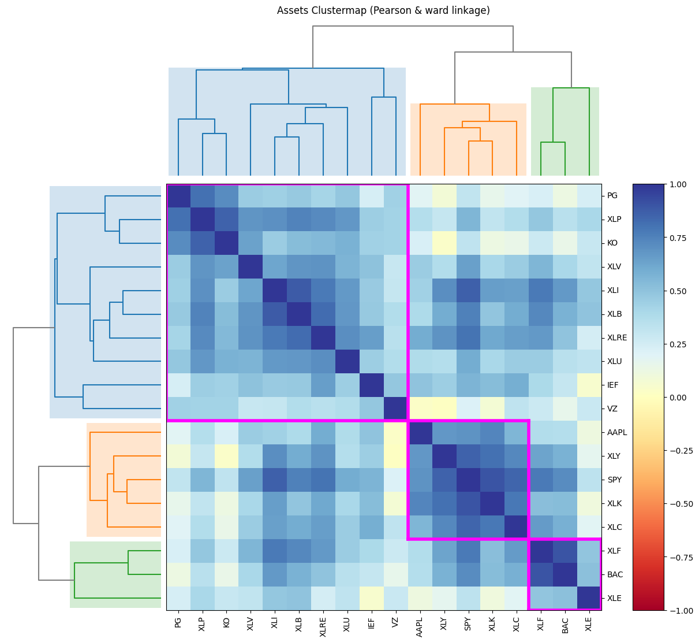
    


### Lectura del clustering

El dendrograma agrupa los activos en tres bloques con alta correlacion interna, casi
todos ligados al S&P 500. Esto anticipa el resultado de la optimizacion: como la
correlacion entre la mayoria de activos es alta, el beneficio de diversificacion
dentro de la renta variable es limitado, y el optimizador va a concentrar peso en
los pocos activos que se comportan distinto (renta fija, servicios publicos).

Correr el clustering antes de optimizar evita interpretar como hallazgo lo que en
realidad es estructura de correlaciones conocida.

Optimizacion de Portafolios: Modelo Clasico M/V con funcion objetivo maximizar el ratio de Sharpe


```python
# Construyendo el objeto rp denominandolo port con el modulo Portfolio
port = rp.Portfolio(returns=y)

method_mu = 'hist'
method_cov = 'hist'

port.assets_stats(method_mu=method_mu, method_cov=method_cov)

# Parametrizacion del modelo
port.alpha = 0.05
model = 'Classic' # Modelo calculado con datos historicos
rm = 'MV' # Utilizando la matriz de varianzas y covarianzas historica
obj = 'Sharpe' # Maximizando el ratio de Sharpe, otras opciones son 'MinRisk' y 'MaxRet'
hist = True
rf = 0 # La tasa libre de riesgo
l = 0 # lambda es un factor de aversion al riesgo, que se utiliza para modelar funciones de utilidad

w = port.optimization(model=model, rm=rm, obj=obj, hist=hist, rf=rf, l=l)
```


```python
display(w)
```


  <div id="df-012baa10-63f2-468b-a393-34093d7fe266" class="colab-df-container">
    <div>
<style scoped>
    .dataframe tbody tr th:only-of-type {
        vertical-align: middle;
    }

    .dataframe tbody tr th {
        vertical-align: top;
    }

    .dataframe thead th {
        text-align: right;
    }
</style>
<table border="1" class="dataframe">
  <thead>
    <tr style="text-align: right;">
      <th></th>
      <th>weights</th>
    </tr>
  </thead>
  <tbody>
    <tr>
      <th>AAPL</th>
      <td>5.057899e-02</td>
    </tr>
    <tr>
      <th>BAC</th>
      <td>2.197688e-09</td>
    </tr>
    <tr>
      <th>IEF</th>
      <td>5.004361e-09</td>
    </tr>
    <tr>
      <th>KO</th>
      <td>2.817717e-01</td>
    </tr>
    <tr>
      <th>PG</th>
      <td>6.302961e-09</td>
    </tr>
    <tr>
      <th>SPY</th>
      <td>1.002628e-08</td>
    </tr>
    <tr>
      <th>VZ</th>
      <td>7.417127e-09</td>
    </tr>
    <tr>
      <th>XLB</th>
      <td>2.419370e-09</td>
    </tr>
    <tr>
      <th>XLC</th>
      <td>1.445626e-08</td>
    </tr>
    <tr>
      <th>XLE</th>
      <td>3.238589e-01</td>
    </tr>
    <tr>
      <th>XLF</th>
      <td>6.418118e-09</td>
    </tr>
    <tr>
      <th>XLI</th>
      <td>6.448645e-09</td>
    </tr>
    <tr>
      <th>XLK</th>
      <td>3.437903e-01</td>
    </tr>
    <tr>
      <th>XLP</th>
      <td>6.673564e-09</td>
    </tr>
    <tr>
      <th>XLRE</th>
      <td>2.448138e-09</td>
    </tr>
    <tr>
      <th>XLU</th>
      <td>3.067669e-08</td>
    </tr>
    <tr>
      <th>XLV</th>
      <td>6.620343e-09</td>
    </tr>
    <tr>
      <th>XLY</th>
      <td>3.554223e-09</td>
    </tr>
  </tbody>
</table>
</div>
    <div class="colab-df-buttons">

  <div class="colab-df-container">
    <button class="colab-df-convert" onclick="convertToInteractive('df-012baa10-63f2-468b-a393-34093d7fe266')"
            title="Convert this dataframe to an interactive table."
            style="display:none;">

  <svg xmlns="http://www.w3.org/2000/svg" height="24px" viewBox="0 -960 960 960">
    <path d="M120-120v-720h720v720H120Zm60-500h600v-160H180v160Zm220 220h160v-160H400v160Zm0 220h160v-160H400v160ZM180-400h160v-160H180v160Zm440 0h160v-160H620v160ZM180-180h160v-160H180v160Zm440 0h160v-160H620v160Z"/>
  </svg>
    </button>

  <style>
    .colab-df-container {
      display:flex;
      gap: 12px;
    }

    .colab-df-convert {
      background-color: #E8F0FE;
      border: none;
      border-radius: 50%;
      cursor: pointer;
      display: none;
      fill: #1967D2;
      height: 32px;
      padding: 0 0 0 0;
      width: 32px;
    }

    .colab-df-convert:hover {
      background-color: #E2EBFA;
      box-shadow: 0px 1px 2px rgba(60, 64, 67, 0.3), 0px 1px 3px 1px rgba(60, 64, 67, 0.15);
      fill: #174EA6;
    }

    .colab-df-buttons div {
      margin-bottom: 4px;
    }

    [theme=dark] .colab-df-convert {
      background-color: #3B4455;
      fill: #D2E3FC;
    }

    [theme=dark] .colab-df-convert:hover {
      background-color: #434B5C;
      box-shadow: 0px 1px 3px 1px rgba(0, 0, 0, 0.15);
      filter: drop-shadow(0px 1px 2px rgba(0, 0, 0, 0.3));
      fill: #FFFFFF;
    }
  </style>

    <script>
      const buttonEl =
        document.querySelector('#df-012baa10-63f2-468b-a393-34093d7fe266 button.colab-df-convert');
      buttonEl.style.display =
        google.colab.kernel.accessAllowed ? 'block' : 'none';

      async function convertToInteractive(key) {
        const element = document.querySelector('#df-012baa10-63f2-468b-a393-34093d7fe266');
        const dataTable =
          await google.colab.kernel.invokeFunction('convertToInteractive',
                                                    [key], {});
        if (!dataTable) return;

        const docLinkHtml = 'Like what you see? Visit the ' +
          '<a target="_blank" href=https://colab.research.google.com/notebooks/data_table.ipynb>data table notebook</a>'
          + ' to learn more about interactive tables.';
        element.innerHTML = '';
        dataTable['output_type'] = 'display_data';
        await google.colab.output.renderOutput(dataTable, element);
        const docLink = document.createElement('div');
        docLink.innerHTML = docLinkHtml;
        element.appendChild(docLink);
      }
    </script>
  </div>


  <div id="id_6fd21e34-bdb7-45fe-900e-d23027541341">
    <style>
      .colab-df-generate {
        background-color: #E8F0FE;
        border: none;
        border-radius: 50%;
        cursor: pointer;
        display: none;
        fill: #1967D2;
        height: 32px;
        padding: 0 0 0 0;
        width: 32px;
      }

      .colab-df-generate:hover {
        background-color: #E2EBFA;
        box-shadow: 0px 1px 2px rgba(60, 64, 67, 0.3), 0px 1px 3px 1px rgba(60, 64, 67, 0.15);
        fill: #174EA6;
      }

      [theme=dark] .colab-df-generate {
        background-color: #3B4455;
        fill: #D2E3FC;
      }

      [theme=dark] .colab-df-generate:hover {
        background-color: #434B5C;
        box-shadow: 0px 1px 3px 1px rgba(0, 0, 0, 0.15);
        filter: drop-shadow(0px 1px 2px rgba(0, 0, 0, 0.3));
        fill: #FFFFFF;
      }
    </style>
    <button class="colab-df-generate" onclick="generateWithVariable('w')"
            title="Generate code using this dataframe."
            style="display:none;">

  <svg xmlns="http://www.w3.org/2000/svg" height="24px"viewBox="0 0 24 24"
       width="24px">
    <path d="M7,19H8.4L18.45,9,17,7.55,7,17.6ZM5,21V16.75L18.45,3.32a2,2,0,0,1,2.83,0l1.4,1.43a1.91,1.91,0,0,1,.58,1.4,1.91,1.91,0,0,1-.58,1.4L9.25,21ZM18.45,9,17,7.55Zm-12,3A5.31,5.31,0,0,0,4.9,8.1,5.31,5.31,0,0,0,1,6.5,5.31,5.31,0,0,0,4.9,4.9,5.31,5.31,0,0,0,6.5,1,5.31,5.31,0,0,0,8.1,4.9,5.31,5.31,0,0,0,12,6.5,5.46,5.46,0,0,0,6.5,12Z"/>
  </svg>
    </button>
    <script>
      (() => {
      const buttonEl =
        document.querySelector('#id_6fd21e34-bdb7-45fe-900e-d23027541341 button.colab-df-generate');
      buttonEl.style.display =
        google.colab.kernel.accessAllowed ? 'block' : 'none';

      buttonEl.onclick = () => {
        google.colab.notebook.generateWithVariable('w');
      }
      })();
    </script>
  </div>

    </div>
  </div>


```python
# Graficamos el portafolio maximizando el ratio de Sharpe
ax = rp.plot_pie(w=w, title='Cartera optima utilizando el modelo Clasico M/V y con funcion objetivo maximizar ratio de Sharpe')
```


    

    


```python
points = 50
frontier = port.efficient_frontier(model=model, rm=rm, points=points, hist=hist, rf=rf)
display(frontier.T.head(20))
```


  <div id="df-2e840eef-70a5-42ed-8fee-5f2f4a7f8197" class="colab-df-container">
    <div>
<style scoped>
    .dataframe tbody tr th:only-of-type {
        vertical-align: middle;
    }

    .dataframe tbody tr th {
        vertical-align: top;
    }

    .dataframe thead th {
        text-align: right;
    }
</style>
<table border="1" class="dataframe">
  <thead>
    <tr style="text-align: right;">
      <th></th>
      <th>AAPL</th>
      <th>BAC</th>
      <th>IEF</th>
      <th>KO</th>
      <th>PG</th>
      <th>SPY</th>
      <th>VZ</th>
      <th>XLB</th>
      <th>XLC</th>
      <th>XLE</th>
      <th>XLF</th>
      <th>XLI</th>
      <th>XLK</th>
      <th>XLP</th>
      <th>XLRE</th>
      <th>XLU</th>
      <th>XLV</th>
      <th>XLY</th>
    </tr>
  </thead>
  <tbody>
    <tr>
      <th>0</th>
      <td>1.875977e-10</td>
      <td>2.775683e-10</td>
      <td>8.843073e-01</td>
      <td>5.132850e-10</td>
      <td>5.612761e-02</td>
      <td>4.083199e-10</td>
      <td>2.288976e-10</td>
      <td>2.011479e-10</td>
      <td>2.484078e-10</td>
      <td>0.059565</td>
      <td>5.880121e-10</td>
      <td>3.040822e-10</td>
      <td>2.554048e-10</td>
      <td>1.349911e-09</td>
      <td>1.478904e-10</td>
      <td>5.233751e-10</td>
      <td>7.280231e-10</td>
      <td>3.275097e-10</td>
    </tr>
    <tr>
      <th>1</th>
      <td>3.579577e-08</td>
      <td>8.118965e-09</td>
      <td>7.676873e-01</td>
      <td>1.094098e-02</td>
      <td>6.878176e-02</td>
      <td>7.214105e-08</td>
      <td>1.046067e-08</td>
      <td>6.910161e-09</td>
      <td>2.442915e-08</td>
      <td>0.126038</td>
      <td>3.284640e-08</td>
      <td>1.869380e-08</td>
      <td>2.655164e-02</td>
      <td>1.183578e-07</td>
      <td>6.066750e-09</td>
      <td>1.574108e-07</td>
      <td>5.735365e-08</td>
      <td>1.934812e-08</td>
    </tr>
    <tr>
      <th>2</th>
      <td>1.622189e-09</td>
      <td>2.842914e-10</td>
      <td>6.989844e-01</td>
      <td>5.305475e-02</td>
      <td>5.056800e-02</td>
      <td>2.902308e-09</td>
      <td>4.206252e-10</td>
      <td>2.489008e-10</td>
      <td>1.078745e-09</td>
      <td>0.138940</td>
      <td>1.401125e-09</td>
      <td>7.067834e-10</td>
      <td>5.845330e-02</td>
      <td>4.244226e-09</td>
      <td>2.211245e-10</td>
      <td>4.366404e-08</td>
      <td>2.380873e-09</td>
      <td>6.911865e-10</td>
    </tr>
    <tr>
      <th>3</th>
      <td>1.491473e-08</td>
      <td>2.045907e-09</td>
      <td>6.390678e-01</td>
      <td>8.885394e-02</td>
      <td>3.465315e-02</td>
      <td>1.888938e-08</td>
      <td>3.743014e-09</td>
      <td>1.863312e-09</td>
      <td>9.524555e-09</td>
      <td>0.149972</td>
      <td>9.666461e-09</td>
      <td>5.224060e-09</td>
      <td>8.575569e-02</td>
      <td>2.428298e-08</td>
      <td>1.691219e-09</td>
      <td>1.697168e-03</td>
      <td>1.484399e-08</td>
      <td>4.819891e-09</td>
    </tr>
    <tr>
      <th>4</th>
      <td>5.489885e-08</td>
      <td>2.431977e-09</td>
      <td>5.845115e-01</td>
      <td>1.209226e-01</td>
      <td>2.018483e-02</td>
      <td>1.142167e-08</td>
      <td>6.943346e-09</td>
      <td>2.487523e-09</td>
      <td>8.387932e-09</td>
      <td>0.159893</td>
      <td>4.858754e-09</td>
      <td>5.637007e-09</td>
      <td>1.103227e-01</td>
      <td>1.785780e-08</td>
      <td>2.460044e-09</td>
      <td>4.165698e-03</td>
      <td>7.924749e-09</td>
      <td>5.256162e-09</td>
    </tr>
    <tr>
      <th>5</th>
      <td>7.369986e-08</td>
      <td>6.329238e-09</td>
      <td>5.337844e-01</td>
      <td>1.509016e-01</td>
      <td>6.603054e-03</td>
      <td>5.355567e-08</td>
      <td>1.718698e-08</td>
      <td>6.054876e-09</td>
      <td>4.238371e-08</td>
      <td>0.169121</td>
      <td>3.016745e-08</td>
      <td>1.665643e-08</td>
      <td>1.331952e-01</td>
      <td>6.143390e-08</td>
      <td>5.659757e-09</td>
      <td>6.394328e-03</td>
      <td>4.176152e-08</td>
      <td>1.446232e-08</td>
    </tr>
    <tr>
      <th>6</th>
      <td>1.203378e-07</td>
      <td>9.637825e-09</td>
      <td>4.835634e-01</td>
      <td>1.751932e-01</td>
      <td>8.383090e-08</td>
      <td>7.415040e-08</td>
      <td>3.030304e-08</td>
      <td>9.372625e-09</td>
      <td>7.061704e-08</td>
      <td>0.178032</td>
      <td>4.290339e-08</td>
      <td>2.589815e-08</td>
      <td>1.552628e-01</td>
      <td>7.537176e-08</td>
      <td>8.787061e-09</td>
      <td>7.948060e-03</td>
      <td>5.739396e-08</td>
      <td>2.112415e-08</td>
    </tr>
    <tr>
      <th>7</th>
      <td>2.509074e-08</td>
      <td>4.041556e-09</td>
      <td>4.334925e-01</td>
      <td>1.942108e-01</td>
      <td>3.312441e-08</td>
      <td>2.469136e-08</td>
      <td>1.494516e-08</td>
      <td>4.075087e-09</td>
      <td>2.818255e-08</td>
      <td>0.186680</td>
      <td>1.319536e-08</td>
      <td>1.013822e-08</td>
      <td>1.766905e-01</td>
      <td>2.324906e-08</td>
      <td>4.037455e-09</td>
      <td>8.926113e-03</td>
      <td>1.909598e-08</td>
      <td>8.304957e-09</td>
    </tr>
    <tr>
      <th>8</th>
      <td>1.056061e-08</td>
      <td>9.205408e-10</td>
      <td>3.855336e-01</td>
      <td>2.125045e-01</td>
      <td>8.603744e-09</td>
      <td>6.689374e-09</td>
      <td>3.674649e-09</td>
      <td>9.132283e-10</td>
      <td>8.759682e-09</td>
      <td>0.195012</td>
      <td>4.095656e-09</td>
      <td>2.400767e-09</td>
      <td>1.972765e-01</td>
      <td>5.862922e-09</td>
      <td>8.933743e-10</td>
      <td>9.673566e-03</td>
      <td>5.222593e-09</td>
      <td>1.971231e-09</td>
    </tr>
    <tr>
      <th>9</th>
      <td>1.155117e-07</td>
      <td>1.372834e-09</td>
      <td>3.391873e-01</td>
      <td>2.301497e-01</td>
      <td>1.023622e-08</td>
      <td>9.755683e-09</td>
      <td>6.154564e-09</td>
      <td>1.369948e-09</td>
      <td>1.496715e-08</td>
      <td>0.203040</td>
      <td>6.061510e-09</td>
      <td>3.548927e-09</td>
      <td>2.171414e-01</td>
      <td>8.195139e-09</td>
      <td>1.364194e-09</td>
      <td>1.048109e-02</td>
      <td>7.826955e-09</td>
      <td>2.964072e-09</td>
    </tr>
    <tr>
      <th>10</th>
      <td>7.104812e-04</td>
      <td>4.561204e-09</td>
      <td>2.942697e-01</td>
      <td>2.471290e-01</td>
      <td>3.389495e-08</td>
      <td>3.414062e-08</td>
      <td>2.417673e-08</td>
      <td>4.543104e-09</td>
      <td>6.548029e-08</td>
      <td>0.210831</td>
      <td>2.209840e-08</td>
      <td>1.204230e-08</td>
      <td>2.358137e-01</td>
      <td>2.752437e-08</td>
      <td>4.526293e-09</td>
      <td>1.124584e-02</td>
      <td>2.723654e-08</td>
      <td>1.000315e-08</td>
    </tr>
    <tr>
      <th>11</th>
      <td>3.652935e-03</td>
      <td>4.790457e-09</td>
      <td>2.507354e-01</td>
      <td>2.631870e-01</td>
      <td>2.941717e-08</td>
      <td>3.417061e-08</td>
      <td>2.664657e-08</td>
      <td>4.835628e-09</td>
      <td>7.864963e-08</td>
      <td>0.218413</td>
      <td>2.209294e-08</td>
      <td>1.244809e-08</td>
      <td>2.520701e-01</td>
      <td>2.672930e-08</td>
      <td>4.896527e-09</td>
      <td>1.194171e-02</td>
      <td>2.764538e-08</td>
      <td>1.033310e-08</td>
    </tr>
    <tr>
      <th>12</th>
      <td>6.626586e-03</td>
      <td>1.005366e-08</td>
      <td>2.081198e-01</td>
      <td>2.788130e-01</td>
      <td>5.332255e-08</td>
      <td>6.781850e-08</td>
      <td>6.614956e-08</td>
      <td>1.019733e-08</td>
      <td>1.517993e-07</td>
      <td>0.225841</td>
      <td>4.408358e-08</td>
      <td>2.627442e-08</td>
      <td>2.678812e-01</td>
      <td>5.202241e-08</td>
      <td>1.041082e-08</td>
      <td>1.271750e-02</td>
      <td>5.439142e-08</td>
      <td>2.113306e-08</td>
    </tr>
    <tr>
      <th>13</th>
      <td>9.466615e-03</td>
      <td>2.426996e-09</td>
      <td>1.662683e-01</td>
      <td>2.942523e-01</td>
      <td>1.192823e-08</td>
      <td>1.626362e-08</td>
      <td>1.649359e-08</td>
      <td>2.466075e-09</td>
      <td>3.985488e-08</td>
      <td>0.233120</td>
      <td>1.075037e-08</td>
      <td>6.371745e-09</td>
      <td>2.834918e-01</td>
      <td>1.212800e-08</td>
      <td>2.523020e-09</td>
      <td>1.340082e-02</td>
      <td>1.293849e-08</td>
      <td>5.051986e-09</td>
    </tr>
    <tr>
      <th>14</th>
      <td>1.226547e-02</td>
      <td>1.563832e-09</td>
      <td>1.251079e-01</td>
      <td>3.094289e-01</td>
      <td>6.938381e-09</td>
      <td>1.015735e-08</td>
      <td>1.488647e-08</td>
      <td>1.629810e-09</td>
      <td>3.934701e-08</td>
      <td>0.240298</td>
      <td>6.702999e-09</td>
      <td>4.100810e-09</td>
      <td>2.988473e-01</td>
      <td>7.312635e-09</td>
      <td>1.701596e-09</td>
      <td>1.405189e-02</td>
      <td>7.998466e-09</td>
      <td>3.148801e-09</td>
    </tr>
    <tr>
      <th>15</th>
      <td>1.502512e-02</td>
      <td>7.268199e-09</td>
      <td>8.453629e-02</td>
      <td>3.243827e-01</td>
      <td>3.140684e-08</td>
      <td>4.715027e-08</td>
      <td>7.104563e-08</td>
      <td>7.476365e-09</td>
      <td>2.057103e-07</td>
      <td>0.247373</td>
      <td>3.198411e-08</td>
      <td>1.920489e-08</td>
      <td>3.139862e-01</td>
      <td>3.364777e-08</td>
      <td>7.732994e-09</td>
      <td>1.469584e-02</td>
      <td>3.706447e-08</td>
      <td>1.473454e-08</td>
    </tr>
    <tr>
      <th>16</th>
      <td>1.773768e-02</td>
      <td>9.789023e-09</td>
      <td>4.441544e-02</td>
      <td>3.391122e-01</td>
      <td>2.956921e-08</td>
      <td>4.979759e-08</td>
      <td>8.873523e-08</td>
      <td>1.057030e-08</td>
      <td>5.399158e-08</td>
      <td>0.254311</td>
      <td>2.645780e-08</td>
      <td>2.502231e-08</td>
      <td>3.289024e-01</td>
      <td>3.774964e-08</td>
      <td>1.097872e-08</td>
      <td>1.552083e-02</td>
      <td>3.890384e-08</td>
      <td>1.798212e-08</td>
    </tr>
    <tr>
      <th>17</th>
      <td>2.046746e-02</td>
      <td>5.904895e-09</td>
      <td>4.857652e-03</td>
      <td>3.537006e-01</td>
      <td>2.095224e-08</td>
      <td>3.637725e-08</td>
      <td>4.977357e-08</td>
      <td>6.110396e-09</td>
      <td>3.549034e-07</td>
      <td>0.261247</td>
      <td>2.615135e-08</td>
      <td>1.572314e-08</td>
      <td>3.436562e-01</td>
      <td>2.495820e-08</td>
      <td>6.268216e-09</td>
      <td>1.607080e-02</td>
      <td>2.795552e-08</td>
      <td>1.146970e-08</td>
    </tr>
    <tr>
      <th>18</th>
      <td>3.702530e-02</td>
      <td>1.062738e-08</td>
      <td>3.705685e-08</td>
      <td>3.197210e-01</td>
      <td>3.436995e-08</td>
      <td>5.548911e-08</td>
      <td>5.132168e-08</td>
      <td>1.148625e-08</td>
      <td>1.068476e-07</td>
      <td>0.296459</td>
      <td>3.652780e-08</td>
      <td>3.078249e-08</td>
      <td>3.467939e-01</td>
      <td>3.681415e-08</td>
      <td>1.172863e-08</td>
      <td>2.879221e-07</td>
      <td>3.792930e-08</td>
      <td>1.860398e-08</td>
    </tr>
    <tr>
      <th>19</th>
      <td>5.379701e-02</td>
      <td>9.564468e-10</td>
      <td>2.014343e-09</td>
      <td>2.727585e-01</td>
      <td>2.696417e-09</td>
      <td>4.301826e-09</td>
      <td>3.052333e-09</td>
      <td>1.061436e-09</td>
      <td>5.932055e-09</td>
      <td>0.330367</td>
      <td>2.731879e-09</td>
      <td>2.867578e-09</td>
      <td>3.430779e-01</td>
      <td>2.849024e-09</td>
      <td>1.071151e-09</td>
      <td>1.238446e-08</td>
      <td>2.805987e-09</td>
      <td>1.528260e-09</td>
    </tr>
  </tbody>
</table>
</div>
    <div class="colab-df-buttons">

  <div class="colab-df-container">
    <button class="colab-df-convert" onclick="convertToInteractive('df-2e840eef-70a5-42ed-8fee-5f2f4a7f8197')"
            title="Convert this dataframe to an interactive table."
            style="display:none;">

  <svg xmlns="http://www.w3.org/2000/svg" height="24px" viewBox="0 -960 960 960">
    <path d="M120-120v-720h720v720H120Zm60-500h600v-160H180v160Zm220 220h160v-160H400v160Zm0 220h160v-160H400v160ZM180-400h160v-160H180v160Zm440 0h160v-160H620v160ZM180-180h160v-160H180v160Zm440 0h160v-160H620v160Z"/>
  </svg>
    </button>

  <style>
    .colab-df-container {
      display:flex;
      gap: 12px;
    }

    .colab-df-convert {
      background-color: #E8F0FE;
      border: none;
      border-radius: 50%;
      cursor: pointer;
      display: none;
      fill: #1967D2;
      height: 32px;
      padding: 0 0 0 0;
      width: 32px;
    }

    .colab-df-convert:hover {
      background-color: #E2EBFA;
      box-shadow: 0px 1px 2px rgba(60, 64, 67, 0.3), 0px 1px 3px 1px rgba(60, 64, 67, 0.15);
      fill: #174EA6;
    }

    .colab-df-buttons div {
      margin-bottom: 4px;
    }

    [theme=dark] .colab-df-convert {
      background-color: #3B4455;
      fill: #D2E3FC;
    }

    [theme=dark] .colab-df-convert:hover {
      background-color: #434B5C;
      box-shadow: 0px 1px 3px 1px rgba(0, 0, 0, 0.15);
      filter: drop-shadow(0px 1px 2px rgba(0, 0, 0, 0.3));
      fill: #FFFFFF;
    }
  </style>

    <script>
      const buttonEl =
        document.querySelector('#df-2e840eef-70a5-42ed-8fee-5f2f4a7f8197 button.colab-df-convert');
      buttonEl.style.display =
        google.colab.kernel.accessAllowed ? 'block' : 'none';

      async function convertToInteractive(key) {
        const element = document.querySelector('#df-2e840eef-70a5-42ed-8fee-5f2f4a7f8197');
        const dataTable =
          await google.colab.kernel.invokeFunction('convertToInteractive',
                                                    [key], {});
        if (!dataTable) return;

        const docLinkHtml = 'Like what you see? Visit the ' +
          '<a target="_blank" href=https://colab.research.google.com/notebooks/data_table.ipynb>data table notebook</a>'
          + ' to learn more about interactive tables.';
        element.innerHTML = '';
        dataTable['output_type'] = 'display_data';
        await google.colab.output.renderOutput(dataTable, element);
        const docLink = document.createElement('div');
        docLink.innerHTML = docLinkHtml;
        element.appendChild(docLink);
      }
    </script>
  </div>


    </div>
  </div>


```python
ax = rp.plot_frontier(w_frontier=frontier, mu=port.mu, cov=port.cov, returns=port.returns, w=w, label='Cartera de Rentabilidad Ajustada por Riesgo')
```


    
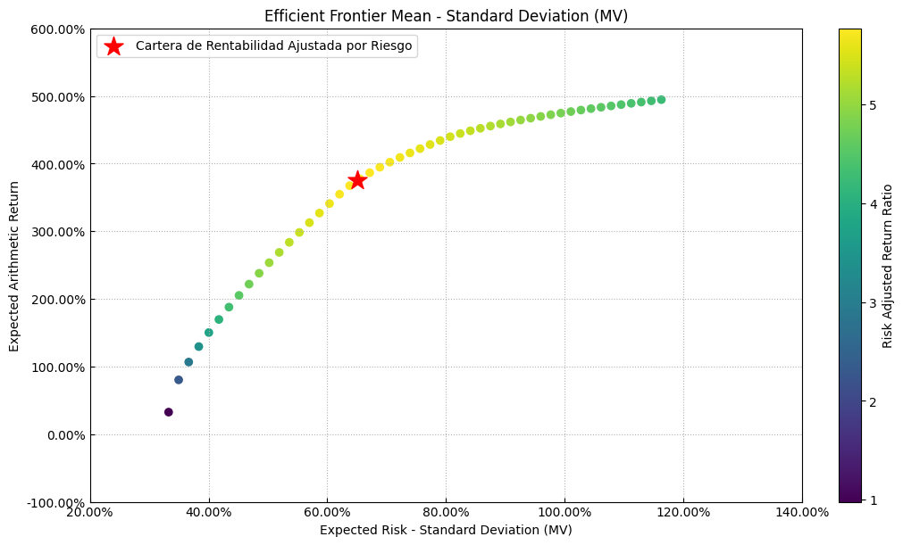
    


```python
# Graficamos la evolucion de la frontera eficiente
ax = rp.plot_frontier_area(w_frontier=frontier, cmap="tab20", height=6, width=10, ax=None)
```


    
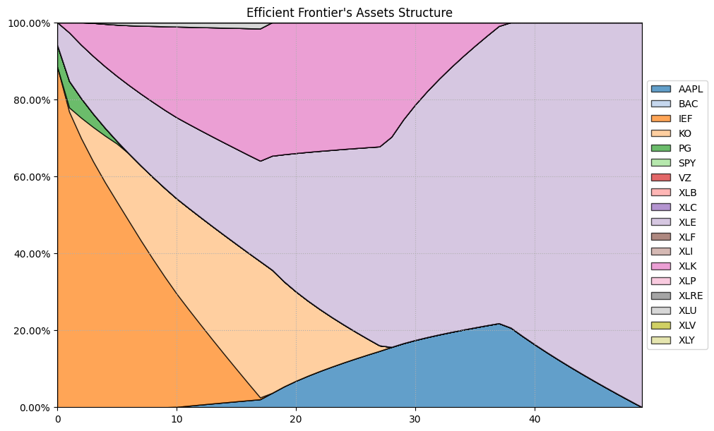
    


```python
ax = rp.jupyter_report(y, w, rm=rm, t_factor=12)
```


    
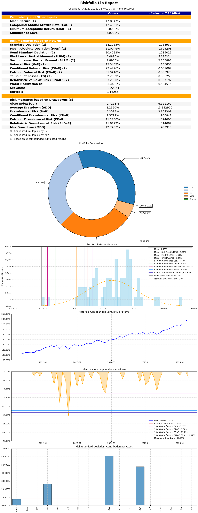
    


Optimizacion de Portafolios: Modelo Clasico M/V con funcion objetivo minimización del riesgo


```python
# Parametrizacion del modelo
port.alpha = 0.05
model = 'Classic' # Modelo calculado con datos historicos
rm = 'MV' # Utilizando la matriz de varianzas y covarianzas historica
obj = 'MinRisk' # Maximizando el ratio de Sharpe, otras opciones son 'MinRisk' y 'MaxRet'
hist = True
rf = 0 # La tasa libre de riesgo
l = 0 # lambda es un factor de aversion al riesgo, que se utiliza para modelar funciones de utilidad

w_min = port.optimization(model=model, rm=rm, obj=obj, hist=hist, rf=rf, l=l)
display(w_min)
```


  <div id="df-535ba3e9-f1c4-4052-8cb9-aac343943fe1" class="colab-df-container">
    <div>
<style scoped>
    .dataframe tbody tr th:only-of-type {
        vertical-align: middle;
    }

    .dataframe tbody tr th {
        vertical-align: top;
    }

    .dataframe thead th {
        text-align: right;
    }
</style>
<table border="1" class="dataframe">
  <thead>
    <tr style="text-align: right;">
      <th></th>
      <th>weights</th>
    </tr>
  </thead>
  <tbody>
    <tr>
      <th>AAPL</th>
      <td>1.875977e-10</td>
    </tr>
    <tr>
      <th>BAC</th>
      <td>2.775683e-10</td>
    </tr>
    <tr>
      <th>IEF</th>
      <td>8.843073e-01</td>
    </tr>
    <tr>
      <th>KO</th>
      <td>5.132850e-10</td>
    </tr>
    <tr>
      <th>PG</th>
      <td>5.612761e-02</td>
    </tr>
    <tr>
      <th>SPY</th>
      <td>4.083199e-10</td>
    </tr>
    <tr>
      <th>VZ</th>
      <td>2.288976e-10</td>
    </tr>
    <tr>
      <th>XLB</th>
      <td>2.011479e-10</td>
    </tr>
    <tr>
      <th>XLC</th>
      <td>2.484078e-10</td>
    </tr>
    <tr>
      <th>XLE</th>
      <td>5.956508e-02</td>
    </tr>
    <tr>
      <th>XLF</th>
      <td>5.880121e-10</td>
    </tr>
    <tr>
      <th>XLI</th>
      <td>3.040822e-10</td>
    </tr>
    <tr>
      <th>XLK</th>
      <td>2.554048e-10</td>
    </tr>
    <tr>
      <th>XLP</th>
      <td>1.349911e-09</td>
    </tr>
    <tr>
      <th>XLRE</th>
      <td>1.478904e-10</td>
    </tr>
    <tr>
      <th>XLU</th>
      <td>5.233751e-10</td>
    </tr>
    <tr>
      <th>XLV</th>
      <td>7.280231e-10</td>
    </tr>
    <tr>
      <th>XLY</th>
      <td>3.275097e-10</td>
    </tr>
  </tbody>
</table>
</div>
    <div class="colab-df-buttons">

  <div class="colab-df-container">
    <button class="colab-df-convert" onclick="convertToInteractive('df-535ba3e9-f1c4-4052-8cb9-aac343943fe1')"
            title="Convert this dataframe to an interactive table."
            style="display:none;">

  <svg xmlns="http://www.w3.org/2000/svg" height="24px" viewBox="0 -960 960 960">
    <path d="M120-120v-720h720v720H120Zm60-500h600v-160H180v160Zm220 220h160v-160H400v160Zm0 220h160v-160H400v160ZM180-400h160v-160H180v160Zm440 0h160v-160H620v160ZM180-180h160v-160H180v160Zm440 0h160v-160H620v160Z"/>
  </svg>
    </button>

  <style>
    .colab-df-container {
      display:flex;
      gap: 12px;
    }

    .colab-df-convert {
      background-color: #E8F0FE;
      border: none;
      border-radius: 50%;
      cursor: pointer;
      display: none;
      fill: #1967D2;
      height: 32px;
      padding: 0 0 0 0;
      width: 32px;
    }

    .colab-df-convert:hover {
      background-color: #E2EBFA;
      box-shadow: 0px 1px 2px rgba(60, 64, 67, 0.3), 0px 1px 3px 1px rgba(60, 64, 67, 0.15);
      fill: #174EA6;
    }

    .colab-df-buttons div {
      margin-bottom: 4px;
    }

    [theme=dark] .colab-df-convert {
      background-color: #3B4455;
      fill: #D2E3FC;
    }

    [theme=dark] .colab-df-convert:hover {
      background-color: #434B5C;
      box-shadow: 0px 1px 3px 1px rgba(0, 0, 0, 0.15);
      filter: drop-shadow(0px 1px 2px rgba(0, 0, 0, 0.3));
      fill: #FFFFFF;
    }
  </style>

    <script>
      const buttonEl =
        document.querySelector('#df-535ba3e9-f1c4-4052-8cb9-aac343943fe1 button.colab-df-convert');
      buttonEl.style.display =
        google.colab.kernel.accessAllowed ? 'block' : 'none';

      async function convertToInteractive(key) {
        const element = document.querySelector('#df-535ba3e9-f1c4-4052-8cb9-aac343943fe1');
        const dataTable =
          await google.colab.kernel.invokeFunction('convertToInteractive',
                                                    [key], {});
        if (!dataTable) return;

        const docLinkHtml = 'Like what you see? Visit the ' +
          '<a target="_blank" href=https://colab.research.google.com/notebooks/data_table.ipynb>data table notebook</a>'
          + ' to learn more about interactive tables.';
        element.innerHTML = '';
        dataTable['output_type'] = 'display_data';
        await google.colab.output.renderOutput(dataTable, element);
        const docLink = document.createElement('div');
        docLink.innerHTML = docLinkHtml;
        element.appendChild(docLink);
      }
    </script>
  </div>


  <div id="id_d4ae53f0-4b72-4eb0-8697-ed3006057ae4">
    <style>
      .colab-df-generate {
        background-color: #E8F0FE;
        border: none;
        border-radius: 50%;
        cursor: pointer;
        display: none;
        fill: #1967D2;
        height: 32px;
        padding: 0 0 0 0;
        width: 32px;
      }

      .colab-df-generate:hover {
        background-color: #E2EBFA;
        box-shadow: 0px 1px 2px rgba(60, 64, 67, 0.3), 0px 1px 3px 1px rgba(60, 64, 67, 0.15);
        fill: #174EA6;
      }

      [theme=dark] .colab-df-generate {
        background-color: #3B4455;
        fill: #D2E3FC;
      }

      [theme=dark] .colab-df-generate:hover {
        background-color: #434B5C;
        box-shadow: 0px 1px 3px 1px rgba(0, 0, 0, 0.15);
        filter: drop-shadow(0px 1px 2px rgba(0, 0, 0, 0.3));
        fill: #FFFFFF;
      }
    </style>
    <button class="colab-df-generate" onclick="generateWithVariable('w_min')"
            title="Generate code using this dataframe."
            style="display:none;">

  <svg xmlns="http://www.w3.org/2000/svg" height="24px"viewBox="0 0 24 24"
       width="24px">
    <path d="M7,19H8.4L18.45,9,17,7.55,7,17.6ZM5,21V16.75L18.45,3.32a2,2,0,0,1,2.83,0l1.4,1.43a1.91,1.91,0,0,1,.58,1.4,1.91,1.91,0,0,1-.58,1.4L9.25,21ZM18.45,9,17,7.55Zm-12,3A5.31,5.31,0,0,0,4.9,8.1,5.31,5.31,0,0,0,1,6.5,5.31,5.31,0,0,0,4.9,4.9,5.31,5.31,0,0,0,6.5,1,5.31,5.31,0,0,0,8.1,4.9,5.31,5.31,0,0,0,12,6.5,5.46,5.46,0,0,0,6.5,12Z"/>
  </svg>
    </button>
    <script>
      (() => {
      const buttonEl =
        document.querySelector('#id_d4ae53f0-4b72-4eb0-8697-ed3006057ae4 button.colab-df-generate');
      buttonEl.style.display =
        google.colab.kernel.accessAllowed ? 'block' : 'none';

      buttonEl.onclick = () => {
        google.colab.notebook.generateWithVariable('w_min');
      }
      })();
    </script>
  </div>

    </div>
  </div>


```python
# Graficamos el portafolio optimo minimizando el riesgo total
ax = rp.plot_pie(w=w_min, title='Cartera optima utilizando el modelo clasico M/V con funcion objetivo minimizar la Desviacion Estandard')
```


    
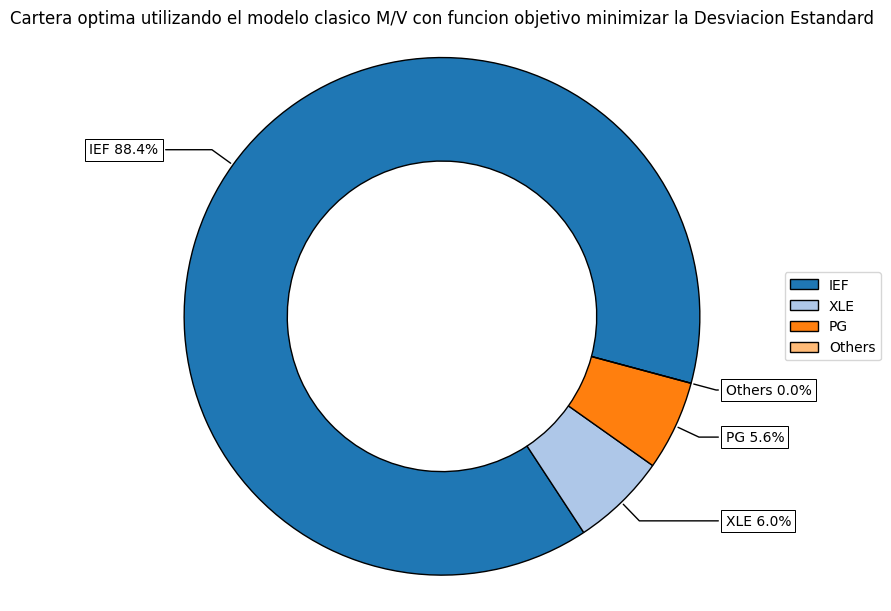
    


```python
ax = rp.plot_frontier(w_frontier=frontier, mu=port.mu, cov=port.cov, returns=port.returns, w=w_min, label='MinRiskPortfolio', t_factor=12)
```


    
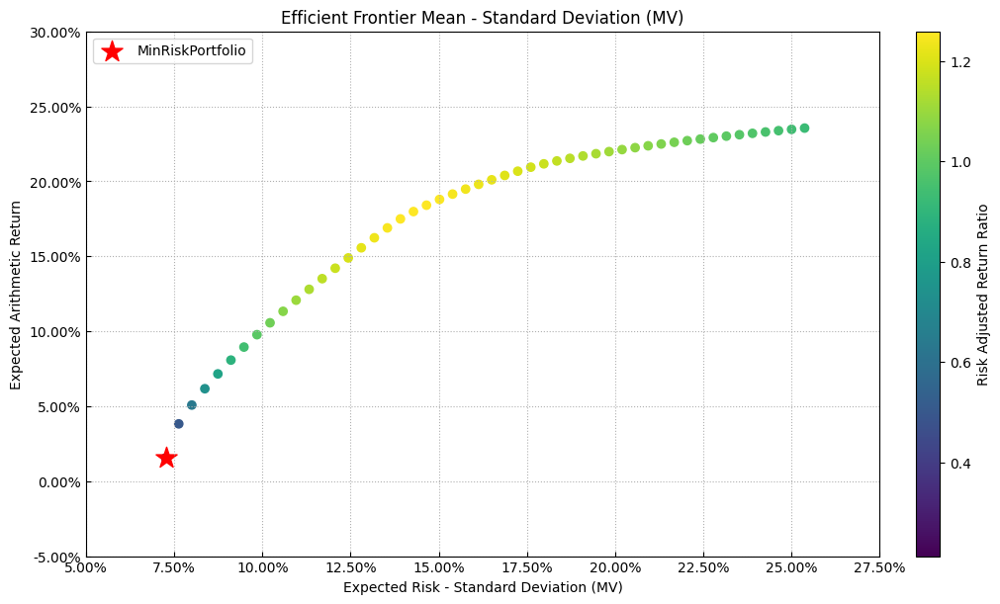
    


### Lectura de la frontera con minimizacion de riesgo

Los activos marcados en la frontera son los que no se penalizan entre si: su
correlacion cruzada es lo bastante baja como para que agregarlos mejore el retorno
ajustado por riesgo del conjunto en lugar de solo diluirlo.


```python
ax=rp.jupyter_report(y,w_min,rm=rm,t_factor=12)
plt.show()
```


    
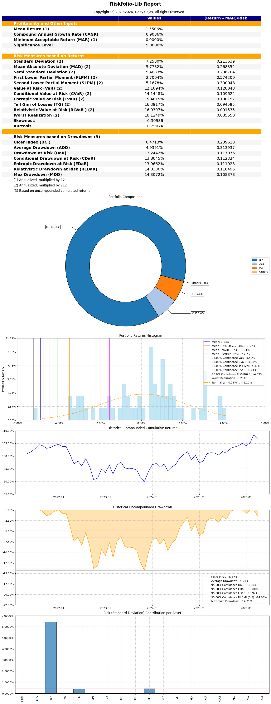
    


Optimizacion de Portafolios: Modelo Clasico M/V con funcion objetivo maximizacion del retorno


```python
# Parametrizacion del modelo
port.alpha=0.05
model='Classic' # Modelo calculado con datos historicos
rm='MV' # Utilizando la matriz de varianzas y covarianzas historica
obj='MaxRet' # Maximizando el ratio de Sharpe, otras opciones son 'MinRisk' y 'MaxRet'
hist=True
rf=0 # La tasa libre de riesgo
l=0 # lambda es un factor de aversion al riesgo, que se utiliza para modelar funciones de utilidad
```


```python
w_max=port.optimization(model=model,rm=rm,obj=obj,hist=hist,rf=rf,l=l)
display(w_max)
```


  <div id="df-f40a8086-dea1-4d27-8e2d-d992815f4805" class="colab-df-container">
    <div>
<style scoped>
    .dataframe tbody tr th:only-of-type {
        vertical-align: middle;
    }

    .dataframe tbody tr th {
        vertical-align: top;
    }

    .dataframe thead th {
        text-align: right;
    }
</style>
<table border="1" class="dataframe">
  <thead>
    <tr style="text-align: right;">
      <th></th>
      <th>weights</th>
    </tr>
  </thead>
  <tbody>
    <tr>
      <th>AAPL</th>
      <td>2.494797e-10</td>
    </tr>
    <tr>
      <th>BAC</th>
      <td>7.416868e-11</td>
    </tr>
    <tr>
      <th>IEF</th>
      <td>3.152725e-11</td>
    </tr>
    <tr>
      <th>KO</th>
      <td>5.537943e-11</td>
    </tr>
    <tr>
      <th>PG</th>
      <td>4.418098e-11</td>
    </tr>
    <tr>
      <th>SPY</th>
      <td>8.105205e-11</td>
    </tr>
    <tr>
      <th>VZ</th>
      <td>4.099136e-11</td>
    </tr>
    <tr>
      <th>XLB</th>
      <td>5.559693e-11</td>
    </tr>
    <tr>
      <th>XLC</th>
      <td>7.042236e-11</td>
    </tr>
    <tr>
      <th>XLE</th>
      <td>1.000000e+00</td>
    </tr>
    <tr>
      <th>XLF</th>
      <td>7.077381e-11</td>
    </tr>
    <tr>
      <th>XLI</th>
      <td>9.318312e-11</td>
    </tr>
    <tr>
      <th>XLK</th>
      <td>1.783013e-10</td>
    </tr>
    <tr>
      <th>XLP</th>
      <td>4.974474e-11</td>
    </tr>
    <tr>
      <th>XLRE</th>
      <td>4.572705e-11</td>
    </tr>
    <tr>
      <th>XLU</th>
      <td>6.477859e-11</td>
    </tr>
    <tr>
      <th>XLV</th>
      <td>5.008898e-11</td>
    </tr>
    <tr>
      <th>XLY</th>
      <td>6.177803e-11</td>
    </tr>
  </tbody>
</table>
</div>
    <div class="colab-df-buttons">

  <div class="colab-df-container">
    <button class="colab-df-convert" onclick="convertToInteractive('df-f40a8086-dea1-4d27-8e2d-d992815f4805')"
            title="Convert this dataframe to an interactive table."
            style="display:none;">

  <svg xmlns="http://www.w3.org/2000/svg" height="24px" viewBox="0 -960 960 960">
    <path d="M120-120v-720h720v720H120Zm60-500h600v-160H180v160Zm220 220h160v-160H400v160Zm0 220h160v-160H400v160ZM180-400h160v-160H180v160Zm440 0h160v-160H620v160ZM180-180h160v-160H180v160Zm440 0h160v-160H620v160Z"/>
  </svg>
    </button>

  <style>
    .colab-df-container {
      display:flex;
      gap: 12px;
    }

    .colab-df-convert {
      background-color: #E8F0FE;
      border: none;
      border-radius: 50%;
      cursor: pointer;
      display: none;
      fill: #1967D2;
      height: 32px;
      padding: 0 0 0 0;
      width: 32px;
    }

    .colab-df-convert:hover {
      background-color: #E2EBFA;
      box-shadow: 0px 1px 2px rgba(60, 64, 67, 0.3), 0px 1px 3px 1px rgba(60, 64, 67, 0.15);
      fill: #174EA6;
    }

    .colab-df-buttons div {
      margin-bottom: 4px;
    }

    [theme=dark] .colab-df-convert {
      background-color: #3B4455;
      fill: #D2E3FC;
    }

    [theme=dark] .colab-df-convert:hover {
      background-color: #434B5C;
      box-shadow: 0px 1px 3px 1px rgba(0, 0, 0, 0.15);
      filter: drop-shadow(0px 1px 2px rgba(0, 0, 0, 0.3));
      fill: #FFFFFF;
    }
  </style>

    <script>
      const buttonEl =
        document.querySelector('#df-f40a8086-dea1-4d27-8e2d-d992815f4805 button.colab-df-convert');
      buttonEl.style.display =
        google.colab.kernel.accessAllowed ? 'block' : 'none';

      async function convertToInteractive(key) {
        const element = document.querySelector('#df-f40a8086-dea1-4d27-8e2d-d992815f4805');
        const dataTable =
          await google.colab.kernel.invokeFunction('convertToInteractive',
                                                    [key], {});
        if (!dataTable) return;

        const docLinkHtml = 'Like what you see? Visit the ' +
          '<a target="_blank" href=https://colab.research.google.com/notebooks/data_table.ipynb>data table notebook</a>'
          + ' to learn more about interactive tables.';
        element.innerHTML = '';
        dataTable['output_type'] = 'display_data';
        await google.colab.output.renderOutput(dataTable, element);
        const docLink = document.createElement('div');
        docLink.innerHTML = docLinkHtml;
        element.appendChild(docLink);
      }
    </script>
  </div>


  <div id="id_543d06de-8407-41fd-9ef0-bee478070cb2">
    <style>
      .colab-df-generate {
        background-color: #E8F0FE;
        border: none;
        border-radius: 50%;
        cursor: pointer;
        display: none;
        fill: #1967D2;
        height: 32px;
        padding: 0 0 0 0;
        width: 32px;
      }

      .colab-df-generate:hover {
        background-color: #E2EBFA;
        box-shadow: 0px 1px 2px rgba(60, 64, 67, 0.3), 0px 1px 3px 1px rgba(60, 64, 67, 0.15);
        fill: #174EA6;
      }

      [theme=dark] .colab-df-generate {
        background-color: #3B4455;
        fill: #D2E3FC;
      }

      [theme=dark] .colab-df-generate:hover {
        background-color: #434B5C;
        box-shadow: 0px 1px 3px 1px rgba(0, 0, 0, 0.15);
        filter: drop-shadow(0px 1px 2px rgba(0, 0, 0, 0.3));
        fill: #FFFFFF;
      }
    </style>
    <button class="colab-df-generate" onclick="generateWithVariable('w_max')"
            title="Generate code using this dataframe."
            style="display:none;">

  <svg xmlns="http://www.w3.org/2000/svg" height="24px"viewBox="0 0 24 24"
       width="24px">
    <path d="M7,19H8.4L18.45,9,17,7.55,7,17.6ZM5,21V16.75L18.45,3.32a2,2,0,0,1,2.83,0l1.4,1.43a1.91,1.91,0,0,1,.58,1.4,1.91,1.91,0,0,1-.58,1.4L9.25,21ZM18.45,9,17,7.55Zm-12,3A5.31,5.31,0,0,0,4.9,8.1,5.31,5.31,0,0,0,1,6.5,5.31,5.31,0,0,0,4.9,4.9,5.31,5.31,0,0,0,6.5,1,5.31,5.31,0,0,0,8.1,4.9,5.31,5.31,0,0,0,12,6.5,5.46,5.46,0,0,0,6.5,12Z"/>
  </svg>
    </button>
    <script>
      (() => {
      const buttonEl =
        document.querySelector('#id_543d06de-8407-41fd-9ef0-bee478070cb2 button.colab-df-generate');
      buttonEl.style.display =
        google.colab.kernel.accessAllowed ? 'block' : 'none';

      buttonEl.onclick = () => {
        google.colab.notebook.generateWithVariable('w_max');
      }
      })();
    </script>
  </div>

    </div>
  </div>


```python
# Graficamos el portafolio optimo maximizando el retorno del portafolio
ax=rp.plot_pie(w=w_max,title='Cartera Optima utilizando el modelo Clasico M/V con funcion objetivo maximizacion del retorno',nrow=25,height=6,width=10)
```


    
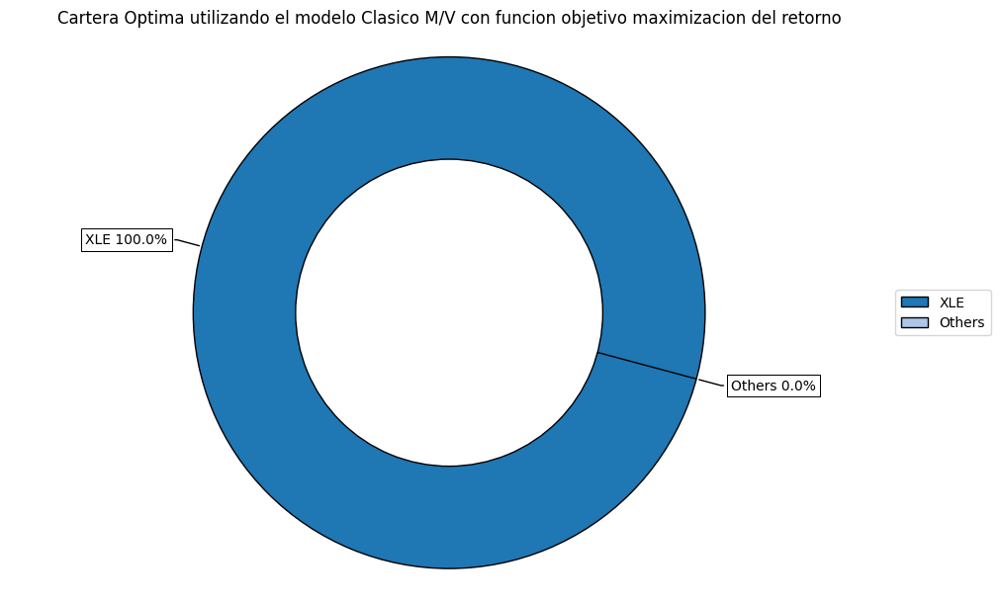
    


```python
points=50
frontier=port.efficient_frontier(model=model, rm=rm,points=points,hist=hist,rf=rf)
display(frontier.T.head(10))
```


  <div id="df-e6a7ec63-8bee-4bce-863e-993d6697c531" class="colab-df-container">
    <div>
<style scoped>
    .dataframe tbody tr th:only-of-type {
        vertical-align: middle;
    }

    .dataframe tbody tr th {
        vertical-align: top;
    }

    .dataframe thead th {
        text-align: right;
    }
</style>
<table border="1" class="dataframe">
  <thead>
    <tr style="text-align: right;">
      <th></th>
      <th>AAPL</th>
      <th>BAC</th>
      <th>IEF</th>
      <th>KO</th>
      <th>PG</th>
      <th>SPY</th>
      <th>VZ</th>
      <th>XLB</th>
      <th>XLC</th>
      <th>XLE</th>
      <th>XLF</th>
      <th>XLI</th>
      <th>XLK</th>
      <th>XLP</th>
      <th>XLRE</th>
      <th>XLU</th>
      <th>XLV</th>
      <th>XLY</th>
    </tr>
  </thead>
  <tbody>
    <tr>
      <th>0</th>
      <td>1.875977e-10</td>
      <td>2.775683e-10</td>
      <td>0.884307</td>
      <td>5.132850e-10</td>
      <td>5.612761e-02</td>
      <td>4.083199e-10</td>
      <td>2.288976e-10</td>
      <td>2.011479e-10</td>
      <td>2.484078e-10</td>
      <td>0.059565</td>
      <td>5.880121e-10</td>
      <td>3.040822e-10</td>
      <td>2.554048e-10</td>
      <td>1.349911e-09</td>
      <td>1.478904e-10</td>
      <td>5.233751e-10</td>
      <td>7.280231e-10</td>
      <td>3.275097e-10</td>
    </tr>
    <tr>
      <th>1</th>
      <td>3.579577e-08</td>
      <td>8.118965e-09</td>
      <td>0.767687</td>
      <td>1.094098e-02</td>
      <td>6.878176e-02</td>
      <td>7.214105e-08</td>
      <td>1.046067e-08</td>
      <td>6.910161e-09</td>
      <td>2.442915e-08</td>
      <td>0.126038</td>
      <td>3.284640e-08</td>
      <td>1.869380e-08</td>
      <td>2.655164e-02</td>
      <td>1.183578e-07</td>
      <td>6.066750e-09</td>
      <td>1.574108e-07</td>
      <td>5.735365e-08</td>
      <td>1.934812e-08</td>
    </tr>
    <tr>
      <th>2</th>
      <td>1.622189e-09</td>
      <td>2.842914e-10</td>
      <td>0.698984</td>
      <td>5.305475e-02</td>
      <td>5.056800e-02</td>
      <td>2.902308e-09</td>
      <td>4.206252e-10</td>
      <td>2.489008e-10</td>
      <td>1.078745e-09</td>
      <td>0.138940</td>
      <td>1.401125e-09</td>
      <td>7.067834e-10</td>
      <td>5.845330e-02</td>
      <td>4.244226e-09</td>
      <td>2.211245e-10</td>
      <td>4.366404e-08</td>
      <td>2.380873e-09</td>
      <td>6.911865e-10</td>
    </tr>
    <tr>
      <th>3</th>
      <td>1.491473e-08</td>
      <td>2.045907e-09</td>
      <td>0.639068</td>
      <td>8.885394e-02</td>
      <td>3.465315e-02</td>
      <td>1.888938e-08</td>
      <td>3.743014e-09</td>
      <td>1.863312e-09</td>
      <td>9.524555e-09</td>
      <td>0.149972</td>
      <td>9.666461e-09</td>
      <td>5.224060e-09</td>
      <td>8.575569e-02</td>
      <td>2.428298e-08</td>
      <td>1.691219e-09</td>
      <td>1.697168e-03</td>
      <td>1.484399e-08</td>
      <td>4.819891e-09</td>
    </tr>
    <tr>
      <th>4</th>
      <td>5.489885e-08</td>
      <td>2.431977e-09</td>
      <td>0.584512</td>
      <td>1.209226e-01</td>
      <td>2.018483e-02</td>
      <td>1.142167e-08</td>
      <td>6.943346e-09</td>
      <td>2.487523e-09</td>
      <td>8.387932e-09</td>
      <td>0.159893</td>
      <td>4.858754e-09</td>
      <td>5.637007e-09</td>
      <td>1.103227e-01</td>
      <td>1.785780e-08</td>
      <td>2.460044e-09</td>
      <td>4.165698e-03</td>
      <td>7.924749e-09</td>
      <td>5.256162e-09</td>
    </tr>
    <tr>
      <th>5</th>
      <td>7.369986e-08</td>
      <td>6.329238e-09</td>
      <td>0.533784</td>
      <td>1.509016e-01</td>
      <td>6.603054e-03</td>
      <td>5.355567e-08</td>
      <td>1.718698e-08</td>
      <td>6.054876e-09</td>
      <td>4.238371e-08</td>
      <td>0.169121</td>
      <td>3.016745e-08</td>
      <td>1.665643e-08</td>
      <td>1.331952e-01</td>
      <td>6.143390e-08</td>
      <td>5.659757e-09</td>
      <td>6.394328e-03</td>
      <td>4.176152e-08</td>
      <td>1.446232e-08</td>
    </tr>
    <tr>
      <th>6</th>
      <td>1.203378e-07</td>
      <td>9.637825e-09</td>
      <td>0.483563</td>
      <td>1.751932e-01</td>
      <td>8.383090e-08</td>
      <td>7.415040e-08</td>
      <td>3.030304e-08</td>
      <td>9.372625e-09</td>
      <td>7.061704e-08</td>
      <td>0.178032</td>
      <td>4.290339e-08</td>
      <td>2.589815e-08</td>
      <td>1.552628e-01</td>
      <td>7.537176e-08</td>
      <td>8.787061e-09</td>
      <td>7.948060e-03</td>
      <td>5.739396e-08</td>
      <td>2.112415e-08</td>
    </tr>
    <tr>
      <th>7</th>
      <td>2.509074e-08</td>
      <td>4.041556e-09</td>
      <td>0.433492</td>
      <td>1.942108e-01</td>
      <td>3.312441e-08</td>
      <td>2.469136e-08</td>
      <td>1.494516e-08</td>
      <td>4.075087e-09</td>
      <td>2.818255e-08</td>
      <td>0.186680</td>
      <td>1.319536e-08</td>
      <td>1.013822e-08</td>
      <td>1.766905e-01</td>
      <td>2.324906e-08</td>
      <td>4.037455e-09</td>
      <td>8.926113e-03</td>
      <td>1.909598e-08</td>
      <td>8.304957e-09</td>
    </tr>
    <tr>
      <th>8</th>
      <td>1.056061e-08</td>
      <td>9.205408e-10</td>
      <td>0.385534</td>
      <td>2.125045e-01</td>
      <td>8.603744e-09</td>
      <td>6.689374e-09</td>
      <td>3.674649e-09</td>
      <td>9.132283e-10</td>
      <td>8.759682e-09</td>
      <td>0.195012</td>
      <td>4.095656e-09</td>
      <td>2.400767e-09</td>
      <td>1.972765e-01</td>
      <td>5.862922e-09</td>
      <td>8.933743e-10</td>
      <td>9.673566e-03</td>
      <td>5.222593e-09</td>
      <td>1.971231e-09</td>
    </tr>
    <tr>
      <th>9</th>
      <td>1.155117e-07</td>
      <td>1.372834e-09</td>
      <td>0.339187</td>
      <td>2.301497e-01</td>
      <td>1.023622e-08</td>
      <td>9.755683e-09</td>
      <td>6.154564e-09</td>
      <td>1.369948e-09</td>
      <td>1.496715e-08</td>
      <td>0.203040</td>
      <td>6.061510e-09</td>
      <td>3.548927e-09</td>
      <td>2.171414e-01</td>
      <td>8.195139e-09</td>
      <td>1.364194e-09</td>
      <td>1.048109e-02</td>
      <td>7.826955e-09</td>
      <td>2.964072e-09</td>
    </tr>
  </tbody>
</table>
</div>
    <div class="colab-df-buttons">

  <div class="colab-df-container">
    <button class="colab-df-convert" onclick="convertToInteractive('df-e6a7ec63-8bee-4bce-863e-993d6697c531')"
            title="Convert this dataframe to an interactive table."
            style="display:none;">

  <svg xmlns="http://www.w3.org/2000/svg" height="24px" viewBox="0 -960 960 960">
    <path d="M120-120v-720h720v720H120Zm60-500h600v-160H180v160Zm220 220h160v-160H400v160Zm0 220h160v-160H400v160ZM180-400h160v-160H180v160Zm440 0h160v-160H620v160ZM180-180h160v-160H180v160Zm440 0h160v-160H620v160Z"/>
  </svg>
    </button>

  <style>
    .colab-df-container {
      display:flex;
      gap: 12px;
    }

    .colab-df-convert {
      background-color: #E8F0FE;
      border: none;
      border-radius: 50%;
      cursor: pointer;
      display: none;
      fill: #1967D2;
      height: 32px;
      padding: 0 0 0 0;
      width: 32px;
    }

    .colab-df-convert:hover {
      background-color: #E2EBFA;
      box-shadow: 0px 1px 2px rgba(60, 64, 67, 0.3), 0px 1px 3px 1px rgba(60, 64, 67, 0.15);
      fill: #174EA6;
    }

    .colab-df-buttons div {
      margin-bottom: 4px;
    }

    [theme=dark] .colab-df-convert {
      background-color: #3B4455;
      fill: #D2E3FC;
    }

    [theme=dark] .colab-df-convert:hover {
      background-color: #434B5C;
      box-shadow: 0px 1px 3px 1px rgba(0, 0, 0, 0.15);
      filter: drop-shadow(0px 1px 2px rgba(0, 0, 0, 0.3));
      fill: #FFFFFF;
    }
  </style>

    <script>
      const buttonEl =
        document.querySelector('#df-e6a7ec63-8bee-4bce-863e-993d6697c531 button.colab-df-convert');
      buttonEl.style.display =
        google.colab.kernel.accessAllowed ? 'block' : 'none';

      async function convertToInteractive(key) {
        const element = document.querySelector('#df-e6a7ec63-8bee-4bce-863e-993d6697c531');
        const dataTable =
          await google.colab.kernel.invokeFunction('convertToInteractive',
                                                    [key], {});
        if (!dataTable) return;

        const docLinkHtml = 'Like what you see? Visit the ' +
          '<a target="_blank" href=https://colab.research.google.com/notebooks/data_table.ipynb>data table notebook</a>'
          + ' to learn more about interactive tables.';
        element.innerHTML = '';
        dataTable['output_type'] = 'display_data';
        await google.colab.output.renderOutput(dataTable, element);
        const docLink = document.createElement('div');
        docLink.innerHTML = docLinkHtml;
        element.appendChild(docLink);
      }
    </script>
  </div>


    </div>
  </div>


```python
ax=rp.plot_frontier(w_frontier=frontier,mu=port.mu,cov=port.cov,returns=port.returns,w=w_max,label='Max Ret Portfolio',t_factor=12)
```


```python
ax=rp.jupyter_report(y,w_max,rm=rm,t_factor=12)
plt.show()
```


    
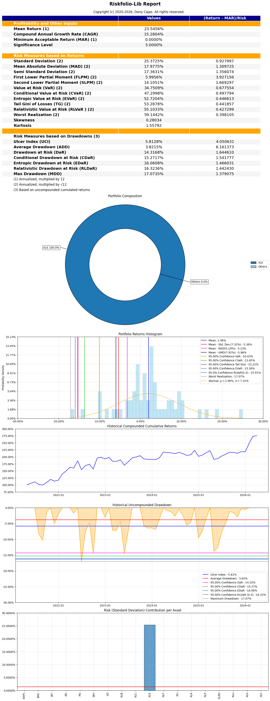
    


Comparando los pesos de los portafolios segun funcion objetivo


```python
w=w.rename(columns={'weights':'w_sharpe_ratio'})
w
```


  <div id="df-7de5e96c-3bc4-4848-b024-29b3a9f18eeb" class="colab-df-container">
    <div>
<style scoped>
    .dataframe tbody tr th:only-of-type {
        vertical-align: middle;
    }

    .dataframe tbody tr th {
        vertical-align: top;
    }

    .dataframe thead th {
        text-align: right;
    }
</style>
<table border="1" class="dataframe">
  <thead>
    <tr style="text-align: right;">
      <th></th>
      <th>w_sharpe_ratio</th>
    </tr>
  </thead>
  <tbody>
    <tr>
      <th>AAPL</th>
      <td>5.057899e-02</td>
    </tr>
    <tr>
      <th>BAC</th>
      <td>2.197688e-09</td>
    </tr>
    <tr>
      <th>IEF</th>
      <td>5.004361e-09</td>
    </tr>
    <tr>
      <th>KO</th>
      <td>2.817717e-01</td>
    </tr>
    <tr>
      <th>PG</th>
      <td>6.302961e-09</td>
    </tr>
    <tr>
      <th>SPY</th>
      <td>1.002628e-08</td>
    </tr>
    <tr>
      <th>VZ</th>
      <td>7.417127e-09</td>
    </tr>
    <tr>
      <th>XLB</th>
      <td>2.419370e-09</td>
    </tr>
    <tr>
      <th>XLC</th>
      <td>1.445626e-08</td>
    </tr>
    <tr>
      <th>XLE</th>
      <td>3.238589e-01</td>
    </tr>
    <tr>
      <th>XLF</th>
      <td>6.418118e-09</td>
    </tr>
    <tr>
      <th>XLI</th>
      <td>6.448645e-09</td>
    </tr>
    <tr>
      <th>XLK</th>
      <td>3.437903e-01</td>
    </tr>
    <tr>
      <th>XLP</th>
      <td>6.673564e-09</td>
    </tr>
    <tr>
      <th>XLRE</th>
      <td>2.448138e-09</td>
    </tr>
    <tr>
      <th>XLU</th>
      <td>3.067669e-08</td>
    </tr>
    <tr>
      <th>XLV</th>
      <td>6.620343e-09</td>
    </tr>
    <tr>
      <th>XLY</th>
      <td>3.554223e-09</td>
    </tr>
  </tbody>
</table>
</div>
    <div class="colab-df-buttons">

  <div class="colab-df-container">
    <button class="colab-df-convert" onclick="convertToInteractive('df-7de5e96c-3bc4-4848-b024-29b3a9f18eeb')"
            title="Convert this dataframe to an interactive table."
            style="display:none;">

  <svg xmlns="http://www.w3.org/2000/svg" height="24px" viewBox="0 -960 960 960">
    <path d="M120-120v-720h720v720H120Zm60-500h600v-160H180v160Zm220 220h160v-160H400v160Zm0 220h160v-160H400v160ZM180-400h160v-160H180v160Zm440 0h160v-160H620v160ZM180-180h160v-160H180v160Zm440 0h160v-160H620v160Z"/>
  </svg>
    </button>

  <style>
    .colab-df-container {
      display:flex;
      gap: 12px;
    }

    .colab-df-convert {
      background-color: #E8F0FE;
      border: none;
      border-radius: 50%;
      cursor: pointer;
      display: none;
      fill: #1967D2;
      height: 32px;
      padding: 0 0 0 0;
      width: 32px;
    }

    .colab-df-convert:hover {
      background-color: #E2EBFA;
      box-shadow: 0px 1px 2px rgba(60, 64, 67, 0.3), 0px 1px 3px 1px rgba(60, 64, 67, 0.15);
      fill: #174EA6;
    }

    .colab-df-buttons div {
      margin-bottom: 4px;
    }

    [theme=dark] .colab-df-convert {
      background-color: #3B4455;
      fill: #D2E3FC;
    }

    [theme=dark] .colab-df-convert:hover {
      background-color: #434B5C;
      box-shadow: 0px 1px 3px 1px rgba(0, 0, 0, 0.15);
      filter: drop-shadow(0px 1px 2px rgba(0, 0, 0, 0.3));
      fill: #FFFFFF;
    }
  </style>

    <script>
      const buttonEl =
        document.querySelector('#df-7de5e96c-3bc4-4848-b024-29b3a9f18eeb button.colab-df-convert');
      buttonEl.style.display =
        google.colab.kernel.accessAllowed ? 'block' : 'none';

      async function convertToInteractive(key) {
        const element = document.querySelector('#df-7de5e96c-3bc4-4848-b024-29b3a9f18eeb');
        const dataTable =
          await google.colab.kernel.invokeFunction('convertToInteractive',
                                                    [key], {});
        if (!dataTable) return;

        const docLinkHtml = 'Like what you see? Visit the ' +
          '<a target="_blank" href=https://colab.research.google.com/notebooks/data_table.ipynb>data table notebook</a>'
          + ' to learn more about interactive tables.';
        element.innerHTML = '';
        dataTable['output_type'] = 'display_data';
        await google.colab.output.renderOutput(dataTable, element);
        const docLink = document.createElement('div');
        docLink.innerHTML = docLinkHtml;
        element.appendChild(docLink);
      }
    </script>
  </div>


  <div id="id_a954cc59-acdc-4335-983f-c77d582e4754">
    <style>
      .colab-df-generate {
        background-color: #E8F0FE;
        border: none;
        border-radius: 50%;
        cursor: pointer;
        display: none;
        fill: #1967D2;
        height: 32px;
        padding: 0 0 0 0;
        width: 32px;
      }

      .colab-df-generate:hover {
        background-color: #E2EBFA;
        box-shadow: 0px 1px 2px rgba(60, 64, 67, 0.3), 0px 1px 3px 1px rgba(60, 64, 67, 0.15);
        fill: #174EA6;
      }

      [theme=dark] .colab-df-generate {
        background-color: #3B4455;
        fill: #D2E3FC;
      }

      [theme=dark] .colab-df-generate:hover {
        background-color: #434B5C;
        box-shadow: 0px 1px 3px 1px rgba(0, 0, 0, 0.15);
        filter: drop-shadow(0px 1px 2px rgba(0, 0, 0, 0.3));
        fill: #FFFFFF;
      }
    </style>
    <button class="colab-df-generate" onclick="generateWithVariable('w')"
            title="Generate code using this dataframe."
            style="display:none;">

  <svg xmlns="http://www.w3.org/2000/svg" height="24px"viewBox="0 0 24 24"
       width="24px">
    <path d="M7,19H8.4L18.45,9,17,7.55,7,17.6ZM5,21V16.75L18.45,3.32a2,2,0,0,1,2.83,0l1.4,1.43a1.91,1.91,0,0,1,.58,1.4,1.91,1.91,0,0,1-.58,1.4L9.25,21ZM18.45,9,17,7.55Zm-12,3A5.31,5.31,0,0,0,4.9,8.1,5.31,5.31,0,0,0,1,6.5,5.31,5.31,0,0,0,4.9,4.9,5.31,5.31,0,0,0,6.5,1,5.31,5.31,0,0,0,8.1,4.9,5.31,5.31,0,0,0,12,6.5,5.46,5.46,0,0,0,6.5,12Z"/>
  </svg>
    </button>
    <script>
      (() => {
      const buttonEl =
        document.querySelector('#id_a954cc59-acdc-4335-983f-c77d582e4754 button.colab-df-generate');
      buttonEl.style.display =
        google.colab.kernel.accessAllowed ? 'block' : 'none';

      buttonEl.onclick = () => {
        google.colab.notebook.generateWithVariable('w');
      }
      })();
    </script>
  </div>

    </div>
  </div>


```python
w_portfolios=w
w_portfolios['w_min_risk']=w_min
w_portfolios['w_max_return']=w_max
w_portfolios
```


  <div id="df-2e464d76-435f-4489-aa53-8af24af0deb8" class="colab-df-container">
    <div>
<style scoped>
    .dataframe tbody tr th:only-of-type {
        vertical-align: middle;
    }

    .dataframe tbody tr th {
        vertical-align: top;
    }

    .dataframe thead th {
        text-align: right;
    }
</style>
<table border="1" class="dataframe">
  <thead>
    <tr style="text-align: right;">
      <th></th>
      <th>w_sharpe_ratio</th>
      <th>w_min_risk</th>
      <th>w_max_return</th>
    </tr>
  </thead>
  <tbody>
    <tr>
      <th>AAPL</th>
      <td>5.057899e-02</td>
      <td>1.875977e-10</td>
      <td>2.494797e-10</td>
    </tr>
    <tr>
      <th>BAC</th>
      <td>2.197688e-09</td>
      <td>2.775683e-10</td>
      <td>7.416868e-11</td>
    </tr>
    <tr>
      <th>IEF</th>
      <td>5.004361e-09</td>
      <td>8.843073e-01</td>
      <td>3.152725e-11</td>
    </tr>
    <tr>
      <th>KO</th>
      <td>2.817717e-01</td>
      <td>5.132850e-10</td>
      <td>5.537943e-11</td>
    </tr>
    <tr>
      <th>PG</th>
      <td>6.302961e-09</td>
      <td>5.612761e-02</td>
      <td>4.418098e-11</td>
    </tr>
    <tr>
      <th>SPY</th>
      <td>1.002628e-08</td>
      <td>4.083199e-10</td>
      <td>8.105205e-11</td>
    </tr>
    <tr>
      <th>VZ</th>
      <td>7.417127e-09</td>
      <td>2.288976e-10</td>
      <td>4.099136e-11</td>
    </tr>
    <tr>
      <th>XLB</th>
      <td>2.419370e-09</td>
      <td>2.011479e-10</td>
      <td>5.559693e-11</td>
    </tr>
    <tr>
      <th>XLC</th>
      <td>1.445626e-08</td>
      <td>2.484078e-10</td>
      <td>7.042236e-11</td>
    </tr>
    <tr>
      <th>XLE</th>
      <td>3.238589e-01</td>
      <td>5.956508e-02</td>
      <td>1.000000e+00</td>
    </tr>
    <tr>
      <th>XLF</th>
      <td>6.418118e-09</td>
      <td>5.880121e-10</td>
      <td>7.077381e-11</td>
    </tr>
    <tr>
      <th>XLI</th>
      <td>6.448645e-09</td>
      <td>3.040822e-10</td>
      <td>9.318312e-11</td>
    </tr>
    <tr>
      <th>XLK</th>
      <td>3.437903e-01</td>
      <td>2.554048e-10</td>
      <td>1.783013e-10</td>
    </tr>
    <tr>
      <th>XLP</th>
      <td>6.673564e-09</td>
      <td>1.349911e-09</td>
      <td>4.974474e-11</td>
    </tr>
    <tr>
      <th>XLRE</th>
      <td>2.448138e-09</td>
      <td>1.478904e-10</td>
      <td>4.572705e-11</td>
    </tr>
    <tr>
      <th>XLU</th>
      <td>3.067669e-08</td>
      <td>5.233751e-10</td>
      <td>6.477859e-11</td>
    </tr>
    <tr>
      <th>XLV</th>
      <td>6.620343e-09</td>
      <td>7.280231e-10</td>
      <td>5.008898e-11</td>
    </tr>
    <tr>
      <th>XLY</th>
      <td>3.554223e-09</td>
      <td>3.275097e-10</td>
      <td>6.177803e-11</td>
    </tr>
  </tbody>
</table>
</div>
    <div class="colab-df-buttons">

  <div class="colab-df-container">
    <button class="colab-df-convert" onclick="convertToInteractive('df-2e464d76-435f-4489-aa53-8af24af0deb8')"
            title="Convert this dataframe to an interactive table."
            style="display:none;">

  <svg xmlns="http://www.w3.org/2000/svg" height="24px" viewBox="0 -960 960 960">
    <path d="M120-120v-720h720v720H120Zm60-500h600v-160H180v160Zm220 220h160v-160H400v160Zm0 220h160v-160H400v160ZM180-400h160v-160H180v160Zm440 0h160v-160H620v160ZM180-180h160v-160H180v160Zm440 0h160v-160H620v160Z"/>
  </svg>
    </button>

  <style>
    .colab-df-container {
      display:flex;
      gap: 12px;
    }

    .colab-df-convert {
      background-color: #E8F0FE;
      border: none;
      border-radius: 50%;
      cursor: pointer;
      display: none;
      fill: #1967D2;
      height: 32px;
      padding: 0 0 0 0;
      width: 32px;
    }

    .colab-df-convert:hover {
      background-color: #E2EBFA;
      box-shadow: 0px 1px 2px rgba(60, 64, 67, 0.3), 0px 1px 3px 1px rgba(60, 64, 67, 0.15);
      fill: #174EA6;
    }

    .colab-df-buttons div {
      margin-bottom: 4px;
    }

    [theme=dark] .colab-df-convert {
      background-color: #3B4455;
      fill: #D2E3FC;
    }

    [theme=dark] .colab-df-convert:hover {
      background-color: #434B5C;
      box-shadow: 0px 1px 3px 1px rgba(0, 0, 0, 0.15);
      filter: drop-shadow(0px 1px 2px rgba(0, 0, 0, 0.3));
      fill: #FFFFFF;
    }
  </style>

    <script>
      const buttonEl =
        document.querySelector('#df-2e464d76-435f-4489-aa53-8af24af0deb8 button.colab-df-convert');
      buttonEl.style.display =
        google.colab.kernel.accessAllowed ? 'block' : 'none';

      async function convertToInteractive(key) {
        const element = document.querySelector('#df-2e464d76-435f-4489-aa53-8af24af0deb8');
        const dataTable =
          await google.colab.kernel.invokeFunction('convertToInteractive',
                                                    [key], {});
        if (!dataTable) return;

        const docLinkHtml = 'Like what you see? Visit the ' +
          '<a target="_blank" href=https://colab.research.google.com/notebooks/data_table.ipynb>data table notebook</a>'
          + ' to learn more about interactive tables.';
        element.innerHTML = '';
        dataTable['output_type'] = 'display_data';
        await google.colab.output.renderOutput(dataTable, element);
        const docLink = document.createElement('div');
        docLink.innerHTML = docLinkHtml;
        element.appendChild(docLink);
      }
    </script>
  </div>


  <div id="id_b0a5a603-31d7-436d-ae37-2693811e090c">
    <style>
      .colab-df-generate {
        background-color: #E8F0FE;
        border: none;
        border-radius: 50%;
        cursor: pointer;
        display: none;
        fill: #1967D2;
        height: 32px;
        padding: 0 0 0 0;
        width: 32px;
      }

      .colab-df-generate:hover {
        background-color: #E2EBFA;
        box-shadow: 0px 1px 2px rgba(60, 64, 67, 0.3), 0px 1px 3px 1px rgba(60, 64, 67, 0.15);
        fill: #174EA6;
      }

      [theme=dark] .colab-df-generate {
        background-color: #3B4455;
        fill: #D2E3FC;
      }

      [theme=dark] .colab-df-generate:hover {
        background-color: #434B5C;
        box-shadow: 0px 1px 3px 1px rgba(0, 0, 0, 0.15);
        filter: drop-shadow(0px 1px 2px rgba(0, 0, 0, 0.3));
        fill: #FFFFFF;
      }
    </style>
    <button class="colab-df-generate" onclick="generateWithVariable('w')"
            title="Generate code using this dataframe."
            style="display:none;">

  <svg xmlns="http://www.w3.org/2000/svg" height="24px"viewBox="0 0 24 24"
       width="24px">
    <path d="M7,19H8.4L18.45,9,17,7.55,7,17.6ZM5,21V16.75L18.45,3.32a2,2,0,0,1,2.83,0l1.4,1.43a1.91,1.91,0,0,1,.58,1.4,1.91,1.91,0,0,1-.58,1.4L9.25,21ZM18.45,9,17,7.55Zm-12,3A5.31,5.31,0,0,0,4.9,8.1,5.31,5.31,0,0,0,1,6.5,5.31,5.31,0,0,0,4.9,4.9,5.31,5.31,0,0,0,6.5,1,5.31,5.31,0,0,0,8.1,4.9,5.31,5.31,0,0,0,12,6.5,5.46,5.46,0,0,0,6.5,12Z"/>
  </svg>
    </button>
    <script>
      (() => {
      const buttonEl =
        document.querySelector('#id_b0a5a603-31d7-436d-ae37-2693811e090c button.colab-df-generate');
      buttonEl.style.display =
        google.colab.kernel.accessAllowed ? 'block' : 'none';

      buttonEl.onclick = () => {
        google.colab.notebook.generateWithVariable('w');
      }
      })();
    </script>
  </div>

    </div>
  </div>


```python
# Comparacion entre los pesos de los portafolios M/V segun funcion objetivo: Ratio de Sharpe, MinRisk y MaxRet
w_portfolios.style.format("{:.2%}").background_gradient(cmap='YlGn')
```


<style type="text/css">
#T_abea0_row0_col0 {
  background-color: #f2fab5;
  color: #000000;
}
#T_abea0_row0_col1, #T_abea0_row0_col2, #T_abea0_row1_col0, #T_abea0_row1_col1, #T_abea0_row1_col2, #T_abea0_row2_col0, #T_abea0_row2_col2, #T_abea0_row3_col1, #T_abea0_row3_col2, #T_abea0_row4_col0, #T_abea0_row4_col2, #T_abea0_row5_col0, #T_abea0_row5_col1, #T_abea0_row5_col2, #T_abea0_row6_col0, #T_abea0_row6_col1, #T_abea0_row6_col2, #T_abea0_row7_col0, #T_abea0_row7_col1, #T_abea0_row7_col2, #T_abea0_row8_col0, #T_abea0_row8_col1, #T_abea0_row8_col2, #T_abea0_row10_col0, #T_abea0_row10_col1, #T_abea0_row10_col2, #T_abea0_row11_col0, #T_abea0_row11_col1, #T_abea0_row11_col2, #T_abea0_row12_col1, #T_abea0_row12_col2, #T_abea0_row13_col0, #T_abea0_row13_col1, #T_abea0_row13_col2, #T_abea0_row14_col0, #T_abea0_row14_col1, #T_abea0_row14_col2, #T_abea0_row15_col0, #T_abea0_row15_col1, #T_abea0_row15_col2, #T_abea0_row16_col0, #T_abea0_row16_col1, #T_abea0_row16_col2, #T_abea0_row17_col0, #T_abea0_row17_col1, #T_abea0_row17_col2 {
  background-color: #ffffe5;
  color: #000000;
}
#T_abea0_row2_col1, #T_abea0_row9_col2, #T_abea0_row12_col0 {
  background-color: #004529;
  color: #f1f1f1;
}
#T_abea0_row3_col0 {
  background-color: #10743c;
  color: #f1f1f1;
}
#T_abea0_row4_col1 {
  background-color: #fbfdcf;
  color: #000000;
}
#T_abea0_row9_col0 {
  background-color: #00542f;
  color: #f1f1f1;
}
#T_abea0_row9_col1 {
  background-color: #fbfdce;
  color: #000000;
}
</style>
<table id="T_abea0" class="dataframe">
  <thead>
    <tr>
      <th class="blank level0" >&nbsp;</th>
      <th id="T_abea0_level0_col0" class="col_heading level0 col0" >w_sharpe_ratio</th>
      <th id="T_abea0_level0_col1" class="col_heading level0 col1" >w_min_risk</th>
      <th id="T_abea0_level0_col2" class="col_heading level0 col2" >w_max_return</th>
    </tr>
  </thead>
  <tbody>
    <tr>
      <th id="T_abea0_level0_row0" class="row_heading level0 row0" >AAPL</th>
      <td id="T_abea0_row0_col0" class="data row0 col0" >5.06%</td>
      <td id="T_abea0_row0_col1" class="data row0 col1" >0.00%</td>
      <td id="T_abea0_row0_col2" class="data row0 col2" >0.00%</td>
    </tr>
    <tr>
      <th id="T_abea0_level0_row1" class="row_heading level0 row1" >BAC</th>
      <td id="T_abea0_row1_col0" class="data row1 col0" >0.00%</td>
      <td id="T_abea0_row1_col1" class="data row1 col1" >0.00%</td>
      <td id="T_abea0_row1_col2" class="data row1 col2" >0.00%</td>
    </tr>
    <tr>
      <th id="T_abea0_level0_row2" class="row_heading level0 row2" >IEF</th>
      <td id="T_abea0_row2_col0" class="data row2 col0" >0.00%</td>
      <td id="T_abea0_row2_col1" class="data row2 col1" >88.43%</td>
      <td id="T_abea0_row2_col2" class="data row2 col2" >0.00%</td>
    </tr>
    <tr>
      <th id="T_abea0_level0_row3" class="row_heading level0 row3" >KO</th>
      <td id="T_abea0_row3_col0" class="data row3 col0" >28.18%</td>
      <td id="T_abea0_row3_col1" class="data row3 col1" >0.00%</td>
      <td id="T_abea0_row3_col2" class="data row3 col2" >0.00%</td>
    </tr>
    <tr>
      <th id="T_abea0_level0_row4" class="row_heading level0 row4" >PG</th>
      <td id="T_abea0_row4_col0" class="data row4 col0" >0.00%</td>
      <td id="T_abea0_row4_col1" class="data row4 col1" >5.61%</td>
      <td id="T_abea0_row4_col2" class="data row4 col2" >0.00%</td>
    </tr>
    <tr>
      <th id="T_abea0_level0_row5" class="row_heading level0 row5" >SPY</th>
      <td id="T_abea0_row5_col0" class="data row5 col0" >0.00%</td>
      <td id="T_abea0_row5_col1" class="data row5 col1" >0.00%</td>
      <td id="T_abea0_row5_col2" class="data row5 col2" >0.00%</td>
    </tr>
    <tr>
      <th id="T_abea0_level0_row6" class="row_heading level0 row6" >VZ</th>
      <td id="T_abea0_row6_col0" class="data row6 col0" >0.00%</td>
      <td id="T_abea0_row6_col1" class="data row6 col1" >0.00%</td>
      <td id="T_abea0_row6_col2" class="data row6 col2" >0.00%</td>
    </tr>
    <tr>
      <th id="T_abea0_level0_row7" class="row_heading level0 row7" >XLB</th>
      <td id="T_abea0_row7_col0" class="data row7 col0" >0.00%</td>
      <td id="T_abea0_row7_col1" class="data row7 col1" >0.00%</td>
      <td id="T_abea0_row7_col2" class="data row7 col2" >0.00%</td>
    </tr>
    <tr>
      <th id="T_abea0_level0_row8" class="row_heading level0 row8" >XLC</th>
      <td id="T_abea0_row8_col0" class="data row8 col0" >0.00%</td>
      <td id="T_abea0_row8_col1" class="data row8 col1" >0.00%</td>
      <td id="T_abea0_row8_col2" class="data row8 col2" >0.00%</td>
    </tr>
    <tr>
      <th id="T_abea0_level0_row9" class="row_heading level0 row9" >XLE</th>
      <td id="T_abea0_row9_col0" class="data row9 col0" >32.39%</td>
      <td id="T_abea0_row9_col1" class="data row9 col1" >5.96%</td>
      <td id="T_abea0_row9_col2" class="data row9 col2" >100.00%</td>
    </tr>
    <tr>
      <th id="T_abea0_level0_row10" class="row_heading level0 row10" >XLF</th>
      <td id="T_abea0_row10_col0" class="data row10 col0" >0.00%</td>
      <td id="T_abea0_row10_col1" class="data row10 col1" >0.00%</td>
      <td id="T_abea0_row10_col2" class="data row10 col2" >0.00%</td>
    </tr>
    <tr>
      <th id="T_abea0_level0_row11" class="row_heading level0 row11" >XLI</th>
      <td id="T_abea0_row11_col0" class="data row11 col0" >0.00%</td>
      <td id="T_abea0_row11_col1" class="data row11 col1" >0.00%</td>
      <td id="T_abea0_row11_col2" class="data row11 col2" >0.00%</td>
    </tr>
    <tr>
      <th id="T_abea0_level0_row12" class="row_heading level0 row12" >XLK</th>
      <td id="T_abea0_row12_col0" class="data row12 col0" >34.38%</td>
      <td id="T_abea0_row12_col1" class="data row12 col1" >0.00%</td>
      <td id="T_abea0_row12_col2" class="data row12 col2" >0.00%</td>
    </tr>
    <tr>
      <th id="T_abea0_level0_row13" class="row_heading level0 row13" >XLP</th>
      <td id="T_abea0_row13_col0" class="data row13 col0" >0.00%</td>
      <td id="T_abea0_row13_col1" class="data row13 col1" >0.00%</td>
      <td id="T_abea0_row13_col2" class="data row13 col2" >0.00%</td>
    </tr>
    <tr>
      <th id="T_abea0_level0_row14" class="row_heading level0 row14" >XLRE</th>
      <td id="T_abea0_row14_col0" class="data row14 col0" >0.00%</td>
      <td id="T_abea0_row14_col1" class="data row14 col1" >0.00%</td>
      <td id="T_abea0_row14_col2" class="data row14 col2" >0.00%</td>
    </tr>
    <tr>
      <th id="T_abea0_level0_row15" class="row_heading level0 row15" >XLU</th>
      <td id="T_abea0_row15_col0" class="data row15 col0" >0.00%</td>
      <td id="T_abea0_row15_col1" class="data row15 col1" >0.00%</td>
      <td id="T_abea0_row15_col2" class="data row15 col2" >0.00%</td>
    </tr>
    <tr>
      <th id="T_abea0_level0_row16" class="row_heading level0 row16" >XLV</th>
      <td id="T_abea0_row16_col0" class="data row16 col0" >0.00%</td>
      <td id="T_abea0_row16_col1" class="data row16 col1" >0.00%</td>
      <td id="T_abea0_row16_col2" class="data row16 col2" >0.00%</td>
    </tr>
    <tr>
      <th id="T_abea0_level0_row17" class="row_heading level0 row17" >XLY</th>
      <td id="T_abea0_row17_col0" class="data row17 col0" >0.00%</td>
      <td id="T_abea0_row17_col1" class="data row17 col1" >0.00%</td>
      <td id="T_abea0_row17_col2" class="data row17 col2" >0.00%</td>
    </tr>
  </tbody>
</table>


Obteniendo la estructura de la cartera bajo el modelo de Risk Parity


```python
y
```


  <div id="df-addbdc7e-07b7-441a-b47f-2552349cfe9d" class="colab-df-container">
    <div>
<style scoped>
    .dataframe tbody tr th:only-of-type {
        vertical-align: middle;
    }

    .dataframe tbody tr th {
        vertical-align: top;
    }

    .dataframe thead th {
        text-align: right;
    }
</style>
<table border="1" class="dataframe">
  <thead>
    <tr style="text-align: right;">
      <th>Ticker</th>
      <th>AAPL</th>
      <th>BAC</th>
      <th>IEF</th>
      <th>KO</th>
      <th>PG</th>
      <th>SPY</th>
      <th>VZ</th>
      <th>XLB</th>
      <th>XLC</th>
      <th>XLE</th>
      <th>XLF</th>
      <th>XLI</th>
      <th>XLK</th>
      <th>XLP</th>
      <th>XLRE</th>
      <th>XLU</th>
      <th>XLV</th>
      <th>XLY</th>
    </tr>
    <tr>
      <th>Date</th>
      <th></th>
      <th></th>
      <th></th>
      <th></th>
      <th></th>
      <th></th>
      <th></th>
      <th></th>
      <th></th>
      <th></th>
      <th></th>
      <th></th>
      <th></th>
      <th></th>
      <th></th>
      <th></th>
      <th></th>
      <th></th>
    </tr>
  </thead>
  <tbody>
    <tr>
      <th>2021-04-30</th>
      <td>0.076218</td>
      <td>0.047557</td>
      <td>0.010013</td>
      <td>0.024094</td>
      <td>-0.008538</td>
      <td>0.052910</td>
      <td>0.004501</td>
      <td>0.053807</td>
      <td>0.064512</td>
      <td>0.006727</td>
      <td>0.064905</td>
      <td>0.035348</td>
      <td>0.051878</td>
      <td>0.018592</td>
      <td>0.083059</td>
      <td>0.041849</td>
      <td>0.039318</td>
      <td>0.064557</td>
    </tr>
    <tr>
      <th>2021-05-31</th>
      <td>-0.050497</td>
      <td>0.045892</td>
      <td>0.004249</td>
      <td>0.024268</td>
      <td>0.010718</td>
      <td>0.006566</td>
      <td>-0.022495</td>
      <td>0.050819</td>
      <td>0.009481</td>
      <td>0.057097</td>
      <td>0.047711</td>
      <td>0.031296</td>
      <td>-0.009306</td>
      <td>0.017678</td>
      <td>0.011457</td>
      <td>-0.023381</td>
      <td>0.018709</td>
      <td>-0.033982</td>
    </tr>
    <tr>
      <th>2021-06-30</th>
      <td>0.099109</td>
      <td>-0.023270</td>
      <td>0.010226</td>
      <td>-0.013968</td>
      <td>0.000593</td>
      <td>0.022428</td>
      <td>-0.008143</td>
      <td>-0.052632</td>
      <td>0.029516</td>
      <td>0.042339</td>
      <td>-0.030394</td>
      <td>-0.022795</td>
      <td>0.068863</td>
      <td>-0.005445</td>
      <td>0.031365</td>
      <td>-0.022083</td>
      <td>0.022989</td>
      <td>0.034569</td>
    </tr>
    <tr>
      <th>2021-07-31</th>
      <td>0.064983</td>
      <td>-0.069610</td>
      <td>0.019902</td>
      <td>0.053964</td>
      <td>0.060732</td>
      <td>0.024412</td>
      <td>0.006722</td>
      <td>0.020775</td>
      <td>0.017661</td>
      <td>-0.083163</td>
      <td>-0.004633</td>
      <td>0.009375</td>
      <td>0.038873</td>
      <td>0.022010</td>
      <td>0.046244</td>
      <td>0.043334</td>
      <td>0.049226</td>
      <td>0.010529</td>
    </tr>
    <tr>
      <th>2021-08-31</th>
      <td>0.042489</td>
      <td>0.088373</td>
      <td>-0.003945</td>
      <td>-0.012625</td>
      <td>0.001125</td>
      <td>0.029760</td>
      <td>-0.013984</td>
      <td>0.018924</td>
      <td>0.039078</td>
      <td>-0.020044</td>
      <td>0.051479</td>
      <td>0.011126</td>
      <td>0.035593</td>
      <td>0.010488</td>
      <td>0.028029</td>
      <td>0.038957</td>
      <td>0.023155</td>
      <td>0.017846</td>
    </tr>
    <tr>
      <th>2021-09-30</th>
      <td>-0.068037</td>
      <td>0.021977</td>
      <td>-0.015970</td>
      <td>-0.061161</td>
      <td>-0.018189</td>
      <td>-0.046605</td>
      <td>-0.018000</td>
      <td>-0.071886</td>
      <td>-0.062753</td>
      <td>0.089315</td>
      <td>-0.018425</td>
      <td>-0.060798</td>
      <td>-0.058399</td>
      <td>-0.041392</td>
      <td>-0.062521</td>
      <td>-0.060932</td>
      <td>-0.055184</td>
      <td>-0.021408</td>
    </tr>
    <tr>
      <th>2021-10-31</th>
      <td>0.058657</td>
      <td>0.125560</td>
      <td>-0.004429</td>
      <td>0.074328</td>
      <td>0.029159</td>
      <td>0.070164</td>
      <td>-0.007234</td>
      <td>0.075971</td>
      <td>0.002372</td>
      <td>0.103283</td>
      <td>0.072742</td>
      <td>0.067968</td>
      <td>0.081770</td>
      <td>0.035009</td>
      <td>0.075816</td>
      <td>0.047433</td>
      <td>0.051217</td>
      <td>0.120925</td>
    </tr>
    <tr>
      <th>2021-11-30</th>
      <td>0.105082</td>
      <td>-0.069276</td>
      <td>0.010921</td>
      <td>-0.062325</td>
      <td>0.011120</td>
      <td>-0.008035</td>
      <td>-0.051330</td>
      <td>-0.005522</td>
      <td>-0.061395</td>
      <td>-0.050113</td>
      <td>-0.057129</td>
      <td>-0.035602</td>
      <td>0.044512</td>
      <td>-0.013474</td>
      <td>-0.008992</td>
      <td>-0.017038</td>
      <td>-0.030563</td>
      <td>0.016356</td>
    </tr>
    <tr>
      <th>2021-12-31</th>
      <td>0.074229</td>
      <td>0.005265</td>
      <td>-0.005240</td>
      <td>0.128885</td>
      <td>0.131415</td>
      <td>0.046248</td>
      <td>0.033618</td>
      <td>0.075832</td>
      <td>0.032769</td>
      <td>0.029834</td>
      <td>0.033643</td>
      <td>0.053976</td>
      <td>0.032473</td>
      <td>0.104547</td>
      <td>0.102631</td>
      <td>0.096893</td>
      <td>0.090198</td>
      <td>0.001497</td>
    </tr>
    <tr>
      <th>2022-01-31</th>
      <td>-0.015712</td>
      <td>0.037087</td>
      <td>-0.021131</td>
      <td>0.030400</td>
      <td>-0.013838</td>
      <td>-0.052741</td>
      <td>0.036785</td>
      <td>-0.067984</td>
      <td>-0.048017</td>
      <td>0.187748</td>
      <td>0.000256</td>
      <td>-0.047916</td>
      <td>-0.068442</td>
      <td>-0.014784</td>
      <td>-0.086277</td>
      <td>-0.032551</td>
      <td>-0.068564</td>
      <td>-0.095334</td>
    </tr>
    <tr>
      <th>2022-02-28</th>
      <td>-0.054066</td>
      <td>-0.042046</td>
      <td>-0.003041</td>
      <td>0.020161</td>
      <td>-0.028420</td>
      <td>-0.029517</td>
      <td>0.008266</td>
      <td>-0.012670</td>
      <td>-0.074375</td>
      <td>0.070692</td>
      <td>-0.013825</td>
      <td>-0.008437</td>
      <td>-0.048774</td>
      <td>-0.014084</td>
      <td>-0.047951</td>
      <td>-0.019061</td>
      <td>-0.009677</td>
      <td>-0.040660</td>
    </tr>
    <tr>
      <th>2022-03-31</th>
      <td>0.057473</td>
      <td>-0.062861</td>
      <td>-0.040609</td>
      <td>0.003769</td>
      <td>-0.019822</td>
      <td>0.037590</td>
      <td>-0.050866</td>
      <td>0.061189</td>
      <td>0.007375</td>
      <td>0.093386</td>
      <td>-0.001300</td>
      <td>0.034364</td>
      <td>0.033450</td>
      <td>0.017813</td>
      <td>0.078252</td>
      <td>0.103452</td>
      <td>0.057381</td>
      <td>0.044267</td>
    </tr>
    <tr>
      <th>2022-04-30</th>
      <td>-0.097131</td>
      <td>-0.134401</td>
      <td>-0.042283</td>
      <td>0.042097</td>
      <td>0.056615</td>
      <td>-0.087769</td>
      <td>-0.080020</td>
      <td>-0.035394</td>
      <td>-0.141320</td>
      <td>-0.016876</td>
      <td>-0.099426</td>
      <td>-0.076131</td>
      <td>-0.110175</td>
      <td>0.023060</td>
      <td>-0.035596</td>
      <td>-0.042976</td>
      <td>-0.048909</td>
      <td>-0.119568</td>
    </tr>
    <tr>
      <th>2022-05-31</th>
      <td>-0.054496</td>
      <td>0.042601</td>
      <td>0.006184</td>
      <td>-0.019037</td>
      <td>-0.078916</td>
      <td>0.002257</td>
      <td>0.107775</td>
      <td>0.011760</td>
      <td>0.018964</td>
      <td>0.160346</td>
      <td>0.027818</td>
      <td>-0.004625</td>
      <td>-0.006859</td>
      <td>-0.040830</td>
      <td>-0.051073</td>
      <td>0.043081</td>
      <td>0.014890</td>
      <td>-0.051203</td>
    </tr>
    <tr>
      <th>2022-06-30</th>
      <td>-0.081430</td>
      <td>-0.158352</td>
      <td>-0.008635</td>
      <td>-0.000244</td>
      <td>-0.027658</td>
      <td>-0.082460</td>
      <td>-0.010528</td>
      <td>-0.138563</td>
      <td>-0.096023</td>
      <td>-0.170735</td>
      <td>-0.108609</td>
      <td>-0.073670</td>
      <td>-0.092557</td>
      <td>-0.023472</td>
      <td>-0.068547</td>
      <td>-0.048954</td>
      <td>-0.026080</td>
      <td>-0.108335</td>
    </tr>
    <tr>
      <th>2022-07-31</th>
      <td>0.188634</td>
      <td>0.086091</td>
      <td>0.029615</td>
      <td>0.020029</td>
      <td>-0.027667</td>
      <td>0.092087</td>
      <td>-0.078401</td>
      <td>0.061549</td>
      <td>0.038695</td>
      <td>0.096630</td>
      <td>0.071860</td>
      <td>0.095031</td>
      <td>0.134519</td>
      <td>0.032003</td>
      <td>0.085169</td>
      <td>0.054470</td>
      <td>0.032439</td>
      <td>0.184391</td>
    </tr>
    <tr>
      <th>2022-08-31</th>
      <td>-0.031208</td>
      <td>-0.005915</td>
      <td>-0.038539</td>
      <td>-0.038336</td>
      <td>-0.006983</td>
      <td>-0.040802</td>
      <td>-0.094826</td>
      <td>-0.034813</td>
      <td>-0.035302</td>
      <td>0.026524</td>
      <td>-0.019579</td>
      <td>-0.028336</td>
      <td>-0.062127</td>
      <td>-0.018526</td>
      <td>-0.056157</td>
      <td>0.005274</td>
      <td>-0.057704</td>
      <td>-0.044955</td>
    </tr>
    <tr>
      <th>2022-09-30</th>
      <td>-0.120977</td>
      <td>-0.095538</td>
      <td>-0.047350</td>
      <td>-0.085587</td>
      <td>-0.084747</td>
      <td>-0.092446</td>
      <td>-0.091844</td>
      <td>-0.093030</td>
      <td>-0.117484</td>
      <td>-0.095587</td>
      <td>-0.076560</td>
      <td>-0.104309</td>
      <td>-0.119671</td>
      <td>-0.081328</td>
      <td>-0.131713</td>
      <td>-0.112810</td>
      <td>-0.025387</td>
      <td>-0.082064</td>
    </tr>
    <tr>
      <th>2022-10-31</th>
      <td>0.109551</td>
      <td>0.193377</td>
      <td>-0.014540</td>
      <td>0.068368</td>
      <td>0.074263</td>
      <td>0.081275</td>
      <td>0.000785</td>
      <td>0.089252</td>
      <td>0.006682</td>
      <td>0.249653</td>
      <td>0.119236</td>
      <td>0.138942</td>
      <td>0.076528</td>
      <td>0.090065</td>
      <td>0.019995</td>
      <td>0.019386</td>
      <td>0.096111</td>
      <td>0.011091</td>
    </tr>
    <tr>
      <th>2022-11-30</th>
      <td>-0.033028</td>
      <td>0.050222</td>
      <td>0.036123</td>
      <td>0.070361</td>
      <td>0.107596</td>
      <td>0.055592</td>
      <td>0.043083</td>
      <td>0.117036</td>
      <td>0.068451</td>
      <td>0.012778</td>
      <td>0.068570</td>
      <td>0.078113</td>
      <td>0.063267</td>
      <td>0.061177</td>
      <td>0.068336</td>
      <td>0.069632</td>
      <td>0.047232</td>
      <td>0.014858</td>
    </tr>
    <tr>
      <th>2022-12-31</th>
      <td>-0.122272</td>
      <td>-0.119851</td>
      <td>-0.014880</td>
      <td>0.000000</td>
      <td>0.016090</td>
      <td>-0.057628</td>
      <td>0.010775</td>
      <td>-0.055188</td>
      <td>-0.066043</td>
      <td>-0.030489</td>
      <td>-0.052205</td>
      <td>-0.029898</td>
      <td>-0.082102</td>
      <td>-0.027275</td>
      <td>-0.048183</td>
      <td>-0.004944</td>
      <td>-0.018777</td>
      <td>-0.113950</td>
    </tr>
    <tr>
      <th>2023-01-31</th>
      <td>0.110521</td>
      <td>0.071256</td>
      <td>0.035811</td>
      <td>-0.036001</td>
      <td>-0.054675</td>
      <td>0.062887</td>
      <td>0.071663</td>
      <td>0.089727</td>
      <td>0.147739</td>
      <td>0.028124</td>
      <td>0.069006</td>
      <td>0.037063</td>
      <td>0.092575</td>
      <td>-0.010865</td>
      <td>0.099106</td>
      <td>-0.020000</td>
      <td>-0.018329</td>
      <td>0.151285</td>
    </tr>
    <tr>
      <th>2023-02-28</th>
      <td>0.023183</td>
      <td>-0.033258</td>
      <td>-0.032708</td>
      <td>-0.029517</td>
      <td>-0.033853</td>
      <td>-0.025143</td>
      <td>-0.066394</td>
      <td>-0.033314</td>
      <td>-0.028686</td>
      <td>-0.069387</td>
      <td>-0.022976</td>
      <td>-0.008640</td>
      <td>0.004119</td>
      <td>-0.023190</td>
      <td>-0.058635</td>
      <td>-0.059198</td>
      <td>-0.046416</td>
      <td>-0.021251</td>
    </tr>
    <tr>
      <th>2023-03-31</th>
      <td>0.118649</td>
      <td>-0.160773</td>
      <td>0.037211</td>
      <td>0.050341</td>
      <td>0.080910</td>
      <td>0.037078</td>
      <td>0.002061</td>
      <td>-0.010011</td>
      <td>0.086514</td>
      <td>0.000053</td>
      <td>-0.095477</td>
      <td>0.006191</td>
      <td>0.108580</td>
      <td>0.042193</td>
      <td>-0.014760</td>
      <td>0.049060</td>
      <td>0.021978</td>
      <td>0.030619</td>
    </tr>
    <tr>
      <th>2023-04-30</th>
      <td>0.028987</td>
      <td>0.023776</td>
      <td>0.008148</td>
      <td>0.034177</td>
      <td>0.058303</td>
      <td>0.015975</td>
      <td>0.014981</td>
      <td>-0.001364</td>
      <td>0.033293</td>
      <td>0.027768</td>
      <td>0.031726</td>
      <td>-0.011662</td>
      <td>-0.001192</td>
      <td>0.036541</td>
      <td>0.009898</td>
      <td>0.019057</td>
      <td>0.031438</td>
      <td>-0.011234</td>
    </tr>
    <tr>
      <th>2023-05-31</th>
      <td>0.046058</td>
      <td>-0.050888</td>
      <td>-0.014383</td>
      <td>-0.069992</td>
      <td>-0.088758</td>
      <td>0.004616</td>
      <td>-0.082411</td>
      <td>-0.068653</td>
      <td>0.039065</td>
      <td>-0.100317</td>
      <td>-0.042508</td>
      <td>-0.031500</td>
      <td>0.089173</td>
      <td>-0.061596</td>
      <td>-0.045298</td>
      <td>-0.058713</td>
      <td>-0.042687</td>
      <td>0.025362</td>
    </tr>
    <tr>
      <th>2023-06-30</th>
      <td>0.094330</td>
      <td>0.040624</td>
      <td>-0.012553</td>
      <td>0.017074</td>
      <td>0.064842</td>
      <td>0.064800</td>
      <td>0.043784</td>
      <td>0.110057</td>
      <td>0.047328</td>
      <td>0.069134</td>
      <td>0.066160</td>
      <td>0.112537</td>
      <td>0.060532</td>
      <td>0.027882</td>
      <td>0.055839</td>
      <td>0.015961</td>
      <td>0.042606</td>
      <td>0.122298</td>
    </tr>
    <tr>
      <th>2023-07-31</th>
      <td>0.012786</td>
      <td>0.115371</td>
      <td>-0.006517</td>
      <td>0.028396</td>
      <td>0.036541</td>
      <td>0.032733</td>
      <td>-0.067220</td>
      <td>0.034391</td>
      <td>0.057007</td>
      <td>0.077738</td>
      <td>0.048057</td>
      <td>0.028885</td>
      <td>0.025825</td>
      <td>0.021302</td>
      <td>0.013266</td>
      <td>0.024908</td>
      <td>0.010698</td>
      <td>0.023143</td>
    </tr>
    <tr>
      <th>2023-08-31</th>
      <td>-0.042384</td>
      <td>-0.096596</td>
      <td>-0.007309</td>
      <td>-0.033909</td>
      <td>-0.012540</td>
      <td>-0.016252</td>
      <td>0.026408</td>
      <td>-0.033015</td>
      <td>-0.015409</td>
      <td>0.016461</td>
      <td>-0.026889</td>
      <td>-0.019833</td>
      <td>-0.015083</td>
      <td>-0.039472</td>
      <td>-0.030636</td>
      <td>-0.061279</td>
      <td>-0.007007</td>
      <td>-0.017440</td>
    </tr>
    <tr>
      <th>2023-09-30</th>
      <td>-0.088678</td>
      <td>-0.044995</td>
      <td>-0.031388</td>
      <td>-0.056926</td>
      <td>-0.054944</td>
      <td>-0.047434</td>
      <td>-0.073471</td>
      <td>-0.047790</td>
      <td>-0.029476</td>
      <td>0.024033</td>
      <td>-0.030882</td>
      <td>-0.059475</td>
      <td>-0.064783</td>
      <td>-0.047879</td>
      <td>-0.072349</td>
      <td>-0.056424</td>
      <td>-0.029592</td>
      <td>-0.055320</td>
    </tr>
    <tr>
      <th>2023-10-31</th>
      <td>-0.002570</td>
      <td>-0.037984</td>
      <td>-0.019277</td>
      <td>0.009111</td>
      <td>0.035081</td>
      <td>-0.021709</td>
      <td>0.107061</td>
      <td>-0.031700</td>
      <td>-0.012963</td>
      <td>-0.057528</td>
      <td>-0.024420</td>
      <td>-0.029789</td>
      <td>0.000488</td>
      <td>-0.013806</td>
      <td>-0.028471</td>
      <td>0.012897</td>
      <td>-0.032624</td>
      <td>-0.055162</td>
    </tr>
    <tr>
      <th>2023-11-30</th>
      <td>0.113780</td>
      <td>0.166794</td>
      <td>0.045544</td>
      <td>0.042757</td>
      <td>0.023262</td>
      <td>0.091344</td>
      <td>0.091090</td>
      <td>0.083487</td>
      <td>0.078028</td>
      <td>-0.007160</td>
      <td>0.109394</td>
      <td>0.088349</td>
      <td>0.128956</td>
      <td>0.041261</td>
      <td>0.124774</td>
      <td>0.051432</td>
      <td>0.054360</td>
      <td>0.109665</td>
    </tr>
    <tr>
      <th>2023-12-31</th>
      <td>0.013582</td>
      <td>0.104296</td>
      <td>0.037723</td>
      <td>0.008385</td>
      <td>-0.045467</td>
      <td>0.045655</td>
      <td>-0.016436</td>
      <td>0.045234</td>
      <td>0.043980</td>
      <td>0.000772</td>
      <td>0.052539</td>
      <td>0.070655</td>
      <td>0.041827</td>
      <td>0.027116</td>
      <td>0.087459</td>
      <td>0.018588</td>
      <td>0.043261</td>
      <td>0.061321</td>
    </tr>
    <tr>
      <th>2024-01-31</th>
      <td>-0.042227</td>
      <td>0.010098</td>
      <td>0.000726</td>
      <td>0.009503</td>
      <td>0.079107</td>
      <td>0.015927</td>
      <td>0.142285</td>
      <td>-0.038929</td>
      <td>0.044316</td>
      <td>-0.005129</td>
      <td>0.030851</td>
      <td>-0.009650</td>
      <td>0.027016</td>
      <td>0.012356</td>
      <td>-0.048178</td>
      <td>-0.029686</td>
      <td>0.029330</td>
      <td>-0.044125</td>
    </tr>
    <tr>
      <th>2024-02-29</th>
      <td>-0.018543</td>
      <td>0.022146</td>
      <td>-0.020826</td>
      <td>0.008909</td>
      <td>0.011455</td>
      <td>0.052187</td>
      <td>-0.055017</td>
      <td>0.065077</td>
      <td>0.045862</td>
      <td>0.032730</td>
      <td>0.040764</td>
      <td>0.071840</td>
      <td>0.047046</td>
      <td>0.020982</td>
      <td>0.025701</td>
      <td>0.010578</td>
      <td>0.031629</td>
      <td>0.078926</td>
    </tr>
    <tr>
      <th>2024-03-31</th>
      <td>-0.051286</td>
      <td>0.098494</td>
      <td>0.007332</td>
      <td>0.027480</td>
      <td>0.020826</td>
      <td>0.032702</td>
      <td>0.048476</td>
      <td>0.064684</td>
      <td>0.031767</td>
      <td>0.104864</td>
      <td>0.048056</td>
      <td>0.044209</td>
      <td>0.007894</td>
      <td>0.033206</td>
      <td>0.017620</td>
      <td>0.065900</td>
      <td>0.023777</td>
      <td>-0.000648</td>
    </tr>
    <tr>
      <th>2024-04-30</th>
      <td>-0.006706</td>
      <td>-0.023998</td>
      <td>-0.031298</td>
      <td>0.009644</td>
      <td>0.012350</td>
      <td>-0.040320</td>
      <td>-0.043625</td>
      <td>-0.045861</td>
      <td>-0.046534</td>
      <td>-0.009427</td>
      <td>-0.041785</td>
      <td>-0.035249</td>
      <td>-0.057618</td>
      <td>-0.011262</td>
      <td>-0.084493</td>
      <td>0.016603</td>
      <td>-0.050091</td>
      <td>-0.044973</td>
    </tr>
    <tr>
      <th>2024-05-31</th>
      <td>0.130222</td>
      <td>0.080519</td>
      <td>0.018002</td>
      <td>0.018779</td>
      <td>0.008211</td>
      <td>0.050580</td>
      <td>0.042036</td>
      <td>0.032720</td>
      <td>0.069355</td>
      <td>-0.003422</td>
      <td>0.031715</td>
      <td>0.016376</td>
      <td>0.070770</td>
      <td>0.024371</td>
      <td>0.051395</td>
      <td>0.089602</td>
      <td>0.024015</td>
      <td>0.001993</td>
    </tr>
    <tr>
      <th>2024-06-30</th>
      <td>0.095553</td>
      <td>0.000547</td>
      <td>0.012170</td>
      <td>0.019289</td>
      <td>0.002309</td>
      <td>0.035280</td>
      <td>0.002187</td>
      <td>-0.030584</td>
      <td>0.031546</td>
      <td>-0.014142</td>
      <td>-0.008819</td>
      <td>-0.009889</td>
      <td>0.078354</td>
      <td>-0.002351</td>
      <td>0.019717</td>
      <td>-0.055426</td>
      <td>0.018240</td>
      <td>0.038770</td>
    </tr>
    <tr>
      <th>2024-07-31</th>
      <td>0.054411</td>
      <td>0.013578</td>
      <td>0.028972</td>
      <td>0.048547</td>
      <td>-0.019362</td>
      <td>0.012109</td>
      <td>-0.001379</td>
      <td>0.043370</td>
      <td>0.001518</td>
      <td>0.022600</td>
      <td>0.063975</td>
      <td>0.049151</td>
      <td>-0.032843</td>
      <td>0.016584</td>
      <td>0.072377</td>
      <td>0.068242</td>
      <td>0.026621</td>
      <td>0.027906</td>
    </tr>
    <tr>
      <th>2024-08-31</th>
      <td>0.032353</td>
      <td>0.010915</td>
      <td>0.013458</td>
      <td>0.085856</td>
      <td>0.067056</td>
      <td>0.023365</td>
      <td>0.031096</td>
      <td>0.023226</td>
      <td>0.017834</td>
      <td>-0.020706</td>
      <td>0.045725</td>
      <td>0.028156</td>
      <td>0.006993</td>
      <td>0.059859</td>
      <td>0.057295</td>
      <td>0.048084</td>
      <td>0.050591</td>
      <td>-0.001974</td>
    </tr>
    <tr>
      <th>2024-09-30</th>
      <td>0.017467</td>
      <td>-0.019909</td>
      <td>0.013825</td>
      <td>-0.001619</td>
      <td>0.009677</td>
      <td>0.021005</td>
      <td>0.074916</td>
      <td>0.026837</td>
      <td>0.038415</td>
      <td>-0.030181</td>
      <td>-0.005589</td>
      <td>0.033620</td>
      <td>0.026485</td>
      <td>0.011284</td>
      <td>0.032907</td>
      <td>0.066030</td>
      <td>-0.016575</td>
      <td>0.073020</td>
    </tr>
    <tr>
      <th>2024-10-31</th>
      <td>-0.030429</td>
      <td>0.053932</td>
      <td>-0.033874</td>
      <td>-0.091150</td>
      <td>-0.040698</td>
      <td>-0.008924</td>
      <td>-0.047257</td>
      <td>-0.031023</td>
      <td>0.018142</td>
      <td>0.008998</td>
      <td>0.025596</td>
      <td>-0.011887</td>
      <td>-0.015592</td>
      <td>-0.034699</td>
      <td>-0.032908</td>
      <td>-0.010770</td>
      <td>-0.046423</td>
      <td>-0.017368</td>
    </tr>
    <tr>
      <th>2024-11-30</th>
      <td>0.051707</td>
      <td>0.136059</td>
      <td>0.010209</td>
      <td>-0.011391</td>
      <td>0.085240</td>
      <td>0.059634</td>
      <td>0.052457</td>
      <td>0.014884</td>
      <td>0.069100</td>
      <td>0.078338</td>
      <td>0.104561</td>
      <td>0.075917</td>
      <td>0.051701</td>
      <td>0.038692</td>
      <td>0.041667</td>
      <td>0.037792</td>
      <td>0.003677</td>
      <td>0.129057</td>
    </tr>
    <tr>
      <th>2024-12-31</th>
      <td>0.055155</td>
      <td>-0.069786</td>
      <td>-0.022584</td>
      <td>-0.028402</td>
      <td>-0.064766</td>
      <td>-0.024060</td>
      <td>-0.098105</td>
      <td>-0.107630</td>
      <td>-0.013601</td>
      <td>-0.095796</td>
      <td>-0.054614</td>
      <td>-0.080332</td>
      <td>-0.003547</td>
      <td>-0.048228</td>
      <td>-0.086503</td>
      <td>-0.079741</td>
      <td>-0.062527</td>
      <td>0.011134</td>
    </tr>
    <tr>
      <th>2025-01-31</th>
      <td>-0.057583</td>
      <td>0.053470</td>
      <td>0.006166</td>
      <td>0.019595</td>
      <td>-0.003864</td>
      <td>0.026856</td>
      <td>0.002450</td>
      <td>0.055265</td>
      <td>0.057535</td>
      <td>0.023115</td>
      <td>0.064970</td>
      <td>0.050015</td>
      <td>-0.007354</td>
      <td>0.004707</td>
      <td>0.018441</td>
      <td>0.028934</td>
      <td>0.067602</td>
      <td>0.034856</td>
    </tr>
    <tr>
      <th>2025-02-28</th>
      <td>0.025873</td>
      <td>-0.004320</td>
      <td>0.027997</td>
      <td>0.121771</td>
      <td>0.047292</td>
      <td>-0.012695</td>
      <td>0.094186</td>
      <td>-0.000338</td>
      <td>-0.003712</td>
      <td>0.038339</td>
      <td>0.013794</td>
      <td>-0.014601</td>
      <td>-0.022876</td>
      <td>0.051912</td>
      <td>0.041767</td>
      <td>0.017206</td>
      <td>0.014026</td>
      <td>-0.069819</td>
    </tr>
    <tr>
      <th>2025-03-31</th>
      <td>-0.081500</td>
      <td>-0.089081</td>
      <td>0.003419</td>
      <td>0.013180</td>
      <td>-0.019673</td>
      <td>-0.055719</td>
      <td>0.052436</td>
      <td>-0.026703</td>
      <td>-0.051613</td>
      <td>0.034932</td>
      <td>-0.041952</td>
      <td>-0.035630</td>
      <td>-0.082860</td>
      <td>-0.011765</td>
      <td>-0.023920</td>
      <td>0.002394</td>
      <td>-0.015813</td>
      <td>-0.083147</td>
    </tr>
    <tr>
      <th>2025-04-30</th>
      <td>-0.043353</td>
      <td>-0.044333</td>
      <td>0.010561</td>
      <td>0.012985</td>
      <td>-0.040116</td>
      <td>-0.008670</td>
      <td>-0.013058</td>
      <td>-0.024308</td>
      <td>-0.010472</td>
      <td>-0.138577</td>
      <td>-0.021080</td>
      <td>0.001144</td>
      <td>0.016902</td>
      <td>0.001959</td>
      <td>-0.013142</td>
      <td>0.000634</td>
      <td>-0.037943</td>
      <td>-0.001013</td>
    </tr>
    <tr>
      <th>2025-05-31</th>
      <td>-0.053584</td>
      <td>0.106570</td>
      <td>-0.012396</td>
      <td>-0.006203</td>
      <td>0.045027</td>
      <td>0.062845</td>
      <td>-0.002270</td>
      <td>0.029205</td>
      <td>0.062448</td>
      <td>0.012795</td>
      <td>0.045119</td>
      <td>0.088401</td>
      <td>0.099728</td>
      <td>0.012220</td>
      <td>0.010412</td>
      <td>0.038276</td>
      <td>-0.055741</td>
      <td>0.083849</td>
    </tr>
    <tr>
      <th>2025-06-30</th>
      <td>0.021508</td>
      <td>0.078605</td>
      <td>0.016020</td>
      <td>-0.011747</td>
      <td>-0.062217</td>
      <td>0.051386</td>
      <td>-0.015696</td>
      <td>0.022207</td>
      <td>0.072913</td>
      <td>0.048693</td>
      <td>0.031191</td>
      <td>0.036052</td>
      <td>0.098479</td>
      <td>-0.015750</td>
      <td>0.001550</td>
      <td>0.003747</td>
      <td>0.021060</td>
      <td>0.018672</td>
    </tr>
    <tr>
      <th>2025-07-31</th>
      <td>0.011698</td>
      <td>-0.001057</td>
      <td>-0.005939</td>
      <td>-0.040424</td>
      <td>-0.049090</td>
      <td>0.023032</td>
      <td>0.004192</td>
      <td>-0.000911</td>
      <td>-0.010320</td>
      <td>0.028299</td>
      <td>0.000000</td>
      <td>0.030436</td>
      <td>0.037555</td>
      <td>-0.014697</td>
      <td>-0.000241</td>
      <td>0.049106</td>
      <td>-0.032347</td>
      <td>0.018865</td>
    </tr>
    <tr>
      <th>2025-08-31</th>
      <td>0.119639</td>
      <td>0.073408</td>
      <td>0.016482</td>
      <td>0.016203</td>
      <td>0.043663</td>
      <td>0.020520</td>
      <td>0.034378</td>
      <td>0.051864</td>
      <td>0.037054</td>
      <td>0.036464</td>
      <td>0.030934</td>
      <td>0.000000</td>
      <td>-0.001104</td>
      <td>0.012534</td>
      <td>0.021734</td>
      <td>-0.015758</td>
      <td>0.053669</td>
      <td>0.046561</td>
    </tr>
    <tr>
      <th>2025-09-30</th>
      <td>0.096881</td>
      <td>0.022407</td>
      <td>0.006511</td>
      <td>-0.031329</td>
      <td>-0.021587</td>
      <td>0.035620</td>
      <td>-0.006331</td>
      <td>-0.024217</td>
      <td>0.066369</td>
      <td>-0.003182</td>
      <td>0.001062</td>
      <td>0.018796</td>
      <td>0.075337</td>
      <td>-0.023177</td>
      <td>0.003346</td>
      <td>0.041236</td>
      <td>0.017292</td>
      <td>0.035914</td>
    </tr>
    <tr>
      <th>2025-10-31</th>
      <td>0.061815</td>
      <td>0.036053</td>
      <td>0.007113</td>
      <td>0.038902</td>
      <td>-0.014504</td>
      <td>0.023837</td>
      <td>-0.080247</td>
      <td>-0.044075</td>
      <td>-0.030075</td>
      <td>-0.013544</td>
      <td>-0.027845</td>
      <td>0.005382</td>
      <td>0.066771</td>
      <td>-0.026668</td>
      <td>-0.029195</td>
      <td>0.021672</td>
      <td>0.036502</td>
      <td>0.001210</td>
    </tr>
    <tr>
      <th>2025-11-30</th>
      <td>0.032364</td>
      <td>0.003742</td>
      <td>0.009881</td>
      <td>0.061248</td>
      <td>-0.014697</td>
      <td>0.001950</td>
      <td>0.034474</td>
      <td>0.043539</td>
      <td>0.005052</td>
      <td>0.026325</td>
      <td>0.018331</td>
      <td>-0.008835</td>
      <td>-0.048091</td>
      <td>0.040509</td>
      <td>0.018826</td>
      <td>0.017172</td>
      <td>0.092894</td>
      <td>-0.014462</td>
    </tr>
    <tr>
      <th>2025-12-31</th>
      <td>-0.025067</td>
      <td>0.030490</td>
      <td>-0.007612</td>
      <td>-0.037185</td>
      <td>-0.032735</td>
      <td>0.000797</td>
      <td>-0.009244</td>
      <td>0.019778</td>
      <td>0.023495</td>
      <td>-0.002960</td>
      <td>0.030591</td>
      <td>0.012761</td>
      <td>0.007535</td>
      <td>-0.013441</td>
      <td>-0.021095</td>
      <td>-0.050870</td>
      <td>-0.013897</td>
      <td>0.011982</td>
    </tr>
    <tr>
      <th>2026-01-31</th>
      <td>-0.045538</td>
      <td>-0.032727</td>
      <td>-0.002288</td>
      <td>0.070090</td>
      <td>0.066552</td>
      <td>0.014738</td>
      <td>0.112016</td>
      <td>0.086439</td>
      <td>0.020048</td>
      <td>0.141803</td>
      <td>-0.024283</td>
      <td>0.066529</td>
      <td>-0.000625</td>
      <td>0.075052</td>
      <td>0.026766</td>
      <td>0.013118</td>
      <td>-0.000388</td>
      <td>0.014739</td>
    </tr>
    <tr>
      <th>2026-02-28</th>
      <td>0.019066</td>
      <td>-0.063346</td>
      <td>0.021367</td>
      <td>0.090229</td>
      <td>0.101667</td>
      <td>-0.008642</td>
      <td>0.126235</td>
      <td>0.084027</td>
      <td>-0.016905</td>
      <td>0.095397</td>
      <td>-0.037612</td>
      <td>0.070720</td>
      <td>-0.035585</td>
      <td>0.077835</td>
      <td>0.058170</td>
      <td>0.103584</td>
      <td>0.035285</td>
      <td>-0.035570</td>
    </tr>
    <tr>
      <th>2026-03-31</th>
      <td>-0.025437</td>
      <td>-0.018363</td>
      <td>-0.012865</td>
      <td>-0.055419</td>
      <td>-0.081160</td>
      <td>-0.019840</td>
      <td>0.019545</td>
      <td>-0.066467</td>
      <td>-0.004998</td>
      <td>0.011624</td>
      <td>-0.016722</td>
      <td>-0.040646</td>
      <td>-0.010594</td>
      <td>-0.046995</td>
      <td>-0.021670</td>
      <td>-0.020742</td>
      <td>-0.046816</td>
      <td>-0.020709</td>
    </tr>
  </tbody>
</table>
</div>
    <div class="colab-df-buttons">

  <div class="colab-df-container">
    <button class="colab-df-convert" onclick="convertToInteractive('df-addbdc7e-07b7-441a-b47f-2552349cfe9d')"
            title="Convert this dataframe to an interactive table."
            style="display:none;">

  <svg xmlns="http://www.w3.org/2000/svg" height="24px" viewBox="0 -960 960 960">
    <path d="M120-120v-720h720v720H120Zm60-500h600v-160H180v160Zm220 220h160v-160H400v160Zm0 220h160v-160H400v160ZM180-400h160v-160H180v160Zm440 0h160v-160H620v160ZM180-180h160v-160H180v160Zm440 0h160v-160H620v160Z"/>
  </svg>
    </button>

  <style>
    .colab-df-container {
      display:flex;
      gap: 12px;
    }

    .colab-df-convert {
      background-color: #E8F0FE;
      border: none;
      border-radius: 50%;
      cursor: pointer;
      display: none;
      fill: #1967D2;
      height: 32px;
      padding: 0 0 0 0;
      width: 32px;
    }

    .colab-df-convert:hover {
      background-color: #E2EBFA;
      box-shadow: 0px 1px 2px rgba(60, 64, 67, 0.3), 0px 1px 3px 1px rgba(60, 64, 67, 0.15);
      fill: #174EA6;
    }

    .colab-df-buttons div {
      margin-bottom: 4px;
    }

    [theme=dark] .colab-df-convert {
      background-color: #3B4455;
      fill: #D2E3FC;
    }

    [theme=dark] .colab-df-convert:hover {
      background-color: #434B5C;
      box-shadow: 0px 1px 3px 1px rgba(0, 0, 0, 0.15);
      filter: drop-shadow(0px 1px 2px rgba(0, 0, 0, 0.3));
      fill: #FFFFFF;
    }
  </style>

    <script>
      const buttonEl =
        document.querySelector('#df-addbdc7e-07b7-441a-b47f-2552349cfe9d button.colab-df-convert');
      buttonEl.style.display =
        google.colab.kernel.accessAllowed ? 'block' : 'none';

      async function convertToInteractive(key) {
        const element = document.querySelector('#df-addbdc7e-07b7-441a-b47f-2552349cfe9d');
        const dataTable =
          await google.colab.kernel.invokeFunction('convertToInteractive',
                                                    [key], {});
        if (!dataTable) return;

        const docLinkHtml = 'Like what you see? Visit the ' +
          '<a target="_blank" href=https://colab.research.google.com/notebooks/data_table.ipynb>data table notebook</a>'
          + ' to learn more about interactive tables.';
        element.innerHTML = '';
        dataTable['output_type'] = 'display_data';
        await google.colab.output.renderOutput(dataTable, element);
        const docLink = document.createElement('div');
        docLink.innerHTML = docLinkHtml;
        element.appendChild(docLink);
      }
    </script>
  </div>


  <div id="id_bd322740-e481-447a-8e9f-8ae9a4a819e5">
    <style>
      .colab-df-generate {
        background-color: #E8F0FE;
        border: none;
        border-radius: 50%;
        cursor: pointer;
        display: none;
        fill: #1967D2;
        height: 32px;
        padding: 0 0 0 0;
        width: 32px;
      }

      .colab-df-generate:hover {
        background-color: #E2EBFA;
        box-shadow: 0px 1px 2px rgba(60, 64, 67, 0.3), 0px 1px 3px 1px rgba(60, 64, 67, 0.15);
        fill: #174EA6;
      }

      [theme=dark] .colab-df-generate {
        background-color: #3B4455;
        fill: #D2E3FC;
      }

      [theme=dark] .colab-df-generate:hover {
        background-color: #434B5C;
        box-shadow: 0px 1px 3px 1px rgba(0, 0, 0, 0.15);
        filter: drop-shadow(0px 1px 2px rgba(0, 0, 0, 0.3));
        fill: #FFFFFF;
      }
    </style>
    <button class="colab-df-generate" onclick="generateWithVariable('y')"
            title="Generate code using this dataframe."
            style="display:none;">

  <svg xmlns="http://www.w3.org/2000/svg" height="24px"viewBox="0 0 24 24"
       width="24px">
    <path d="M7,19H8.4L18.45,9,17,7.55,7,17.6ZM5,21V16.75L18.45,3.32a2,2,0,0,1,2.83,0l1.4,1.43a1.91,1.91,0,0,1,.58,1.4,1.91,1.91,0,0,1-.58,1.4L9.25,21ZM18.45,9,17,7.55Zm-12,3A5.31,5.31,0,0,0,4.9,8.1,5.31,5.31,0,0,0,1,6.5,5.31,5.31,0,0,0,4.9,4.9,5.31,5.31,0,0,0,6.5,1,5.31,5.31,0,0,0,8.1,4.9,5.31,5.31,0,0,0,12,6.5,5.46,5.46,0,0,0,6.5,12Z"/>
  </svg>
    </button>
    <script>
      (() => {
      const buttonEl =
        document.querySelector('#id_bd322740-e481-447a-8e9f-8ae9a4a819e5 button.colab-df-generate');
      buttonEl.style.display =
        google.colab.kernel.accessAllowed ? 'block' : 'none';

      buttonEl.onclick = () => {
        google.colab.notebook.generateWithVariable('y');
      }
      })();
    </script>
  </div>

    </div>
  </div>


Estimacion del Portfolio Risk-Parity


```python
b=None # restricciones de la contribucion al riesgo
```


```python
w_rp=port.rp_optimization(model=model,rm=rm,rf=rf,b=b,hist=hist)
```


```python
display(w_rp.T)
```


  <div id="df-aa60e844-45d5-49db-aa9d-6daf15de3997" class="colab-df-container">
    <div>
<style scoped>
    .dataframe tbody tr th:only-of-type {
        vertical-align: middle;
    }

    .dataframe tbody tr th {
        vertical-align: top;
    }

    .dataframe thead th {
        text-align: right;
    }
</style>
<table border="1" class="dataframe">
  <thead>
    <tr style="text-align: right;">
      <th></th>
      <th>AAPL</th>
      <th>BAC</th>
      <th>IEF</th>
      <th>KO</th>
      <th>PG</th>
      <th>SPY</th>
      <th>VZ</th>
      <th>XLB</th>
      <th>XLC</th>
      <th>XLE</th>
      <th>XLF</th>
      <th>XLI</th>
      <th>XLK</th>
      <th>XLP</th>
      <th>XLRE</th>
      <th>XLU</th>
      <th>XLV</th>
      <th>XLY</th>
    </tr>
  </thead>
  <tbody>
    <tr>
      <th>weights</th>
      <td>0.044011</td>
      <td>0.037243</td>
      <td>0.132369</td>
      <td>0.065691</td>
      <td>0.066139</td>
      <td>0.048976</td>
      <td>0.067142</td>
      <td>0.038507</td>
      <td>0.048663</td>
      <td>0.052802</td>
      <td>0.04764</td>
      <td>0.042339</td>
      <td>0.046146</td>
      <td>0.063212</td>
      <td>0.039508</td>
      <td>0.054572</td>
      <td>0.060748</td>
      <td>0.04429</td>
    </tr>
  </tbody>
</table>
</div>
    <div class="colab-df-buttons">

  <div class="colab-df-container">
    <button class="colab-df-convert" onclick="convertToInteractive('df-aa60e844-45d5-49db-aa9d-6daf15de3997')"
            title="Convert this dataframe to an interactive table."
            style="display:none;">

  <svg xmlns="http://www.w3.org/2000/svg" height="24px" viewBox="0 -960 960 960">
    <path d="M120-120v-720h720v720H120Zm60-500h600v-160H180v160Zm220 220h160v-160H400v160Zm0 220h160v-160H400v160ZM180-400h160v-160H180v160Zm440 0h160v-160H620v160ZM180-180h160v-160H180v160Zm440 0h160v-160H620v160Z"/>
  </svg>
    </button>

  <style>
    .colab-df-container {
      display:flex;
      gap: 12px;
    }

    .colab-df-convert {
      background-color: #E8F0FE;
      border: none;
      border-radius: 50%;
      cursor: pointer;
      display: none;
      fill: #1967D2;
      height: 32px;
      padding: 0 0 0 0;
      width: 32px;
    }

    .colab-df-convert:hover {
      background-color: #E2EBFA;
      box-shadow: 0px 1px 2px rgba(60, 64, 67, 0.3), 0px 1px 3px 1px rgba(60, 64, 67, 0.15);
      fill: #174EA6;
    }

    .colab-df-buttons div {
      margin-bottom: 4px;
    }

    [theme=dark] .colab-df-convert {
      background-color: #3B4455;
      fill: #D2E3FC;
    }

    [theme=dark] .colab-df-convert:hover {
      background-color: #434B5C;
      box-shadow: 0px 1px 3px 1px rgba(0, 0, 0, 0.15);
      filter: drop-shadow(0px 1px 2px rgba(0, 0, 0, 0.3));
      fill: #FFFFFF;
    }
  </style>

    <script>
      const buttonEl =
        document.querySelector('#df-aa60e844-45d5-49db-aa9d-6daf15de3997 button.colab-df-convert');
      buttonEl.style.display =
        google.colab.kernel.accessAllowed ? 'block' : 'none';

      async function convertToInteractive(key) {
        const element = document.querySelector('#df-aa60e844-45d5-49db-aa9d-6daf15de3997');
        const dataTable =
          await google.colab.kernel.invokeFunction('convertToInteractive',
                                                    [key], {});
        if (!dataTable) return;

        const docLinkHtml = 'Like what you see? Visit the ' +
          '<a target="_blank" href=https://colab.research.google.com/notebooks/data_table.ipynb>data table notebook</a>'
          + ' to learn more about interactive tables.';
        element.innerHTML = '';
        dataTable['output_type'] = 'display_data';
        await google.colab.output.renderOutput(dataTable, element);
        const docLink = document.createElement('div');
        docLink.innerHTML = docLinkHtml;
        element.appendChild(docLink);
      }
    </script>
  </div>


    </div>
  </div>


```python
# Mostrando la composicion del portafolio
ax=rp.plot_pie(w=w_rp,title='Risk Parity Variance', others=0.05,nrow=25,cmap="tab20",height=6,width=10,ax=None)
```


    
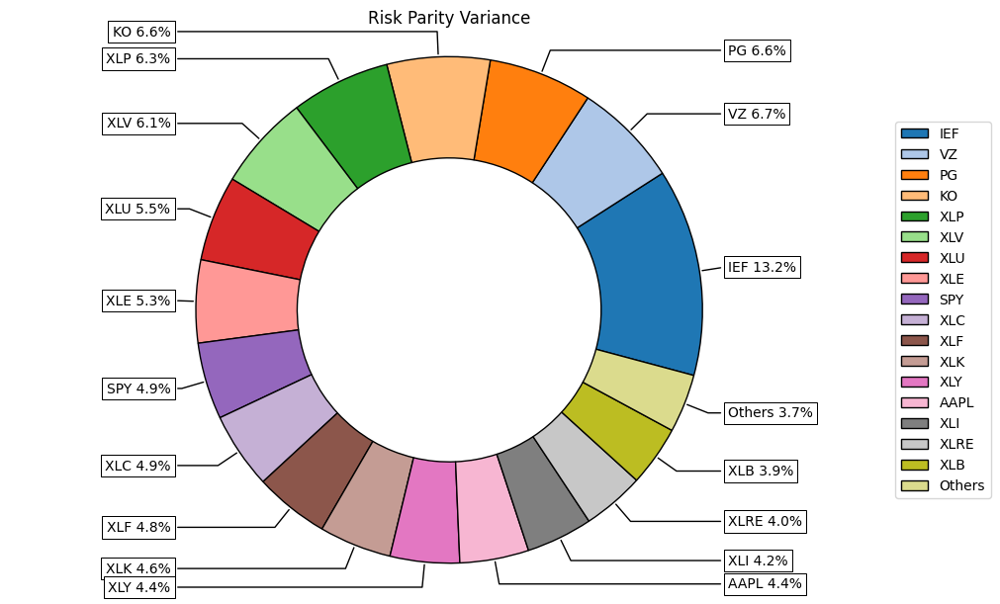
    


```python
# Mostrando la contribucion al riesgo del portafolio
ax=rp.plot_risk_con(w_rp,cov=port.cov,returns=port.returns,rm=rm,rf=rf,alpha=0.01,color="tab:blue")
```


    
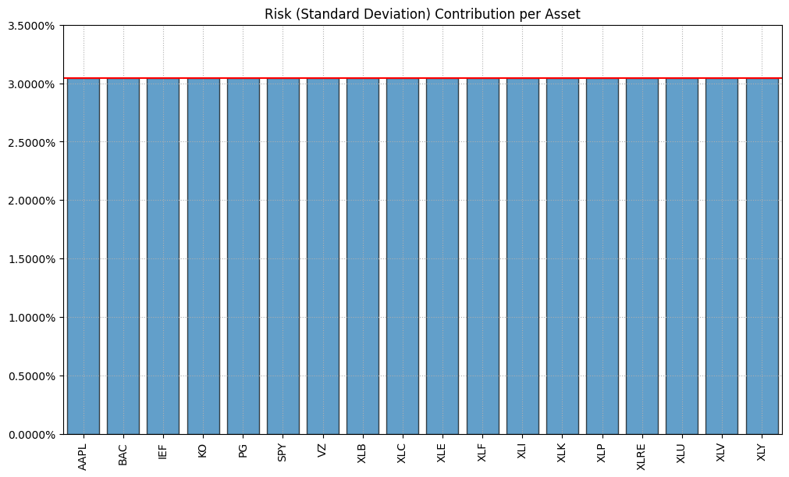
    


Calculo de los pesos de All Weather Portafolio


```python
tickers_awp=['DBC','GLD','IEF','SPY','TLT']
```


```python
df_awp=yf.download(tickers_awp,period='5y',auto_adjust=False)['Adj Close']df_awp
```

    [*********************100%***********************]  5 of 5 completed


  <div id="df-6dfa9057-a687-4317-9990-02ab28737850" class="colab-df-container">
    <div>
<style scoped>
    .dataframe tbody tr th:only-of-type {
        vertical-align: middle;
    }

    .dataframe tbody tr th {
        vertical-align: top;
    }

    .dataframe thead th {
        text-align: right;
    }
</style>
<table border="1" class="dataframe">
  <thead>
    <tr style="text-align: right;">
      <th>Ticker</th>
      <th>DBC</th>
      <th>GLD</th>
      <th>IEF</th>
      <th>SPY</th>
      <th>TLT</th>
    </tr>
    <tr>
      <th>Date</th>
      <th></th>
      <th></th>
      <th></th>
      <th></th>
      <th></th>
    </tr>
  </thead>
  <tbody>
    <tr>
      <th>2021-03-08</th>
      <td>14.905462</td>
      <td>157.490005</td>
      <td>99.957489</td>
      <td>356.326599</td>
      <td>117.746635</td>
    </tr>
    <tr>
      <th>2021-03-09</th>
      <td>14.905462</td>
      <td>160.839996</td>
      <td>100.431068</td>
      <td>361.414032</td>
      <td>119.378258</td>
    </tr>
    <tr>
      <th>2021-03-10</th>
      <td>15.001179</td>
      <td>161.660004</td>
      <td>100.641541</td>
      <td>363.663727</td>
      <td>119.617516</td>
    </tr>
    <tr>
      <th>2021-03-11</th>
      <td>15.227415</td>
      <td>161.520004</td>
      <td>100.606468</td>
      <td>367.350922</td>
      <td>118.754639</td>
    </tr>
    <tr>
      <th>2021-03-12</th>
      <td>15.157804</td>
      <td>161.490005</td>
      <td>99.878510</td>
      <td>367.845673</td>
      <td>116.234543</td>
    </tr>
    <tr>
      <th>...</th>
      <td>...</td>
      <td>...</td>
      <td>...</td>
      <td>...</td>
      <td>...</td>
    </tr>
    <tr>
      <th>2026-03-02</th>
      <td>25.809999</td>
      <td>490.000000</td>
      <td>97.120003</td>
      <td>686.380005</td>
      <td>89.610001</td>
    </tr>
    <tr>
      <th>2026-03-03</th>
      <td>25.910000</td>
      <td>468.140015</td>
      <td>97.010002</td>
      <td>680.330017</td>
      <td>89.430000</td>
    </tr>
    <tr>
      <th>2026-03-04</th>
      <td>26.139999</td>
      <td>471.799988</td>
      <td>96.809998</td>
      <td>685.130005</td>
      <td>89.150002</td>
    </tr>
    <tr>
      <th>2026-03-05</th>
      <td>26.520000</td>
      <td>466.130005</td>
      <td>96.510002</td>
      <td>681.309998</td>
      <td>88.790001</td>
    </tr>
    <tr>
      <th>2026-03-06</th>
      <td>27.510000</td>
      <td>473.510010</td>
      <td>96.449997</td>
      <td>672.380005</td>
      <td>88.459999</td>
    </tr>
  </tbody>
</table>
<p>1256 rows × 5 columns</p>
</div>
    <div class="colab-df-buttons">

  <div class="colab-df-container">
    <button class="colab-df-convert" onclick="convertToInteractive('df-6dfa9057-a687-4317-9990-02ab28737850')"
            title="Convert this dataframe to an interactive table."
            style="display:none;">

  <svg xmlns="http://www.w3.org/2000/svg" height="24px" viewBox="0 -960 960 960">
    <path d="M120-120v-720h720v720H120Zm60-500h600v-160H180v160Zm220 220h160v-160H400v160Zm0 220h160v-160H400v160ZM180-400h160v-160H180v160Zm440 0h160v-160H620v160ZM180-180h160v-160H180v160Zm440 0h160v-160H620v160Z"/>
  </svg>
    </button>

  <style>
    .colab-df-container {
      display:flex;
      gap: 12px;
    }

    .colab-df-convert {
      background-color: #E8F0FE;
      border: none;
      border-radius: 50%;
      cursor: pointer;
      display: none;
      fill: #1967D2;
      height: 32px;
      padding: 0 0 0 0;
      width: 32px;
    }

    .colab-df-convert:hover {
      background-color: #E2EBFA;
      box-shadow: 0px 1px 2px rgba(60, 64, 67, 0.3), 0px 1px 3px 1px rgba(60, 64, 67, 0.15);
      fill: #174EA6;
    }

    .colab-df-buttons div {
      margin-bottom: 4px;
    }

    [theme=dark] .colab-df-convert {
      background-color: #3B4455;
      fill: #D2E3FC;
    }

    [theme=dark] .colab-df-convert:hover {
      background-color: #434B5C;
      box-shadow: 0px 1px 3px 1px rgba(0, 0, 0, 0.15);
      filter: drop-shadow(0px 1px 2px rgba(0, 0, 0, 0.3));
      fill: #FFFFFF;
    }
  </style>

    <script>
      const buttonEl =
        document.querySelector('#df-6dfa9057-a687-4317-9990-02ab28737850 button.colab-df-convert');
      buttonEl.style.display =
        google.colab.kernel.accessAllowed ? 'block' : 'none';

      async function convertToInteractive(key) {
        const element = document.querySelector('#df-6dfa9057-a687-4317-9990-02ab28737850');
        const dataTable =
          await google.colab.kernel.invokeFunction('convertToInteractive',
                                                    [key], {});
        if (!dataTable) return;

        const docLinkHtml = 'Like what you see? Visit the ' +
          '<a target="_blank" href=https://colab.research.google.com/notebooks/data_table.ipynb>data table notebook</a>'
          + ' to learn more about interactive tables.';
        element.innerHTML = '';
        dataTable['output_type'] = 'display_data';
        await google.colab.output.renderOutput(dataTable, element);
        const docLink = document.createElement('div');
        docLink.innerHTML = docLinkHtml;
        element.appendChild(docLink);
      }
    </script>
  </div>


  <div id="id_4c982ffd-78ad-4fed-8cc8-9d15302a3be2">
    <style>
      .colab-df-generate {
        background-color: #E8F0FE;
        border: none;
        border-radius: 50%;
        cursor: pointer;
        display: none;
        fill: #1967D2;
        height: 32px;
        padding: 0 0 0 0;
        width: 32px;
      }

      .colab-df-generate:hover {
        background-color: #E2EBFA;
        box-shadow: 0px 1px 2px rgba(60, 64, 67, 0.3), 0px 1px 3px 1px rgba(60, 64, 67, 0.15);
        fill: #174EA6;
      }

      [theme=dark] .colab-df-generate {
        background-color: #3B4455;
        fill: #D2E3FC;
      }

      [theme=dark] .colab-df-generate:hover {
        background-color: #434B5C;
        box-shadow: 0px 1px 3px 1px rgba(0, 0, 0, 0.15);
        filter: drop-shadow(0px 1px 2px rgba(0, 0, 0, 0.3));
        fill: #FFFFFF;
      }
    </style>
    <button class="colab-df-generate" onclick="generateWithVariable('df_awp')"
            title="Generate code using this dataframe."
            style="display:none;">

  <svg xmlns="http://www.w3.org/2000/svg" height="24px"viewBox="0 0 24 24"
       width="24px">
    <path d="M7,19H8.4L18.45,9,17,7.55,7,17.6ZM5,21V16.75L18.45,3.32a2,2,0,0,1,2.83,0l1.4,1.43a1.91,1.91,0,0,1,.58,1.4,1.91,1.91,0,0,1-.58,1.4L9.25,21ZM18.45,9,17,7.55Zm-12,3A5.31,5.31,0,0,0,4.9,8.1,5.31,5.31,0,0,0,1,6.5,5.31,5.31,0,0,0,4.9,4.9,5.31,5.31,0,0,0,6.5,1,5.31,5.31,0,0,0,8.1,4.9,5.31,5.31,0,0,0,12,6.5,5.46,5.46,0,0,0,6.5,12Z"/>
  </svg>
    </button>
    <script>
      (() => {
      const buttonEl =
        document.querySelector('#id_4c982ffd-78ad-4fed-8cc8-9d15302a3be2 button.colab-df-generate');
      buttonEl.style.display =
        google.colab.kernel.accessAllowed ? 'block' : 'none';

      buttonEl.onclick = () => {
        google.colab.notebook.generateWithVariable('df_awp');
      }
      })();
    </script>
  </div>

    </div>
  </div>


```python
y_awp=df_awp.pct_change()
y_awp=y_awp.dropna()
y_awp
```


  <div id="df-323b1906-9973-476f-a3dd-f98264524b57" class="colab-df-container">
    <div>
<style scoped>
    .dataframe tbody tr th:only-of-type {
        vertical-align: middle;
    }

    .dataframe tbody tr th {
        vertical-align: top;
    }

    .dataframe thead th {
        text-align: right;
    }
</style>
<table border="1" class="dataframe">
  <thead>
    <tr style="text-align: right;">
      <th>Ticker</th>
      <th>DBC</th>
      <th>GLD</th>
      <th>IEF</th>
      <th>SPY</th>
      <th>TLT</th>
    </tr>
    <tr>
      <th>Date</th>
      <th></th>
      <th></th>
      <th></th>
      <th></th>
      <th></th>
    </tr>
  </thead>
  <tbody>
    <tr>
      <th>2021-03-09</th>
      <td>0.000000</td>
      <td>0.021271</td>
      <td>0.004738</td>
      <td>0.014277</td>
      <td>0.013857</td>
    </tr>
    <tr>
      <th>2021-03-10</th>
      <td>0.006422</td>
      <td>0.005098</td>
      <td>0.002096</td>
      <td>0.006225</td>
      <td>0.002004</td>
    </tr>
    <tr>
      <th>2021-03-11</th>
      <td>0.015081</td>
      <td>-0.000866</td>
      <td>-0.000348</td>
      <td>0.010139</td>
      <td>-0.007214</td>
    </tr>
    <tr>
      <th>2021-03-12</th>
      <td>-0.004571</td>
      <td>-0.000186</td>
      <td>-0.007236</td>
      <td>0.001347</td>
      <td>-0.021221</td>
    </tr>
    <tr>
      <th>2021-03-15</th>
      <td>-0.003444</td>
      <td>0.004397</td>
      <td>0.001230</td>
      <td>0.005964</td>
      <td>0.005880</td>
    </tr>
    <tr>
      <th>...</th>
      <td>...</td>
      <td>...</td>
      <td>...</td>
      <td>...</td>
      <td>...</td>
    </tr>
    <tr>
      <th>2026-03-02</th>
      <td>0.028287</td>
      <td>0.012920</td>
      <td>-0.006008</td>
      <td>0.000569</td>
      <td>-0.010042</td>
    </tr>
    <tr>
      <th>2026-03-03</th>
      <td>0.003874</td>
      <td>-0.044612</td>
      <td>-0.001133</td>
      <td>-0.008814</td>
      <td>-0.002009</td>
    </tr>
    <tr>
      <th>2026-03-04</th>
      <td>0.008877</td>
      <td>0.007818</td>
      <td>-0.002062</td>
      <td>0.007055</td>
      <td>-0.003131</td>
    </tr>
    <tr>
      <th>2026-03-05</th>
      <td>0.014537</td>
      <td>-0.012018</td>
      <td>-0.003099</td>
      <td>-0.005576</td>
      <td>-0.004038</td>
    </tr>
    <tr>
      <th>2026-03-06</th>
      <td>0.037330</td>
      <td>0.015833</td>
      <td>-0.000622</td>
      <td>-0.013107</td>
      <td>-0.003717</td>
    </tr>
  </tbody>
</table>
<p>1255 rows × 5 columns</p>
</div>
    <div class="colab-df-buttons">

  <div class="colab-df-container">
    <button class="colab-df-convert" onclick="convertToInteractive('df-323b1906-9973-476f-a3dd-f98264524b57')"
            title="Convert this dataframe to an interactive table."
            style="display:none;">

  <svg xmlns="http://www.w3.org/2000/svg" height="24px" viewBox="0 -960 960 960">
    <path d="M120-120v-720h720v720H120Zm60-500h600v-160H180v160Zm220 220h160v-160H400v160Zm0 220h160v-160H400v160ZM180-400h160v-160H180v160Zm440 0h160v-160H620v160ZM180-180h160v-160H180v160Zm440 0h160v-160H620v160Z"/>
  </svg>
    </button>

  <style>
    .colab-df-container {
      display:flex;
      gap: 12px;
    }

    .colab-df-convert {
      background-color: #E8F0FE;
      border: none;
      border-radius: 50%;
      cursor: pointer;
      display: none;
      fill: #1967D2;
      height: 32px;
      padding: 0 0 0 0;
      width: 32px;
    }

    .colab-df-convert:hover {
      background-color: #E2EBFA;
      box-shadow: 0px 1px 2px rgba(60, 64, 67, 0.3), 0px 1px 3px 1px rgba(60, 64, 67, 0.15);
      fill: #174EA6;
    }

    .colab-df-buttons div {
      margin-bottom: 4px;
    }

    [theme=dark] .colab-df-convert {
      background-color: #3B4455;
      fill: #D2E3FC;
    }

    [theme=dark] .colab-df-convert:hover {
      background-color: #434B5C;
      box-shadow: 0px 1px 3px 1px rgba(0, 0, 0, 0.15);
      filter: drop-shadow(0px 1px 2px rgba(0, 0, 0, 0.3));
      fill: #FFFFFF;
    }
  </style>

    <script>
      const buttonEl =
        document.querySelector('#df-323b1906-9973-476f-a3dd-f98264524b57 button.colab-df-convert');
      buttonEl.style.display =
        google.colab.kernel.accessAllowed ? 'block' : 'none';

      async function convertToInteractive(key) {
        const element = document.querySelector('#df-323b1906-9973-476f-a3dd-f98264524b57');
        const dataTable =
          await google.colab.kernel.invokeFunction('convertToInteractive',
                                                    [key], {});
        if (!dataTable) return;

        const docLinkHtml = 'Like what you see? Visit the ' +
          '<a target="_blank" href=https://colab.research.google.com/notebooks/data_table.ipynb>data table notebook</a>'
          + ' to learn more about interactive tables.';
        element.innerHTML = '';
        dataTable['output_type'] = 'display_data';
        await google.colab.output.renderOutput(dataTable, element);
        const docLink = document.createElement('div');
        docLink.innerHTML = docLinkHtml;
        element.appendChild(docLink);
      }
    </script>
  </div>


  <div id="id_2cdb3c05-608d-4cc5-881a-c48b772367ad">
    <style>
      .colab-df-generate {
        background-color: #E8F0FE;
        border: none;
        border-radius: 50%;
        cursor: pointer;
        display: none;
        fill: #1967D2;
        height: 32px;
        padding: 0 0 0 0;
        width: 32px;
      }

      .colab-df-generate:hover {
        background-color: #E2EBFA;
        box-shadow: 0px 1px 2px rgba(60, 64, 67, 0.3), 0px 1px 3px 1px rgba(60, 64, 67, 0.15);
        fill: #174EA6;
      }

      [theme=dark] .colab-df-generate {
        background-color: #3B4455;
        fill: #D2E3FC;
      }

      [theme=dark] .colab-df-generate:hover {
        background-color: #434B5C;
        box-shadow: 0px 1px 3px 1px rgba(0, 0, 0, 0.15);
        filter: drop-shadow(0px 1px 2px rgba(0, 0, 0, 0.3));
        fill: #FFFFFF;
      }
    </style>
    <button class="colab-df-generate" onclick="generateWithVariable('y_awp')"
            title="Generate code using this dataframe."
            style="display:none;">

  <svg xmlns="http://www.w3.org/2000/svg" height="24px"viewBox="0 0 24 24"
       width="24px">
    <path d="M7,19H8.4L18.45,9,17,7.55,7,17.6ZM5,21V16.75L18.45,3.32a2,2,0,0,1,2.83,0l1.4,1.43a1.91,1.91,0,0,1,.58,1.4,1.91,1.91,0,0,1-.58,1.4L9.25,21ZM18.45,9,17,7.55Zm-12,3A5.31,5.31,0,0,0,4.9,8.1,5.31,5.31,0,0,0,1,6.5,5.31,5.31,0,0,0,4.9,4.9,5.31,5.31,0,0,0,6.5,1,5.31,5.31,0,0,0,8.1,4.9,5.31,5.31,0,0,0,12,6.5,5.46,5.46,0,0,0,6.5,12Z"/>
  </svg>
    </button>
    <script>
      (() => {
      const buttonEl =
        document.querySelector('#id_2cdb3c05-608d-4cc5-881a-c48b772367ad button.colab-df-generate');
      buttonEl.style.display =
        google.colab.kernel.accessAllowed ? 'block' : 'none';

      buttonEl.onclick = () => {
        google.colab.notebook.generateWithVariable('y_awp');
      }
      })();
    </script>
  </div>

    </div>
  </div>


```python
port=rp.Portfolio(returns=y_awp)
```


```python
method_mu='hist'
method_cov='hist'
```


```python
port.assets_stats(method_mu=method_mu,method_cov=method_cov)
```

Estimacion del All Weather Portfolio siguiendo metodologia de Risk Parity


```python
b=None # restricciones de la contribucion al riesgo
```


```python
w_rp=port.rp_optimization(model=model,rm=rm,rf=rf,b=b,hist=hist)
```


```python
display(w.T)
```


  <div id="df-b475afb9-a377-4163-b1a9-818ca4049e4b" class="colab-df-container">
    <div>
<style scoped>
    .dataframe tbody tr th:only-of-type {
        vertical-align: middle;
    }

    .dataframe tbody tr th {
        vertical-align: top;
    }

    .dataframe thead th {
        text-align: right;
    }
</style>
<table border="1" class="dataframe">
  <thead>
    <tr style="text-align: right;">
      <th></th>
      <th>AAPL</th>
      <th>BAC</th>
      <th>IEF</th>
      <th>KO</th>
      <th>PG</th>
      <th>SPY</th>
      <th>VZ</th>
      <th>XLB</th>
      <th>XLC</th>
      <th>XLE</th>
      <th>XLF</th>
      <th>XLI</th>
      <th>XLK</th>
      <th>XLP</th>
      <th>XLRE</th>
      <th>XLU</th>
      <th>XLV</th>
      <th>XLY</th>
    </tr>
  </thead>
  <tbody>
    <tr>
      <th>w_sharpe_ratio</th>
      <td>5.057899e-02</td>
      <td>2.197688e-09</td>
      <td>5.004361e-09</td>
      <td>2.817717e-01</td>
      <td>6.302961e-09</td>
      <td>1.002628e-08</td>
      <td>7.417127e-09</td>
      <td>2.419370e-09</td>
      <td>1.445626e-08</td>
      <td>0.323859</td>
      <td>6.418118e-09</td>
      <td>6.448645e-09</td>
      <td>3.437903e-01</td>
      <td>6.673564e-09</td>
      <td>2.448138e-09</td>
      <td>3.067669e-08</td>
      <td>6.620343e-09</td>
      <td>3.554223e-09</td>
    </tr>
    <tr>
      <th>w_min_risk</th>
      <td>1.875977e-10</td>
      <td>2.775683e-10</td>
      <td>8.843073e-01</td>
      <td>5.132850e-10</td>
      <td>5.612761e-02</td>
      <td>4.083199e-10</td>
      <td>2.288976e-10</td>
      <td>2.011479e-10</td>
      <td>2.484078e-10</td>
      <td>0.059565</td>
      <td>5.880121e-10</td>
      <td>3.040822e-10</td>
      <td>2.554048e-10</td>
      <td>1.349911e-09</td>
      <td>1.478904e-10</td>
      <td>5.233751e-10</td>
      <td>7.280231e-10</td>
      <td>3.275097e-10</td>
    </tr>
    <tr>
      <th>w_max_return</th>
      <td>2.494797e-10</td>
      <td>7.416868e-11</td>
      <td>3.152725e-11</td>
      <td>5.537943e-11</td>
      <td>4.418098e-11</td>
      <td>8.105205e-11</td>
      <td>4.099136e-11</td>
      <td>5.559693e-11</td>
      <td>7.042236e-11</td>
      <td>1.000000</td>
      <td>7.077381e-11</td>
      <td>9.318312e-11</td>
      <td>1.783013e-10</td>
      <td>4.974474e-11</td>
      <td>4.572705e-11</td>
      <td>6.477859e-11</td>
      <td>5.008898e-11</td>
      <td>6.177803e-11</td>
    </tr>
  </tbody>
</table>
</div>
    <div class="colab-df-buttons">

  <div class="colab-df-container">
    <button class="colab-df-convert" onclick="convertToInteractive('df-b475afb9-a377-4163-b1a9-818ca4049e4b')"
            title="Convert this dataframe to an interactive table."
            style="display:none;">

  <svg xmlns="http://www.w3.org/2000/svg" height="24px" viewBox="0 -960 960 960">
    <path d="M120-120v-720h720v720H120Zm60-500h600v-160H180v160Zm220 220h160v-160H400v160Zm0 220h160v-160H400v160ZM180-400h160v-160H180v160Zm440 0h160v-160H620v160ZM180-180h160v-160H180v160Zm440 0h160v-160H620v160Z"/>
  </svg>
    </button>

  <style>
    .colab-df-container {
      display:flex;
      gap: 12px;
    }

    .colab-df-convert {
      background-color: #E8F0FE;
      border: none;
      border-radius: 50%;
      cursor: pointer;
      display: none;
      fill: #1967D2;
      height: 32px;
      padding: 0 0 0 0;
      width: 32px;
    }

    .colab-df-convert:hover {
      background-color: #E2EBFA;
      box-shadow: 0px 1px 2px rgba(60, 64, 67, 0.3), 0px 1px 3px 1px rgba(60, 64, 67, 0.15);
      fill: #174EA6;
    }

    .colab-df-buttons div {
      margin-bottom: 4px;
    }

    [theme=dark] .colab-df-convert {
      background-color: #3B4455;
      fill: #D2E3FC;
    }

    [theme=dark] .colab-df-convert:hover {
      background-color: #434B5C;
      box-shadow: 0px 1px 3px 1px rgba(0, 0, 0, 0.15);
      filter: drop-shadow(0px 1px 2px rgba(0, 0, 0, 0.3));
      fill: #FFFFFF;
    }
  </style>

    <script>
      const buttonEl =
        document.querySelector('#df-b475afb9-a377-4163-b1a9-818ca4049e4b button.colab-df-convert');
      buttonEl.style.display =
        google.colab.kernel.accessAllowed ? 'block' : 'none';

      async function convertToInteractive(key) {
        const element = document.querySelector('#df-b475afb9-a377-4163-b1a9-818ca4049e4b');
        const dataTable =
          await google.colab.kernel.invokeFunction('convertToInteractive',
                                                    [key], {});
        if (!dataTable) return;

        const docLinkHtml = 'Like what you see? Visit the ' +
          '<a target="_blank" href=https://colab.research.google.com/notebooks/data_table.ipynb>data table notebook</a>'
          + ' to learn more about interactive tables.';
        element.innerHTML = '';
        dataTable['output_type'] = 'display_data';
        await google.colab.output.renderOutput(dataTable, element);
        const docLink = document.createElement('div');
        docLink.innerHTML = docLinkHtml;
        element.appendChild(docLink);
      }
    </script>
  </div>


    </div>
  </div>


```python
ax=rp.plot_pie(w=w_rp,title='Risk Parity Variance',others=0.05)
```


    
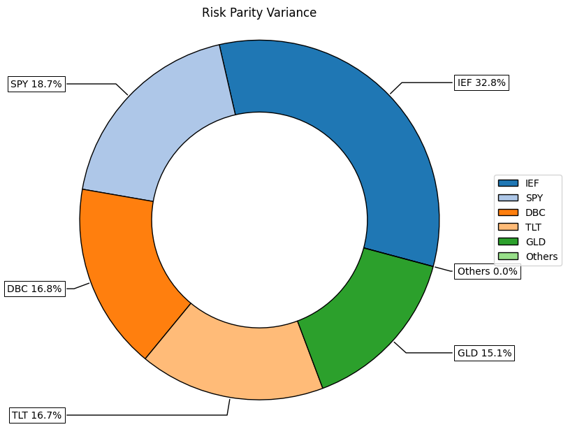
    


```python
# Graficando la composicion del riesgo
ax=rp.plot_risk_con(w_rp,cov=port.cov,returns=port.returns,rm=rm,rf=0,alpha=0.01)
```


    
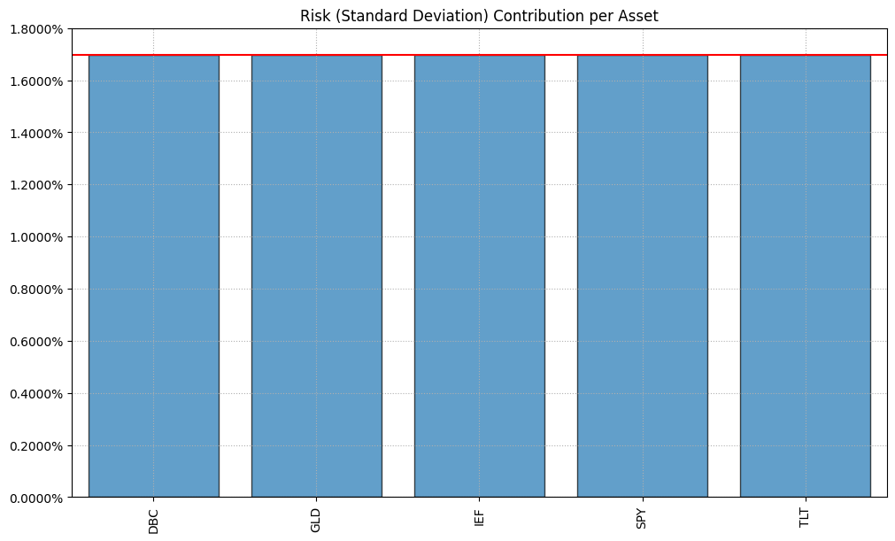
    


```python
ax=rp.jupyter_report(y_awp,w=w_rp,rm=rm,t_factor=252)
```


    
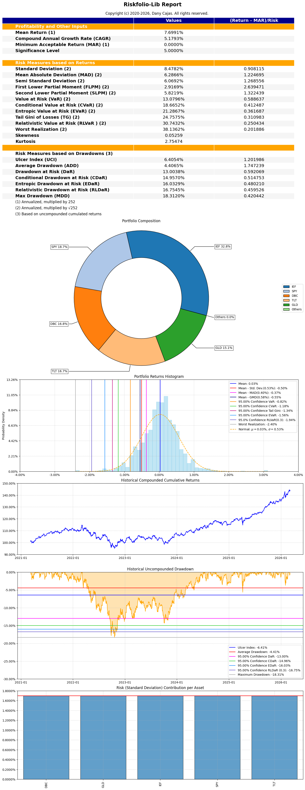
    


## Sintesis de resultados

La comparacion de las tres funciones objetivo sobre el mismo universo y la misma
matriz de covarianzas muestra lo siguiente:

| Funcion objetivo | Comportamiento de los pesos |
|---|---|
| Maximo ratio de Sharpe | Concentra en pocos activos con mejor retorno historico ajustado |
| Minimo riesgo | Se desplaza hacia renta fija y sectores defensivos, con pesos mas repartidos |
| Maximo retorno | Solucion de esquina: casi todo el peso en un solo activo |
| Risk Parity | Distribucion mas estable, sin depender de estimar retornos esperados |

El contraste entre la cartera de maximo Sharpe y la de Risk Parity es el resultado
mas informativo del ejercicio: la primera depende criticamente de que los retornos
historicos sean un buen estimador de los esperados, supuesto que rara vez se cumple.
La segunda solo requiere estimar la matriz de covarianzas, que es sustancialmente
mas estable en el tiempo.

## Limitaciones

- **Los estimadores historicos de retorno esperado son el punto debil del modelo.**
  Media-Varianza clasico es muy sensible a `mu`: cambios pequenos en el retorno
  esperado producen cambios grandes en los pesos. La solucion de esquina del
  portafolio de maximo retorno es una manifestacion directa de esto.
- **No hay restricciones de peso maximo por activo ni por sector.** Una cartera
  implementable exigiria limites de concentracion.
- **No se incorporan costos de transaccion ni politica de rebalanceo**, que en
  carteras concentradas pueden absorber buena parte de la ventaja teorica.
- **La tasa libre de riesgo se fija en cero.** Con una tasa positiva, el punto de
  tangencia de la frontera se desplaza y la cartera de maximo Sharpe cambia.
- **Todo el analisis es dentro de muestra.** No hay validacion fuera de muestra ni
  ventana rodante, de modo que el desempeno mostrado no es un pronostico.

## Que haria distinto

Reemplazar los estimadores historicos por un estimador con shrinkage (Ledoit-Wolf
para la covarianza) o incorporar vistas via Black-Litterman, y evaluar la estabilidad
de los pesos con una ventana rodante en lugar de una sola optimizacion sobre toda
la muestra.
